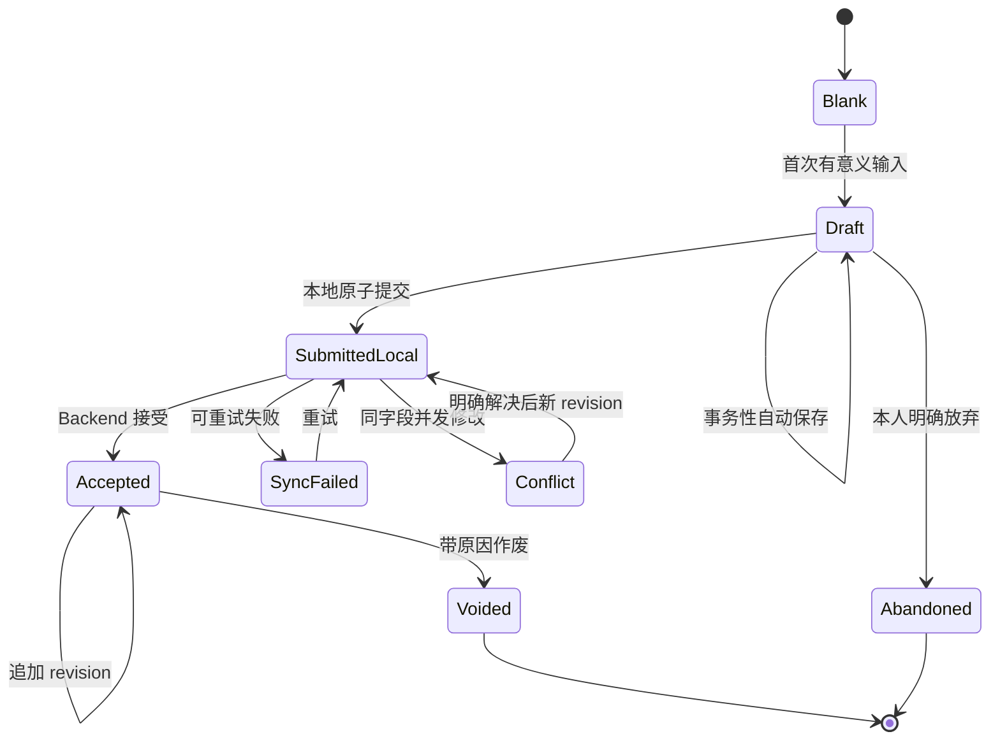
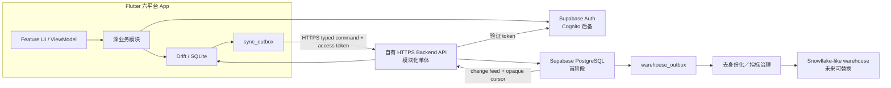

# 同行者 App 现代化产品与技术 Spec

- Spec ID：`TXZ-SPEC-001`
- 版本：`1.1`
- 更新日期：2026-08-03
- 状态：**1.0 已于 2026-07-31 确认；1.1 的五项设计调整已于 2026-08-03 确认；后续实施必须通过本 Spec 对应的 GitHub Issues**
- 覆盖范围：iOS、Android、Web、macOS、Windows、Linux 六平台正式 App

## 0. 文档权威与使用方式

本 Spec 把已确认的产品需求、领域决策、架构约束、隐私规则、统计口径、学习说明书和迁移路线收敛为一份实施合同。

权威顺序为：

1. [领域词汇 `CONTEXT.md`](../CONTEXT.md) 规定词语含义；
2. [ADR 索引](./adr/README.md) 记录已接受单项决策的状态和取代关系；
3. 本 Spec 定义产品全貌、交付顺序与验收条件；
4. [`docs/research/`](./research/) 提供技术证据与备选比较；
5. 当前代码只代表 legacy demo 现状，冲突时不得覆盖已确认需求。

如本 Spec 与已接受 ADR 冲突，以最新 ADR 为准并同步修正 Spec。原 [项目设计文档](./PROJECT_DESIGN.md) 保留为 legacy demo 的历史资料，不再是现代化产品的规范来源。

## 1. 一句话产品定义

**同行者是一个通用的推广行动记录、跟进协作与隐私保护分析 App：它首先帮助使用者如实看见自己已经采取的行动，其次才在权限范围内为团队提供匿名事实汇总和需关心的异常。**

“推广”是场景中立的总称，可以指课程、产品、服务、公益或信仰内容的介绍与跟进。产品不假定用户属于教会、销售团队或任何特定行业。

## 2. 目标、成功标准与非目标

### 2.1 产品目标

| ID | 目标 |
| --- | --- |
| `GOAL-001` | 使用者可在无网络时快速、可靠地记录一次真实直接互动，默认不采集对方身份。 |
| `GOAL-002` | 使用者能私下设定提醒和可选每周接触场次目标，如实看见差距，但不被排名、惩罚或管理者监控。 |
| `GOAL-003` | 为确有跟进需要的场景提供可审计、最小权限的推广对象与关系进展管理。 |
| `GOAL-004` | 项目可以通过版本化场景问卷调整需求，不需每次发布 App，且不改写历史含义。 |
| `GOAL-005` | 提供可复算、可解释、保护小样本的个人与管理分析，不把观察性数据写成因果结论。 |
| `GOAL-006` | 使用一套现代、可测试、可分步演进的 Flutter／SQL 正式代码支持六平台。 |
| `GOAL-007` | 让正式代码本身成为 Flutter 与 SQL 学习素材，并配套零基础读者可理解的中文开发说明书。 |
| `GOAL-008` | 保留替换认证商、数据库托管商、Backend 运行环境和分析仓库的明确边界。 |

### 2.2 可验证的成功标准

- 简单匿名接触只需填写核心事实，不必创建推广对象或穿过多页向导。
- 草稿、正式提交和同步不会因断网、App 转入后台或意外退出而静默丢失。
- 已批准的管理报告不提供个人绩效或排名，并通过受限查询面、贡献者保护和完整网格抑制降低小群体精确值被恢复的风险。
- 同一指标在 Dart／SQLite、PostgreSQL 和未来 warehouse 上对同一 synthetic fixture 得出一致结果。
- 问卷、指标或认证商变更不需让无关 Flutter Feature 同时重写。
- 六平台共用领域语义、数据约束和主要测试，平台差异局限于 Adapter 与响应式表现。
- 每个发布版本都包含与当时代码匹配的中文说明书，重要代码块可一键复制。

### 2.3 非目标

本产品不是：

- 个人绩效考核、销售竞赛、公开排行榜或惩罚性打卡工具；
- 要求先建客户档案才能记录行动的 CRM；
- 把广告投放、群发、通勤或资料准备冒充为接触的工时记录器；
- 让 Flutter 直接连接 PostgreSQL、Snowflake 或任意 warehouse 的数据库客户端；
- 完整 Event Sourcing、微服务集群、分布式 CQRS 或先造万能框架的项目；
- 在正式 App 中执行任意 Dart、JavaScript 或 SQL 的编程沙盒；
- 一套与真实 App 脱节的教学 Demo；
- 仅换颜色、组件库或状态管理包而不修复业务边界的表面重构。

本 Spec 所有功能都属于完整产品范围。分阶段交付只是依赖与风险顺序，不表示后续功能被取消。

## 3. 使用者、协作边界与权限

### 3.1 业务角色

| 角色／身份 | 主要职责 | 默认看不到的内容 |
| --- | --- | --- |
| 用户账号 | 登录身份，可使用个人空间并加入多个组织 | 未建立成员关系的组织或项目数据 |
| 推广者 | 记录自己的接触并查看个人分析 | 他人个人明细与私人计划 |
| 跟进者 | 跟进明确分配给自己的推广对象 | 组织全部对象目录与未分配对象 PII |
| 项目管理员 | 配置项目、问卷和分析定义，查看匿名汇总与去身份化异常 | 个人反思、私人目标和未分配对象 PII |
| 组织所有者 | 治理组织成员、所有权和项目 | 不因“所有者”身份自动看到个人或对象明细 |
| 区域维护者 | 审核全 App 规范区域树 | 不因区域职责获得接触记录访问权 |

### 3.2 权限原则

| ID | 需求 |
| --- | --- |
| `AUTHZ-001` | 账号只代表身份；组织、项目角色与成员能力保存在具体成员关系上。 |
| `AUTHZ-002` | 权限以 capability 表达；角色只是常用 capability 组合，禁止用 `roleLevel` 数字大小推导权限。 |
| `AUTHZ-003` | 组织成员不自动成为项目成员；新项目成员默认只获得推广者能力。 |
| `AUTHZ-004` | Backend 对每个受保护操作重新验证 workspace、project、membership、capability 和撤权状态；UI 隐藏不是安全边界。 |
| `AUTHZ-005` | 管理角色不自动获得对象 PII、个人反思或个人行动计划访问权。 |
| `AUTHZ-006` | 分配、撤销分配、查看敏感资料、导入导出、合并拆分、权限变更与区域修改都必须审计。 |
| `AUTHZ-007` | 固定匿名管理报告文件导出必须同时具备 `view_anonymous_analytics` 与独立 `export_management_reports` capability；每次请求重新授权，完整授权的导出结果写入独立于普通快照读取的不可变导出审计。 |

## 4. 核心信息架构

### 4.1 工作空间与项目

| ID | 需求 |
| --- | --- |
| `CTX-001` | 每个用户自动拥有私有个人空间，无需加入组织即可创建个人推广项目。 |
| `CTX-002` | 已验证邮箱的用户可以自助创建组织，并成为首位组织所有者。 |
| `CTX-003` | 组织可拥有多个推广项目；每条接触只属于一个空间和项目。 |
| `CTX-004` | App 顶部持续显示“个人空间或组织 → 当前推广项目”，并允许有权用户切换。 |
| `CTX-005` | 草稿与接触创建后固定原项目归属；切换上下文不会静默搬移数据。 |
| `CTX-006` | 个人历史只能通过明确预览与确认的“历史贡献”产生组织项目的去身份化副本，原记录不移动。 |

### 4.2 稳定主导航

App 只保留四个稳定主目的地：

1. **今日**：私人提醒、可选每周目标进度、近期行动与需本人处理的同步异常；
2. **接触**：快速记录、接触尝试、多草稿、补录、修订、作废与同步状态；
3. **对象**：本人有权跟进的个人／机构对象、项目关系和后续事项；
4. **分析**：默认个人分析，有相应能力时才显示匿名项目／组织分析入口。

手机使用 `NavigationBar`，宽屏使用 `NavigationRail`，信息架构不变。所有主页提供明显的“记录接触”操作。项目管理、问卷和成员从项目菜单进入；账号、主题、语言、隐私和开发说明书从个人菜单进入。

## 5. 功能需求

### 5.1 认证、会话与内部身份

| ID | 需求 |
| --- | --- |
| `AUTH-001` | 正式认证以 Supabase Auth 为有条件首选；首版只承诺邮箱＋密码和 App 内输入的邮箱确认／恢复 OTP。 |
| `AUTH-002` | Android、iOS、Web、macOS、Windows、Linux 都必须验证注册、确认、登录、token 刷新、注销、撤销、恢复密码和重启会话恢复。 |
| `AUTH-003` | 如任一平台必需流程或安全会话存储无法可靠通过，停止平台专用长期补丁并改用 AWS Cognito。 |
| `AUTH-004` | Flutter 业务模块只依赖 `IdentitySession`，不导入 Supabase 或 Cognito 用户类型。 |
| `AUTH-005` | Backend 验证受信 issuer／JWKS 后，以 `(issuer, subject)` 映射稳定内部 `app_user_id`；业务表不直接依赖 `auth.users`。 |
| `AUTH-006` | 原生平台使用合适的安全会话存储；客户端不得包含 service-role secret、PostgreSQL 密码或 warehouse 凭据。 |
| `AUTH-007` | 本地单元／组件测试使用无法进入正式构建的 fake；Supabase 接线用本地 CLI＋Mailpit 和隔离 staging。 |
| `AUTH-008` | legacy MD5 认证只能留在明确 Demo／Test 配置，不得进入正式构建。 |

Magic Link、社交登录和短信登录不在首版认证合同中。

### 5.2 今日、私人行动计划与提醒

| ID | 需求 |
| --- | --- |
| `PLAN-001` | 用户可按项目自由设定提醒时间，并可选设定每周接触场次目标；两者可分开使用。 |
| `PLAN-002` | 计划、进度、差距和个人反思只对本人可见；组织不能强制设定、修改或查看。 |
| `PLAN-003` | 每周目标只计当周实际发生且当前有效的已提交接触；草稿、尝试、触达人数、兴趣与结果不能代替场次。 |
| `PLAN-004` | 未达目标时显示计划数、已记录数和差额，但不强制解释、不罚打卡、不通知管理者、不使用羞辱文案。 |
| `PLAN-005` | 目标周期使用计划固定 IANA 统计时区和用户选择的周起始日；修改只从下一周期生效。 |
| `PLAN-006` | 提醒按每台提醒设备的当地时间触发；计划在设备间同步，系统通知必须逐设备明确启用，新设备默认关闭。 |
| `PLAN-007` | 系统通知默认只显示通用提醒；用户可选显示项目名与个人进度，但不得包含推广对象资料。 |

### 5.3 接触、尝试、草稿与修订

#### 5.3.1 计数单位与渠道

| ID | 需求 |
| --- | --- |
| `CONTACT-001` | 接触是不限渠道的直接互动。一个连续互动场次形成一条接触，不因参与人数拆分。 |
| `CONTACT-002` | 每条接触单独保存触达人数，只计实际参与的自然人，不计机构对象，不从对象关联数推导。 |
| `CONTACT-003` | 对明确个人或小组发起但没有获得回应的直接联络是接触尝试：触达人数 `0`，不记兴趣，不改关系阶段，不进入周目标。 |
| `CONTACT-004` | 广告投放、群发宣传、资料准备和通勤既不是接触，也不是接触尝试。 |
| `CONTACT-005` | 每条接触或尝试从七个稳定类别只选一个：面对面、语音通话、视频通话、即时文字互动、异步消息、混合渠道、其他直接渠道。 |
| `CONTACT-006` | 项目可配置显示名、示例和可选渠道明细，不得改变类别语义；“其他”必填简短明细。 |

#### 5.3.2 核心事实与快速记录

每条接触的稳定核心事实至少包含：稳定 ID、空间与项目、实际发生 UTC 时刻与当时 IANA 时区、首次录入时间、渠道、地点、触达人数、必填单次兴趣 `0–4`、创建者、问卷版本、当前修订和有效／作废状态。

| ID | 需求 |
| --- | --- |
| `CONTACT-007` | 快速记录是完整接触草稿的渐进展开入口，不是校验更弱或统计地位不同的另一种记录。 |
| `CONTACT-008` | 首屏只强调项目／问卷版本、时间、渠道、地点、触达人数和单次兴趣；问卷、对象跟进和个人记录按需展开。 |
| `CONTACT-009` | 接触默认匿名；姓名、联系方式等 PII 不得写入接触核心表。 |
| `CONTACT-010` | 补录与更正必须保留首次录入时间和修订历史；按实际发生时间进入目标周期和分析。 |
| `CONTACT-011` | 接触尝试后来获得回应并开始实际互动时，新建真正的接触并可选关联原尝试；不把原尝试静默改写成接触。 |
| `CONTACT-012` | 同一连续互动从一种渠道立即转入另一种渠道时仍是一条接触并归入混合渠道；相隔数小时或数天后重新发起的互动另建接触或尝试。 |

#### 5.3.3 草稿、正式提交与冲突

| ID | 需求 |
| --- | --- |
| `DRAFT-001` | 打开空白页不创建草稿；首次有意义输入才创建，之后在修改、页面切换、转入后台或中断前自动保存。 |
| `DRAFT-002` | 同一用户可以保留多份、不同项目的草稿；列表显示项目、发生时间、修改时间、问卷版本和完成度。 |
| `DRAFT-003` | 草稿只对创建者可见，默认私有跨设备同步；记录者可为单份草稿选择“仅本设备”。 |
| `DRAFT-004` | 草稿冲突不用静默 Last Write Wins；保留私有冲突副本，由本人比较、合并或放弃。 |
| `DRAFT-005` | 已有内容的草稿只能由本人明确放弃并可短暂撤销；草稿不进入接触统计。 |
| `DRAFT-006` | 正式提交在一个 Drift transaction 中原子写入接触、初始 revision、类型化答案与唯一 `sync_outbox` mutation。 |
| `DRAFT-007` | 本地事务成功后 UI 才显示“已保存”；断网只改变同步状态，不删除本地事实。 |
| `DRAFT-008` | 已提交接触不能直接覆盖；更正使用追加 revision，不限于最近十条。 |
| `DRAFT-009` | 不存在、重复或误录的已提交接触使用带原因的 void 作废，从正常统计排除，不静默物理删除。 |
| `DRAFT-010` | 离线并发修改在不同字段时可自动合并；同一字段冲突时保留原始修改并要求有权用户明确解决。 |

### 5.4 接触地点与全平台区域树

| ID | 需求 |
| --- | --- |
| `REGION-001` | 每条接触和尝试都必须明确地点：有线下成分时记录具体线下地点，纯非线下时明确为 `N/A`；不用空值混同定位失败与不适用。 |
| `REGION-002` | 面对面或含线下成分的混合渠道最终至少归入城市；保存当时可确定的最小区域节点。 |
| `REGION-003` | 全 App 使用一棵规范的严格层级树；每个节点只有一个规范父级，上级由父链推导，不在接触上重复存储整条路径。 |
| `REGION-004` | 城市下可有片区、街道、学校、超市或其他地点节点；“校园”、“超市”等是区域属性，不是额外父级。 |
| `REGION-005` | 有经纬度但暂时无法解析时保存坐标与“待解析”，之后必须归入至少城市；该状态不等于 `N/A`。 |
| `REGION-006` | 规范区域树由平台区域维护者管理；组织可提交建议与配置显示别名，但不能改变父级、边界或节点身份。 |
| `REGION-007` | 每次匹配保留解析版本和原结果；分析同时支持“当前区域视图”和用原版本复现的“原始区域视图”。 |
| `REGION-008` | 新节点或边界建议待审核时，接触先归入当时已有的最小规范上级；审核后可用新版本重新解析，但不得抹除原匹配。 |
| `REGION-009` | 日常分析默认使用当前区域视图；原始区域视图用于历史复现、解释跨期边界变化和审计。 |
| `REGION-010` | 没有原始坐标可重新解析时，旧区域只能凭绑定两个已发布树内容指纹的显式一对一映射证据进入指定新版本；缺失、冲突、拆分、合并或证据漂移必须失败关闭，不按名称、父链或坐标猜测。 |
| `REGION-011` | 区域归属证据解析必须接收调用方明确指定的已发布目标树版本和内容指纹；原始视图只接受精确来源证据，当前视图的坐标只接受唯一最深且同属一条父链的命中，跨父链或同深度多命中返回歧义；`region-only` 只接受同版本来源或显式一对一映射，`pending_resolution`、`not_applicable` 和不完整来源返回 `not_reportable`。 |
| `REGION-012` | 固定管理区域报告必须用可信 `data_cutoff_utc` 从追加式区域树选择历史解析唯一目标树；publication selection 和目标 release 的发布时间都必须不晚于该截止点，内容指纹必须精确一致。迁移基线没有真实 `selected_at_utc`，只能从 `recorded_at_utc` 这个观察下界开始使用；更早截止点返回历史不可用，不读取 `is_current`，也不按最新 release 猜测。 |
| `REGION-013` | 首个私有区域报告候选固定为 current 城市粒度。它把 6AM 的显式目标树传给 6AL，把每条可报告的最小区域归入唯一城市祖先，并输出两完整期间 × 目标树全部城市的稳定完整网格；嵌套城市、缺失唯一城市祖先或证据漂移失败关闭。 |

### 5.5 场景问卷

| ID | 需求 |
| --- | --- |
| `QUESTION-001` | 时间、渠道、接触地点、触达人数和单次兴趣是全平台稳定核心；场景特有问题属于推广项目的版本化问卷。 |
| `QUESTION-002` | 第一版支持八类受控题型：是／否、普通单选、有序单选、多选、数字、日期、短文本、长文本。 |
| `QUESTION-003` | 数字题区分整数／小数并可配单位与范围；日期题只表示日期；普通单选不得因显示顺序被当作有序量表。 |
| `QUESTION-004` | 每题区分已回答、未知／无法判断、拒绝回答、不适用、未回答五种状态；状态与真实值分开。 |
| `QUESTION-005` | 问题可按同版本更早问题使用一层 AND 或 OR 的受限声明式显示规则；禁止循环、任意嵌套、代码、公式或 SQL。 |
| `QUESTION-006` | 规则隐藏的问题当次为“不适用／规则跳过”并不携带旧答案；清除前必须提示并可短暂撤销。 |
| `QUESTION-007` | 问卷经历草稿、校验、模拟答案预览、版本差异和指标兼容判断后才能发布；已发布版本不可修改。 |
| `QUESTION-008` | 每个项目只有一个供新草稿使用的当前版本；旧草稿保留原版本，可继续提交或明确升级。 |
| `QUESTION-009` | 草稿升级只自动复制已审计为语义兼容的答案；新题、新必填题与不兼容答案必须重新确认。 |
| `QUESTION-010` | Flutter 离线 evaluator 与 Backend validator 使用同一组 fixture；Backend 不信任客户端的隐藏、必填或类型判断。 |
| `QUESTION-011` | 只有具备 `manage_analysis_definitions` 能力的成员可以确认跨版本语义兼容；必须比较定义、选项、时间范围与回答方式，记录理由、操作者、时间和影响预览，并允许撤销。组织可选启用第二人批准。 |
| `QUESTION-012` | 短文本和长文本默认不进入结构化统计，也不得用来绕过推广对象资料的 PII 存储、授权和保留边界。 |

文件上传、签名、矩阵、重复子表、任意公式和任意 SQL 不属于问卷第一版能力。

### 5.6 推广对象、关系与跟进

| ID | 需求 |
| --- | --- |
| `TARGET-001` | 只在确有跟进需要且对方愿意留下可识别资料时按需建立推广对象；接触始终可以匿名存在。 |
| `TARGET-002` | 推广对象类型必须是个人或机构，并归一个个人空间或组织所有；不同空间不自动匹配或共享。 |
| `TARGET-003` | 姓名、联系方式等 PII 只保存在推广对象中；接触、warehouse 事实和匿名分析不复制这些字段。 |
| `TARGET-004` | 一条接触可关联零个到多个同空间对象；关联数不增加接触场次，未识别参与者不建占位档案。 |
| `TARGET-005` | 关联尚未进入当前项目的对象时，App 在记录流程内明确请求确认；确认后以关系阶段 `0` 建立项目关系。 |
| `TARGET-006` | 每条接触有必填场次单次兴趣；每个已识别对象关联另可选填写对象当次反应。两者均用 `0–4`，但分开存储与统计。 |
| `TARGET-007` | 机构只有在参与者明确代表机构表态时才能拥有对象当次反应；不从个人反应推断机构反应。 |
| `TARGET-008` | 每个“推广对象 × 推广项目”拥有独立 `0–4` 关系阶段和生命周期状态；阶段可上升或下降。 |
| `TARGET-009` | 阶段变更保留原阶段、新阶段、操作者、时间和原因；下降必须有结构化原因，不覆盖历史。 |
| `TARGET-010` | 后续联系同意是一次接触中的明确结构化事实；不得从已有联系方式、导入资料或过去同意推断。 |
| `TARGET-011` | 个人反思只属于记录者；共享跟进备注属于对象的项目关系、只对当前跟进者可见并保留修改历史。两者不进入匿名分析或 warehouse。 |
| `TARGET-012` | 平均心率等个人生理信号默认关闭，只供推广者本人观察，不属于项目或对象数据，也不进入管理分析或 warehouse。 |
| `TARGET-013` | 单次兴趣和对象当次反应的固定语义为：`0` 明确拒绝、`1` 互动但无继续意愿、`2` 中性或无法判断、`3` 明确愿意继续、`4` 主动提出或落实下一步。 |
| `TARGET-014` | 关系阶段的固定语义为：`0` 初次建立、`1` 可以联络、`2` 持续互动、`3` 明确推进、`4` 达成项目定义的目标关系。 |
| `TARGET-015` | 项目可为两套量表配置符合固定语义的显示名，但不得改变含义、顺序或方向；如界面显示 `0／2／4／6／8`，由 `stage * 2` 派生，不写入数据库。 |
| `TARGET-016` | 阶段变更历史保留 `old_stage`、`new_stage`、`changed_by_app_user_id` 和 UTC `changed_at`；个人指标只接受可信当前用户实际执行的 revision，不能从客户端 actor 字段取值。 |

#### 5.6.1 个人与机构关系

- 个人与机构在同一空间内是多对多，每条关系保留开始、结束和历史状态。
- 一条关系必须且只能选择任职／代表、所有／治理、学习／参与、成员／归属、合作／服务或其他；“其他”必填角色说明。
- 同一人与机构可以同时有多条不同性质的关系。
- 该关系不授权、不代表 App 组织成员、不自动关联接触，也不推断反应或阶段。

#### 5.6.2 PII 访问、保留、导入与合并

| ID | 需求 |
| --- | --- |
| `PII-001` | 对象创建者初始自动成为跟进者；之后只有当前明确分配的跟进者能查看 PII，创建者没有永久访问权。 |
| `PII-002` | 离线只缓存本人当前分配的对象资料并加密；自最近联网验权起最多七十二小时可打开，到期后必须联网。 |
| `PII-003` | 取消分配、退出组织、资料到期、退出登录或删除账号时清除相应本地敏感缓存。 |
| `PII-004` | 对方明确退出时立即匿名化；连续十二个月无接触时必须复核，未明确续期即匿名化。组织可配更短期限。 |
| `PII-005` | 匿名化删除可识别资料，但历史接触继续作为匿名行动事实存在。 |
| `PII-006` | 批量导出 PII 需要独立 `export_target_pii` capability、近期重新认证和审计，且不超过原有可见范围。 |
| `PII-007` | CSV／未来 CRM 导入需要 `import_target_pii` capability；导入只创建对象，不生成接触、兴趣、阶段或同意事实。 |
| `PII-008` | 系统可以在同一空间提示疑似重复，但绝不自动合并，也不进行跨空间检测。 |
| `PII-009` | 人工合并保留原对象、字段来源、项目关系和接触关联，必须可逆拆分；无法确定归属的合并后新数据由人工分配。 |

### 5.7 组织治理与生命周期

| ID | 需求 |
| --- | --- |
| `ORG-001` | 组织默认私有；用户只能接受定向邀请，或提交加入申请并获批后入组。 |
| `ORG-002` | 定向邀请绑定指定邮箱或账号，只用一次并在七天后失效；可转发加入链接只创建待审批申请。 |
| `ORG-003` | 每个组织始终至少有一位有效所有者；唯一所有者退出或删除账号前必须转让所有权或删除组织。 |
| `ORG-004` | 组织删除后进入三十天可恢复只读期；期满清除组织业务数据，只保留不含业务内容的最小删除审计。 |
| `ORG-005` | 账号删除也有三十天恢复期；期满清除身份、个人空间、个人反思和成员关系，组织历史事实以不可反查的“已删除成员”保留。 |
| `ORG-006` | 完成邮箱验证的用户可以自助创建组织并成为首位所有者；平台可实施配额、停用和反滥用，但不把组织创建变成人工审批流程。 |

### 5.8 分析、指标与报告

#### 5.8.1 统计单位和核心口径

| 指标 | 真实统计单位 | 核心计算 |
| --- | --- | --- |
| 接触场次 | 当前有效的已提交接触 | `count(distinct contact_id)`；排除草稿、尝试和作废 |
| 触达人数 | 有效接触中的自然人 | `sum(reach_count)`；不等于对象关联数 |
| 单次兴趣分布 | 有效接触 | 对 `0–4` 分别计数，不按对象去重 |
| 对象当次反应 | 当前有效 revision 中已填反应的接触对象关联 | 与场次兴趣分开的 `0–4` 分布、中位等级和五档比例；比例共同分母只含已填关联 |
| 当前关系阶段 | 去重的“对象 × 项目” | 每个当前有效项目关系只计一次 |
| 阶段变更事件（`relationship_stage_change_events@1`） | 合格的阶段变更 revision | `count(event)`；按可信当前用户和可信 workspace／project 统计 |
| 阶段变更方向分布（`relationship_stage_change_direction_distribution@1`） | 合格的阶段变更事件 | 固定 `upward`／`downward` 两格；两格之和等于事件数 |
| 发生过阶段变更的项目关系（`relationships_with_stage_change@1`） | 去重的“对象 × 项目”关系 | `count(distinct (promotion_target_id, project_id))`；同一关系多次事件只计一次 |
| 后续联系同意占比 | 适用且明确回答是／否的有效接触对象关联 | `yes / (yes + no)`；同一接触的不同对象分别计数，其他状态分开报告 |

五级有序量表默认展示各级数量、比例和中位等级；单次兴趣另可显示 `3–4` 占比与 `0` 占比。

对象当次反应五档比例的五个分子必须穷尽同一期间全部已填关联。未填写的
`response_level` 不进入分子或分母，不改写为等级 `2`，并作为未回答覆盖单独报告。
比例使用整数分子、分母和按 half-up 计算的百分比基点；空分母显示 `0 / 0` 和空百分比，
不显示 `0%`。

后续联系同意占比只在项目明确启用时存在。启用后，候选集只包含可信个人项目和 UTC
半开期间内，当前有效 contact revision 的对象关联。`yes` 是分子，`yes + no` 是分母；
`refused` 与 `not_applicable` 分开报告。现有对象关联的 `unknown` 同时也是新关联默认值，
无法证明使用者主动选择了“未知”，因此 v1 一律作为未回答覆盖，不进入分母。草稿、接触
尝试、作废接触、旧 revision、其他项目和期间外记录在候选集之前排除，不用来凑
`excluded_count`。启用但没有 `yes` 或 `no` 时显示 `0 / 0` 和空百分比；项目未启用时返回
独立的 `not_enabled` 状态，不返回数值或覆盖计数。

项目启用采用可审计的当前开关。当前启用后可以计算项目已有期间；当前停用或从未配置时均为
`not_enabled`。启用或停用不改写接触事实，也不按配置时间裁切统计期间。

个人当前关系阶段分布是动态当前快照，不使用接触期间。候选集只包含可信当前项目中，
查看者仍有活动分配、对象仍有效且项目关系生命周期为 `active` 的去重“对象 × 项目”关系。
`paused`、`ended`、匿名化对象和已结束分配不进入五档；分配只限制个人可见范围，
不改变共享项目关系本身。结果必须显示当前快照时刻、来源新鲜度和以对象 × 项目为单位的
同步覆盖；覆盖未知时不得显示“已同步”。历史某一时点的分布必须另行从 revision、分配
有效区间和匿名化事实重建，不能使用今天的当前投影回填。

阶段变更使用独立的历史事件合同，不把当前关系阶段快照回填成历史。三个指标固定为
`relationship_stage_change_events@1`、`relationship_stage_change_direction_distribution@1`
和 `relationships_with_stage_change@1`。它们都使用 `changed_at` 的 UTC 半开期间
`[from_utc, until_utc)`，`MetricTimeBasis` 固定为 `relationshipChangedAtUtc`：包含左边界，
不包含右边界。查询范围、workspace、project 和
actor 来自可信上下文；个人结果只保留 `changed_by_app_user_id` 等于可信当前用户的 revision。

一条 revision 只有在 `old_stage IS NOT NULL`、`old_stage <> new_stage` 且 `changed_fields` 包含
`stage` 时才是合格事件。初始 `project_entry`、只改变 lifecycle 或备注的 revision、同阶段
revision，以及同一 revision 的重复输入都不计入；重复输入必须失败关闭，不能静默加一条事件。
`new_stage > old_stage`
固定为 `upward`，`new_stage < old_stage` 固定为 `downward`。同一“对象 × 项目”关系的
不同 revision 分别计入事件数和方向分布，但在 `relationships_with_stage_change@1` 中只计一次。
事件发生后当前分配结束，不会把该事件从原 UTC 期间移除；本合同不按当前分配或历史分配区间
归因，也不提供历史 `as-of` 快照。

Slice 6AE-1 通过固定的
`GET /v1/personal/relationship-stage-change-summary?from_utc=...&until_utc=...`
读取个人汇总。请求只接受两个 UTC `Z` query key 和无 body；Backend 先验证 Bearer，再由
PostgreSQL 从可信 issuer／subject 解析 active app user、锁定当前项目指针并重新验证 personal
workspace／project。响应固定为 `personal_relationship_stage_change_summary_result_v1`，包含
`project_id`、`relationshipChangedAtUtc`、UTC 半开 `period`、statement 时刻的
`data_cutoff_utc`／`authorized_at_utc` 和四个非负计数。两者是读取时刻，不是历史 `as-of` 或
客户端收包时刻。对象匿名化或当前分配结束不会删除此前合格事件；匿名化产生的 lifecycle-only
和 note-only revision 不计入。该入口不提供逐事件明细，也不返回 PII。

Slice 6AE-1 中的阶段变更指标仍属于个人事实；该服务端切片不新增 Flutter 页面、Drift 表、
关系历史同步、Outbox 或管理报告。

事件数和方向分布的 `managementPrivacyUnit` 固定为
`targetProjectRelationship`，去重关系指标本身也使用该单位。未来管理报告若使用事件数，
`k=10` 仍必须由不同的“对象 × 项目”关系满足；同一关系的重复事件不能满足阈值，并继续遵守
贡献者保护和互补隐藏规则。

Slice 6AE-2 在 personal workspace 的最近七日页面显示该固定汇总。Flutter 请求仍只含 UTC
半开期间；当前项目 ID 只用于核对返回 scope 和丢弃迟到响应，不进入 query。卡片同时显示事件
总数、`upward`、`downward`、去重关系数、回显期间和 Backend 的可信数据截止。页面说明结果按
实际操作者归属，同一关系可有多次事件但只形成一个关系统计单位，上升和下降不表示成功或失败。

它是独立的远端个人事实，不写入 Drift，不把当前关系阶段、本地接触事实或客户端收包时间当作
历史替代值或数据截止。项目／期间变化、同步完成、项目设置返回、App 恢复和手工重试会触发
重新读取。

Slice 6AF（Issue #140）只在 personal workspace 比较个人指标 `interest_3_4_ratio@1`。一次刷新
只读取一次当前 UTC 时钟。较晚期的 `until` 固定为当天 UTC `00:00`，该期覆盖此前完整的七个
UTC 自然日；较早期紧接其前，满足 `previous.until = current.from`。两个期间都是不重叠的
`[from_utc, until_utc)` 半开区间，不能包含尚未结束的日期，也不接受项目报告时区、旅行时区或
任意期间。

两期事实在同一个 Drift transaction 中读取，使用同一可信身份、personal workspace 和项目范围，
并共享一次取得的本地 `dataCutoffUtc`。候选集继续排除草稿、接触尝试、作废记录、旧 revision、
期间外记录和其他项目；待同步只作为同步覆盖，不伪装成后端已接受。每期显示整数分子、分母、
既有 half-up 百分比和本地待同步接触数。分母为零时显示 `0 / 0` 和“暂无可计算比例”，不显示
`0%`。

比较器必须确认两期的 metric ID／version、统计单位、公式、时间基准、UTC 时区、七日长度、
personalFact 隐私状态、身份／workspace／project 范围和 `dataCutoffUtc` 一致。只有两期都有
百分比时，才显示带正负号的 `current - previous` 百分点差；可按
`current.percentage_basis_points - previous.percentage_basis_points` 复算。任一条件不一致或
趋势读取失败时，趋势显示不可用，不遮蔽已有“今日”和“最近七日”个人事实。该差异只是个人
观察到的描述性事实，不表示成功、失败或因果关系。

页面自动测试覆盖 320×568、小屏、200% 字号、键盘路径、heading、屏幕阅读器语义和中英文文案。
这些测试不把 Slice 6AF 扩展为真机通知验收。

Slice 6AF 不协调后续联系同意占比的两个独立 HTTP GET，也不新增管理报告、管理隐私抑制、固定
报告导出、图表、排名、任意指标、任意期间、Backend、PostgreSQL、migration、Drift schema、
离线趋势缓存、历史 `as-of`、报告更正／删除、区域下钻或真机通知验收。

#### Slice 6AH：固定匿名管理报告文件导出

Slice 6AH 只为一份已发布、具有可信 v2 来源的
`contact_sessions_by_channel_two_periods@1` 固定管理报告提供 canonical JSON v1 文件导出。
它使用显式项目和快照 ID 的窄 GET；请求不接受 query、body、报告定义、格式、时区、数据截止点或筛选。
Backend 和 PostgreSQL 每次重新验证活动账号、组织／项目成员关系、`view_anonymous_analytics`
与独立 `export_management_reports` capability。`release_management_reports` 不自动包含查看或导出权。

导出 JSON 的顶层 exact keys 固定为 `export_contract_id`、`snapshot_id`、`released_at_utc` 和
`report`。`report` 复用 6L 已验证的固定来源、定义、时区、截止点、期间和 16 格 `cells`；格子顺序
使用 `cell_order`，`displayed` 只能带大于等于 10 的整数，`suppressed` 必须是 JSON `null`。服务端直接序列化
已保存的受保护快照，不重新执行动态报告或隐私政策，不接受客户端自定义字段。响应使用 UTF-8、
`application/json`、稳定的 canonical 序列化和 `Cache-Control: no-store`。

每次通过身份验证并完成完整授权的导出请求都写入独立、不可变的管理报告导出审计，记录内部 actor、项目、快照、
导出合同、请求时间、结果状态和事件 ID，不记录报告格、贡献者、推广对象、地点或 PII。审计只证明
服务端已完成授权、生成并准备交付，不证明客户端已经落盘、分享或读取。固定匿名管理报告文件导出
不等同于推广对象资料导出，也不声称形式化不可重识别。

本 Slice 不交付 Flutter、浏览器或原生保存／分享、CSV、六平台真机验收、图表、批量导出、任意查询、
区域下钻、报告更正／取代、缓存、保留或删除策略；推广对象资料导出和 Slice 7 删除规则保持原边界。

#### Slice 6AI：Flutter 验证管理报告导出 artifact

Slice 6AI 只把 6AH 的固定导出接入 Flutter transport。客户端使用当前显式管理项目和目录中的快照
摘要调用同一窄 GET，不增加 query 或 body。成功响应必须同时通过固定响应头、export event ID、
Content-Length、UTF-8、canonical key 顺序、项目／快照／发布时间／报告元数据和 16 格合同验证。

成功结果是只存在于内存的 typed export artifact。它保留服务端原始 canonical bytes、固定文件名、
content type、export event ID 和已核对的快照，不重新序列化，不写入 Drift、离线缓存或日志。`401`
最多强制刷新并重试一次；权限、未找到、不可信、网络和协议漂移保持不同的稳定失败类别。

本 Slice 不增加 Widget 下载按钮、浏览器 API、原生文件系统、系统分享、文件插件或真实平台证据。
浏览器下载、原生保存和系统分享是三种不同的后续交付行为；任何一项成功都不能证明另外两项成功，
也不能扩大服务端导出审计的含义。

#### Slice 6AJ：Web 两阶段下载管理报告 artifact

Slice 6AJ 只为 Web 提供浏览器下载请求。详情页先通过 6AI 准备并验证一份内存 artifact；准备完成后，
用户必须再次选择下载。第二次操作把 artifact 的原始 bytes、固定 content type 和固定文件名交给 Web
delivery adapter。adapter 使用 Blob、临时 object URL 和带 `download` 的 anchor 发起请求，随后移除
anchor 并释放 object URL。它不重新序列化、不再次读取服务端，也不写入 Drift、缓存或日志。

浏览器只向客户端提供“已接受下载请求”的可观察边界。页面使用“已请求下载”，不使用“下载成功”或
“已保存”；浏览器可能自动保存、询问用户或阻止请求。delivery 失败时复用同一份内存 artifact，
不重复调用 6AH，也不产生新的服务端导出审计。切换项目或快照、返回目录和销毁页面都会清除 artifact。

非 Web build 使用明确的 unavailable adapter。Web 下载不复用持久文件系统 capability，也不证明
Android、iOS、macOS、Windows 或 Linux 已支持保存。本 Slice 不增加原生保存、系统分享、文件打开、
下载历史、File System Access API、离线缓存、CSV／PDF、Backend／PostgreSQL 变更或跨浏览器声明。

#### Slice 6AK：规范区域树跨版本显式映射证据

Slice 6AK 只在私有数据边界保存已发布规范区域树之间的显式一对一映射。每条事实固定来源和目标的
`tree_version + region_id + content_fingerprint`、稳定 mapping／request ID、
`canonical-region-version-mapping-evidence:v1` 和原始证据的 SHA-256 摘要。摘要只证明维护流程曾明确
引用一份证据，不证明两个真实区域天然相同，也不保存自由文本、坐标、接触资料或 PII。

登记函数必须重新读取并锁定两个 release，确认均已发布、请求指纹与冻结内容精确一致、两个节点属于
相应版本且版本不同。同一 request 的完全相同重试幂等；载荷漂移，或同一来源节点到同一目标版本的
第二个目标，必须失败关闭。映射事实只可追加，不能更新、删除、清空或静默取代。私有解析只在调用方提供的
来源、目标版本和两个指纹与唯一登记事实一致时返回 `mapped`；缺失映射、错误指纹、未知节点、草稿树、
拆分、合并和歧义均不可按名称、父链或坐标猜测。

这张表不改写旧 contact revision 的地点来源，也不把 target tree 的 current 选择时间写进映射。
未来报告必须另行按自己的数据截止点确定目标树，并决定有坐标时是否按当时 current 边界重新解析。
`pending_resolution`、`not_applicable` 和来源不完整记录没有可映射的规范区域 ID。

本 Slice 不注册生产区域报告，不增加 runtime／HTTP／Flutter 入口，也不交付完整网格、互补隐藏、授权、
快照 lineage、动态下钻、缓存、导出、历史 as-of、更正版、删除或一对多／多对一映射。

#### Slice 6AL：固定私有管理区域归属证据解析接缝

Slice 6AL 只提供供未来固定区域报告复用的私有、只读 typed resolver。调用方必须提供
`original` 或 `current` 视图；`original` 的两个 target 参数必须为 `NULL`，`current` 才必须提供
一个明确的已发布目标 `tree_version` 和 `content_fingerprint`。resolver 不读取 current 选择开关，也不
替调用方决定报告截止点的目标树。

`original` 视图只在地点来源的 release 已发布、来源指纹精确匹配、节点真实存在且父链包含城市时返回
原始区域 tuple。`current` 视图对 `resolved_from_coordinates` 使用原始坐标和指定目标树的边界重新解析，
只接受唯一最深候选；多个命中只有在同一父链上才可继续，跨父链或同深度多候选返回稳定歧义状态，零命中
返回未映射。`resolved_region_only` 在来源与目标树相同时保留已验证来源，跨版本时只调用 6AK 的显式
一对一 mapping resolver，不组合映射链。

`pending_resolution`、`not_applicable` 和 `legacy_incomplete` 不产生区域 tuple，返回稳定的
`not_reportable` 状态。成功结果只包含固定 contract、视图、状态、原因和区域 ID、树版本、内容指纹；
不得返回来源 ID、contact、revision、贡献者、地点名称、坐标或 PII。错误视图、缺少 current 目标、草稿
目标、目标指纹漂移、未知目标节点或没有城市父链的目标均失败关闭。

resolver 由无登录、无成员的 `tongxingzhe_region_attribution_reader` 拥有；`tongxingzhe_runtime`、区域发布者、
mapping writer 和 provenance writer 不得执行它。

本 Slice 不选择 current tree，不实现报告截止点或历史 `as-of`，不读取接触统计资格，不注册生产区域报告，
也不增加完整区域网格、父子或重叠查询、互补隐藏、授权、快照 lineage、HTTP、Flutter、缓存或导出。
组织成员治理和区域维护者审核仍由后续工作单元负责。

自动测试使用 synthetic provenance 和区域树，覆盖原始成功、坐标 current 成功／零命中／同链嵌套／跨链
歧义／同深度歧义、region-only 同版本／显式 mapping／缺失 mapping、错误指纹、草稿树、未知树、
pending／N/A／不完整来源以及敏感字段不出现在输出。结构与权限 check、migration checksum 和跨 cluster
dump／restore 必须重复验证同一合同。

#### Slice 6AM：按报告截止点固定区域目标树上下文

Slice 6AM 只提供私有、只读的历史派生报告截止上下文。resolver 接收可信的 `data_cutoff_utc`，读取
追加式区域树 current selection history 和已发布 release，返回固定 contract、状态、原因、截止点、
`target_tree_version`、`target_content_fingerprint`、`selection_sequence`、`selection_source`、
证据时间和 `tree_published_at_utc`。它不读取 mutable `is_current`，不按最新 release 或区域名称选择目标树。

publication selection 只有在 `selected_at_utc <= data_cutoff_utc` 时才有效，目标 release 还必须在该截止点
前已发布，且保存的内容指纹与 release 精确一致。0038 migration baseline 的 `selected_at_utc` 是 `NULL`，
只能把 `recorded_at_utc` 当作“已观察到该基线”的下界；截止点早于该时间时返回稳定的历史不可用状态，
不能把观察时间伪装成真实选择时间。
没有符合 cutoff 的历史时返回不含 target tuple 的 `selection_history_unavailable`；已经选中的历史若指向
草稿或缺失 release，或者指纹、选择时间和发布时间不一致，则以 `SQLSTATE 55000` 拒绝解析，不返回上下文。

区域树发布函数和 resolver 共用 publication transaction advisory lock。resolver 虽然不写表，也必须在这把
锁内线性化，避免读取未提交 selection 或把结果排在发布提交之前。resolver 由最小权限的无登录 reader
role 拥有，使用固定 `SECURITY DEFINER` 和 search path；`PUBLIC`、`tongxingzhe_runtime`、区域发布者、
mapping writer 和 provenance writer 都不能执行它。`PUBLIC`、runtime、mapping writer 和 provenance writer
也不能直接读取 selection history；区域发布者只保留 0038 发布流程所需的既有 `SELECT`／`INSERT`。

未来固定区域报告先消费 6AM 返回的显式 `target_tree_version + target_content_fingerprint`，再把这两个值传给 6AL 的
`current` 归属 resolver。6AM 不修改 6AL 的 `original`／`current` 合同，6AL 也不自行选择目标树。没有可
验证的截止上下文时，调用方必须保持不可报告，不生成区域 tuple。

本 Slice 不注册生产区域报告，不执行接触统计资格或区域聚合，不实现完整网格、父子或重叠查询、`k=10`、
三位贡献者、单人占比、互补隐藏、snapshot lineage、capability、任意历史 `as-of`、报告修订／删除、
项目目标树配置、区域发布 UI、HTTP、Flutter、Drift、缓存、导出或 UI。

自动测试覆盖无历史、publication 在 cutoff 前／等于／之后、两次切换、migration baseline 在观察下界前／
等于／之后、草稿、缺失 release、指纹或发布时间不一致、敏感字段不输出、读写权限和同一 cutoff 重试。
并发测试覆盖 publication-first 与 resolver-first 两种锁顺序。完整 Docker 套件还必须在无源 cluster roles
的恢复库中重跑 migration、check、fixture、checksum 和并发脚本。

#### Slice 6AN：私有 current 城市报告执行与保护合同

Slice 6AN 注册私有固定定义 `contact_sessions_by_current_city_two_periods@1`，但不把它接入既有生产发布链。
定义固定 `contact_sessions@1`、`current` 视图、城市粒度、项目报告时区下最近两个完整 ISO 周和
`management_current_city_contact_session_privacy_v1`。专用 canonicalizer 只接受该 ID 和 version；现有渠道
canonicalizer、16 格校验、快照、HTTP 和导出必须继续拒绝它，不能把“注册表已有一行”解释成生产支持。

私有 executor 只接受可信项目、报告时区和 `data_cutoff_utc`。它先调用 6AM，再把显式 target tree version
和 fingerprint 传给 6AL。当前 active、首次提交不晚于 cutoff 且发生在两完整期间的接触使用当前 revision
地点来源。`attributed` 结果归入目标树中唯一城市祖先；`pending_resolution`、`not_applicable`、不完整来源、
零命中、歧义和缺失 mapping 不进入城市格。缺失 current revision 来源、嵌套城市或证据不一致失败关闭。

完整网格包含 `previous/current × target tree 全部 city`，按 `region_id` 的 `C` 排序稳定输出。每格以接触
场次为真实单位，先检查 `k=10`、至少三位贡献者和单人不超过一半。一个期间若恰有一个 primary-suppressed
格且仍有可显示格，再按稳定城市顺序互补隐藏一个格。所有 suppressed 值为 `null`。文档可以包含固定定义、
期间、目标树选择证据、数据截止和 source change watermark，但不得包含名称、geometry、坐标、来源、
contact、revision、贡献者或 PII。

executor 由无登录、无成员的最小 reader role 拥有；runtime、`PUBLIC` 和区域维护身份没有执行权。本 Slice
不提供 original 视图、父子 rollup、任意区域集合、生产快照 lineage、runtime bridge、HTTP、Flutter、缓存、
导出、区域治理、历史 `as-of`、更正版或删除。读取 current projection 和 watermark 不能解释成历史重放。

#### Slice 6AO：固定 current 城市报告快照与发布 lineage

Slice 6AO 只在私有数据库边界把 6AN 的 current 城市报告候选固定为受保护快照。它复用通用不可变快照存储，
但使用独立的区域发布尝试和 provenance；不能把区域文档写入或伪装成既有渠道 v2 的 provenance、16 格
validator、读取、目录或导出通道。

区域 validator 和 pair comparison 固定 6AN 的 report、metric、dimension、view、granularity、query fingerprint、
privacy、source scope、期间、source watermark、target context 和完整 cells。unavailable、额外字段、错误 report
identity、错误 target tuple、缺失或重复网格、乱序网格及其他期间错误都失败关闭；`displayed` 必须满足 6AN 的
`k=10` 保护，`suppressed` 必须是 JSON `null`。

每次私有发布只接受 request ID、可信内部用户、项目和固定报告 definition/version。数据库在取得必要锁后
重新验证 `release_management_reports`，并在同一 release transaction 中派生项目可信报告时区 revision、
`data_cutoff_utc` 和 6AM target context，再调用 6AN executor。调用方不能提交 capability、JSON、时区、截止点、
城市列表或 target tree tuple。快照文档必须保留 6AN 固定定义、两个期间、完整城市网格、保护状态、目标树
`version + content_fingerprint`、可信时区 revision、数据截至时间和 source change watermark。

首个合法文档建立唯一的区域 lineage baseline。后续同一项目的滚动发布只能推进 cutoff，并保持定义、期间、
网格、目标 tuple 和可信时区 revision 一致；成功发布必须链接前一 snapshot。相同 request 和固定上下文必须
精确幂等，不新增 snapshot 或 attempt。current-city 与渠道发布不能复用 request UUID；trusted v2 与其内部
委托的 v1 记录仍属于同一渠道发布。same／earlier cutoff、无共享期间、与已发布文档共享的期间／城市值或
隐私状态发生变化，以及目标 tuple、时区 revision、定义、期间或网格上下文漂移，都返回稳定 blocked reason。

被阻断的尝试只保存不含 protected document、cells、来源、贡献者、隐藏前值和 PII 的最小 attempt／provenance
证据，不能把候选值带入失败记录。snapshot 与 attempt 均追加不可变，不允许 UPDATE 或 DELETE。

区域 release writer 之外，runtime、`PUBLIC` 和区域维护身份不能执行发布、读取区域 provenance 或直接写区域
attempt／snapshot 表。

本 Slice 仅交付 DB-only 的存储、授权重检、lineage 和失败关闭合同。它不交付 HTTP、runtime bridge、Flutter、
Drift、缓存、UI、目录、读取、导出、生产调度、区域能力授予／撤销、original、历史 `as-of`、更正版、删除、
retention 或 warehouse 流程；既有渠道 v2/read/directory/export 继续只接受其固定渠道定义。

#### Slice 6AP：授权读取 current 城市受保护快照

Slice 6AP 在私有 PostgreSQL 中增加一个显式的三参数读取合同：用户、项目和 snapshot UUID。读取先重新解析
`view_anonymous_analytics`，再检查组织成员、项目成员、项目状态和 capability 的有效时间。授权解析和撤权使用同一
事务锁，因此结果按数据库的锁取得顺序线性化。

读取只接受 0057 的 current-city release attempt。attempt 必须通过
`current_city_management_report_snapshot_release` claim，状态为 `approved` 或 `approved_baseline`，且
`reason_codes = []`。它还必须与 snapshot 对齐 report、version、query fingerprint、release lineage、
`reporting_time_zone`、`data_cutoff_utc`、`previous_snapshot_id` 和 target tree tuple。数据库在返回前再次调用 0057
的 current-city document validator。

成功结果只在同一事务追加不含报告格的不可变访问审计，然后返回受保护报告。未知 snapshot、跨项目请求和不可信
provenance 失败关闭，不返回报告正文，只记录最小的 `not_found` 或 `untrusted_provenance` 事件。runtime、`PUBLIC`
和区域维护身份没有审计表或读取函数权限。本 Slice 不增加 HTTP、Flutter、Drift、缓存、目录、导出、区域名称、
几何数据或任意查询。

#### Slice 6AQ：向 Backend runtime 开放 current 城市快照读取桥

Slice 6AQ 只把 6AP 的 current 城市快照读取合同接到 Backend runtime。runtime 使用可信 external identity 的
`issuer + subject`，并显式提供 project UUID 与 snapshot UUID。0059 的 bridge 必须用 exact issuer／subject 匹配现有且
active 的 identity；它不能通过 trim、别名、session context 或 bootstrap 逻辑扩大身份映射。

bridge 使用 `SECURITY DEFINER` 和固定 `search_path = pg_catalog`。它只调用 0058 的 current-city 私有函数，并原样
返回 6AP 固定合同；completed 报告内的 project UUID 必须匹配请求。它不调用渠道 read、generic reader、目录、导出或任意查询。runtime 只拥有该
bridge 的 `EXECUTE`；它没有 `app_private` 的 schema usage、关键私有表或函数权限，也不能读取 `app_users` 或
`external_identities`。bridge owner 必须与 0058 私有函数 owner 相同，且不能是 runtime、区域维护或 release writer。

Backend adapter 只发送一次固定 bridge 调用，并严格解析返回 JSON。它核对 root keys、请求 project／snapshot、固定
report identity、query fingerprint、privacy、source、period／target context shape、两个期间的 city grid、cell keys
和顺序，以及 `suppressed = null` 和 `displayed` 的整数语义。它拒绝 contact、source、contributor、city name、
坐标、geometry 和其他多余字段。adapter 只把 `42501` 映射为稳定的 `forbidden`；本 Slice 没有 wire 入口，其他数据库
错误的统一映射留给后续 HTTP 切片。

真实 PostgreSQL integration 自己建立数据并在事务结束时回滚；synthetic fixture 仍覆盖 approved／approved_baseline、
空 reason、精确身份边界、未知／停用／跨项目／非法 UUID、直接私有函数拒绝和 value-free audit。完整 Docker runner
把 migration、check、fixture、adapter integration、并发检查、checksum 和 dump／restore 一起运行。

本 Slice 仍是 DB-only runtime bridge，不交付 HTTP handler、Flutter、Drift、缓存、目录、导出、区域名称、边界、
坐标、生产 identity provider 或六平台 runtime 证据。

#### Slice 6AR：通过 Backend HTTP 读取 current 城市快照

Slice 6AR 为 6AQ adapter 增加一个固定的 Backend HTTP 读取入口：

```text
GET /v1/projects/:projectId/management-current-city-report-snapshots/:snapshotId
```

请求只接受路径中的 project UUID 和 snapshot UUID。handler 先验证 Bearer token，再检查 UUID、query、GET body
和 adapter 是否可用。它不读取 SessionContext，不接受筛选、报告定义、时区、截止点或客户端 SQL。认证失败时，
即使路径、query、body 或 adapter 状态无效，也先返回 `401`。

通过验证后，handler 只调用 6AQ 的 current-city adapter。adapter 的单次 PostgreSQL Promise 完成后，handler 才发送
响应。成功响应保留 6AP 的受保护报告形状，并包含 `access_event_id` 与 `snapshot_id`。错误响应只含稳定错误码和
必要的访问事件 ID，不含数据库消息、SQL、栈、external subject、报告格、城市名称或坐标。

| 结果 | HTTP 合同 |
| --- | --- |
| token 缺失或验证失败 | `401 unauthenticated` |
| UUID、query 或 GET body 无效 | `400 invalid_management_current_city_report_snapshot_request` |
| 6AP 授权拒绝 | `403 management_current_city_report_snapshot_forbidden` |
| 快照不存在或跨项目 | `404 management_current_city_report_snapshot_not_found` |
| current-city provenance 不可信 | `409 management_current_city_report_snapshot_untrusted` |
| adapter、数据库或未知 SQLSTATE 异常 | `503 management_current_city_report_snapshot_unavailable` |

成功和错误响应都使用 JSON `Content-Type` 与 `Cache-Control: no-store`。生产入口只组合
`PostgresManagementCurrentCityReportSnapshotStore`，不调用渠道快照 reader、通用 reader、私有表或任意查询。

本 Slice 不增加 Flutter、目录、分页、搜索、导出、下载、离线缓存、同步、快照创建／刷新／更正／删除、六平台
真机验收或 Apple Developer Program 工作。Backend handler、route、composition 和错误映射由单元、HTTP、静态边界及
既有 PostgreSQL Docker 测试覆盖。

#### Slice 6AS：发现 current 城市受保护快照目录

Slice 6AS 为 6AP／6AQ／6AR 增加一个只返回元数据的 current-city 快照目录。它使用独立的 0060 DB 合同，不调用 0035
渠道目录、6AP 单份读取或任何客户端提供的查询。

private 函数固定为：

```text
app_private.list_authorized_management_current_city_report_snapshots_v1(
  requested_app_user_id,
  requested_project_id
) -> jsonb

app_data.list_authorized_management_current_city_report_snapshots_v1(
  trusted_issuer,
  trusted_subject,
  requested_project_id
) -> jsonb
```

private 函数在同一事务重新解析 `view_anonymous_analytics` 的组织成员、项目成员、项目状态和有效时间。它只接受
0057 current-city release family 的 `approved`／`approved_baseline` attempt，且 `reason_codes = []`。attempt 必须与
snapshot 对齐 project、report、version、query fingerprint、release lineage、`reporting_time_zone`、`data_cutoff_utc`、
`previous_snapshot_id` 和 target tree tuple，并使用 0057 的 provenance 边界。报告固定为
`contact_sessions_by_current_city_two_periods@1`，固定 release lineage 和 query fingerprint 也必须匹配。

目录最多返回 20 项，按 `data_cutoff_utc DESC`、`released_at_utc DESC`、`snapshot_id DESC` 排序。根对象只含固定的
`access_contract_id`、`access_event_id`、`project_id` 和 `snapshots`。每项只含 `snapshot_id`、`report_id`、
`report_version`、`reporting_time_zone`、`data_cutoff_utc` 和 `released_at_utc`。目录不返回报告格、来源、贡献者、
城市名称、边界、坐标或 PII。空目录仍返回 `200`，并追加返回数量为 0 的不可变 value-free 访问审计。legacy channel、
blocked／unavailable、跨项目、claim 不匹配、tuple 漂移或其他不可信 provenance 记录只被排除，不转换为逐 snapshot
的可观察资源错误。

0060 runtime bridge 使用 `SECURITY DEFINER` 和固定 `search_path = pg_catalog`，只做 exact `issuer + subject` 的
active identity 映射，再调用上述 private 函数。runtime 只拥有 bridge `EXECUTE`，没有 `app_private` schema usage、
private directory／snapshot／attempt／claim 表、`app_users` 或 `external_identities` 的读取权，也不能执行 private
函数。区域发布、区域映射、接触来源、区域归属和 current-city release writer 角色同样没有 bridge 或目录审计权；bridge
owner 与 private function owner 相同，且不能是这些运行或写入角色。

Backend 使用固定 HTTP 入口：

```text
GET /v1/projects/:projectId/management-current-city-report-snapshots
```

handler 先验证 Bearer token，再检查 project UUID、query、GET body 和 adapter 是否可用。认证失败时，即使 path、query、
body 或 store 状态无效，也先返回 `401 unauthenticated`。认证通过后只把 verified issuer、subject 和显式 project UUID
交给 0060 adapter；不读取 `SessionContext`。adapter 的单次 PostgreSQL Promise 完成后，handler 才写响应。

| 结果 | HTTP 合同 |
| --- | --- |
| token 缺失或验证失败 | `401 unauthenticated` |
| project UUID、query 或 GET body 无效 | `400 invalid_management_current_city_report_snapshot_directory_request` |
| 0060 重新授权拒绝 | `403 management_current_city_report_snapshot_directory_forbidden` |
| adapter、数据库、返回合同或未知 SQLSTATE 异常 | `503 management_current_city_report_snapshot_directory_unavailable` |

成功响应包含 `access_event_id`、`project_id` 和 metadata-only `snapshots`。所有响应使用 JSON `Content-Type` 与
`Cache-Control: no-store`。目录只帮助调用方选择显式 snapshot，第一项不表示“当前”“最新有效”或“取代”。

新增的 DB check、synthetic fixture、真实 PostgreSQL adapter integration、并发脚本、strict parser unit／HTTP／route 测试
必须覆盖 active／停用／未知 exact identity、授权与撤权、跨项目、current-city claim、legacy channel、blocked／unavailable、
tuple 漂移、空目录、20 项上限、稳定排序、value-free audit、不可改删、runtime ACL、直接 private access 拒绝、认证顺序、
query／GET body、错误脱敏、Promise gate 和 `no-store`。Docker runner 还要在 checksum 与 dump／restore 恢复库重跑
0060 migration、check、fixture 和并发证据。

本 Slice 不增加 Flutter、Drift、管理导航上下文、分页、搜索、筛选、导出、下载、缓存、离线、同步、动态报告、快照
创建／刷新／更正／删除、retention、warehouse、区域发布、授权授予／撤销、六平台真机验收或生产 identity provider。

#### Slice 6AT：Flutter current-city 目录与详情 typed gateway

Slice 6AT 只把 6AS 的 metadata-only 目录和 6AR 的单份受保护详情接入 Flutter transport。它定义独立的 current-city
typed gateway、目录类型和详情类型；不复用 legacy channel gateway，因为两者的目录、授权来源和报告合同不同。gateway
是把 HTTPS JSON 转成不可变 Dart 类型的窄适配器，不是 Widget、管理导航上下文或 Drift repository。

固定入口为：

```text
GET /v1/projects/:projectId/management-current-city-report-snapshots
GET /v1/projects/:projectId/management-current-city-report-snapshots/:snapshotId
```

两个请求都只接受显式 UUID path 参数，不接受 query、GET body、筛选、分页、报告定义、时区、截止点或客户端提供的
内部身份。目录响应的根对象严格只含 `access_event_id`、`project_id` 和 `snapshots`；每个目录项严格只含
`snapshot_id`、`report_id`、`report_version`、`reporting_time_zone`、`data_cutoff_utc` 和 `released_at_utc`。目录最多
返回 20 项，顺序由 Backend 固定为 `data_cutoff_utc DESC`、`released_at_utc DESC`、`snapshot_id DESC`。第一项只是
这个排序结果，绝不表示 current、latest、最新有效或取代关系；调用方必须把用户选择的显式 `projectId` 和
`snapshotId` 原样传给详情入口。

详情响应沿用 6AP／6AR 的固定 protected report root：`access_event_id`、`snapshot_id` 和 `report`。Flutter 只解码
已通过 Backend 隐私和 provenance 检查的报告，严格检查 report、periods、target context 与 city grid 的固定字段、
类型、顺序和 `suppressed = null`；不重算指标、不解释隐藏值、不把城市 ID 变成城市名称，也不接受 source、contributor、
坐标、geometry、contact 或其他 PII 字段。目录和详情类型均不暴露任意 JSON。

gateway 从 `IdentitySession` 取得 Bearer token，不能从 Widget、ViewModel 或调用参数接收 token。请求顺序和失败关闭规则
如下：先取得并验证当前身份，再发送请求；收到一次 `401` 时刷新一次并重试一次，不能循环刷新或把 token 写入日志；其余
`401`、`400`、`403`、`404`、`409`、`503`、网络失败、非 JSON、响应头错误、字段缺失、额外字段、类型错误或项目／快照
不匹配都映射为稳定 typed failure，不显示部分报告。成功响应要求 JSON `Content-Type` 与
`Cache-Control: no-store`；非成功响应按状态码映射，不解析或暴露响应正文。

本 Slice 的自动测试使用 synthetic HTTP 和 fake `IdentitySession`，必须覆盖固定 path、无 query／GET body、Bearer 注入、
一次 401 刷新、目录与详情的 strict parser、显式 ID 传递、目录空结果和稳定排序、第一项不具 current/latest 语义、所有
错误映射、无 PII 字段、重复目录项、timeout 和 gateway close。它不增加 UI、Drift／SQLite、缓存、离线、同步、导出／下载、搜索、
分页、管理导航、报告创建／刷新／删除、生产 identity provider、真实平台或真机验收；这些边界另行交付。

#### Slice 6AU：Flutter current-city 管理报告 consumer

Slice 6AU 把 6AT gateway 接入已有管理报告浏览器。项目坐标只来自该浏览器已经通过 management-analysis context 端点
重新授权的 `ManagementAnalysisContext`；它不从个人 `TrustedSessionContext`、Widget 自由输入或 current-city 响应正文
推导项目。个人项目和管理项目继续保持独立。

已有渠道报告仍是默认视图。用户必须明确选择“当前城市”后，客户端才为当前管理项目读取 current-city 目录；目录第一项
不自动打开，也不称为 current、latest、最新有效或取代快照。详情只使用用户选中的
`CurrentCityReportSnapshotSummary`。切换管理项目、切回渠道视图、重试或销毁页面时，ViewModel 增加 generation 并清除
旧目录、旧选择和旧报告；迟到响应不能恢复已清除的状态。

current-city panel 只显示 6AT 已严格解析的固定元数据、报告版本、来源范围、隐私规则、时区、截止点、两个期间、target
context、城市 ID、`displayed` 计数和 `suppressed` 状态。它不重算指标或隐私，不把隐藏值显示为 `0`，也不把城市 ID
转换或猜测成名称。城市行使用按需构建的纵向列表，不使用要求横向滚动的宽表。

composition root 构造、传递并关闭独立 `CurrentCityReportGateway`；未配置 Backend、未认证、禁止、未找到、不可信、服务
不可用、网络或协议失败都显示稳定文案，不显示响应正文。空目录是成功空态。目录、报告和错误状态提供 heading／live
region 语义；320×568、200% 字号和键盘进入详情、返回目录、焦点恢复必须有 Widget 测试。

本 Slice 不修改 PostgreSQL、Backend HTTP、6AT parser 或渠道 wire／DTO，不增加 Drift、缓存、离线、同步、导出、地图、
城市名称、geometry、搜索、分页、筛选、original／parent／overlap 区域视图、报告更正／删除／retention、warehouse、真实
identity provider 或六平台 runtime 证据。

只有高级分析可显示：

```text
兴趣算术指数 = sum(单次兴趣等级) / 有效接触数
```

显示时必须警示：该公式临时假设 `0→1→2→3→4` 相邻等级距离相等，不能取代分布和中位等级。

#### Slice 6AV：私有管理兴趣五档分布合同

Slice 6AV 固定一个独立、版本化的管理报告候选：
`contact_sessions_by_interest_level_two_periods@1`。它的 metric identity 是
`interest_distribution@1`，dimension 是 `interest_level`，产品视图分类是 `management`（不是 DB 输出字段），granularity 是
`iso_week_monday_v1`，query fingerprint 是
`management-report:contact_sessions_by_interest_level_two_periods:v1`，privacy policy 是
`management_interest_distribution_privacy_v1`，source scope 是
`backend_accepted_active_contacts_current_revision`。

统计单位固定为 Backend 已接受的有效接触场次。贡献者固定为可信的 `app_user_id`，不是客户端提交的姓名、邮箱或其他
身份字段。服务端使用项目的 IANA 报告时区和可信 `data_cutoff_utc`，取截止点之前最近两个已经结束且相邻的完整 ISO 周，
并以当地周边界分别转换为 UTC 半开期间。客户端不能提交项目、时区、截止点、期间、等级、筛选或任意 SQL。

结果固定为 `previous × 0..4` 与 `current × 0..4` 的十个格。每格只有期间、`interest_level`、privacy status 和可选的
整数 count；没有 total cell。v1 是 count-only，不返回中位数、比例、百分点差、算术指数或其他派生统计。没有记录的等级仍须
出现在完整网格中，但不能把未通过隐私检查的值表示为精确 `0`。

每个期间的五个等级分别计算 `N`、`P` 和 `M`：`N` 是该期间该等级的有效接触场次数，`P` 是不同可信贡献者数量，
`M` 是单一贡献者的最大贡献数。单格只有在 `N >= 10`、`P >= 3` 且 `2 × M <= N` 时才可显示。若该期间任一等级不安全，
该期间五格整体为 `suppressed`，每格的 count 都是 JSON `null`；另一期间独立判断。这个期间闭包不依赖已有渠道或 current-city
报告是否恰好隐藏总数，避免通过跨报告相减恢复兴趣档位。

PostgreSQL private policy／executor 与独立 Dart 纯政策合同必须对同一无 PII synthetic fixture 产生相同的十格顺序、状态和值。
检查应包含“兴趣某一档不安全，但同期渠道总数和城市总数可显示”的反例；兴趣报告仍整体隐藏该期间。输出不得包含贡献者、接触、
revision、原始答案、地点、推广对象、PII 或隐藏前值。

本 Slice 不增加 runtime bridge、HTTP、快照、发布 lineage、目录、Flutter UI、导出、缓存、离线、同步、warehouse 或任何
真实平台／真人证据。不修改已有渠道或 current-city 报告合同，也不交付 original、parent、overlap 区域视图、报告更正／取代或
retention。

#### 5.8.2 时间、趋势、版本与因果边界

| ID | 需求 |
| --- | --- |
| `ANALYTICS-001` | 管理日／周／月使用项目固定报告 IANA 时区和实际发生时间；不使用查看者设备或录入时间。 |
| `ANALYTICS-002` | 按小时分析默认使用接触当地时间；可切换项目报告时区，但两种口径不混入同一数列。 |
| `ANALYTICS-003` | 已启用且产生数值合同的比例同时显示分子、分母、百分比、未知、拒答、不适用、未回答与排除数；`not_enabled` 不伪造这些字段。 |
| `ANALYTICS-004` | 趋势默认显示两期原始数和百分点差；只在单位、时长、时区、版本一致且两期通过隐私保护时比较。 |
| `ANALYTICS-005` | 普通数据只能描述数量、分布、差异与关联；不得自动使用“导致”、“提升了”或“最佳策略”等因果语言。 |
| `ANALYTICS-006` | 核心报表默认不展示置信区间、`p-value` 或显著性；推断性分析必须先定义总体、抽样、重复观察和数学模型。 |
| `ANALYTICS-007` | 每个正式指标在指标目录中保存稳定 ID、版本、单位、分子／分母、排除项、时间口径和隐私规则。 |
| `ANALYTICS-008` | 平台核心指标随代码发布；项目只能使用受验证配置器组合问卷数量、分布和比例，不执行任意 SQL。 |
| `ANALYTICS-009` | 问卷版本只在已明确审计为语义兼容时合并；兼容判断可撤销，已生成报告保留原定义。 |
| `ANALYTICS-010` | 个人分析在本地事实写入后立即更新并标明同步状态；管理分析只统计后端已接受数据，目标在五分钟内更新。 |
| `ANALYTICS-011` | 未来 warehouse 第一阶段允许最多二十四小时延迟；图表、缓存和报告显示数据截止时间和新鲜度层级。 |
| `ANALYTICS-012` | 动态分析随补录、修订和作废重算；正式导出是固定截止、指标、问卷兼容、区域、时区和计算版本的报告快照。 |
| `ANALYTICS-013` | 后续数据或定义变更以更正版报告取代原快照；不静默覆盖原报告，也不用报告绕过删除规则。 |
| `ANALYTICS-014` | “后续联系同意占比”由项目选择是否启用，不是平台必显核心指标，也不得作为个人目标、排名或考核；管理展示继续经过匿名保护。 |
| `ANALYTICS-015` | 阶段变更三个指标固定 ID／version、事件或对象×项目统计单位、UTC `changed_at` 半开期间、`upward`／`downward` 顺序、actor scope 和排除项；个人事件数与去重关系数必须同时可复算。 |
| `ANALYTICS-016` | 个人阶段变更汇总只通过固定 GET 读取；认证优先、当前项目由数据库解析并加锁，响应使用单 statement 的授权／数据截止时刻，不提供历史 as-of 或逐事件明细。 |
| `ANALYTICS-017` | 个人兴趣 `3–4` 趋势只比较两个相邻、完整结束的 UTC 七日期间；两期使用同一 Drift transaction 和本地 `dataCutoffUtc`，只有两期可计算时才显示 `current - previous` 百分点差，并保持个人观察、非因果边界。 |
| `ANALYTICS-018` | 固定管理报告详情只显示已解析的报告／指标 ID 与 version、`source_scope`、`privacy_policy`、时区、数据截止、发布时间和 16 格 `displayed`／`suppressed` 计数；稳定 ID 与 version 同时保留，`suppressed` 不解释为零，客户端不重算指标或隐私；中英文和屏幕阅读器在 320×568、200% 字号下仍可读，并明确匿名控制只降低披露风险、不构成形式化不可重识别保证。 |
| `ANALYTICS-019` | 固定匿名管理报告文件导出只返回已发布可信 v2 快照的 canonical JSON v1；报告定义、指标、来源、时区、截止点、发布时间和 16 格顺序固定，后续数据不改变同一快照的导出字节。 |
| `ANALYTICS-020` | Flutter 只把固定导出解码为内存 artifact；它严格核对响应头、原始 canonical bytes、目录摘要和受保护报告合同，不重新序列化、不持久化，也不把取得 bytes 表述为下载、保存或分享成功。 |
| `ANALYTICS-021` | Web 管理报告下载使用两阶段操作：先准备并验证内存 artifact，再由新的用户操作把原始 bytes、固定 MIME 和文件名交给浏览器；结果只表示已请求下载，delivery 重试不重复生成服务端导出事件，非 Web 平台明确 unavailable。 |
| `ANALYTICS-022` | 固定区域报告的 `history-derived cutoff context` 只由可信 `data_cutoff_utc` 和追加式 selection history 派生；它保存目标树、指纹、selection evidence 和发布时间。selection time 与 release `published_at_utc` 必须不晚于 cutoff，指纹必须精确一致；migration baseline 只能从 `recorded_at_utc` 观察下界使用，更早 cutoff 不可判定，不能回退到 `is_current` 或最新 release。 |
| `ANALYTICS-023` | `contact_sessions_by_current_city_two_periods@1` 只统计两个完整 ISO 周内、截止点前已首次提交的 current active 接触，并返回固定定义、目标树选择证据、source change watermark 和完整受保护城市网格；它不声称 current projection 是历史 `as-of`。 |
| `ANALYTICS-024` | current 城市私有 validator／pair comparison 固定 6AN 的 report、metric、dimension、view、granularity、query fingerprint、privacy、source scope、期间、watermark、target context 和完整 cells；unavailable、额外字段、错误 identity、错误 tuple、期间或网格失败关闭。发布在锁后重新验证 `release_management_reports`，由同一 release transaction 派生可信项目报告时区 revision、`data_cutoff_utc` 和 6AM target context；成功发布链接前一 snapshot，相同 request 与固定上下文精确幂等，不新增 snapshot 或 attempt。current-city 与渠道发布 UUID 互斥；trusted v2 与其委托的 v1 记录共享渠道 claim。same／earlier cutoff、无共享期间、共享值／隐私变化及定义、期间、网格、target tuple 或时区 revision 漂移返回稳定 blocked reason；区域 attempt／provenance 不得冒充渠道 v2 provenance。 |
| `ANALYTICS-025` | current 城市快照读取只接受显式 project／snapshot、重新解析的 `view_anonymous_analytics` 和通过 current-city release family claim 的 0057 approved attempt；attempt 与 snapshot 的 report、query、lineage、reporting time zone、`data_cutoff_utc`、previous pointer 和 target tuple 必须一致，并在返回前重新运行 current-city document validator。 |
| `ANALYTICS-026` | Backend runtime current 城市读取只通过 0059 narrow bridge；bridge 用 exact external identity、显式 project／snapshot 和 0058 current-city private function，不调用渠道 read、generic reader、目录、导出或任意查询；它原样返回 6AP 固定合同，completed 报告的 project 必须匹配请求。 |
| `ANALYTICS-027` | Backend HTTP 只接受固定 current-city snapshot path；认证先于 UUID、query、GET body 和 store 检查，成功只通过 6AQ adapter 返回 6AP 固定报告，响应在 adapter Promise 完成后发送。 |
| `ANALYTICS-028` | current-city 快照目录只通过 0060 独立 DB／runtime bridge 和固定 HTTP collection route 返回至多 20 项可信 current-city metadata；它重新授权、复核 0057 provenance、固定排序并保持显式 project scope，不把第一项解释为当前或最新。 |
| `ANALYTICS-029` | Flutter current-city typed gateway 将 6AS 目录仅作为有序元数据，将显式选择的 project／snapshot 传给 6AR 详情；它不把第一项解释为 current／latest，不复用 channel gateway，不在客户端聚合、重算或推断报告。 |
| `ANALYTICS-030` | Flutter current-city consumer 只在用户明确选择当前城市视图后，使用已重新授权的 `ManagementAnalysisContext` 项目读取目录；它不使用个人 workspace 项目、不自动打开第一项，切换项目或视图时清除旧状态并隔离迟到响应。 |
| `ANALYTICS-031` | `contact_sessions_by_interest_level_two_periods@1` 使用可信项目 IANA 时区、`data_cutoff_utc` 和两个相邻完整 ISO 周，按 `previous/current × interest_level 0..4` 返回 count-only 完整网格；统计单位是 Backend 已接受的有效接触场次，贡献者是可信 `app_user_id`，metric identity 固定为 `interest_distribution@1`，不返回中位数、比例或总计格。 |

### 5.9 管理分析的匿名保护

| ID | 需求 |
| --- | --- |
| `PRIVACY-001` | 管理分析只返回权限范围内的匿名汇总和去身份化异常，不提供个人绩效、排名或个人目标达成。 |
| `PRIVACY-002` | 每个可显示或可推导统计单元至少包含 `10` 个该指标的真实统计单位；不足时只返回“样本不足”。 |
| `PRIVACY-003` | 每个管理单元还必须包含至少三位不同推广者，且任一人的统计单位不超过该单元一半。 |
| `PRIVACY-004` | 二元比例的两类和多级分布的每格分别检查阈值；隐藏小格时使用互补隐藏，不让总数相减恢复精确值。 |
| `PRIVACY-005` | 后端在返回 API、图表或导出前完成阈值、贡献者保护、完整结果网格和互补隐藏；Flutter 不先收到精确明细再隐藏。 |
| `PRIVACY-006` | 第一阶段不对安全单元加随机噪声；这些控制用于降低披露风险，不构成形式化的不可重识别保证，也不证明统计显著性或结论可靠性。 |
| `PRIVACY-007` | 去身份化异常只包含纠错所需时间、区域、定位状态和必要坐标，不含推广者／对象身份、联系方式或备注。 |
| `PRIVACY-008` | 本人查看自己的事实不受管理匿名阈值限制，但界面必须标明这是个人数据，不能据此代表团队或总体。 |
| `PRIVACY-009` | 组织可以提高最小统计单位、要求更多推广者或降低单人占比上限，但不能弱化平台底线。 |
| `PRIVACY-010` | 第一阶段只开放服务端定义、版本化的固定报告形状；后端对维度、时间／区域粒度、筛选和导出字段使用 allowlist，将请求 canonicalize 后执行完整网格与互补隐藏，并以审计和重识别 fixture 验证风险边界。 |
| `PRIVACY-011` | 查看或修正去身份化异常需要相应 capability 并留下审计；修正采用接触 revision，不借纠错入口取得记录者或对象身份。 |
| `PRIVACY-012` | 未来管理阶段变更报告的 `k=10` 以不同“对象 × 项目”关系为真实统计单位；事件数和方向事件数不能靠同一关系重复发生来达到阈值。 |
| `PRIVACY-013` | 固定匿名管理报告文件导出只能接收已经完成阈值、贡献者保护、完整网格和互补隐藏的快照；`suppressed` 永远是 `null`，客户端和导出过程都不得重算或补回隐藏值。 |
| `PRIVACY-014` | 区域目标上下文只返回固定合同、状态、原因、截止点、树版本、内容指纹和选择／发布时间证据，不返回坐标、来源、接触、贡献者、区域名称或 PII；历史不可用时失败关闭，不能用 current、名称或几何相似度补造归属。 |
| `PRIVACY-015` | current 城市报告只返回完整城市网格中的保护后接触场次数；每格执行 `k=10`、三位贡献者和单人不超过一半，单一 primary suppression 触发确定性互补隐藏，所有 suppressed 值为 `null`，输出不含名称、边界、坐标、来源、接触、revision、贡献者或 PII。 |
| `PRIVACY-016` | current 城市受保护快照可以复用通用不可变 snapshot storage，但区域发布 attempt／provenance 必须独立；只允许保存已通过 6AN 合同的文档，失败关闭的尝试不保存 protected document、cells、来源、贡献者、隐藏前值或 PII。snapshot 与 attempt 追加不可变，不允许 UPDATE 或 DELETE；runtime、`PUBLIC` 和区域维护身份不能读取区域 provenance 或直接写表，也不因此取得读取、目录或导出能力。 |
| `PRIVACY-017` | current 城市快照读取只在 provenance、授权和 validator 全部通过时返回受保护报告；未知、跨项目或不可信快照不返回正文。访问审计不可变且 value-free，只保存最小授权 lineage、结果和稳定 reason code；runtime、`PUBLIC` 和区域维护身份不能读取审计或执行读取函数。 |
| `PRIVACY-018` | 0059 runtime bridge 使用 `SECURITY DEFINER`、固定 `pg_catalog` search path 和 exact external identity 映射；runtime 只拥有 bridge `EXECUTE`，不能使用 `app_private` 或读取 identity／用户／快照／审计表。Backend parser 只接受固定 current-city protected JSON，拒绝 contact、source、contributor、城市名称、坐标、geometry 和其他多余字段。 |
| `PRIVACY-019` | current-city HTTP 错误只返回稳定 code 和必要的访问事件 ID；未知 SQLSTATE、数据库消息、SQL、栈、external subject、报告格、城市名称和坐标不进入响应。所有响应使用 `Cache-Control: no-store`。 |
| `PRIVACY-020` | current-city 目录使用独立 release family provenance、value-free directory audit 和最小 runtime ACL；响应只含固定快照 metadata，不含报告格、来源、贡献者、城市名称、边界、坐标、PII 或 generic channel provenance。 |
| `PRIVACY-021` | Flutter current-city gateway 只在内存中保存严格解析后的受保护类型；不写 Drift、不做缓存、离线、同步或导出，不暴露 PII 或隐藏前值。授权、隐私和 provenance 仍由 Backend 决定，解析失败和授权失败均失败关闭。 |
| `PRIVACY-022` | current-city panel 只渲染 6AT 受保护类型中的固定元数据、城市 ID、`displayed` 计数和 `suppressed` 状态；它不收到隐藏前值、不把隐藏值当零、不猜测城市名称，也不把 Widget 显示门控冒充 Backend 授权。 |
| `PRIVACY-023` | 6AV 对每个期间×兴趣档分别执行 `N >= 10`、至少三位可信 `app_user_id` 和 `2 × M <= N`；任一档不安全时，该期间五档整体 `suppressed` 且 count 为 `null`，另一期间独立判断，不依赖渠道或 current-city 总数隐藏，不允许跨报告相减恢复值。 |

个人查看自己的数据不受匿名阈值限制，但页面必须标示“个人数据”，不将它表述为团队或总体结论。

### 5.10 开发说明书与中文注释

| ID | 需求 |
| --- | --- |
| `MANUAL-001` | 项目只维护一套可正式上线的代码；学习内容解释这套代码，不另建脱节 Demo。 |
| `MANUAL-002` | 完整说明书以 `docs/manual/README.md` 为唯一入口，分章 Markdown 是唯一内容来源；HTML 只由 Markdown 生成。 |
| `MANUAL-003` | App 设置中提供“开发说明书”页，可渲染目录、正文、搜索和代码块；每个代码块有一键复制与反馈。 |
| `MANUAL-004` | 每个 App 发布版本离线打包与当时代码匹配的说明书；在线版必须标明对应 App 版本。 |
| `MANUAL-005` | 中文是权威版；英文使用同一章节 ID 和版本逐章同步，未核对时明确回退中文。 |
| `MANUAL-006` | 为零基础读者解释架构、数据流、Flutter、Drift／SQLite、PostgreSQL、SQL、迁移、权限、同步和选择的优缺点；不要求理解 Dart／SQL 底层实现。 |
| `MANUAL-007` | 统计章解释数学背景、单位、公式、分子／分母、去重、排除、时区、缺失、有序量表假设、隐私和因果边界。 |
| `MANUAL-008` | 声称来自当前 App 的 Dart／SQL 片段从正式源码或可执行测试中以 marker 自动提取；教学改写标记“简化示例”。 |
| `MANUAL-009` | 可执行 SQL 示例使用 synthetic fixture 自动测试；正式 App 不提供任意代码或 SQL 执行器。 |
| `MANUAL-010` | 手写业务代码注释以中文为主；公共业务接口说明用途、参数来源／单位／空值语义、返回值、副作用和权限边界。 |
| `MANUAL-011` | 复杂 SQL、事务、migration、同步、冲突、统计和隐私逻辑按不变量与原因注释；不机械给每个括号、赋值或生成代码加注释。 |
| `MANUAL-012` | 注释和说明书不引用会随编辑失效的固定行号；使用稳定类、函数、字段和 snippet marker 追溯。 |
| `MANUAL-013` | 学习文档必须说明 6AM 的可信 cutoff、history-derived context、migration baseline 观察下界、publication 共享事务锁、私有无 runtime 边界、6AL 显式消费方式，以及 Docker 和已有测试库中的手工命令。 |
| `MANUAL-014` | 学习文档必须说明 6AN 的固定 current 城市范围、完整网格、三项 primary 阈值、互补隐藏、source watermark、6AO 的 validator／pair 字段、前一 snapshot 链接、精确幂等、稳定 blocked 条件、value-free attempt、snapshot／attempt 不可改删、发布能力与可信时区 revision、6AP 的显式授权读取、current-city claim、时区／截止点／前一 snapshot 对齐、再次 validator、value-free read audit、角色读写边界、漂移失败关闭、warehouse／retention 非范围、私有非生产边界、与旧渠道发布链的隔离，以及 Docker 和已有测试库中的验证步骤。 |
| `MANUAL-015` | 学习文档必须用零基础读者可以复制的步骤说明 6AV 的 Dart 与 PostgreSQL 测试、Docker 首次启动、预期输出、常见失败排查、专用测试库边界和证据限制；必须明确自动测试和 Docker 不证明真人平台运行时。 |

## 6. 领域数据模型与生命周期

### 6.1 核心逻辑实体

| 实体 | 所有权／作用域 | 关键不变量 |
| --- | --- | --- |
| `app_user` | 全平台内部身份 | 与外部 issuer／subject 分开，不携带全局权限等级 |
| `workspace` | 个人空间或组织 | 数据共享、对象所有权与跨空间隔离边界 |
| `project` | 一个 workspace | 接触、问卷、项目关系、计划和分析上下文 |
| `membership` + `capability` | 组织或项目 | 账号不等于成员，角色不等于数字权限 |
| `region_node` + `region_version` | 全平台 | 唯一父级、最小节点引用、版本化解析 |
| `contact_draft` | 创建者／项目 | 私有、多份、自动保存、固定问卷版本，不进统计 |
| `contact_session` | 空间／项目 | 一个互动场次一条，默认匿名，已提交后只追加修订 |
| `contact_attempt` | 空间／项目 | 无回应的直接联络，不伪装成接触 |
| `promotion_target` | 一个 workspace | 个人或机构，PII 集中存储，不跨空间自动识别 |
| `contact_target_link` | 一条接触 | 零对多关联，可选对象当次反应，不改变场次数 |
| `target_project_relation` | 对象 × 项目 | 长期阶段与生命周期，不从单次反应推断 |
| `person_institution_relation` | 一个 workspace | 多对多、六类性质、保留历史，不授权 |
| `questionnaire_version` + typed answers | 一个 project | 已发布版本不可变，值、状态与题型可验证 |
| `personal_plan` | 用户 × 项目 | 私人、可选周目标、版本化时区／起始日 |
| `metric_definition` + `report_snapshot` | 平台或项目 | 稳定版本口径、可复算快照和隐私状态 |
| `processed_command` + `change_feed` | Backend | 幂等结果、同步 cursor 与客户端变更 |
| `warehouse_outbox` | Backend | 只输出已批准、版本化、去身份化分析事实 |

实际表名可在实施 Issue 中细化，但不得用一张宽表重新把接触、对象 PII、关系阶段、个人反思、心率和问卷答案混在一起。

### 6.2 接触生命周期



`SubmittedLocal` 已是本人的正式本地事实，可进入个人分析并显示未同步状态；只有 `Accepted` 才进入管理分析和服务端报告。

## 7. 系统架构和数据流

### 7.1 总体架构



### 7.2 强制边界

| ID | 需求 |
| --- | --- |
| `ARCH-001` | Flutter 使用 Drift／SQLite 作为离线事实、草稿、同步状态和个人即时查询的本地存储。 |
| `ARCH-002` | Flutter 只调用自有 HTTPS API，不直接读写 Supabase Data API 业务表、PostgreSQL 或 warehouse。 |
| `ARCH-003` | Backend 是按业务模块组织的模块化单体，负责 token 验证、身份映射、授权、校验、幂等、修订、审计、同步和隐私。 |
| `ARCH-004` | 首阶段业务数据库使用与 Supabase Auth 同一 project 的 Supabase PostgreSQL，但核心 schema 保持标准 PostgreSQL。 |
| `ARCH-005` | 正常 Backend 流量使用最小权限数据库角色；`service_role` 不得进入 Flutter，RLS 只是额外防线，不取代 Backend 授权。 |
| `ARCH-006` | PostgreSQL schema 的唯一权威来源是仓库内有序、可审阅的 `.sql` migration；不在生产 Dashboard 手工改 schema。 |
| `ARCH-007` | 业务事实、revision、audit、幂等结果、`change_feed` 和 `warehouse_outbox` 尽可能在同一 PostgreSQL transaction 中提交。 |
| `ARCH-008` | warehouse 只接收已批准的去身份化分析事实；不把 Auth schema、PII、精细位置、备注或整库 CDC 默认复制过去。 |
| `ARCH-009` | Backend 运行位置当前优先考虑 Cloud Run，但不进入业务合同；第一批不可丢失数据前执行 ADR-0097 的跨云／私网／HA／SLA／PITR 复审。 |
| `ARCH-010` | 定期使用 `pg_dump`／restore 在 stock PostgreSQL 或 Cloud SQL staging 执行恢复演练，确保托管商可替换。 |

### 7.3 同步协议

Outbox command envelope 至少包含：

```text
protocol_version
command_id / client_mutation_id
device_id
aggregate_id
base_revision
type
typed_payload
```

客户端不得把自报 `app_user_id`、角色或项目权限作为可信事实。服务端稳定结果为 `accepted`、`duplicate`、`conflict`、`rejected` 和 `forbidden`。Pull 使用不透明 server cursor，不用客户端时钟排序；客户端在一个 Drift transaction 内幂等应用 batch，成功后才推进 cursor。

首批 command 是 `contact.submit.v1`、`contact.revise.v1` 和 `contact.void.v1`。同一 `app_user_id + command_id` 重放必须返回原结果，不重复写入、计数或发布 warehouse 事实。

Outbox 采用 ADR-0098 的持久状态机。`ContactJournal` 在本地业务 transaction 中写入唯一 command；内部 `SyncEngine` 在 SQLite transaction 中领取并租赁待发送项，ACK 后更新稳定 command 结果。依 ADR-0100，pull cursor 只在整批远端变化本地落盘后推进。关键运行合同如下：

| 合同 | 规则 |
| --- | --- |
| 状态 | `pending`、`leased`、`needs_resolution`、`permanent_failure`、`completed` |
| 顺序与并行 | 同一 aggregate 同时最多一条租约并按创建顺序发送；其他 aggregate 可以继续 |
| 崩溃恢复 | 租约过期后可重新领取；Web 以持久租约保证单 drainer，tab 内存锁只作优化 |
| 结果 | accepted／duplicate 完成，conflict 待解决，rejected／forbidden 永久失败，超时／429／5xx 退避重试 |
| 确认与清理 | push result 与 command 状态原子确认；pull 事实与 cursor 原子确认；待解决项不自动清理 |
| 健康状态 | 只返回数量、最旧等待时长、最后成功时间和稳定错误码，不暴露 payload、PII 或自由文本 |

重试采用有上限的指数退避、jitter 和可信 `Retry-After`。服务端幂等仍是 ACK 丢失后重放的最终安全边界。

### 7.4 SQL 的三个学习层

| 层 | 用途 | 学习重点 |
| --- | --- | --- |
| Drift／SQLite | 草稿、本地原子提交、Outbox、个人即时查询 | transaction、JOIN、index、migration、NULL 与本地时间 |
| PostgreSQL | 共享事实、权限、revision、幂等、审计、管理分析 | constraint、recursive CTE、partial index、lock／isolation、隐私查询 |
| Warehouse SQL | 去身份化趋势和较大规模分析 | 分层模型、窗口函数、快照、延迟、隐私与对账 |

三层方言不强行共用一段 SQL，但必须共用指标定义和 synthetic fixture。有教学与统计价值的 SQLite JOIN／聚合放入按领域命名的 `.drift` 文件；PostgreSQL 使用有序 migration 和命名 `.sql` query，不让 ORM 隐藏重要 SQL。

## 8. Flutter 代码组织与变更灵活性

### 8.1 依赖方向

```text
Feature View / ViewModel
        ↓
窄的业务模块接口
        ↓
领域规则（不依赖 Flutter／Drift／认证 SDK）
        ↓
Drift、HTTP、Auth、Location、Notification 等 Adapter
```

| ID | 需求 |
| --- | --- |
| `CODE-001` | 代码按用户行为和 Feature 组织，不强制每个 Feature 复制四层目录。 |
| `CODE-002` | View 只负责布局、动画、简单显示与用户意图；Widget 不执行 SQL、HTTP、认证 SDK、权限或指标公式。 |
| `CODE-003` | ViewModel 只向 UI 暴露不可变 ViewState，不暴露 Drift row、HTTP DTO 或认证商 User。 |
| `CODE-004` | 深模块以少量完整行为作为公共接口，内部协调多表、事务、校验和失败；不为每张表建浅 Repository／DAO／UseCase 三件套。 |
| `CODE-005` | 只有确有生产／测试、跨平台或复杂外部失败需要替换时才建 Port，不为抽象而抽象。 |
| `CODE-006` | 新需求按最小可用垂直切片进入，只创建当前行为需要的表和模块；第二个真实重复场景后再抽取通用机制。 |
| `CODE-007` | 禁止继续扩张万能 `AppController`、万能 `ConversationRecord`、Widget 内统计和一个任意 JSON 包含所有业务语义。 |

### 8.2 首批深模块

| 模块 | 对外表达 | 内部隐藏 |
| --- | --- | --- |
| `AppSession` | 登录态、语言、主题、当前空间／项目、capabilities | 认证商、设置表、上下文恢复和路由输入 |
| `ContactJournal` | 自动保存、提交、修订、作废、观察记录／草稿状态 | 多表 SQL、revision、Outbox 原子性和错误分类 |
| `QuestionnaireCatalog` | 取得绑定版本、显示规则、验证、升级 | 八题型、五状态、兼容关系与不可变版本 |
| `TargetFollowUp` | 有权对象、接触关联、项目阶段、备注与后续事项 | PII 隔离、分配、关系历史、保留期与匿名化 |
| `PersonalPlan` | 提醒、周期、可选目标和私人差距 | 时区版本、设备 opt-in、补录重算 |
| `MetricRepository` | 返回带版本、单位和口径的 `MetricResult` | SQL、去重、分母／排除、隐私抑制和数据截止 |
| `ManualCatalog` | 目录、章节、版本、代码块和复制内容 | bundled Markdown、manifest、snippet 和在线／本地版本差异 |

`SyncEngine` 是内部深模块，独占领取、租约、ACK、退避、pull cursor 和错误分类。页面只观察“仅本机／同步中／失败／冲突／已同步”及不含 payload 的健康状态，不需理解 HTTP 或 Outbox 表结构。

### 8.3 七类固定测试接缝

“测试接缝”不是多造七层代码，而是在最容易出错的边界保留可替换入口：测试时可以把真实云服务、网络、时钟或设备能力换成能够稳定制造断网、过期、重复、冲突和拒绝的测试实现。

| ID | 接缝与必须证明的行为 |
| --- | --- |
| `TEST-001` | `ContactJournal` 使用真实测试 Drift，证明草稿、接触、revision、答案和 Outbox 的原子成功／失败。 |
| `TEST-002` | Identity fake／staging Adapter 与 Backend SQL 授权共同证明内部身份映射、membership、capability、对象分配、撤权和越权拒绝。 |
| `TEST-003` | Sync 的 HTTP／内存合同 Adapter 共同覆盖幂等、原子 claim／lease／ACK、过期租约、指数退避、离线重启、Web 单 drainer、乱序、部分失败、冲突、健康状态和旧 contract。 |
| `TEST-004` | Questionnaire 的 Flutter evaluator 与 Backend validator 对同一 fixture 运行八题型、五状态、显示规则、旧草稿和升级用例。 |
| `TEST-005` | Metric fixture 对账 Dart／SQLite、PostgreSQL 与未来 warehouse；`MetricResult` 固定来源层级、单位、分母、排除、时区、版本、截止、同步覆盖与隐私状态。 |
| `TEST-006` | Platform Capability／Policy 覆盖位置、持久化、认证、安全缓存、通知和后台同步的可用、拒绝、超时与降级。 |
| `TEST-007` | Database fixture 覆盖新库初始化、每次正式升级、关键 SQL、失败恢复和 forward-fix，不拿真实用户资料试 migration。 |
| `TEST-008` | 阶段变更共享 fixture `relationship_stage_changes_v1.csv` 由 Dart 与 PostgreSQL 独立重算；覆盖 actor、项目、UTC 边界、结束分配、排除项、上升／下降、重复关系和重复 revision，错误输入失败关闭。 |
| `TEST-009` | Dart／Drift synthetic fixture 覆盖一次时钟读取、相邻 UTC 边界、scope／排除项、half-up、正／负／零差、空分母、同一 Drift transaction 与共享 `dataCutoffUtc`，以及不可比较结果失败关闭。 |
| `TEST-010` | 管理报告浏览器 synthetic snapshot 覆盖中英文固定元数据、稳定 ID／version、16 格 displayed／suppressed 计数、`management-report-privacy-summary` Semantics、隐藏格不显示零，以及 320×568、200% 字号无溢出；`AppStrings` 同时验证中英文边界文案。 |
| `TEST-011` | 固定匿名管理报告文件导出使用共享 synthetic snapshot 和 canonical JSON golden fixture；覆盖双 capability 授权、可信 provenance、16 格顺序、`suppressed = null`、稳定字节、独立不可变导出审计和无 PII／贡献者／地点字段。 |
| `TEST-012` | Flutter 导出 gateway 使用 canonical UTF-8 golden bytes；覆盖固定请求／响应头、一次 `401` 刷新、稳定错误、Content-Length、key 顺序、目录摘要绑定、16 格、`displayed >= 10`、`suppressed = null`、额外字段和非 canonical 响应失败关闭。 |
| `TEST-013` | Web 下载 delivery、管理报告状态机和 Widget 覆盖两阶段操作、原始 artifact 透传、非 Web unavailable、重复点击、delivery 重试不重复导出、迟到响应和页面离开清理，以及中英文 live semantics、320×568 和 200% 字号；Web build 验证条件导入，真实浏览器证据单独记录。 |
| `TEST-014` | 规范区域跨版本映射 fixture 覆盖已发布树与精确指纹、未知节点、草稿树、同版本、幂等、request 漂移、冲突目标、追加不可变、最小权限和缺失映射；确定性双事务测试证明同一来源到同一目标版本至多提交一个目标，完整 Docker 套件在恢复库重复验证。 |
| `TEST-015` | 私有区域归属 resolver fixture 覆盖 original 精确来源、current 显式目标树、坐标唯一／零命中／同链嵌套／跨链歧义／同深度歧义、region-only 同版本与 6AK 映射、错误指纹、草稿或未知树、`not_reportable` 状态、无敏感输出和最小权限；完整 Docker 套件在恢复库重复验证。 |
| `TEST-016` | 6AM fixture 覆盖无历史、publication 在 cutoff 前／等于／之后、两次切换、migration baseline 观察下界前／等于／之后、草稿、缺失 release、指纹或发布时间不一致、稳定 blocked 状态、无敏感输出和最小权限；publication-first 与 resolver-first 并发脚本证明共享锁线性化，完整 Docker 套件在恢复库重跑。 |
| `TEST-017` | 6AN fixture 覆盖固定请求、两完整期间、全城市网格、空格、三项 primary 阈值、单一／多个隐藏、互补隐藏、稳定排序和 watermark；current 坐标、同版本 region-only、6AK mapping、无 mapping、歧义、pending、N/A、不完整或缺失来源及嵌套城市均有失败关闭证据。publication-first 与 report-first 并发脚本证明组合仍使用 6AM 锁，完整 Docker 套件在恢复库重跑。 |
| `TEST-018` | 6AO fixture 覆盖完整 6AN validator／pair 字段、completed／unavailable、额外字段、错误 identity、错误 tuple、缺失／重复／乱序网格、首个唯一 baseline、前一 snapshot 链接、相同 request 与上下文精确幂等、跨区域／渠道 release family 的 request UUID 冲突、稳定滚动发布、same／earlier cutoff、无共享期间、共享值／隐私变化、定义／期间／网格／target tuple／时区 revision 漂移、并发发布和 value-free blocked attempt；blocked 记录不含 protected document、cells、来源、贡献者、隐藏前值或 PII，snapshot／attempt／request claim UPDATE／DELETE、固定 reason allowlist、最小权限和旧渠道回归均有证据。还要检查 `release_management_reports`、通用 snapshot storage 复用、区域 provenance 与渠道 v2/read/directory/export 隔离、checksum 和 dump／restore。Docker 套件必须重跑这些检查。 |
| `TEST-019` | 6AP fixture 覆盖 approved／approved_baseline 与 current-city family claim、`reason_codes = []`、reporting time zone／cutoff／previous snapshot 对齐、再次 current-city validator、固定 protected grid 与 `suppressed = null`、unknown／cross-project／legacy channel／untrusted provenance 失败关闭、撤权和不可变 value-free read audit。并发脚本覆盖 read-first 与 revoke-first 的锁线性化；完整 Docker 套件在 checksum 和 dump／restore 后重跑。 |
| `TEST-020` | 6AQ fixture 覆盖 exact issuer／subject、active／停用／未知 identity、trim 不映射、显式 project／snapshot、0058 private bridge、runtime ACL、owner 对齐、固定 root／period／target／cell keys、两期间 city grid 和 rejected extra fields。真实 PostgreSQL adapter integration 自建数据并回滚；Docker runner 运行 migration、check、fixture、integration、并发、checksum 和 dump／restore。 |
| `TEST-021` | 6AR handler 覆盖认证先于 UUID／query／GET body／store、401／400／403／404／409／503 稳定映射、未知 SQLSTATE 不泄漏、adapter Promise gate 和固定 route；route 覆盖 method、path、transfer-encoding body 与 no-store；production entry 只组合 6AQ adapter。 |
| `TEST-022` | 6AS 覆盖 current-city provenance 过滤、approved／approved_baseline、legacy／blocked／unavailable／tuple 漂移、精确 identity、授权撤权、跨项目、空目录、20 项上限、稳定排序、value-free audit、不可改删、runtime ACL、checksum、dump／restore、真实 PostgreSQL adapter parser，以及 HTTP 认证顺序、固定 collection route、query／GET body、错误脱敏、Promise gate 和 no-store。 |
| `TEST-023` | 6AT Flutter typed gateway 使用 synthetic HTTP 与 fake `IdentitySession` 覆盖目录／详情固定 path、显式 project／snapshot、无 query／GET body、Bearer 注入、一次 401 刷新、strict parser、目录排序与空结果、第一项不代表 current/latest、详情 project 对齐、错误映射、PII／额外字段拒绝、timeout、gateway close 和 no-store；不以此声称 UI、Drift、离线、导出或真实平台证据。 |
| `TEST-024` | 6AU ViewModel、Widget 和 composition 测试覆盖显式管理项目、视图选择、空目录、不自动选第一项、详情返回与焦点恢复、项目／视图切换、逐阶段重试、迟到响应、dispose、稳定错误、displayed／suppressed 语义、320×568 和 200% 字号；build smoke 不冒充真实平台 runtime 证据。 |
| `TEST-025` | 6AV Dart 与 PostgreSQL 对同一无 PII synthetic fixture 对账 `previous/current × 0..4` 十格、完整顺序、count-only、边界 `10`／三人／`50%`、`9`／两人／`6/10`、期间整体闭包、跨期间独立判断、跨报告相减反例、截止点／半开周边界、草稿／尝试／作废／其他项目排除、畸形输入、最小权限、checksum 和 dump／restore；通过不声称 HTTP、Flutter、真人平台或真机证据。 |

## 9. UI、视觉与可访问性

| ID | 需求 |
| --- | --- |
| `UI-001` | 使用 Material 3 并建立统一 color、type、spacing、shape 和 motion tokens；不把换色当作 UI 现代化。 |
| `UI-002` | 使用 `MaterialApp.router` 与稳定 URL／deep link，支持浏览器前进后退、详情页和说明书章节地址。 |
| `UI-003` | 同时支持触摸、鼠标、键盘、Tab focus、hover、tooltip 和可读的点击区域。 |
| `UI-004` | 不用颜色单独表达兴趣、同步错误、作废或隐私抑制；图表同时提供文本／表格与口径说明。 |
| `UI-005` | 快速记录在手机为单列渐进表单，宽屏可为表单＋摘要双栏；字段顺序、校验和含义不随屏幕改变。 |
| `UI-006` | 草稿、同步、冲突、样本不足、权限失效和网络降级都使用明确可恢复状态，不只显示 spinner 或静默失败。 |
| `UI-007` | 正式 Widget 大量编写前用可丢弃 UI prototype 验证信息密度、主导航和关键尺寸；prototype 不承载正式业务逻辑。 |

## 10. 六平台能力合同

| ID | 需求 |
| --- | --- |
| `PLATFORM-001` | 六平台共用同一 Flutter 产品、领域规则、四主导航、指标定义和大部分测试。 |
| `PLATFORM-002` | 原生平台使用 Drift Native，Web 使用 Drift Wasm；重 SQL／I/O 不在 UI isolate 执行。 |
| `PLATFORM-003` | 定位、可靠持久化、安全存储、背景同步、系统通知和文件系统通过 Capability／Policy 适配，不在 Widget 散落平台判断。 |
| `PLATFORM-004` | 能力不可用时提供明确降级，但不改变接触、兴趣、阶段或隐私的核心语义。 |
| `PLATFORM-005` | Web 验证 OPFS／IndexedDB／内存降级、普通／隐私窗口、刷新、崩溃、断网和双标签；同一时刻只有一个 tab drain Outbox。 |
| `PLATFORM-006` | `unsafeIndexedDb` 必须警示不要多开标签页；`inMemory` 不得声称未同步草稿已可靠保存。 |
| `PLATFORM-007` | 六平台进入 build smoke 和关键宽度 Widget 验收；硬件能力只需少量真机 integration，不重复全部业务测试。 |

## 11. legacy v5 处理

用户已确认：当前没有真实用户，也没有任何设备上不可丢失的 schema v5 真实数据。因此不开发复杂旧业务数据迁移向导，采用“保留证据＋干净初始化”。

| ID | 需求 |
| --- | --- |
| `MIGRATION-001` | 第一次改 schema 前保存 v5 Drift schema 快照与只读 SQLite／数据导出，并区分空库、Demo seed 与演示账号。 |
| `MIGRATION-002` | 使用新 schema 从零初始化，重新生成明确标记为 synthetic 的 Demo／Test 数据。 |
| `MIGRATION-003` | 不从 legacy `roleLevel`、team、联系方式、关系等级、备注、姓名或旧区域默认值猜测现代领域事实。 |
| `MIGRATION-004` | 自第一个正式新 schema 起，每次升级保存真实旧库 fixture，自动验证 migration、约束、索引、seed、关键 SQL 和失败恢复。 |
| `MIGRATION-005` | 如以后意外发现未知真实 v5 数据，必须暂停导入并单独评估，不静默套用 Demo 转换。 |

## 12. 交付切片与验收顺序

以下切片只是依赖顺序，不是功能删减。除非新的 ADR 明确修改，前文所有需求都属于完整产品范围；每个切片都必须形成可运行、可测试、可解释的端到端增量。

### Slice 0：安全地基与可测试接缝

交付：

- 保存 v5 schema、SQLite／数据备份和 legacy 行为证据，隔离 Demo seed 与旧 MD5 登录；
- 建立 composition root，并为 Clock、ID、Error mapping、Database factory、Authentication 和平台 Capability 提供可替换边界；
- 通过 Fake Identity 完成本地单元／Widget 测试，以真实 Supabase test project 建立六平台认证与安全存储证据矩阵；已验证、仅 build 通过和待实测必须分开记录；
- 建立 PostgreSQL 本地／测试 migration runner、受限 runtime role、CI 空库重建和 fixture 机制。

验收：生产路径不存在 MD5、Demo 密码、客户端数据库凭据或 service-role secret；时间、ID、数据库和认证失败均可确定性测试；任意空 PostgreSQL 与空 Drift 数据库都能从 migration 重建；证据矩阵诚实记录各平台已通过和待完成项目。尚未完成的 Android、Windows、Linux 运行时证据可与领域切片并行推进，但仍是公开发布门槛；失败平台按 ADR-0096 评估 Cognito。

### Slice 1：匿名接触的第一个完整闭环

交付：

- `Identity → app_user → 个人空间 → 推广项目 → 当前上下文 → 基础问卷`；
- 多草稿、自动保存、匿名接触、七类渠道、地点／`N/A`、触达人数和单次兴趣；
- Drift 事务内同时写入接触、首个 revision、答案和 `sync_outbox`；
- `SyncEngine` 实现原子 claim／lease／ACK、过期租约恢复、基本退避和不含 payload 的同步健康状态；
- 自有 API 将幂等 mutation 写入 PostgreSQL，并以游标拉取服务端变化；
- 建立稳定 router 和跨尺寸主框架；“今日”和“接触”可完成本切片行为，“分析”显示最近七日个人接触场次及来源／新鲜度／同步覆盖，“对象”明确显示尚未开放，不伪造功能；
- 本人看到保存后的即时反馈和“仅本机／同步中／失败／已同步”状态。

验收：用户可断网完成、关闭并重开草稿，联网后重复重放同一 mutation 不产生重复事实；进程退出和过期租约不会永久卡住 command，Web 双标签最多一个 drainer；整个切片不要求或生成 PII；最近七日计数只统计当前有效、已提交的接触，并明确显示同步覆盖。

### Slice 2：修订、作废、重试与冲突

交付：接触尝试、提交、补录、修订、作废、稳定服务端处理结果、完整退避与错误分类、批次部分失败、跨设备冲突和旧 contract fixture。

验收：历史只追加不覆盖；重复请求幂等；不同字段可按规则合并，同字段并发进入显式冲突；作废记录从当前指标排除但审计仍可见；失败可区分可重试、需用户处理和永久拒绝。

### Slice 2 后的内部 Alpha 门槛

Slice 0、1、2 完成后可以发放内部 Alpha，用于验证匿名接触闭环、修订、冲突和同步恢复。该里程碑只允许测试资料，不开放推广对象 PII、组织管理或管理分析，也不等于公开发布。平台能力页面和证据矩阵必须明确哪些平台只完成 build、哪些已通过真实运行；未完成认证或安全存储实测的平台不得被宣称为已支持。

### Slice 3：项目问卷设计与版本化

交付：八题型、五回答状态、受限显示规则、草稿预览、发布、旧草稿保留／升级、不可变问卷版本、指标语义兼容决定。

验收：Flutter evaluator 与 Backend validator 跑同一 fixture；隐藏字段伪造、越界答案和过期权限由后端拒绝；发布新版本不改变旧提交，也不破坏离线待同步记录；兼容决定可审计并可撤销。

### Slice 4：推广对象与隐私跟进

交付：个人／机构对象、个人与机构历史关系、接触对象关联、对象×项目关系阶段、对象当次反应、后续联系同意、分配、共享备注、保留／匿名化，以及加密本地 PII 缓存。

先做七十二小时离线 PII 方案的 security spike，再决定各平台具体存储实现；CSV 导入、批量导出、疑似重复和可逆合并可在本切片后半段逐项开放。

验收：未授权访问必须由后端拒绝；取消分配、退出、过期和登出后本地敏感缓存按合同清除；日志、通知、匿名分析和 warehouse 不含 PII；导入不生成接触、兴趣、阶段或同意事实。

### Slice 5：私人计划、提醒与跨平台交互

交付：在 Slice 1 的稳定导航上加入项目提醒、可选每周接触场次目标、私人进度、系统通知 opt-in，以及键盘、鼠标、触摸和可访问状态的跨平台细化。

验收：不存在供管理者读取个人目标或差距的 API／UI；不做排名；计划时区、周起始日、下周期生效和逐设备通知 opt-in 有自动测试；通知默认不含项目名和任何对象资料。

### Slice 6：指标、管理汇总与隐私

交付：指标目录、个人即时分析、管理匿名汇总、区域与时间分析、问卷兼容合并、动态报表、固定报告快照、固定匿名管理报告文件导出和必要 SQL 教学样例。

验收：Drift、PostgreSQL 和前端使用同一 synthetic fixture 对账。管理界面只调用版本化固定报告，后端 canonicalize 请求并统一执行 `k=10`、至少三位推广者、单人不超过一半、完整结果网格与互补隐藏。

区域 current 城市候选进入快照前，数据库重新确认 `release_management_reports`、可信报告时区 revision 和 6AM target tuple，并以独立区域 attempt／provenance 做基线、滚动发布和漂移失败关闭。6AP 的私有读取只接受显式 project／snapshot 和通过 current-city claim 的 approved provenance。它在返回前重检授权、时区／截止点／前一 snapshot 对齐和 current-city validator，访问审计不含报告值。

固定匿名管理报告文件导出同时检查 `view_anonymous_analytics` 与 `export_management_reports`，只序列化可信 v2 快照，保持 16 格顺序和 `suppressed = null`，并留下独立不可变导出审计。区域文档不进入该渠道 v2/read/directory/export。相邻周期、重叠区域、互补类别和已知外部事实的重识别 fixture 通过。

Widget 只渲染已带来源、单位、版本、截止时间和抑制状态的 `MetricResult`，拿不到被隐藏的精确值。6AO 与 6AP
仍只证明 DB-only 合同；6AQ、6AR 与 6AS 增加 Backend runtime bridge、固定 HTTP 读取和 metadata-only 目录，但不交付
Flutter UI 或生产调度；6AT 增加独立 typed gateway，6AU 再以已重新授权的管理项目接入 Flutter panel。两者都不增加
Drift、离线、导出或真实平台证据。
验收结论只能说明降低披露风险，不宣称形式化不可重识别。

### Slice 7：组织治理与数据可携带性

交付：组织创建、定向邀请、可转发申请链接、审批、所有权、成员与 capability 管理、账号／组织删除恢复期，以及推广对象资料的完整导入、导出、重复处理和可逆合并流程。固定匿名管理报告文件导出属于 Slice 6，不改变本 Slice 的 PII 边界。

验收：定向邀请与公开申请链接不能混用；组织始终保有所有者；删除与恢复状态可演练；PII 导出需要独立权限、近期重新认证和审计；合并不会丢失来源且可以拆分。

## 13. 每个切片的 Definition of Done

每个切片只有同时满足下列条件才算完成：

1. 对外模块接口有中文文档，说明用途、输入、输出、副作用、授权和失败；
2. Drift 与 PostgreSQL migration 包含约束、索引、从零初始化和真实旧版本 fixture 升级测试；
3. 领域行为、后端授权、事务、不变量和错误分类有自动测试；
4. 关键 Widget 同时覆盖成功、失败、离线、权限失效和恢复状态；
5. Android、iOS、Web、Windows、macOS、Linux 均通过 build smoke，相关真机能力通过有针对性的 integration test；
6. 重要 SQL 有命名示例、synthetic fixture、预期结果和公式／时区／缺失值说明；
7. `docs/manual/` 同步新增或更新相应章节，正式源码片段可追溯并可复制；
8. 文档、中文注释、测试和行为在同一个变更中同步更新；
9. formatter、静态分析、单元／Widget／integration 测试、migration 重建、生成文件检查、文档链接检查和 SQL 对账全部通过。

涉及 PII、认证、同步、权限或管理统计的切片还必须有负向测试：证明无权者、过期设备、重复请求、伪造客户端、被抑制统计和删除后缓存无法绕过边界。

## 14. 全局发布门槛

首个公开版本发布前必须全部满足：

- Supabase Auth 已在六平台验证登录、登出、token 刷新、恢复、deep link 和失败语义；否则已依据 ADR-0096 切换 Cognito；
- 正式路径没有 MD5、演示密码、硬编码账号、数据库直连凭据、service-role secret 或仓库中的真实 PII；
- 依 ADR-0097 对预计生产规模、备份恢复、区域、连接池、日志与成本重新评审 Supabase PostgreSQL；必要时迁移到 Cloud SQL；
- PostgreSQL 与 Drift 都完成备份、恢复、灾难演练，并记录可接受的 RPO／RTO；
- 六个平台都能构建，并通过登录、持久化、离线记录、同步恢复和会话恢复 smoke test；
- 管理统计只开放已批准的固定报告形状，并通过阈值、贡献者保护、完整网格、互补隐藏、审计和重识别测试；发布材料不声称形式化不可重识别；
- 权限撤销、成员退出、账号／组织删除、PII 保留到期和本地缓存清除完成演练；
- App 内置说明书与发布 commit／版本一致，章节、snippet、链接和复制功能检查通过。

## 15. 技术边界：已确认、必须验证与延后选择

### 15.1 已确认

- Flutter 是六平台正式客户端；Drift／SQLite 是 offline-first 本地事实与 SQL 学习载体；
- 客户端只连接自有 HTTPS API；Backend 负责授权、验证、幂等、冲突、隐私和审计；
- 当前阶段共享事务数据库是 Supabase PostgreSQL；认证优先 Supabase Auth，失败回退 AWS Cognito；
- 应用使用自己的 `app_user_id`、membership、capability 与审计，不把认证商 subject 或数据库角色当作业务权限；
- warehouse 只接收去身份化事实与维度，并通过标准 SQL／ETL 边界接入。

### 15.2 开工后先验证

- Supabase Auth 在 Windows、macOS、Linux 的 SDK／浏览器回调、安全存储和 session 恢复质量；
- Drift Web 在 OPFS、IndexedDB、隐私窗口、双标签和崩溃恢复下的可靠性；
- 原生平台的后台同步、系统通知、定位和安全存储能力及各自降级；
- Cloud Run 到 Supabase PostgreSQL 的区域延迟、连接池、IPv4／IPv6、TLS 和故障行为；
- PII 本地加密、密钥保护、七十二小时离线访问和远程撤销之间的可实现边界。

验证结论必须形成 spike 记录；若推翻已接受选择，新增或取代相应 ADR，不能只在实现代码里悄悄改变。

### 15.3 延后到相应切片决定

- Backend 语言与框架：Node.js／TypeScript 是当前建议，Go 是可接受备选；以团队学习成本、部署、类型安全和可维护性 spike 决定；
- 具体 state management、图表库、设计 token 工具、地图／geocoder 与通知插件；
- warehouse 厂商及 ETL／ELT 工具；
- 平均心率将来支持的设备和采样协议。

这些选择不得改变已确认的领域语义、API 边界、SQL 可读性、六平台合同、隐私规则和正式代码教学要求。

## 16. 批准状态与 GitHub Issues 输出

本文件 1.0 已于 2026-07-31 由用户整体确认。1.1 的 Outbox、早期闭环、平台证据、隐私查询面和 ADR 治理调整已于 2026-08-03 确认，状态为 `accepted`。

1.2 于 2026-08-05 依 ADR-0100 澄清 push 结果与 pull cursor 的不同事实。push 结果不推进 pull cursor。只有远端 batch 已在本地完整落盘才推进 pull cursor。

后续实现以 GitHub 父 Issue、Slice 0 至 7 子票和独立发布门槛控制范围。不以口头理解取代 requirement ID、测试和 Definition of Done。

GitHub 实施地图为 [#1](https://github.com/XavierOwen/tongxingzhe-app/issues/1)。[#2 Slice 0](https://github.com/XavierOwen/tongxingzhe-app/issues/2)、[#3 Slice 1](https://github.com/XavierOwen/tongxingzhe-app/issues/3) 和 [#4 Slice 2](https://github.com/XavierOwen/tongxingzhe-app/issues/4) 已完成，下一实施前沿是 [#5 Slice 3](https://github.com/XavierOwen/tongxingzhe-app/issues/5)。后续切片依次为 [#6](https://github.com/XavierOwen/tongxingzhe-app/issues/6)、[#7](https://github.com/XavierOwen/tongxingzhe-app/issues/7)、[#8](https://github.com/XavierOwen/tongxingzhe-app/issues/8) 和 [#9](https://github.com/XavierOwen/tongxingzhe-app/issues/9)。Android、Windows、Linux 的认证与安全存储运行时证据由 [#11](https://github.com/XavierOwen/tongxingzhe-app/issues/11) 并行推进；它不阻塞 Slice 3，但阻塞首个公开版本。

批准后的执行规则：

1. 创建一个带 `ready-for-agent` 标签的 GitHub 父 Issue，链接本 Spec、`CONTEXT.md` 和关键 ADR；
2. 按 Slice 0 至 7 创建有依赖关系的子 Issue，每张票只包含可独立验收的垂直切片，并引用适用 requirement ID、测试和 Definition of Done；
3. 先实施 Slice 0，不在同一 PR 中顺带重写未进入当前票的整个 App；
4. 后续需求变更先判断应更新领域词汇、ADR、Spec、指标定义还是实现票，再同步修改测试、代码和说明书。

本次批准只授权按 Issues 组织后续实施，不授权跳过票据范围、隐私门槛或发布检查进行整库重写。

## 17. 追溯来源

- [领域上下文与统一语言](../CONTEXT.md)
- [架构决策记录](./adr/README.md)
- [当前代码差距审计](./research/current-code-gap-audit.md)
- [目标架构](./research/target-architecture-and-migration-plan.md)
- [Flutter／Drift 六平台研究](./research/flutter-drift-six-platform-constraints-2026.md)
- [认证方案比较](./research/flutter-auth-provider-comparison-2026.md)
- [Supabase PostgreSQL 与 Cloud SQL 比较](./research/supabase-postgres-vs-cloud-sql-2026.md)
- [历史后端与 SQL 方案研究](./research/operational-sql-backend-2026.md)
