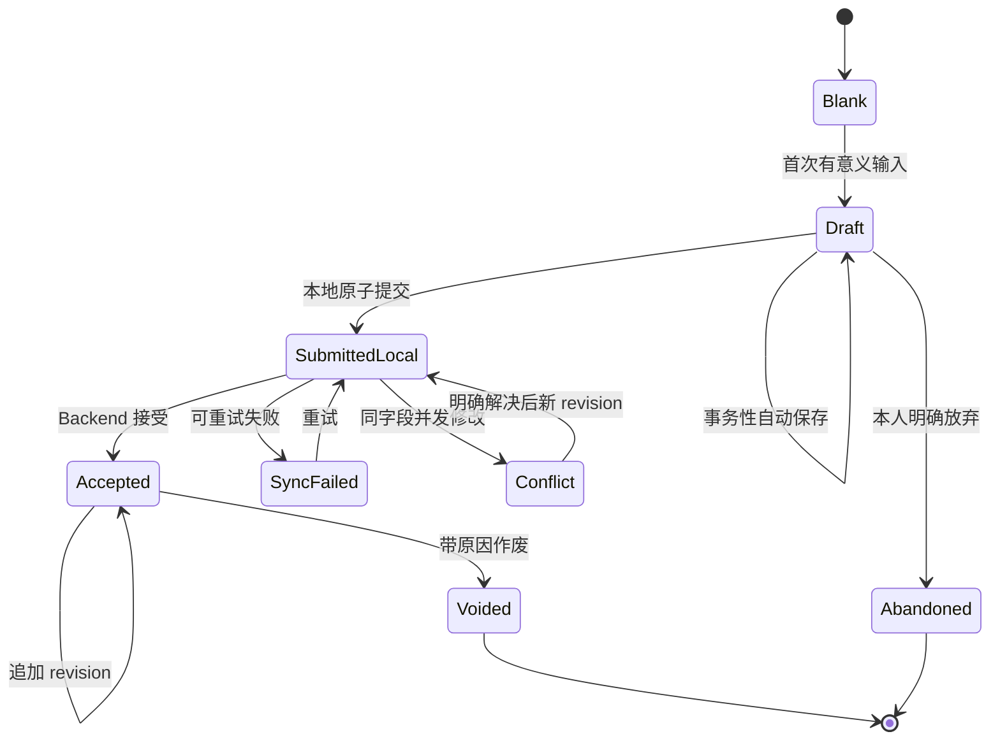
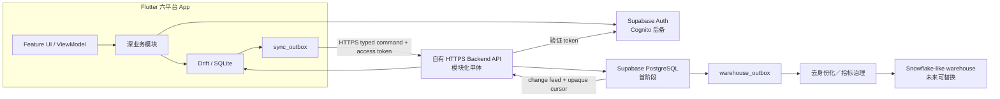

# 同行者 App 现代化产品与技术 Spec

- Spec ID：`TXZ-SPEC-001`
- 版本：`1.1`
- 更新日期：2026-08-03
- 状态：**1.0 已于 2026-07-31 确认；1.1 的五项设计调整已于 2026-08-03 确认；后续实施必须通过本 Spec 对应的 GitHub Issues**
- 覆盖范围：iOS、Android、Web、macOS、Windows、Linux 六平台正式 App

## 0. 文档权威与使用方式

本 Spec 把已确认的产品需求、领域决策、架构约束、隐私规则、统计口径、学习说明书和迁移路线收敛为一份实施合同。

权威顺序为：

1. [领域词汇 `CONTEXT.md`](../CONTEXT.md) 规定词语含义；
2. [ADR 索引](./adr/README.md) 记录已接受单项决策的状态和取代关系；
3. 本 Spec 定义产品全貌、交付顺序与验收条件；
4. [`docs/research/`](./research/) 提供技术证据与备选比较；
5. 当前代码只代表 legacy demo 现状，冲突时不得覆盖已确认需求。

如本 Spec 与已接受 ADR 冲突，以最新 ADR 为准并同步修正 Spec。原 [项目设计文档](./PROJECT_DESIGN.md) 保留为 legacy demo 的历史资料，不再是现代化产品的规范来源。

## 1. 一句话产品定义

**同行者是一个通用的推广行动记录、跟进协作与隐私保护分析 App：它首先帮助使用者如实看见自己已经采取的行动，其次才在权限范围内为团队提供匿名事实汇总和需关心的异常。**

“推广”是场景中立的总称，可以指课程、产品、服务、公益或信仰内容的介绍与跟进。产品不假定用户属于教会、销售团队或任何特定行业。

## 2. 目标、成功标准与非目标

### 2.1 产品目标

| ID | 目标 |
| --- | --- |
| `GOAL-001` | 使用者可在无网络时快速、可靠地记录一次真实直接互动，默认不采集对方身份。 |
| `GOAL-002` | 使用者能私下设定提醒和可选每周接触场次目标，如实看见差距，但不被排名、惩罚或管理者监控。 |
| `GOAL-003` | 为确有跟进需要的场景提供可审计、最小权限的推广对象与关系进展管理。 |
| `GOAL-004` | 项目可以通过版本化场景问卷调整需求，不需每次发布 App，且不改写历史含义。 |
| `GOAL-005` | 提供可复算、可解释、保护小样本的个人与管理分析，不把观察性数据写成因果结论。 |
| `GOAL-006` | 使用一套现代、可测试、可分步演进的 Flutter／SQL 正式代码支持六平台。 |
| `GOAL-007` | 让正式代码本身成为 Flutter 与 SQL 学习素材，并配套零基础读者可理解的中文开发说明书。 |
| `GOAL-008` | 保留替换认证商、数据库托管商、Backend 运行环境和分析仓库的明确边界。 |

### 2.2 可验证的成功标准

- 简单匿名接触只需填写核心事实，不必创建推广对象或穿过多页向导。
- 草稿、正式提交和同步不会因断网、App 转入后台或意外退出而静默丢失。
- 已批准的管理报告不提供个人绩效或排名，并通过受限查询面、贡献者保护和完整网格抑制降低小群体精确值被恢复的风险。
- 同一指标在 Dart／SQLite、PostgreSQL 和未来 warehouse 上对同一 synthetic fixture 得出一致结果。
- 问卷、指标或认证商变更不需让无关 Flutter Feature 同时重写。
- 六平台共用领域语义、数据约束和主要测试，平台差异局限于 Adapter 与响应式表现。
- 每个发布版本都包含与当时代码匹配的中文说明书，重要代码块可一键复制。

### 2.3 非目标

本产品不是：

- 个人绩效考核、销售竞赛、公开排行榜或惩罚性打卡工具；
- 要求先建客户档案才能记录行动的 CRM；
- 把广告投放、群发、通勤或资料准备冒充为接触的工时记录器；
- 让 Flutter 直接连接 PostgreSQL、Snowflake 或任意 warehouse 的数据库客户端；
- 完整 Event Sourcing、微服务集群、分布式 CQRS 或先造万能框架的项目；
- 在正式 App 中执行任意 Dart、JavaScript 或 SQL 的编程沙盒；
- 一套与真实 App 脱节的教学 Demo；
- 仅换颜色、组件库或状态管理包而不修复业务边界的表面重构。

本 Spec 所有功能都属于完整产品范围。分阶段交付只是依赖与风险顺序，不表示后续功能被取消。

## 3. 使用者、协作边界与权限

### 3.1 业务角色

| 角色／身份 | 主要职责 | 默认看不到的内容 |
| --- | --- | --- |
| 用户账号 | 登录身份，可使用个人空间并加入多个组织 | 未建立成员关系的组织或项目数据 |
| 推广者 | 记录自己的接触并查看个人分析 | 他人个人明细与私人计划 |
| 跟进者 | 跟进明确分配给自己的推广对象 | 组织全部对象目录与未分配对象 PII |
| 项目管理员 | 配置项目、问卷和分析定义，查看匿名汇总与去身份化异常 | 个人反思、私人目标和未分配对象 PII |
| 组织所有者 | 治理组织成员、所有权和项目 | 不因“所有者”身份自动看到个人或对象明细 |
| 区域维护者 | 审核全 App 规范区域树 | 不因区域职责获得接触记录访问权 |

### 3.2 权限原则

| ID | 需求 |
| --- | --- |
| `AUTHZ-001` | 账号只代表身份；组织、项目角色与成员能力保存在具体成员关系上。 |
| `AUTHZ-002` | 权限以 capability 表达；角色只是常用 capability 组合，禁止用 `roleLevel` 数字大小推导权限。 |
| `AUTHZ-003` | 组织成员不自动成为项目成员；新项目成员默认只获得推广者能力。 |
| `AUTHZ-004` | Backend 对每个受保护操作重新验证 workspace、project、membership、capability 和撤权状态；UI 隐藏不是安全边界。 |
| `AUTHZ-005` | 管理角色不自动获得对象 PII、个人反思或个人行动计划访问权。 |
| `AUTHZ-006` | 分配、撤销分配、查看敏感资料、导入导出、合并拆分、权限变更与区域修改都必须审计。 |

## 4. 核心信息架构

### 4.1 工作空间与项目

| ID | 需求 |
| --- | --- |
| `CTX-001` | 每个用户自动拥有私有个人空间，无需加入组织即可创建个人推广项目。 |
| `CTX-002` | 已验证邮箱的用户可以自助创建组织，并成为首位组织所有者。 |
| `CTX-003` | 组织可拥有多个推广项目；每条接触只属于一个空间和项目。 |
| `CTX-004` | App 顶部持续显示“个人空间或组织 → 当前推广项目”，并允许有权用户切换。 |
| `CTX-005` | 草稿与接触创建后固定原项目归属；切换上下文不会静默搬移数据。 |
| `CTX-006` | 个人历史只能通过明确预览与确认的“历史贡献”产生组织项目的去身份化副本，原记录不移动。 |

### 4.2 稳定主导航

App 只保留四个稳定主目的地：

1. **今日**：私人提醒、可选每周目标进度、近期行动与需本人处理的同步异常；
2. **接触**：快速记录、接触尝试、多草稿、补录、修订、作废与同步状态；
3. **对象**：本人有权跟进的个人／机构对象、项目关系和后续事项；
4. **分析**：默认个人分析，有相应能力时才显示匿名项目／组织分析入口。

手机使用 `NavigationBar`，宽屏使用 `NavigationRail`，信息架构不变。所有主页提供明显的“记录接触”操作。项目管理、问卷和成员从项目菜单进入；账号、主题、语言、隐私和开发说明书从个人菜单进入。

## 5. 功能需求

### 5.1 认证、会话与内部身份

| ID | 需求 |
| --- | --- |
| `AUTH-001` | 正式认证以 Supabase Auth 为有条件首选；首版只承诺邮箱＋密码和 App 内输入的邮箱确认／恢复 OTP。 |
| `AUTH-002` | Android、iOS、Web、macOS、Windows、Linux 都必须验证注册、确认、登录、token 刷新、注销、撤销、恢复密码和重启会话恢复。 |
| `AUTH-003` | 如任一平台必需流程或安全会话存储无法可靠通过，停止平台专用长期补丁并改用 AWS Cognito。 |
| `AUTH-004` | Flutter 业务模块只依赖 `IdentitySession`，不导入 Supabase 或 Cognito 用户类型。 |
| `AUTH-005` | Backend 验证受信 issuer／JWKS 后，以 `(issuer, subject)` 映射稳定内部 `app_user_id`；业务表不直接依赖 `auth.users`。 |
| `AUTH-006` | 原生平台使用合适的安全会话存储；客户端不得包含 service-role secret、PostgreSQL 密码或 warehouse 凭据。 |
| `AUTH-007` | 本地单元／组件测试使用无法进入正式构建的 fake；Supabase 接线用本地 CLI＋Mailpit 和隔离 staging。 |
| `AUTH-008` | legacy MD5 认证只能留在明确 Demo／Test 配置，不得进入正式构建。 |

Magic Link、社交登录和短信登录不在首版认证合同中。

### 5.2 今日、私人行动计划与提醒

| ID | 需求 |
| --- | --- |
| `PLAN-001` | 用户可按项目自由设定提醒时间，并可选设定每周接触场次目标；两者可分开使用。 |
| `PLAN-002` | 计划、进度、差距和个人反思只对本人可见；组织不能强制设定、修改或查看。 |
| `PLAN-003` | 每周目标只计当周实际发生且当前有效的已提交接触；草稿、尝试、触达人数、兴趣与结果不能代替场次。 |
| `PLAN-004` | 未达目标时显示计划数、已记录数和差额，但不强制解释、不罚打卡、不通知管理者、不使用羞辱文案。 |
| `PLAN-005` | 目标周期使用计划固定 IANA 统计时区和用户选择的周起始日；修改只从下一周期生效。 |
| `PLAN-006` | 提醒按每台提醒设备的当地时间触发；计划在设备间同步，系统通知必须逐设备明确启用，新设备默认关闭。 |
| `PLAN-007` | 系统通知默认只显示通用提醒；用户可选显示项目名与个人进度，但不得包含推广对象资料。 |

### 5.3 接触、尝试、草稿与修订

#### 5.3.1 计数单位与渠道

| ID | 需求 |
| --- | --- |
| `CONTACT-001` | 接触是不限渠道的直接互动。一个连续互动场次形成一条接触，不因参与人数拆分。 |
| `CONTACT-002` | 每条接触单独保存触达人数，只计实际参与的自然人，不计机构对象，不从对象关联数推导。 |
| `CONTACT-003` | 对明确个人或小组发起但没有获得回应的直接联络是接触尝试：触达人数 `0`，不记兴趣，不改关系阶段，不进入周目标。 |
| `CONTACT-004` | 广告投放、群发宣传、资料准备和通勤既不是接触，也不是接触尝试。 |
| `CONTACT-005` | 每条接触或尝试从七个稳定类别只选一个：面对面、语音通话、视频通话、即时文字互动、异步消息、混合渠道、其他直接渠道。 |
| `CONTACT-006` | 项目可配置显示名、示例和可选渠道明细，不得改变类别语义；“其他”必填简短明细。 |

#### 5.3.2 核心事实与快速记录

每条接触的稳定核心事实至少包含：稳定 ID、空间与项目、实际发生 UTC 时刻与当时 IANA 时区、首次录入时间、渠道、地点、触达人数、必填单次兴趣 `0–4`、创建者、问卷版本、当前修订和有效／作废状态。

| ID | 需求 |
| --- | --- |
| `CONTACT-007` | 快速记录是完整接触草稿的渐进展开入口，不是校验更弱或统计地位不同的另一种记录。 |
| `CONTACT-008` | 首屏只强调项目／问卷版本、时间、渠道、地点、触达人数和单次兴趣；问卷、对象跟进和个人记录按需展开。 |
| `CONTACT-009` | 接触默认匿名；姓名、联系方式等 PII 不得写入接触核心表。 |
| `CONTACT-010` | 补录与更正必须保留首次录入时间和修订历史；按实际发生时间进入目标周期和分析。 |
| `CONTACT-011` | 接触尝试后来获得回应并开始实际互动时，新建真正的接触并可选关联原尝试；不把原尝试静默改写成接触。 |
| `CONTACT-012` | 同一连续互动从一种渠道立即转入另一种渠道时仍是一条接触并归入混合渠道；相隔数小时或数天后重新发起的互动另建接触或尝试。 |

#### 5.3.3 草稿、正式提交与冲突

| ID | 需求 |
| --- | --- |
| `DRAFT-001` | 打开空白页不创建草稿；首次有意义输入才创建，之后在修改、页面切换、转入后台或中断前自动保存。 |
| `DRAFT-002` | 同一用户可以保留多份、不同项目的草稿；列表显示项目、发生时间、修改时间、问卷版本和完成度。 |
| `DRAFT-003` | 草稿只对创建者可见，默认私有跨设备同步；记录者可为单份草稿选择“仅本设备”。 |
| `DRAFT-004` | 草稿冲突不用静默 Last Write Wins；保留私有冲突副本，由本人比较、合并或放弃。 |
| `DRAFT-005` | 已有内容的草稿只能由本人明确放弃并可短暂撤销；草稿不进入接触统计。 |
| `DRAFT-006` | 正式提交在一个 Drift transaction 中原子写入接触、初始 revision、类型化答案与唯一 `sync_outbox` mutation。 |
| `DRAFT-007` | 本地事务成功后 UI 才显示“已保存”；断网只改变同步状态，不删除本地事实。 |
| `DRAFT-008` | 已提交接触不能直接覆盖；更正使用追加 revision，不限于最近十条。 |
| `DRAFT-009` | 不存在、重复或误录的已提交接触使用带原因的 void 作废，从正常统计排除，不静默物理删除。 |
| `DRAFT-010` | 离线并发修改在不同字段时可自动合并；同一字段冲突时保留原始修改并要求有权用户明确解决。 |

### 5.4 接触地点与全平台区域树

| ID | 需求 |
| --- | --- |
| `REGION-001` | 每条接触和尝试都必须明确地点：有线下成分时记录具体线下地点，纯非线下时明确为 `N/A`；不用空值混同定位失败与不适用。 |
| `REGION-002` | 面对面或含线下成分的混合渠道最终至少归入城市；保存当时可确定的最小区域节点。 |
| `REGION-003` | 全 App 使用一棵规范的严格层级树；每个节点只有一个规范父级，上级由父链推导，不在接触上重复存储整条路径。 |
| `REGION-004` | 城市下可有片区、街道、学校、超市或其他地点节点；“校园”、“超市”等是区域属性，不是额外父级。 |
| `REGION-005` | 有经纬度但暂时无法解析时保存坐标与“待解析”，之后必须归入至少城市；该状态不等于 `N/A`。 |
| `REGION-006` | 规范区域树由平台区域维护者管理；组织可提交建议与配置显示别名，但不能改变父级、边界或节点身份。 |
| `REGION-007` | 每次匹配保留解析版本和原结果；分析同时支持“当前区域视图”和用原版本复现的“原始区域视图”。 |
| `REGION-008` | 新节点或边界建议待审核时，接触先归入当时已有的最小规范上级；审核后可用新版本重新解析，但不得抹除原匹配。 |
| `REGION-009` | 日常分析默认使用当前区域视图；原始区域视图用于历史复现、解释跨期边界变化和审计。 |

### 5.5 场景问卷

| ID | 需求 |
| --- | --- |
| `QUESTION-001` | 时间、渠道、接触地点、触达人数和单次兴趣是全平台稳定核心；场景特有问题属于推广项目的版本化问卷。 |
| `QUESTION-002` | 第一版支持八类受控题型：是／否、普通单选、有序单选、多选、数字、日期、短文本、长文本。 |
| `QUESTION-003` | 数字题区分整数／小数并可配单位与范围；日期题只表示日期；普通单选不得因显示顺序被当作有序量表。 |
| `QUESTION-004` | 每题区分已回答、未知／无法判断、拒绝回答、不适用、未回答五种状态；状态与真实值分开。 |
| `QUESTION-005` | 问题可按同版本更早问题使用一层 AND 或 OR 的受限声明式显示规则；禁止循环、任意嵌套、代码、公式或 SQL。 |
| `QUESTION-006` | 规则隐藏的问题当次为“不适用／规则跳过”并不携带旧答案；清除前必须提示并可短暂撤销。 |
| `QUESTION-007` | 问卷经历草稿、校验、模拟答案预览、版本差异和指标兼容判断后才能发布；已发布版本不可修改。 |
| `QUESTION-008` | 每个项目只有一个供新草稿使用的当前版本；旧草稿保留原版本，可继续提交或明确升级。 |
| `QUESTION-009` | 草稿升级只自动复制已审计为语义兼容的答案；新题、新必填题与不兼容答案必须重新确认。 |
| `QUESTION-010` | Flutter 离线 evaluator 与 Backend validator 使用同一组 fixture；Backend 不信任客户端的隐藏、必填或类型判断。 |
| `QUESTION-011` | 只有具备 `manage_analysis_definitions` 能力的成员可以确认跨版本语义兼容；必须比较定义、选项、时间范围与回答方式，记录理由、操作者、时间和影响预览，并允许撤销。组织可选启用第二人批准。 |
| `QUESTION-012` | 短文本和长文本默认不进入结构化统计，也不得用来绕过推广对象资料的 PII 存储、授权和保留边界。 |

文件上传、签名、矩阵、重复子表、任意公式和任意 SQL 不属于问卷第一版能力。

### 5.6 推广对象、关系与跟进

| ID | 需求 |
| --- | --- |
| `TARGET-001` | 只在确有跟进需要且对方愿意留下可识别资料时按需建立推广对象；接触始终可以匿名存在。 |
| `TARGET-002` | 推广对象类型必须是个人或机构，并归一个个人空间或组织所有；不同空间不自动匹配或共享。 |
| `TARGET-003` | 姓名、联系方式等 PII 只保存在推广对象中；接触、warehouse 事实和匿名分析不复制这些字段。 |
| `TARGET-004` | 一条接触可关联零个到多个同空间对象；关联数不增加接触场次，未识别参与者不建占位档案。 |
| `TARGET-005` | 关联尚未进入当前项目的对象时，App 在记录流程内明确请求确认；确认后以关系阶段 `0` 建立项目关系。 |
| `TARGET-006` | 每条接触有必填场次单次兴趣；每个已识别对象关联另可选填写对象当次反应。两者均用 `0–4`，但分开存储与统计。 |
| `TARGET-007` | 机构只有在参与者明确代表机构表态时才能拥有对象当次反应；不从个人反应推断机构反应。 |
| `TARGET-008` | 每个“推广对象 × 推广项目”拥有独立 `0–4` 关系阶段和生命周期状态；阶段可上升或下降。 |
| `TARGET-009` | 阶段变更保留原阶段、新阶段、操作者、时间和原因；下降必须有结构化原因，不覆盖历史。 |
| `TARGET-010` | 后续联系同意是一次接触中的明确结构化事实；不得从已有联系方式、导入资料或过去同意推断。 |
| `TARGET-011` | 个人反思只属于记录者；共享跟进备注属于对象的项目关系、只对当前跟进者可见并保留修改历史。两者不进入匿名分析或 warehouse。 |
| `TARGET-012` | 平均心率等个人生理信号默认关闭，只供推广者本人观察，不属于项目或对象数据，也不进入管理分析或 warehouse。 |
| `TARGET-013` | 单次兴趣和对象当次反应的固定语义为：`0` 明确拒绝、`1` 互动但无继续意愿、`2` 中性或无法判断、`3` 明确愿意继续、`4` 主动提出或落实下一步。 |
| `TARGET-014` | 关系阶段的固定语义为：`0` 初次建立、`1` 可以联络、`2` 持续互动、`3` 明确推进、`4` 达成项目定义的目标关系。 |
| `TARGET-015` | 项目可为两套量表配置符合固定语义的显示名，但不得改变含义、顺序或方向；如界面显示 `0／2／4／6／8`，由 `stage * 2` 派生，不写入数据库。 |

#### 5.6.1 个人与机构关系

- 个人与机构在同一空间内是多对多，每条关系保留开始、结束和历史状态。
- 一条关系必须且只能选择任职／代表、所有／治理、学习／参与、成员／归属、合作／服务或其他；“其他”必填角色说明。
- 同一人与机构可以同时有多条不同性质的关系。
- 该关系不授权、不代表 App 组织成员、不自动关联接触，也不推断反应或阶段。

#### 5.6.2 PII 访问、保留、导入与合并

| ID | 需求 |
| --- | --- |
| `PII-001` | 对象创建者初始自动成为跟进者；之后只有当前明确分配的跟进者能查看 PII，创建者没有永久访问权。 |
| `PII-002` | 离线只缓存本人当前分配的对象资料并加密；自最近联网验权起最多七十二小时可打开，到期后必须联网。 |
| `PII-003` | 取消分配、退出组织、资料到期、退出登录或删除账号时清除相应本地敏感缓存。 |
| `PII-004` | 对方明确退出时立即匿名化；连续十二个月无接触时必须复核，未明确续期即匿名化。组织可配更短期限。 |
| `PII-005` | 匿名化删除可识别资料，但历史接触继续作为匿名行动事实存在。 |
| `PII-006` | 批量导出 PII 需要独立 `export_target_pii` capability、近期重新认证和审计，且不超过原有可见范围。 |
| `PII-007` | CSV／未来 CRM 导入需要 `import_target_pii` capability；导入只创建对象，不生成接触、兴趣、阶段或同意事实。 |
| `PII-008` | 系统可以在同一空间提示疑似重复，但绝不自动合并，也不进行跨空间检测。 |
| `PII-009` | 人工合并保留原对象、字段来源、项目关系和接触关联，必须可逆拆分；无法确定归属的合并后新数据由人工分配。 |

### 5.7 组织治理与生命周期

| ID | 需求 |
| --- | --- |
| `ORG-001` | 组织默认私有；用户只能接受定向邀请，或提交加入申请并获批后入组。 |
| `ORG-002` | 定向邀请绑定指定邮箱或账号，只用一次并在七天后失效；可转发加入链接只创建待审批申请。 |
| `ORG-003` | 每个组织始终至少有一位有效所有者；唯一所有者退出或删除账号前必须转让所有权或删除组织。 |
| `ORG-004` | 组织删除后进入三十天可恢复只读期；期满清除组织业务数据，只保留不含业务内容的最小删除审计。 |
| `ORG-005` | 账号删除也有三十天恢复期；期满清除身份、个人空间、个人反思和成员关系，组织历史事实以不可反查的“已删除成员”保留。 |
| `ORG-006` | 完成邮箱验证的用户可以自助创建组织并成为首位所有者；平台可实施配额、停用和反滥用，但不把组织创建变成人工审批流程。 |

### 5.8 分析、指标与报告

#### 5.8.1 统计单位和核心口径

| 指标 | 真实统计单位 | 核心计算 |
| --- | --- | --- |
| 接触场次 | 当前有效的已提交接触 | `count(distinct contact_id)`；排除草稿、尝试和作废 |
| 触达人数 | 有效接触中的自然人 | `sum(reach_count)`；不等于对象关联数 |
| 单次兴趣分布 | 有效接触 | 对 `0–4` 分别计数，不按对象去重 |
| 对象当次反应 | 当前有效 revision 中已填反应的接触对象关联 | 与场次兴趣分开的 `0–4` 分布、中位等级和五档比例；比例共同分母只含已填关联 |
| 当前关系阶段 | 去重的“对象 × 项目” | 每个当前有效项目关系只计一次 |
| 阶段变更 | 阶段变更事件，阈值依不同项目关系 | 上升与下降分开；历史分布依事件还原 |
| 后续联系同意占比 | 适用且明确回答是／否的有效接触对象关联 | `yes / (yes + no)`；同一接触的不同对象分别计数，其他状态分开报告 |

五级有序量表默认展示各级数量、比例和中位等级；单次兴趣另可显示 `3–4` 占比与 `0` 占比。

对象当次反应五档比例的五个分子必须穷尽同一期间全部已填关联。未填写的
`response_level` 不进入分子或分母，不改写为等级 `2`，并作为未回答覆盖单独报告。
比例使用整数分子、分母和按 half-up 计算的百分比基点；空分母显示 `0 / 0` 和空百分比，
不显示 `0%`。

只有高级分析可显示：

```text
兴趣算术指数 = sum(单次兴趣等级) / 有效接触数
```

显示时必须警示：该公式临时假设 `0→1→2→3→4` 相邻等级距离相等，不能取代分布和中位等级。

#### 5.8.2 时间、趋势、版本与因果边界

| ID | 需求 |
| --- | --- |
| `ANALYTICS-001` | 管理日／周／月使用项目固定报告 IANA 时区和实际发生时间；不使用查看者设备或录入时间。 |
| `ANALYTICS-002` | 按小时分析默认使用接触当地时间；可切换项目报告时区，但两种口径不混入同一数列。 |
| `ANALYTICS-003` | 比例同时显示分子、分母、百分比、未知、拒答、不适用、未回答与排除数。 |
| `ANALYTICS-004` | 趋势默认显示两期原始数和百分点差；只在单位、时长、时区、版本一致且两期通过隐私保护时比较。 |
| `ANALYTICS-005` | 普通数据只能描述数量、分布、差异与关联；不得自动使用“导致”、“提升了”或“最佳策略”等因果语言。 |
| `ANALYTICS-006` | 核心报表默认不展示置信区间、`p-value` 或显著性；推断性分析必须先定义总体、抽样、重复观察和数学模型。 |
| `ANALYTICS-007` | 每个正式指标在指标目录中保存稳定 ID、版本、单位、分子／分母、排除项、时间口径和隐私规则。 |
| `ANALYTICS-008` | 平台核心指标随代码发布；项目只能使用受验证配置器组合问卷数量、分布和比例，不执行任意 SQL。 |
| `ANALYTICS-009` | 问卷版本只在已明确审计为语义兼容时合并；兼容判断可撤销，已生成报告保留原定义。 |
| `ANALYTICS-010` | 个人分析在本地事实写入后立即更新并标明同步状态；管理分析只统计后端已接受数据，目标在五分钟内更新。 |
| `ANALYTICS-011` | 未来 warehouse 第一阶段允许最多二十四小时延迟；图表、缓存和报告显示数据截止时间和新鲜度层级。 |
| `ANALYTICS-012` | 动态分析随补录、修订和作废重算；正式导出是固定截止、指标、问卷兼容、区域、时区和计算版本的报告快照。 |
| `ANALYTICS-013` | 后续数据或定义变更以更正版报告取代原快照；不静默覆盖原报告，也不用报告绕过删除规则。 |
| `ANALYTICS-014` | “后续联系同意占比”由项目选择是否启用，不是平台必显核心指标，也不得作为个人目标、排名或考核；管理展示继续经过匿名保护。 |

### 5.9 管理分析的匿名保护

| ID | 需求 |
| --- | --- |
| `PRIVACY-001` | 管理分析只返回权限范围内的匿名汇总和去身份化异常，不提供个人绩效、排名或个人目标达成。 |
| `PRIVACY-002` | 每个可显示或可推导统计单元至少包含 `10` 个该指标的真实统计单位；不足时只返回“样本不足”。 |
| `PRIVACY-003` | 每个管理单元还必须包含至少三位不同推广者，且任一人的统计单位不超过该单元一半。 |
| `PRIVACY-004` | 二元比例的两类和多级分布的每格分别检查阈值；隐藏小格时使用互补隐藏，不让总数相减恢复精确值。 |
| `PRIVACY-005` | 后端在返回 API、图表或导出前完成阈值、贡献者保护、完整结果网格和互补隐藏；Flutter 不先收到精确明细再隐藏。 |
| `PRIVACY-006` | 第一阶段不对安全单元加随机噪声；这些控制用于降低披露风险，不构成形式化的不可重识别保证，也不证明统计显著性或结论可靠性。 |
| `PRIVACY-007` | 去身份化异常只包含纠错所需时间、区域、定位状态和必要坐标，不含推广者／对象身份、联系方式或备注。 |
| `PRIVACY-008` | 本人查看自己的事实不受管理匿名阈值限制，但界面必须标明这是个人数据，不能据此代表团队或总体。 |
| `PRIVACY-009` | 组织可以提高最小统计单位、要求更多推广者或降低单人占比上限，但不能弱化平台底线。 |
| `PRIVACY-010` | 第一阶段只开放服务端定义、版本化的固定报告形状；后端对维度、时间／区域粒度、筛选和导出字段使用 allowlist，将请求 canonicalize 后执行完整网格与互补隐藏，并以审计和重识别 fixture 验证风险边界。 |
| `PRIVACY-011` | 查看或修正去身份化异常需要相应 capability 并留下审计；修正采用接触 revision，不借纠错入口取得记录者或对象身份。 |

个人查看自己的数据不受匿名阈值限制，但页面必须标示“个人数据”，不将它表述为团队或总体结论。

### 5.10 开发说明书与中文注释

| ID | 需求 |
| --- | --- |
| `MANUAL-001` | 项目只维护一套可正式上线的代码；学习内容解释这套代码，不另建脱节 Demo。 |
| `MANUAL-002` | 完整说明书以 `docs/manual/README.md` 为唯一入口，分章 Markdown 是唯一内容来源；HTML 只由 Markdown 生成。 |
| `MANUAL-003` | App 设置中提供“开发说明书”页，可渲染目录、正文、搜索和代码块；每个代码块有一键复制与反馈。 |
| `MANUAL-004` | 每个 App 发布版本离线打包与当时代码匹配的说明书；在线版必须标明对应 App 版本。 |
| `MANUAL-005` | 中文是权威版；英文使用同一章节 ID 和版本逐章同步，未核对时明确回退中文。 |
| `MANUAL-006` | 为零基础读者解释架构、数据流、Flutter、Drift／SQLite、PostgreSQL、SQL、迁移、权限、同步和选择的优缺点；不要求理解 Dart／SQL 底层实现。 |
| `MANUAL-007` | 统计章解释数学背景、单位、公式、分子／分母、去重、排除、时区、缺失、有序量表假设、隐私和因果边界。 |
| `MANUAL-008` | 声称来自当前 App 的 Dart／SQL 片段从正式源码或可执行测试中以 marker 自动提取；教学改写标记“简化示例”。 |
| `MANUAL-009` | 可执行 SQL 示例使用 synthetic fixture 自动测试；正式 App 不提供任意代码或 SQL 执行器。 |
| `MANUAL-010` | 手写业务代码注释以中文为主；公共业务接口说明用途、参数来源／单位／空值语义、返回值、副作用和权限边界。 |
| `MANUAL-011` | 复杂 SQL、事务、migration、同步、冲突、统计和隐私逻辑按不变量与原因注释；不机械给每个括号、赋值或生成代码加注释。 |
| `MANUAL-012` | 注释和说明书不引用会随编辑失效的固定行号；使用稳定类、函数、字段和 snippet marker 追溯。 |

## 6. 领域数据模型与生命周期

### 6.1 核心逻辑实体

| 实体 | 所有权／作用域 | 关键不变量 |
| --- | --- | --- |
| `app_user` | 全平台内部身份 | 与外部 issuer／subject 分开，不携带全局权限等级 |
| `workspace` | 个人空间或组织 | 数据共享、对象所有权与跨空间隔离边界 |
| `project` | 一个 workspace | 接触、问卷、项目关系、计划和分析上下文 |
| `membership` + `capability` | 组织或项目 | 账号不等于成员，角色不等于数字权限 |
| `region_node` + `region_version` | 全平台 | 唯一父级、最小节点引用、版本化解析 |
| `contact_draft` | 创建者／项目 | 私有、多份、自动保存、固定问卷版本，不进统计 |
| `contact_session` | 空间／项目 | 一个互动场次一条，默认匿名，已提交后只追加修订 |
| `contact_attempt` | 空间／项目 | 无回应的直接联络，不伪装成接触 |
| `promotion_target` | 一个 workspace | 个人或机构，PII 集中存储，不跨空间自动识别 |
| `contact_target_link` | 一条接触 | 零对多关联，可选对象当次反应，不改变场次数 |
| `target_project_relation` | 对象 × 项目 | 长期阶段与生命周期，不从单次反应推断 |
| `person_institution_relation` | 一个 workspace | 多对多、六类性质、保留历史，不授权 |
| `questionnaire_version` + typed answers | 一个 project | 已发布版本不可变，值、状态与题型可验证 |
| `personal_plan` | 用户 × 项目 | 私人、可选周目标、版本化时区／起始日 |
| `metric_definition` + `report_snapshot` | 平台或项目 | 稳定版本口径、可复算快照和隐私状态 |
| `processed_command` + `change_feed` | Backend | 幂等结果、同步 cursor 与客户端变更 |
| `warehouse_outbox` | Backend | 只输出已批准、版本化、去身份化分析事实 |

实际表名可在实施 Issue 中细化，但不得用一张宽表重新把接触、对象 PII、关系阶段、个人反思、心率和问卷答案混在一起。

### 6.2 接触生命周期



`SubmittedLocal` 已是本人的正式本地事实，可进入个人分析并显示未同步状态；只有 `Accepted` 才进入管理分析和服务端报告。

## 7. 系统架构和数据流

### 7.1 总体架构



### 7.2 强制边界

| ID | 需求 |
| --- | --- |
| `ARCH-001` | Flutter 使用 Drift／SQLite 作为离线事实、草稿、同步状态和个人即时查询的本地存储。 |
| `ARCH-002` | Flutter 只调用自有 HTTPS API，不直接读写 Supabase Data API 业务表、PostgreSQL 或 warehouse。 |
| `ARCH-003` | Backend 是按业务模块组织的模块化单体，负责 token 验证、身份映射、授权、校验、幂等、修订、审计、同步和隐私。 |
| `ARCH-004` | 首阶段业务数据库使用与 Supabase Auth 同一 project 的 Supabase PostgreSQL，但核心 schema 保持标准 PostgreSQL。 |
| `ARCH-005` | 正常 Backend 流量使用最小权限数据库角色；`service_role` 不得进入 Flutter，RLS 只是额外防线，不取代 Backend 授权。 |
| `ARCH-006` | PostgreSQL schema 的唯一权威来源是仓库内有序、可审阅的 `.sql` migration；不在生产 Dashboard 手工改 schema。 |
| `ARCH-007` | 业务事实、revision、audit、幂等结果、`change_feed` 和 `warehouse_outbox` 尽可能在同一 PostgreSQL transaction 中提交。 |
| `ARCH-008` | warehouse 只接收已批准的去身份化分析事实；不把 Auth schema、PII、精细位置、备注或整库 CDC 默认复制过去。 |
| `ARCH-009` | Backend 运行位置当前优先考虑 Cloud Run，但不进入业务合同；第一批不可丢失数据前执行 ADR-0097 的跨云／私网／HA／SLA／PITR 复审。 |
| `ARCH-010` | 定期使用 `pg_dump`／restore 在 stock PostgreSQL 或 Cloud SQL staging 执行恢复演练，确保托管商可替换。 |

### 7.3 同步协议

Outbox command envelope 至少包含：

```text
protocol_version
command_id / client_mutation_id
device_id
aggregate_id
base_revision
type
typed_payload
```

客户端不得把自报 `app_user_id`、角色或项目权限作为可信事实。服务端稳定结果为 `accepted`、`duplicate`、`conflict`、`rejected` 和 `forbidden`。Pull 使用不透明 server cursor，不用客户端时钟排序；客户端在一个 Drift transaction 内幂等应用 batch，成功后才推进 cursor。

首批 command 是 `contact.submit.v1`、`contact.revise.v1` 和 `contact.void.v1`。同一 `app_user_id + command_id` 重放必须返回原结果，不重复写入、计数或发布 warehouse 事实。

Outbox 采用 ADR-0098 的持久状态机。`ContactJournal` 在本地业务 transaction 中写入唯一 command；内部 `SyncEngine` 在 SQLite transaction 中领取并租赁待发送项，ACK 后更新稳定 command 结果。依 ADR-0100，pull cursor 只在整批远端变化本地落盘后推进。关键运行合同如下：

| 合同 | 规则 |
| --- | --- |
| 状态 | `pending`、`leased`、`needs_resolution`、`permanent_failure`、`completed` |
| 顺序与并行 | 同一 aggregate 同时最多一条租约并按创建顺序发送；其他 aggregate 可以继续 |
| 崩溃恢复 | 租约过期后可重新领取；Web 以持久租约保证单 drainer，tab 内存锁只作优化 |
| 结果 | accepted／duplicate 完成，conflict 待解决，rejected／forbidden 永久失败，超时／429／5xx 退避重试 |
| 确认与清理 | push result 与 command 状态原子确认；pull 事实与 cursor 原子确认；待解决项不自动清理 |
| 健康状态 | 只返回数量、最旧等待时长、最后成功时间和稳定错误码，不暴露 payload、PII 或自由文本 |

重试采用有上限的指数退避、jitter 和可信 `Retry-After`。服务端幂等仍是 ACK 丢失后重放的最终安全边界。

### 7.4 SQL 的三个学习层

| 层 | 用途 | 学习重点 |
| --- | --- | --- |
| Drift／SQLite | 草稿、本地原子提交、Outbox、个人即时查询 | transaction、JOIN、index、migration、NULL 与本地时间 |
| PostgreSQL | 共享事实、权限、revision、幂等、审计、管理分析 | constraint、recursive CTE、partial index、lock／isolation、隐私查询 |
| Warehouse SQL | 去身份化趋势和较大规模分析 | 分层模型、窗口函数、快照、延迟、隐私与对账 |

三层方言不强行共用一段 SQL，但必须共用指标定义和 synthetic fixture。有教学与统计价值的 SQLite JOIN／聚合放入按领域命名的 `.drift` 文件；PostgreSQL 使用有序 migration 和命名 `.sql` query，不让 ORM 隐藏重要 SQL。

## 8. Flutter 代码组织与变更灵活性

### 8.1 依赖方向

```text
Feature View / ViewModel
        ↓
窄的业务模块接口
        ↓
领域规则（不依赖 Flutter／Drift／认证 SDK）
        ↓
Drift、HTTP、Auth、Location、Notification 等 Adapter
```

| ID | 需求 |
| --- | --- |
| `CODE-001` | 代码按用户行为和 Feature 组织，不强制每个 Feature 复制四层目录。 |
| `CODE-002` | View 只负责布局、动画、简单显示与用户意图；Widget 不执行 SQL、HTTP、认证 SDK、权限或指标公式。 |
| `CODE-003` | ViewModel 只向 UI 暴露不可变 ViewState，不暴露 Drift row、HTTP DTO 或认证商 User。 |
| `CODE-004` | 深模块以少量完整行为作为公共接口，内部协调多表、事务、校验和失败；不为每张表建浅 Repository／DAO／UseCase 三件套。 |
| `CODE-005` | 只有确有生产／测试、跨平台或复杂外部失败需要替换时才建 Port，不为抽象而抽象。 |
| `CODE-006` | 新需求按最小可用垂直切片进入，只创建当前行为需要的表和模块；第二个真实重复场景后再抽取通用机制。 |
| `CODE-007` | 禁止继续扩张万能 `AppController`、万能 `ConversationRecord`、Widget 内统计和一个任意 JSON 包含所有业务语义。 |

### 8.2 首批深模块

| 模块 | 对外表达 | 内部隐藏 |
| --- | --- | --- |
| `AppSession` | 登录态、语言、主题、当前空间／项目、capabilities | 认证商、设置表、上下文恢复和路由输入 |
| `ContactJournal` | 自动保存、提交、修订、作废、观察记录／草稿状态 | 多表 SQL、revision、Outbox 原子性和错误分类 |
| `QuestionnaireCatalog` | 取得绑定版本、显示规则、验证、升级 | 八题型、五状态、兼容关系与不可变版本 |
| `TargetFollowUp` | 有权对象、接触关联、项目阶段、备注与后续事项 | PII 隔离、分配、关系历史、保留期与匿名化 |
| `PersonalPlan` | 提醒、周期、可选目标和私人差距 | 时区版本、设备 opt-in、补录重算 |
| `MetricRepository` | 返回带版本、单位和口径的 `MetricResult` | SQL、去重、分母／排除、隐私抑制和数据截止 |
| `ManualCatalog` | 目录、章节、版本、代码块和复制内容 | bundled Markdown、manifest、snippet 和在线／本地版本差异 |

`SyncEngine` 是内部深模块，独占领取、租约、ACK、退避、pull cursor 和错误分类。页面只观察“仅本机／同步中／失败／冲突／已同步”及不含 payload 的健康状态，不需理解 HTTP 或 Outbox 表结构。

### 8.3 七类固定测试接缝

“测试接缝”不是多造七层代码，而是在最容易出错的边界保留可替换入口：测试时可以把真实云服务、网络、时钟或设备能力换成能够稳定制造断网、过期、重复、冲突和拒绝的测试实现。

| ID | 接缝与必须证明的行为 |
| --- | --- |
| `TEST-001` | `ContactJournal` 使用真实测试 Drift，证明草稿、接触、revision、答案和 Outbox 的原子成功／失败。 |
| `TEST-002` | Identity fake／staging Adapter 与 Backend SQL 授权共同证明内部身份映射、membership、capability、对象分配、撤权和越权拒绝。 |
| `TEST-003` | Sync 的 HTTP／内存合同 Adapter 共同覆盖幂等、原子 claim／lease／ACK、过期租约、指数退避、离线重启、Web 单 drainer、乱序、部分失败、冲突、健康状态和旧 contract。 |
| `TEST-004` | Questionnaire 的 Flutter evaluator 与 Backend validator 对同一 fixture 运行八题型、五状态、显示规则、旧草稿和升级用例。 |
| `TEST-005` | Metric fixture 对账 Dart／SQLite、PostgreSQL 与未来 warehouse；`MetricResult` 固定来源层级、单位、分母、排除、时区、版本、截止、同步覆盖与隐私状态。 |
| `TEST-006` | Platform Capability／Policy 覆盖位置、持久化、认证、安全缓存、通知和后台同步的可用、拒绝、超时与降级。 |
| `TEST-007` | Database fixture 覆盖新库初始化、每次正式升级、关键 SQL、失败恢复和 forward-fix，不拿真实用户资料试 migration。 |

## 9. UI、视觉与可访问性

| ID | 需求 |
| --- | --- |
| `UI-001` | 使用 Material 3 并建立统一 color、type、spacing、shape 和 motion tokens；不把换色当作 UI 现代化。 |
| `UI-002` | 使用 `MaterialApp.router` 与稳定 URL／deep link，支持浏览器前进后退、详情页和说明书章节地址。 |
| `UI-003` | 同时支持触摸、鼠标、键盘、Tab focus、hover、tooltip 和可读的点击区域。 |
| `UI-004` | 不用颜色单独表达兴趣、同步错误、作废或隐私抑制；图表同时提供文本／表格与口径说明。 |
| `UI-005` | 快速记录在手机为单列渐进表单，宽屏可为表单＋摘要双栏；字段顺序、校验和含义不随屏幕改变。 |
| `UI-006` | 草稿、同步、冲突、样本不足、权限失效和网络降级都使用明确可恢复状态，不只显示 spinner 或静默失败。 |
| `UI-007` | 正式 Widget 大量编写前用可丢弃 UI prototype 验证信息密度、主导航和关键尺寸；prototype 不承载正式业务逻辑。 |

## 10. 六平台能力合同

| ID | 需求 |
| --- | --- |
| `PLATFORM-001` | 六平台共用同一 Flutter 产品、领域规则、四主导航、指标定义和大部分测试。 |
| `PLATFORM-002` | 原生平台使用 Drift Native，Web 使用 Drift Wasm；重 SQL／I/O 不在 UI isolate 执行。 |
| `PLATFORM-003` | 定位、可靠持久化、安全存储、背景同步、系统通知和文件系统通过 Capability／Policy 适配，不在 Widget 散落平台判断。 |
| `PLATFORM-004` | 能力不可用时提供明确降级，但不改变接触、兴趣、阶段或隐私的核心语义。 |
| `PLATFORM-005` | Web 验证 OPFS／IndexedDB／内存降级、普通／隐私窗口、刷新、崩溃、断网和双标签；同一时刻只有一个 tab drain Outbox。 |
| `PLATFORM-006` | `unsafeIndexedDb` 必须警示不要多开标签页；`inMemory` 不得声称未同步草稿已可靠保存。 |
| `PLATFORM-007` | 六平台进入 build smoke 和关键宽度 Widget 验收；硬件能力只需少量真机 integration，不重复全部业务测试。 |

## 11. legacy v5 处理

用户已确认：当前没有真实用户，也没有任何设备上不可丢失的 schema v5 真实数据。因此不开发复杂旧业务数据迁移向导，采用“保留证据＋干净初始化”。

| ID | 需求 |
| --- | --- |
| `MIGRATION-001` | 第一次改 schema 前保存 v5 Drift schema 快照与只读 SQLite／数据导出，并区分空库、Demo seed 与演示账号。 |
| `MIGRATION-002` | 使用新 schema 从零初始化，重新生成明确标记为 synthetic 的 Demo／Test 数据。 |
| `MIGRATION-003` | 不从 legacy `roleLevel`、team、联系方式、关系等级、备注、姓名或旧区域默认值猜测现代领域事实。 |
| `MIGRATION-004` | 自第一个正式新 schema 起，每次升级保存真实旧库 fixture，自动验证 migration、约束、索引、seed、关键 SQL 和失败恢复。 |
| `MIGRATION-005` | 如以后意外发现未知真实 v5 数据，必须暂停导入并单独评估，不静默套用 Demo 转换。 |

## 12. 交付切片与验收顺序

以下切片只是依赖顺序，不是功能删减。除非新的 ADR 明确修改，前文所有需求都属于完整产品范围；每个切片都必须形成可运行、可测试、可解释的端到端增量。

### Slice 0：安全地基与可测试接缝

交付：

- 保存 v5 schema、SQLite／数据备份和 legacy 行为证据，隔离 Demo seed 与旧 MD5 登录；
- 建立 composition root，并为 Clock、ID、Error mapping、Database factory、Authentication 和平台 Capability 提供可替换边界；
- 通过 Fake Identity 完成本地单元／Widget 测试，以真实 Supabase test project 建立六平台认证与安全存储证据矩阵；已验证、仅 build 通过和待实测必须分开记录；
- 建立 PostgreSQL 本地／测试 migration runner、受限 runtime role、CI 空库重建和 fixture 机制。

验收：生产路径不存在 MD5、Demo 密码、客户端数据库凭据或 service-role secret；时间、ID、数据库和认证失败均可确定性测试；任意空 PostgreSQL 与空 Drift 数据库都能从 migration 重建；证据矩阵诚实记录各平台已通过和待完成项目。尚未完成的 Android、Windows、Linux 运行时证据可与领域切片并行推进，但仍是公开发布门槛；失败平台按 ADR-0096 评估 Cognito。

### Slice 1：匿名接触的第一个完整闭环

交付：

- `Identity → app_user → 个人空间 → 推广项目 → 当前上下文 → 基础问卷`；
- 多草稿、自动保存、匿名接触、七类渠道、地点／`N/A`、触达人数和单次兴趣；
- Drift 事务内同时写入接触、首个 revision、答案和 `sync_outbox`；
- `SyncEngine` 实现原子 claim／lease／ACK、过期租约恢复、基本退避和不含 payload 的同步健康状态；
- 自有 API 将幂等 mutation 写入 PostgreSQL，并以游标拉取服务端变化；
- 建立稳定 router 和跨尺寸主框架；“今日”和“接触”可完成本切片行为，“分析”显示最近七日个人接触场次及来源／新鲜度／同步覆盖，“对象”明确显示尚未开放，不伪造功能；
- 本人看到保存后的即时反馈和“仅本机／同步中／失败／已同步”状态。

验收：用户可断网完成、关闭并重开草稿，联网后重复重放同一 mutation 不产生重复事实；进程退出和过期租约不会永久卡住 command，Web 双标签最多一个 drainer；整个切片不要求或生成 PII；最近七日计数只统计当前有效、已提交的接触，并明确显示同步覆盖。

### Slice 2：修订、作废、重试与冲突

交付：接触尝试、提交、补录、修订、作废、稳定服务端处理结果、完整退避与错误分类、批次部分失败、跨设备冲突和旧 contract fixture。

验收：历史只追加不覆盖；重复请求幂等；不同字段可按规则合并，同字段并发进入显式冲突；作废记录从当前指标排除但审计仍可见；失败可区分可重试、需用户处理和永久拒绝。

### Slice 2 后的内部 Alpha 门槛

Slice 0、1、2 完成后可以发放内部 Alpha，用于验证匿名接触闭环、修订、冲突和同步恢复。该里程碑只允许测试资料，不开放推广对象 PII、组织管理或管理分析，也不等于公开发布。平台能力页面和证据矩阵必须明确哪些平台只完成 build、哪些已通过真实运行；未完成认证或安全存储实测的平台不得被宣称为已支持。

### Slice 3：项目问卷设计与版本化

交付：八题型、五回答状态、受限显示规则、草稿预览、发布、旧草稿保留／升级、不可变问卷版本、指标语义兼容决定。

验收：Flutter evaluator 与 Backend validator 跑同一 fixture；隐藏字段伪造、越界答案和过期权限由后端拒绝；发布新版本不改变旧提交，也不破坏离线待同步记录；兼容决定可审计并可撤销。

### Slice 4：推广对象与隐私跟进

交付：个人／机构对象、个人与机构历史关系、接触对象关联、对象×项目关系阶段、对象当次反应、后续联系同意、分配、共享备注、保留／匿名化，以及加密本地 PII 缓存。

先做七十二小时离线 PII 方案的 security spike，再决定各平台具体存储实现；CSV 导入、批量导出、疑似重复和可逆合并可在本切片后半段逐项开放。

验收：未授权访问必须由后端拒绝；取消分配、退出、过期和登出后本地敏感缓存按合同清除；日志、通知、匿名分析和 warehouse 不含 PII；导入不生成接触、兴趣、阶段或同意事实。

### Slice 5：私人计划、提醒与跨平台交互

交付：在 Slice 1 的稳定导航上加入项目提醒、可选每周接触场次目标、私人进度、系统通知 opt-in，以及键盘、鼠标、触摸和可访问状态的跨平台细化。

验收：不存在供管理者读取个人目标或差距的 API／UI；不做排名；计划时区、周起始日、下周期生效和逐设备通知 opt-in 有自动测试；通知默认不含项目名和任何对象资料。

### Slice 6：指标、管理汇总与隐私

交付：指标目录、个人即时分析、管理匿名汇总、区域与时间分析、问卷兼容合并、动态报表、固定报告快照和必要 SQL 教学样例。

验收：Drift、PostgreSQL 和前端使用同一 synthetic fixture 对账；管理界面只调用版本化固定报告，后端 canonicalize 请求并统一执行 `k=10`、至少三位推广者、单人不超过一半、完整结果网格与互补隐藏；相邻周期、重叠区域、互补类别和已知外部事实的重识别 fixture 通过。Widget 只渲染已带来源、单位、版本、截止时间和抑制状态的 `MetricResult`，拿不到被隐藏的精确值。验收结论只能说明降低披露风险，不宣称形式化不可重识别。

### Slice 7：组织治理与数据可携带性

交付：组织创建、定向邀请、可转发申请链接、审批、所有权、成员与 capability 管理、账号／组织删除恢复期，以及完整导入、导出、重复处理和可逆合并流程。

验收：定向邀请与公开申请链接不能混用；组织始终保有所有者；删除与恢复状态可演练；PII 导出需要独立权限、近期重新认证和审计；合并不会丢失来源且可以拆分。

## 13. 每个切片的 Definition of Done

每个切片只有同时满足下列条件才算完成：

1. 对外模块接口有中文文档，说明用途、输入、输出、副作用、授权和失败；
2. Drift 与 PostgreSQL migration 包含约束、索引、从零初始化和真实旧版本 fixture 升级测试；
3. 领域行为、后端授权、事务、不变量和错误分类有自动测试；
4. 关键 Widget 同时覆盖成功、失败、离线、权限失效和恢复状态；
5. Android、iOS、Web、Windows、macOS、Linux 均通过 build smoke，相关真机能力通过有针对性的 integration test；
6. 重要 SQL 有命名示例、synthetic fixture、预期结果和公式／时区／缺失值说明；
7. `docs/manual/` 同步新增或更新相应章节，正式源码片段可追溯并可复制；
8. 文档、中文注释、测试和行为在同一个变更中同步更新；
9. formatter、静态分析、单元／Widget／integration 测试、migration 重建、生成文件检查、文档链接检查和 SQL 对账全部通过。

涉及 PII、认证、同步、权限或管理统计的切片还必须有负向测试：证明无权者、过期设备、重复请求、伪造客户端、被抑制统计和删除后缓存无法绕过边界。

## 14. 全局发布门槛

首个公开版本发布前必须全部满足：

- Supabase Auth 已在六平台验证登录、登出、token 刷新、恢复、deep link 和失败语义；否则已依据 ADR-0096 切换 Cognito；
- 正式路径没有 MD5、演示密码、硬编码账号、数据库直连凭据、service-role secret 或仓库中的真实 PII；
- 依 ADR-0097 对预计生产规模、备份恢复、区域、连接池、日志与成本重新评审 Supabase PostgreSQL；必要时迁移到 Cloud SQL；
- PostgreSQL 与 Drift 都完成备份、恢复、灾难演练，并记录可接受的 RPO／RTO；
- 六个平台都能构建，并通过登录、持久化、离线记录、同步恢复和会话恢复 smoke test；
- 管理统计只开放已批准的固定报告形状，并通过阈值、贡献者保护、完整网格、互补隐藏、审计和重识别测试；发布材料不声称形式化不可重识别；
- 权限撤销、成员退出、账号／组织删除、PII 保留到期和本地缓存清除完成演练；
- App 内置说明书与发布 commit／版本一致，章节、snippet、链接和复制功能检查通过。

## 15. 技术边界：已确认、必须验证与延后选择

### 15.1 已确认

- Flutter 是六平台正式客户端；Drift／SQLite 是 offline-first 本地事实与 SQL 学习载体；
- 客户端只连接自有 HTTPS API；Backend 负责授权、验证、幂等、冲突、隐私和审计；
- 当前阶段共享事务数据库是 Supabase PostgreSQL；认证优先 Supabase Auth，失败回退 AWS Cognito；
- 应用使用自己的 `app_user_id`、membership、capability 与审计，不把认证商 subject 或数据库角色当作业务权限；
- warehouse 只接收去身份化事实与维度，并通过标准 SQL／ETL 边界接入。

### 15.2 开工后先验证

- Supabase Auth 在 Windows、macOS、Linux 的 SDK／浏览器回调、安全存储和 session 恢复质量；
- Drift Web 在 OPFS、IndexedDB、隐私窗口、双标签和崩溃恢复下的可靠性；
- 原生平台的后台同步、系统通知、定位和安全存储能力及各自降级；
- Cloud Run 到 Supabase PostgreSQL 的区域延迟、连接池、IPv4／IPv6、TLS 和故障行为；
- PII 本地加密、密钥保护、七十二小时离线访问和远程撤销之间的可实现边界。

验证结论必须形成 spike 记录；若推翻已接受选择，新增或取代相应 ADR，不能只在实现代码里悄悄改变。

### 15.3 延后到相应切片决定

- Backend 语言与框架：Node.js／TypeScript 是当前建议，Go 是可接受备选；以团队学习成本、部署、类型安全和可维护性 spike 决定；
- 具体 state management、图表库、设计 token 工具、地图／geocoder 与通知插件；
- warehouse 厂商及 ETL／ELT 工具；
- 平均心率将来支持的设备和采样协议。

这些选择不得改变已确认的领域语义、API 边界、SQL 可读性、六平台合同、隐私规则和正式代码教学要求。

## 16. 批准状态与 GitHub Issues 输出

本文件 1.0 已于 2026-07-31 由用户整体确认。1.1 的 Outbox、早期闭环、平台证据、隐私查询面和 ADR 治理调整已于 2026-08-03 确认，状态为 `accepted`。

1.2 于 2026-08-05 依 ADR-0100 澄清 push 结果与 pull cursor 的不同事实。push 结果不推进 pull cursor。只有远端 batch 已在本地完整落盘才推进 pull cursor。

后续实现以 GitHub 父 Issue、Slice 0 至 7 子票和独立发布门槛控制范围。不以口头理解取代 requirement ID、测试和 Definition of Done。

GitHub 实施地图为 [#1](https://github.com/XavierOwen/tongxingzhe-app/issues/1)。[#2 Slice 0](https://github.com/XavierOwen/tongxingzhe-app/issues/2)、[#3 Slice 1](https://github.com/XavierOwen/tongxingzhe-app/issues/3) 和 [#4 Slice 2](https://github.com/XavierOwen/tongxingzhe-app/issues/4) 已完成，下一实施前沿是 [#5 Slice 3](https://github.com/XavierOwen/tongxingzhe-app/issues/5)。后续切片依次为 [#6](https://github.com/XavierOwen/tongxingzhe-app/issues/6)、[#7](https://github.com/XavierOwen/tongxingzhe-app/issues/7)、[#8](https://github.com/XavierOwen/tongxingzhe-app/issues/8) 和 [#9](https://github.com/XavierOwen/tongxingzhe-app/issues/9)。Android、Windows、Linux 的认证与安全存储运行时证据由 [#11](https://github.com/XavierOwen/tongxingzhe-app/issues/11) 并行推进；它不阻塞 Slice 3，但阻塞首个公开版本。

批准后的执行规则：

1. 创建一个带 `ready-for-agent` 标签的 GitHub 父 Issue，链接本 Spec、`CONTEXT.md` 和关键 ADR；
2. 按 Slice 0 至 7 创建有依赖关系的子 Issue，每张票只包含可独立验收的垂直切片，并引用适用 requirement ID、测试和 Definition of Done；
3. 先实施 Slice 0，不在同一 PR 中顺带重写未进入当前票的整个 App；
4. 后续需求变更先判断应更新领域词汇、ADR、Spec、指标定义还是实现票，再同步修改测试、代码和说明书。

本次批准只授权按 Issues 组织后续实施，不授权跳过票据范围、隐私门槛或发布检查进行整库重写。

## 17. 追溯来源

- [领域上下文与统一语言](../CONTEXT.md)
- [架构决策记录](./adr/README.md)
- [当前代码差距审计](./research/current-code-gap-audit.md)
- [目标架构](./research/target-architecture-and-migration-plan.md)
- [Flutter／Drift 六平台研究](./research/flutter-drift-six-platform-constraints-2026.md)
- [认证方案比较](./research/flutter-auth-provider-comparison-2026.md)
- [Supabase PostgreSQL 与 Cloud SQL 比较](./research/supabase-postgres-vs-cloud-sql-2026.md)
- [历史后端与 SQL 方案研究](./research/operational-sql-backend-2026.md)
