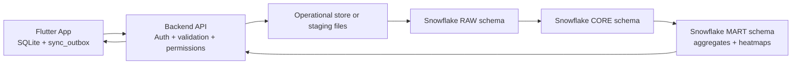

# 同行者 App 项目设计文档

版本：2026-06-28

本文把当前 Flutter demo 扩展为一个更完整的“地面推广结果分析”应用设计。短期目标是本地 SQLite demo 可运行、可教学；长期目标是移动端离线采集 + 后端同步 + Snowflake 分析仓库。

## 1. 产品定位

同行者 App 面向地面推广团队，帮助推广者快速记录每次推广接触，帮助区域/城市管理者分析推广量、区域热度、人群特征、兴趣转化和团队表现。

核心问题：

- 推广者今天做了多少、在哪些区域做了、哪些时段效果好。
- 区域总管能看到 Union、IIT、UC、UIC、88超市、Costco、北郊、中国城等区域的汇总趋势。
- 城市管理者能看到 Chicago 等城市级别的汇总、热力图和团队表现。
- 所有人都可以查看经过匿名化、聚合化的数据趋势，但不能看到自己权限之外的个人敏感信息。

## 2. 术语定义

- 推广者：一线使用者，负责记录推广接触。
- 管理者：区域、城市或组织层级的负责人。
- 被推广者：被接触的人，只在记录中出现，不拥有登录账号。
- 城市：例如 `Chicago, IL`。
- 区域：城市内的业务区域，例如 `Union`、`IIT`、`UIC`、`88超市`。
- 片区：可选的区域分组，例如 `校园片区`、`商圈片区`、`北郊片区`。
- 个人明细数据：姓名、联系方式、备注、精确坐标等敏感数据。
- 匿名统计数据：按时间、区域、人群分类聚合后的数据，去掉个人身份信息。

## 3. 角色和权限

推荐不要把管理员表和普通用户表拆开。所有登录用户放在 `app_users`，通过 `role_level` 和 membership 表控制范围。

| 角色 | role_level | 可见范围 | 能做什么 |
| --- | ---: | --- | --- |
| 推广者 | 10 | 自己的明细 + 授权范围内匿名统计 | 新增/修改自己近期记录，查看个人分析 |
| 区域管理员 | 40 | 分配区域内明细 + 城市匿名统计 | 审核区域数据、看区域图表、管理区域成员 |
| 城市管理员 | 70 | 城市内明细 + 城市/区域统计 | 管理城市区域、成员、数据质量 |
| 组织管理员 | 90 | 全部城市 | 全局配置、账号管理、数据治理 |

权限原则：

- 明细数据按 `user_id`、`area_id`、`city_id` 限制。
- 匿名统计可以放宽，但必须满足最小样本数，例如 `count >= 5` 或 `count >= 10` 才展示。
- 精确经纬度只给有管理权限的人看；普通统计使用网格化或热力图桶。
- 联系方式默认只给记录者和有明确管理权限者看。

## 4. 信息架构

### 推广者界面

底部导航建议：

- 记录：快速新增推广记录。
- 我的数据：个人今日/本周/月度汇总。
- 地图：匿名区域热力图和自己记录点位。
- 列表：最近记录，可修改最近 10 条或未同步记录。
- 设置：账号、安全、语言、主题。

推广者首页建议显示：

- 今日推广量、本周推广量、本月推广量。
- 兴趣度分布：0 级拒绝到 4 级高兴趣。
- 最近 7 天折线图。
- 自己常去区域排名。
- 数据质量提醒：缺定位、缺区域、重复记录、未同步。

### 管理者界面

管理者应有独立的“管理”或“工作台”入口，而不是只在普通页面里多一个按钮。

管理工作台建议模块：

- 总览：推广量、兴趣度、有效联系方式率、活跃推广者数。
- 地图热力：按时段、日期、月份、区域筛选。
- 区域分析：区域之间的推广量、兴趣度、身份分布对比。
- 时间趋势：某月每日推广量折线图，某周每天/每小时趋势。
- 团队分析：推广者活跃度、数据质量、区域覆盖。
- 数据质量：无定位、低精度定位、区域识别失败、异常重复。
- 用户管理：推广者资料、权限层级、区域分配。
- 图表生成：选择数据范围、维度、指标，自动推荐图表。

## 5. 核心交互设计

### 5.1 快速记录流程

1. 进入“记录”页。
2. App 自动生成时间、尝试获取经纬度。
3. App 根据经纬度自动匹配城市和区域；无法匹配时让用户手选区域。
4. 用户填写被推广者基本信息：
   - 年龄段
   - 性别
   - 身份
   - 兴趣度
   - 联系方式，可多条
   - 可选备注
5. 保存到本地 SQLite。
6. 若联网，把 mutation 放入同步队列并上传；离线则留在 `sync_outbox`。
7. 最近 10 条可快速修改，修改后再次进入同步队列。

### 5.2 兴趣度设计

建议把当前 demo 的“态度”逐步迁移为“兴趣度”，用 0 到 4 共五级：

| 等级 | 中文 | 英文 | 分析含义 |
| ---: | --- | --- | --- |
| 0 | 被拒绝 | Rejected | 明确拒绝，不建议跟进 |
| 1 | 低兴趣 | Low interest | 礼貌交流但兴趣弱 |
| 2 | 中立/可再观察 | Neutral | 没拒绝，但不明显 |
| 3 | 感兴趣 | Interested | 愿意继续了解 |
| 4 | 高兴趣/重点跟进 | Highly interested | 明确接受，需要跟进 |

“关系阶段”与“兴趣度”建议分开：

- 兴趣度：当次推广接触的即时反应。
- 关系阶段：这人与团队的长期关系，1 级刚认识到 4 级同伴关系。

### 5.3 区域识别

区域可以同时支持三种方式：

- 自动：用经纬度落入区域 polygon 判断。
- 半自动：离某区域中心点最近，并提示用户确认。
- 手动：定位失败或区域边界复杂时由用户选择。

Chicago 示例区域：

- Union
- IIT
- UC
- UIC
- 88超市
- Costco
- 北郊
- 中国城

### 5.4 图表生成交互

图表生成器不要直接让用户写 SQL。建议设计成表单：

- 数据范围：我的数据、我的区域、城市匿名统计、组织统计。
- 时间范围：今天、本周、本月、自定义。
- 空间范围：城市、区域、片区。
- 指标：推广量、有效联系方式数、兴趣度平均值、高兴趣数、拒绝数。
- 维度：日期、小时、区域、身份、年龄段、性别、推广者年龄段。
- 图表类型：自动、折线图、柱状图、饼图、热力地图。

自动推荐规则：

- 时间 + 数量：折线图。
- 区域 + 数量：地图热力图或柱状图。
- 类别占比：饼图或横向柱状图。
- 小时 + 区域：热力矩阵。
- 经纬度 + 数量：地图热力图。

## 6. 数据模型设计

### 6.1 本地 SQLite 核心表

本地 SQLite 用 Drift 管理。短期 demo 可以把核心表建齐；正式版建议仍保留本地 SQLite 作为离线缓存，不让 App 直接连接 Snowflake。

```sql
create table app_users (
  user_id text primary key,
  username text not null unique,
  display_name text not null,
  birthday text,
  gender_code text,
  occupation text,
  email text,
  phone text,
  contact_json text,
  role_level integer not null,
  password_md5 text not null,
  status text not null,
  failed_login_count integer not null default 0,
  locked_until text,
  last_seen_at text,
  created_at text not null,
  updated_at text not null
);

create table cities (
  city_id text primary key,
  city_label text not null,
  state_code text,
  country_code text not null,
  timezone text not null,
  created_at text not null
);

create table city_areas (
  area_id text primary key,
  city_id text not null,
  area_label text not null,
  area_group text,
  center_latitude real,
  center_longitude real,
  polygon_json text,
  is_active integer not null default 1,
  created_at text not null
);

create table user_area_memberships (
  membership_id text primary key,
  user_id text not null,
  city_id text not null,
  area_id text,
  role_level integer not null,
  created_at text not null
);

create table promotion_records (
  record_id text primary key,
  promoter_user_id text not null,
  occurred_at text not null,
  city_id text not null,
  area_id text,
  area_label_snapshot text,
  latitude real,
  longitude real,
  location_accuracy_m real,
  location_source text,
  location_status text not null,
  age_range_code text,
  gender_code text,
  identity_code text,
  interest_level integer not null,
  relationship_level integer not null default 1,
  exact_place text,
  note text,
  is_location_verified integer not null default 0,
  sync_status text not null default 'pending',
  server_version integer not null default 0,
  created_at text not null,
  updated_at text not null
);

create table record_contacts (
  contact_id text primary key,
  record_id text not null,
  contact_type text not null,
  contact_value text not null,
  created_at text not null
);

create table record_revisions (
  revision_id text primary key,
  record_id text not null,
  editor_user_id text not null,
  revision_type text not null,
  before_json text,
  after_json text,
  created_at text not null
);

create table sync_outbox (
  mutation_id text primary key,
  entity_type text not null,
  entity_id text not null,
  operation text not null,
  payload_json text not null,
  attempt_count integer not null default 0,
  last_error text,
  created_at text not null,
  next_retry_at text
);

create table saved_chart_specs (
  chart_id text primary key,
  owner_user_id text not null,
  title text not null,
  scope text not null,
  chart_type text not null,
  filter_json text not null,
  metric_json text not null,
  created_at text not null
);
```

### 6.2 字段规范

推广记录字段：

- `occurred_at`：实际推广时间。
- `latitude` / `longitude`：原始坐标。
- `area_id`：区域 ID。即使区域名称以后改了，历史记录仍可关联。
- `area_label_snapshot`：记录当时展示的区域名，方便审计。
- `interest_level`：0 到 4，0 是被拒绝。
- `relationship_level`：1 到 4，长期关系阶段。
- `sync_status`：`pending`、`synced`、`failed`、`conflicted`。

推广者字段：

- `birthday`：本地用日期字符串存储。分析时只展示年龄段，不直接展示生日。
- `gender_code`：推广者性别。
- `occupation`：推广者职业。
- `contact_json`：管理员联系推广者使用，不进入匿名统计。
- `role_level`：权限层级。

## 7. Snowflake 设计

Snowflake 作为分析仓库，不建议让移动 App 直连。推荐链路是：



### 7.1 Snowflake 分层

- `RAW`：原始上传 JSON，保留客户端 payload 和接收时间。
- `CORE`：清洗后的维度表和事实表。
- `MART`：面向 App 图表的聚合表。
- `SECURITY`：权限辅助表、审计表、策略函数。

### 7.2 Snowflake 核心表草案

```sql
create schema if not exists core;
create schema if not exists mart;

create table core.dim_city (
  city_id varchar primary key,
  city_label varchar not null,
  timezone varchar not null,
  country_code varchar not null,
  created_at timestamp_ntz not null
);

create table core.dim_area (
  area_id varchar primary key,
  city_id varchar not null,
  area_label varchar not null,
  area_group varchar,
  center_geog geography,
  boundary_geog geography,
  is_active boolean not null default true,
  created_at timestamp_ntz not null
);

create table core.dim_user (
  user_id varchar primary key,
  username varchar not null,
  display_name varchar not null,
  birthday date,
  promoter_age_band varchar,
  gender_code varchar,
  occupation varchar,
  email varchar,
  phone varchar,
  contact_variant variant,
  role_level number(3, 0) not null,
  status varchar not null,
  last_seen_at timestamp_ntz,
  created_at timestamp_ntz not null,
  updated_at timestamp_ntz not null
);

create table core.user_area_membership (
  membership_id varchar primary key,
  user_id varchar not null,
  city_id varchar not null,
  area_id varchar,
  role_level number(3, 0) not null,
  created_at timestamp_ntz not null
);

create table core.fact_promotion_record (
  record_id varchar primary key,
  promoter_user_id varchar not null,
  occurred_at timestamp_ntz not null,
  occurred_date date not null,
  occurred_hour number(2, 0) not null,
  city_id varchar not null,
  area_id varchar,
  latitude float,
  longitude float,
  geog geography,
  location_accuracy_m float,
  age_range_code varchar,
  prospect_gender_code varchar,
  identity_code varchar,
  interest_level number(1, 0) not null,
  relationship_level number(1, 0) not null,
  contact_count number(3, 0) not null default 0,
  has_contact boolean not null default false,
  exact_place varchar,
  note varchar,
  is_location_verified boolean not null default false,
  client_record_version number not null,
  ingested_at timestamp_ntz not null,
  updated_at timestamp_ntz not null
);

create table core.record_contact (
  contact_id varchar primary key,
  record_id varchar not null,
  contact_type varchar not null,
  contact_value varchar not null,
  created_at timestamp_ntz not null
);
```

`geog` 建议由后端或 Snowflake 生成，例如 `TO_GEOGRAPHY('POINT(longitude latitude)')`。注意 WKT 点的顺序是经度在前、纬度在后。

### 7.3 聚合表和图表表

```sql
create dynamic table mart.daily_area_summary
  target_lag = '15 minutes'
  warehouse = analytics_wh
as
select
  occurred_date,
  city_id,
  area_id,
  count(*) as promotion_count,
  count_if(has_contact) as contact_count,
  avg(interest_level) as avg_interest_level,
  count_if(interest_level = 0) as rejected_count,
  count_if(interest_level >= 3) as high_interest_count
from core.fact_promotion_record
group by 1, 2, 3;

create dynamic table mart.hourly_area_heatmap
  target_lag = '15 minutes'
  warehouse = analytics_wh
as
select
  occurred_date,
  occurred_hour,
  city_id,
  area_id,
  count(*) as promotion_count,
  avg(latitude) as center_latitude,
  avg(longitude) as center_longitude
from core.fact_promotion_record
where latitude is not null and longitude is not null
group by 1, 2, 3, 4;
```

真实热力图建议进一步按 H3 / geohash / fixed grid 做空间桶，不直接把每个精确点暴露给普通用户。

### 7.4 安全策略

Snowflake 侧建议：

- Row access policy：限制用户只能查询自己权限范围内的明细行。
- Masking policy：对 email、phone、contact_value、exact_place、note 等敏感字段做动态脱敏。
- Aggregation threshold：低于最小样本数的统计格子不返回给 App。
- 审计：记录每次导出、管理员查看明细、权限变更。

App 侧也要做权限检查，但正式环境不能只依赖 App。所有权限必须在后端和 Snowflake 侧重复执行。

## 8. 数据交互设计

### 8.1 本地优先

新增记录流程：

1. Flutter 表单生成 `PromotionRecordDraft`。
2. 写入本地 `promotion_records`，`sync_status = pending`。
3. 写入 `sync_outbox`。
4. UI 立刻更新，不等待网络。
5. 后台同步成功后更新 `server_version` 和 `sync_status = synced`。

### 8.2 同步 API

移动端不要直接连接 Snowflake。建议后端 API 提供：

- `POST /auth/login`
- `POST /sync/mutations`
- `GET /sync/bootstrap`
- `GET /analytics/summary`
- `GET /analytics/heatmap`
- `GET /analytics/timeseries`
- `GET /analytics/chart`
- `GET /admin/users`
- `PATCH /admin/users/{id}`
- `GET /admin/data-quality`

同步 payload 示例：

```json
{
  "clientDeviceId": "device-001",
  "mutations": [
    {
      "mutationId": "m-123",
      "entityType": "promotion_record",
      "entityId": "r-123",
      "operation": "upsert",
      "clientVersion": 1,
      "payload": {
        "occurredAt": "2026-06-28T18:30:00-05:00",
        "cityId": "chicago-il",
        "areaId": "iit",
        "latitude": 41.8349,
        "longitude": -87.6270,
        "ageRangeCode": "18_25",
        "genderCode": "unknown",
        "identityCode": "student",
        "interestLevel": 3,
        "relationshipLevel": 1,
        "contacts": [
          {"type": "wechat", "value": "demo"}
        ]
      }
    }
  ]
}
```

### 8.3 冲突处理

推荐规则：

- 同一用户修改自己的未同步记录：本地直接覆盖。
- 同一记录已被管理员校正位置后，推广者再编辑：保留管理员校正字段，推广者只改问卷字段。
- 服务端发现版本冲突：返回 `conflicted`，App 展示“需要处理”的状态。
- 所有修改写入 `record_revisions`。

## 9. 匿名统计和隐私

匿名统计数据不应包含：

- 被推广者姓名
- 联系方式
- 精确地址文本
- 原始备注
- 其他自由文本
- 单个推广者可被反推出的低样本格子

建议展示规则：

- 区域/小时/日期组合低于 `min_count = 5` 时隐藏或合并到“其他”。
- 热力地图默认用空间网格，不显示单个点。
- 普通推广者只能看自己的精确点位；看城市热力时只能看匿名聚合。
- 管理者下载数据需要审计。

## 10. Flutter 代码设计

现有 demo 结构可以继续演进，但建议下一阶段按 feature 分层：

```text
lib/
  app/
    app.dart
    router.dart
    theme.dart
  data/
    local_database.dart
    daos/
      promotion_record_dao.dart
      user_dao.dart
      analytics_cache_dao.dart
    sync/
      sync_client.dart
      sync_outbox_worker.dart
  domain/
    models/
      app_user.dart
      promotion_record.dart
      city_area.dart
      chart_spec.dart
    services/
      permission_service.dart
      analytics_query_builder.dart
  features/
    auth/
    record/
    promoter_dashboard/
    analytics/
    map/
    manager/
    settings/
  l10n/
```

### 10.1 状态管理

当前 `AppController + ChangeNotifier` 适合 demo。进入多页面、多权限、多同步状态后，建议迁移到 Riverpod 或 Bloc：

- AuthController：登录态、当前用户。
- RecordController：表单草稿、保存状态。
- SyncController：队列、重试、冲突。
- AnalyticsController：筛选条件、图表数据。
- AdminController：用户和区域管理。

### 10.2 图表模型

建议定义一个通用 `ChartSpec`：

```dart
class ChartSpec {
  ChartSpec({
    required this.chartType,
    required this.scope,
    required this.timeRange,
    required this.dimensions,
    required this.metrics,
    required this.filters,
  });

  final String chartType; // auto, line, bar, pie, heatmap, mapHeatmap
  final String scope; // mine, area, cityAnonymous, org
  final TimeRange timeRange;
  final List<String> dimensions; // date, hour, area, identity
  final List<String> metrics; // count, avgInterest, contactRate
  final Map<String, Object?> filters;
}
```

自动图表生成不是 AI 必须项。第一版可以规则化推荐，后续再接 LLM 或 Snowflake Cortex 生成标题、洞察摘要和图表解释。

## 11. 界面设计细节

### 11.1 推广者记录页

表单分区：

- 自动信息：时间、城市、区域、定位状态。
- 被推广者：年龄、性别、身份、兴趣度、关系阶段。
- 联系方式：可添加多条。
- 备注：可选，默认不出现在匿名统计里。
- 保存状态：本地已保存、等待同步、同步成功、同步失败。

控件建议：

- 兴趣度：0 到 4 slider 或 segmented control。
- 区域：自动识别 + 可手选下拉。
- 联系方式：Add button 增加多行。
- 定位：灰色状态 + 点击请求权限。

### 11.2 推广者数据页

卡片：

- 今日推广量
- 本周推广量
- 高兴趣数
- 有效联系方式率
- 我的区域分布
- 最近 7 天趋势

### 11.3 管理者总览

顶部筛选：

- 城市
- 区域/片区
- 时间范围
- 推广者/团队

主图：

- 地图热力图
- 月度每日推广量折线图
- 兴趣度分布
- 身份/年龄/性别分布
- 区域排名

管理动作：

- 校正区域
- 导出匿名统计
- 查看数据质量
- 调整成员权限

## 12. 开发阶段建议

### Phase 1：本地数据模型重构

- 把现有 `ConversationRecord` 重命名或兼容为 `PromotionRecord`。
- 增加城市、区域、membership 表。
- 把态度迁移为兴趣度 `0..4`。
- 推广者增加生日、性别、职业。
- 快速记录页加入区域选择。

### Phase 2：本地分析增强

- 个人 dashboard。
- 管理者 dashboard。
- 按区域/月份/日/小时筛选。
- 月度每日折线图。
- 区域热力图第一版。
- 图表生成器第一版。

### Phase 3：同步层

- `sync_outbox`。
- API client mock。
- 冲突处理。
- 授权聚合数据缓存。

### Phase 4：Snowflake 后端

- 后端 API。
- Snowflake RAW / CORE / MART schemas。
- Row access policy。
- Masking policy。
- Dynamic tables 聚合。
- 管理端审计。

## 13. 代码迁移对照

当前 demo 字段到新设计字段：

| 当前字段 | 新字段 | 说明 |
| --- | --- | --- |
| `ConversationRecord` | `PromotionRecord` | 语义更贴近推广场景 |
| `cityName` | `city_id` + `city_label` | 结构化城市 |
| `manualPlaceName` | `exact_place` | 具体地点文本 |
| `attitudeLevel -2..2` | `interest_level 0..4` | 0 表示被拒绝 |
| `relationshipLevel 1..4` | `relationship_level 1..4` | 长期关系阶段 |
| `identity` | `identity_code` | 枚举化 |
| `contacts[]` | `record_contacts` | 子表规范化 |
| `teamName` | `area_id` / membership | 从团队概念转成区域权限 |

## 14. 风险和取舍

- 地图热力图依赖地图 SDK；Web demo 可先用简单散点/网格，移动端再接正式地图。
- 自由文本字段有隐私风险，默认不进入匿名统计。
- 推广者生日用于年龄段分析，展示时必须转成年龄段。
- Snowflake 更适合分析，不适合移动端直接事务写入，所以必须有后端 API。
- 图表自动生成要先规则化，避免一开始就把核心体验绑定到 AI。

## 15. 参考资料

- Snowflake geospatial data types: https://docs.snowflake.com/en/sql-reference/data-types-geospatial
- Snowflake semi-structured data types: https://docs.snowflake.com/en/sql-reference/data-types-semistructured
- Snowflake row access policies: https://docs.snowflake.com/en/user-guide/security-row-intro
- Snowflake dynamic data masking: https://docs.snowflake.com/en/user-guide/security-column-intro
- Snowflake dynamic tables: https://docs.snowflake.com/en/user-guide/dynamic-tables-intro
- Drift Flutter package: https://pub.dev/packages/drift_flutter
