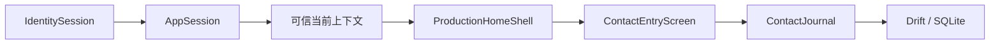

# 第 5 章：正式接触闭环如何连接 Flutter 与 SQL

本章解释第一个可操作的正式界面。用户登录后取得可信项目上下文，填写匿名接触草稿，再把完整草稿提交到 SQLite。提交结果会立即出现在“今日”和最近七日个人分析中。同步引擎随后上传本机 command，再拉取其他设备的变化。

## 从登录到接触记录

正式入口从 [`TongxingzheApp`](../../lib/app/tongxingzhe_app.dart) 开始。它不再使用 legacy Demo 的 `currentUser` 判断登录状态。



`IdentitySession` 只证明外部身份。`AppSession` 用 bearer token 请求 Backend，并取得内部 `app_user_id`、个人空间、当前推广项目和问卷版本。只有这条信任链完成后，[`ProductionHomeShell`](../../lib/screens/production_home_shell.dart) 才显示“记录接触”。

这个边界防止 Flutter 把 Supabase subject 当成业务用户 ID。它也防止上下文载入失败时继续写入一个猜测的项目。

## 四个稳定目的地

主框架固定包含“今日”“接触”“对象”“分析”。手机使用底部导航，宽屏使用侧边导航。两种布局使用相同的目的地顺序和页面状态。

“对象”目前明确显示尚未开放。“今日”和“分析”读取正式接触事实。“接触”显示草稿、今日有效场次和本机待同步数量。

正式入口使用 `MaterialApp.router`。[`AppRouteInformationParser`](../../lib/routing/app_route.dart) 将 URL 转换成类型化地址，[`AppRouterDelegate`](../../lib/routing/app_router.dart) 管理 Navigator page 栈。当前稳定地址是：

| 地址 | 用途 |
| --- | --- |
| `/today` | 今日个人反馈 |
| `/contacts` | 草稿和接触状态 |
| `/contacts/new` | 新建接触草稿 |
| `/contacts/drafts/{draftId}` | 恢复本人当前项目的指定草稿 |
| `/targets` | 对象的真实未开放页 |
| `/analysis` | 最近七日个人分析 |

URL 不包含权限。用户、空间、项目和问卷版本仍由 `AppSession` 提供。直接打开别人或另一项目的草稿 ID，不会绕过创建者和当前项目检查。草稿不存在时，页面显示可返回的错误，不会永久显示加载状态。

接触表单是真实的 Navigator page。AppBar 返回、系统返回和浏览器返回因此都会通过同一个 `PopScope`，在离开前保存最后输入。浏览器前进、后退与屏幕导航共用同一份 `AppRoute`，不会出现地址和页面各自变化的两套状态。

稳定导航的价值不只在界面。后续切片可以替换一个目的地的内部页面，不必改登录路由或其他页面的入口。

## 草稿为什么从首次输入开始

打开空白表单不会创建数据库记录。用户第一次选择渠道、填写触达人数或选择兴趣后，[`ContactJournal.saveDraft`](../../lib/features/contact_journal/contact_draft_operations.dart) 才创建草稿。

这条规则区分两个事实：

- 打开过页面不等于开始记录一次接触。
- 有意义输入需要跨页面切换和 App 重启保留。

表单在输入停止 350 毫秒后自动保存。这个短延迟会合并连续按键，减少 SQLite 写入。用户离开页面或 App 进入后台时，表单取消等待并立即保存。

多个快速保存请求不能并行创建草稿。表单使用单一保存队列和编辑版本号。一次写入完成后，如果编辑版本已经改变，队列继续保存较新的快照。页面只在最新编辑版本落盘后显示“已保存”。

## 草稿的放弃与撤销

草稿列表允许用户明确放弃一份草稿。`abandonDraft` 不立即删除记录。它写入放弃时间和十秒撤销期限，并从正常列表隐藏草稿。

列表同时显示项目、发生时间、最后修改时间、问卷版本和完成度。这些都是草稿创建时固定或自动保存的事实，不从当前屏幕状态猜测。

用户在期限内选择“撤销”时，`undoAbandonDraft` 清除放弃状态。期限已经过去时，领域层返回稳定错误码。UI 不根据数据库错误文字猜测结果。

这种设计保留用户意图，也避免误触造成不可恢复的数据丢失。

## 一次接触如何提交

当前表单要求五组核心事实：

1. 实际发生时间和 IANA 时区；
2. 稳定渠道；
3. 具体线下地点或明确的 `N/A`；
4. 触达人数；
5. 当次兴趣 `0–4`。

纯线上渠道自动使用 `NotApplicableContactLocation`。它是一个明确领域类型，不是空值。面对面渠道不能使用这个类型。

面对面接触必须先请求当前坐标。坐标和可选精度以 `PendingContactLocation` 保存，表示位置事实已存在，但还没有匹配到统一区域树。定位失败会保持地点未完成，不会自动改成 `N/A`。

[`ContactLocationCapture`](../../lib/services/location_service.dart) 是系统定位的测试接缝。正式 App 装配 Geolocator；公开界面测试装配固定坐标，因此不会弹出系统权限对话框。“其他直接渠道”还必须填写渠道说明，否则不算完成渠道事实。

当前发生时区暂用 `UTC`，统计也按 UTC 自然日分界。项目报告时区还没有进入可信上下文，因此代码不猜测设备缩写。后续加入项目时区后，日界线可以集中替换。

正式提交调用 [`ContactJournal.submitDraft`](../../lib/features/contact_journal/contact_draft_operations.dart)。一个 Drift transaction 完成接触当前投影、首个 revision、类型化答案和唯一 Outbox command，然后删除草稿。任何一步失败时，transaction 回滚，草稿继续存在。

## 设备 ID 的用途

Outbox command 需要一个安装级设备 ID。它由 [`DeviceIdentityStore`](../../lib/device/device_identity_store.dart) 生成，并保存在 SQLite 的 App 设置表中。

设备 ID 不是登录凭据，也不授予权限。它只标识命令来源和后续同步租约。每次启动重新生成会破坏重试和诊断，因此同一次安装必须复用原值。

完整的上传、拉取和 PostgreSQL 原理见 [第 6 章](06-persistent-sync-and-backend-sql.md)。

## 个人统计的 SQL 与数学口径

统计入口是 [`ContactJournal.summarizePersonalContacts`](../../lib/features/contact_journal/contact_journal.dart)。可读 SQL 位于 [`contact_queries.drift`](../../lib/features/contact_journal/contact_queries.drift)。

查询只计算当前用户、当前空间、当前项目、`active` 状态和指定 UTC 半开区间内的已提交接触：

```sql
occurred_at_utc >= :from_utc
AND occurred_at_utc < :until_utc
```

半开区间写作 `[from, until)`。相邻两天可以共用一个边界时刻，而不会重复计算该时刻的记录。

接触场次和触达人数使用不同单位：

```text
接触场次 = COUNT(*)
触达人数 = SUM(reach_count)
```

一次小组互动是一场接触，但触达人数可以大于一。两个值不能互相替代。

兴趣分布统计每个等级的接触场次。渠道分布按七类稳定渠道分组。两条 SQL 在同一个只读 transaction 中执行，所以总数和渠道来源来自同一数据库快照。

同步覆盖使用已完成同步的有效接触数作为分子：

```text
同步覆盖 = (接触场次 - 未完成同步场次) / 接触场次
```

当场次为零时，页面显示 `0 / 0`，不计算没有定义的百分比。最近发生时间使用区间内 `MAX(occurred_at_utc)`，并在领域层统一转回 UTC。

这些统计只服务个人自我问责。它们不使用匿名阈值，也不构成管理考核。管理汇总属于后续切片，并继续遵守匿名阈值 10。

## 这批界面怎样测试

[`tongxingzhe_app_test.dart`](../../test/app/tongxingzhe_app_test.dart) 从公开的 `TongxingzheApp` 入口操作界面。测试使用假的身份和上下文网关，但使用真实的内存 SQLite 与正式 `ContactJournal`。

测试只观察用户可见行为：

- 登录后出现可信项目和四个目的地；
- deep link 可直达分析页，导航会更新 URL，系统和浏览器返回都会先保存草稿；
- 不存在的草稿地址显示稳定错误和返回入口；
- 上下文失败时不显示记录入口；
- 首次输入后自动保存，列表显示完整草稿摘要并可继续填写；
- 立即返回或进入后台时先保存最后输入；
- 放弃草稿后可在期限内撤销；
- 完整纯线上接触提交后，草稿消失；
- 面对面接触取得坐标后才能提交；
- 其他直接渠道必须保存渠道说明；
- 上传 ACK 后变为已同步；
- 启动时拉取其他设备的接触并刷新今日事实；
- “今日”和最近七日显示场次、触达人数、兴趣、渠道、最近发生时间和同步覆盖。

每项行为先加入一个失败测试，再写最少实现使它通过。这是第 2 章所述的红-绿回归循环。它证明用户入口、Flutter 状态和 SQLite 事务已经接通，而不是分别证明几个孤立函数可以运行。

## 下一步仍缺什么

本切片尚未完成以下发布条件：

- 把已取得的经纬度解析到统一区域树的最小节点；
- 从问卷版本载入并保存真实题目；
- 正式注册、OTP 和密码恢复界面。

这些缺口会继续沿用本章的公开入口测试和深模块边界。新功能不能绕过 `AppSession`、`ContactJournal` 或自有 HTTPS Backend。
