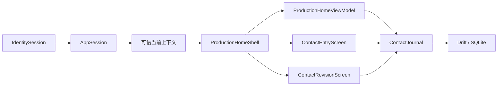

# 第 5 章：接触提交、修订与尝试入口如何连接 Flutter 与 SQL

本章解释正式接触、追加修订与未获回应尝试的用户入口。用户登录后取得可信项目上下文，可以填写匿名接触草稿、修订本人已提交接触，也可以单独保存一次未获回应的直接联络。只有当前有效接触会进入“今日”和最近七日个人分析。

## 从登录到接触记录

正式入口从 [`TongxingzheApp`](../../lib/app/tongxingzhe_app.dart) 开始。它不再使用 legacy Demo 的 `currentUser` 判断登录状态。



`IdentitySession` 只证明外部身份。`AppSession` 用 bearer token 请求 Backend，并取得内部 `app_user_id`、个人空间、可用推广项目以及每个项目的问卷版本。使用者可以从主框架创建或切换个人推广项目；Backend 返回新的可信上下文后，页面才切换。只有这条信任链完成后，[`ProductionHomeShell`](../../lib/screens/production_home_shell.dart) 才显示“记录接触”。

这个边界防止 Flutter 把 Supabase subject 当成业务用户 ID。它也防止上下文载入失败时继续写入一个猜测的项目。

## 四个稳定目的地

主框架固定包含“今日”“接触”“对象”“分析”。手机使用底部导航，宽屏使用侧边导航。两种布局使用相同的目的地顺序和页面状态。

“对象”目前明确显示尚未开放。“今日”和“分析”读取当前项目的正式接触事实。“接触”显示当前项目的已提交接触和尝试，也显示本人的私有草稿、今日有效场次和同步状态。点击已提交接触会打开当前投影和完整 revision 历史。点击另一项目的草稿时，App 先向 Backend 恢复该项目的可信上下文，再打开草稿；不能只在客户端替换 project ID。

正式入口使用 `MaterialApp.router`。[`AppRouteInformationParser`](../../lib/routing/app_route.dart) 将 URL 转换成类型化地址，[`AppRouterDelegate`](../../lib/routing/app_router.dart) 管理 Navigator page 栈。当前稳定地址是：

| 地址 | 用途 |
| --- | --- |
| `/today` | 今日个人反馈 |
| `/contacts` | 草稿和接触状态 |
| `/contacts/{contactId}` | 本人当前项目的接触详情与 revision 历史 |
| `/contacts/new` | 新建接触草稿 |
| `/contacts/drafts/{draftId}` | 恢复本人当前项目的指定草稿 |
| `/contacts/attempts/{attemptId}/contact` | 为一次较早尝试记录后来回应 |
| `/targets` | 对象的真实未开放页 |
| `/analysis` | 最近七日个人分析 |

URL 不包含权限。用户、空间、项目和问卷版本仍由 `AppSession` 提供。直接打开别人或另一项目的 contact ID 或 draft ID，不会绕过创建者和当前项目检查。记录不存在时，页面显示可返回的错误，不会永久显示加载状态。

接触表单是真实的 Navigator page。AppBar 返回、系统返回和浏览器返回因此都会通过同一个 `PopScope`，在离开前保存最后输入。浏览器前进、后退与屏幕导航共用同一份 `AppRoute`，不会出现地址和页面各自变化的两套状态。

路由在接触表单或详情页关闭后发布 `ContactEntryClosedEvent`。事件明确区分“已提交”和普通刷新。首页两种情况都会刷新，只有正式提交才显示提交成功提示。详情页完成更正或作废后返回时，列表和个人指标会读取新的当前投影。

稳定导航的价值不只在界面。后续切片可以替换一个目的地的内部页面，不必改登录路由或其他页面的入口。

## 未获回应尝试怎样进入后来接触

“记录接触尝试”只收集发生时间、IANA 时区、直接渠道和必要的渠道说明。页面没有触达人数、兴趣或问卷控件。保存后，“接触”页把尝试与草稿、已发生接触分区显示，并明确说明尝试不进入接触指标。

如果对方后来回应，使用者从该尝试选择“记录后来回应”。App 打开普通接触表单，预填原渠道，并把尝试 ID 保存到草稿。正式提交时，`ContactJournal` 在同一 transaction 内创建接触、关联来源尝试并写入 Outbox。原尝试不被改成接触，也不丢失原发生时间。

[`ProductionHomeViewModel`](../../lib/features/home/production_home_view_model.dart) 负责首页同步、项目切换与创建、跨项目草稿的可信上下文恢复、草稿放弃与撤销，以及“今日”“接触”“分析”需要的数据刷新。它向 Widget 发布不可变的 `ProductionHomeViewState`。项目菜单和草稿说明只读取其中的项目显示字段，不读取完整 `AppSessionSnapshot`。

页面只渲染快照并发送启动、恢复、提交、项目和草稿操作意图。创建项目的对话框和页面导航仍属于 Widget；`ContactJournal`、`SyncEngine` 和 `AppSession` 的结果解释留在 ViewModel 的 Adapter 边界。同步运行时收到新的唤醒信号，ViewModel 会在当前轮结束后串行补跑一次。操作失败时保留上一次可用快照，并发布稳定提示类别。Widget 只把提示类别翻译成本地化 Snackbar。

## 表单逻辑为什么不放在 Widget 中

[`ContactEntryViewModel`](../../lib/features/contact_entry/contact_entry_view_model.dart) 负责设备时区、发生时间、定位、编辑版本、自动保存队列、失败重试和正式提交。Widget 只把点击与输入交给 ViewModel，再渲染它的状态。

这个边界使保存失败、定位失败和提交失败可以用确定性的 fake 制造，并验证使用者重试后不会丢失刚才输入。它也避免页面重建、导航或平台差异改变领域规则。正式持久化仍由 `ContactJournalEntryStore` 适配到 `ContactJournal`，测试接缝没有形成第二套业务实现。

## 草稿为什么从首次输入开始

打开空白表单不会创建数据库记录。用户第一次选择渠道、填写触达人数或选择兴趣后，[`ContactJournal.saveDraft`](../../lib/features/contact_journal/contact_draft_operations.dart) 才创建草稿。

这条规则区分两个事实：

- 打开过页面不等于开始记录一次接触。
- 有意义输入需要跨页面切换和 App 重启保留。

表单在输入停止 350 毫秒后自动保存。这个短延迟会合并连续按键，减少 SQLite 写入。用户离开页面或 App 进入后台时，表单取消等待并立即保存。

多个快速保存请求不能并行创建草稿。表单使用单一保存队列和编辑版本号。一次写入完成后，如果编辑版本已经改变，队列继续保存较新的快照。页面只在最新编辑版本落盘后显示“已保存”。

新草稿默认是 `account_private`：只对本人可见，并通过 Backend 在本人的设备间同步。使用者也可以选择 `device_only`，让草稿只留在当前安装。尚未上传的设备专用草稿不产生 command；已经同步的草稿切换到该模式时，会先发送 `draft.delete.v1` 删除服务器副本，但仍保留本机内容。若先前上传已经发出而 ACK 尚未确定，App 不会假装切换成功，而是要求同步先取得确定结果。

账号私有草稿使用 local/server revision 检查并发编辑。另一台设备的内容与本机未上传编辑分叉时，App 保留服务器确认的原草稿，并额外建立一份 `device_only` 冲突副本。副本不能直接提交；使用者先对照并手动合并需要的内容，系统不会用“最后写入覆盖”静默丢掉其中一份。

## 草稿的放弃与撤销

草稿列表允许用户明确放弃一份草稿。`abandonDraft` 不立即删除记录。它写入放弃时间和十秒撤销期限，并从正常列表隐藏草稿。

列表同时显示项目、发生时间、最后修改时间、问卷版本和完成度。这些都是草稿创建时固定或自动保存的事实，不从当前屏幕状态猜测。

用户在期限内选择“撤销”时，`undoAbandonDraft` 清除放弃状态。期限已经过去时，领域层返回稳定错误码。UI 不根据数据库错误文字猜测结果。

这种设计保留用户意图，也避免误触造成不可恢复的数据丢失。

## 一次接触如何提交

当前表单要求五组核心事实：

1. 实际发生时间和 IANA 时区；
2. 稳定渠道；
3. 具体线下地点或明确的 `N/A`；
4. 触达人数；
5. 当次兴趣 `0–4`。

纯线上渠道自动使用 `NotApplicableContactLocation`。它是一个明确领域类型，不是空值。面对面渠道不能使用这个类型。

面对面接触必须先请求当前坐标。App 随后通过 [`ContactRegionResolver`](../../lib/regions/contact_region_resolver.dart) 把坐标发送给自有 Backend。Backend 命中当前发布边界后返回最小规范节点和完整父链；Flutter 先安装并验证父链，再显示已解析地点。

断网、身份失效、响应无效或没有边界命中时，坐标和可选精度以 `PendingContactLocation` 保存，界面明确显示“待匹配规范区域”。定位失败会保持地点未完成。解析失败仍保留可提交的坐标事实，使用者可以再次获取坐标重试；系统不会自动改成 `N/A`。

[`ContactLocationCapture`](../../lib/services/location_service.dart) 是系统定位的测试接缝。正式 App 装配 Geolocator；公开界面测试装配固定坐标，因此不会弹出系统权限对话框。“其他直接渠道”还必须填写渠道说明，否则不算完成渠道事实。

[`DeviceTimeZoneProvider`](../../lib/device/device_time_zone.dart) 从系统取得 IANA 时区标识，例如 `America/Chicago`，同时保存实际发生的 UTC 时刻。IANA 标识具有明确地区规则，不使用含义可能冲突的 `CST` 等缩写。使用者可以修改发生日期和时间；发生时区保留为这次记录取得的设备时区。项目报告时区尚未进入可信上下文，因此当前“今日”和七日窗口仍按 UTC 半开区间计算，不能把“保存了 IANA”误写成“已经按当地自然日统计”。

正式提交调用 [`ContactJournal.submitDraft`](../../lib/features/contact_journal/contact_draft_operations.dart)。一个 Drift transaction 完成接触当前投影、首个 revision、类型化答案和唯一 Outbox command，然后删除草稿。任何一步失败时，transaction 回滚，草稿继续存在。

## 已提交接触如何更正和作废

“接触”页列出当前项目的有效和已作废接触。详情页显示当前事实，并按 revision 倒序显示动作类型、操作者时间、原因和完整快照。

更正对话框从当前投影开始。使用者可以修改发生时间、渠道、地点、触达人数和兴趣，并必须填写原因。页面把打开时看到的 revision 作为 `baseRevision` 交给 `ContactJournal.correctContact`。如果记录已被另一条命令推进，领域层返回稳定冲突，页面不会覆盖新版本。

作废对话框只要求原因。`ContactJournal.voidContact` 追加一条作废 revision，并把当前投影标记为 `voided`。列表继续显示该记录和历史，但个人指标立即排除它。界面没有物理删除已提交接触的入口。

面对面更正仍使用正式定位和区域解析边界。定位或解析失败时保留待解析坐标。线上渠道明确使用 `N/A`，不能把定位失败改写成不适用。

## 设备 ID 的用途

Outbox command 需要一个安装级设备 ID。它由 [`DeviceIdentityStore`](../../lib/device/device_identity_store.dart) 生成，并保存在 SQLite 的 App 设置表中。

设备 ID 不是登录凭据，也不授予权限。它只标识命令来源和后续同步租约。每次启动重新生成会破坏重试和诊断，因此同一次安装必须复用原值。

完整的上传、拉取和 PostgreSQL 原理见 [第 6 章](06-persistent-sync-and-backend-sql.md)。

## 个人统计的 SQL 与数学口径

统计入口是 [`ContactJournal.summarizePersonalContacts`](../../lib/features/contact_journal/contact_journal.dart)。可读 SQL 位于 [`contact_queries.drift`](../../lib/features/contact_journal/contact_queries.drift)。

查询只计算当前用户、当前空间、当前项目、`active` 状态和指定 UTC 半开区间内的已提交接触：

```sql
occurred_at_utc >= :from_utc
AND occurred_at_utc < :until_utc
```

半开区间写作 `[from, until)`。相邻两天可以共用一个边界时刻，而不会重复计算该时刻的记录。

接触场次和触达人数使用不同单位：

```text
接触场次 = COUNT(*)
触达人数 = SUM(reach_count)
```

一次小组互动是一场接触，但触达人数可以大于一。两个值不能互相替代。

兴趣分布统计每个等级的接触场次，并从同一组五档数量计算下中位等级。偶数样本取两个中间观察值中较低的真实等级，空期间没有中位等级；该算法不计算等级平均数。渠道分布按七类稳定渠道分组。两条 SQL 在同一个只读 transaction 中执行，所以总数和渠道来源来自同一数据库快照。

同步覆盖使用已完成同步的有效接触数作为分子：

```text
同步覆盖 = (接触场次 - 未完成同步场次) / 接触场次
```

当场次为零时，页面显示 `0 / 0`，不计算没有定义的百分比。最近发生时间使用区间内 `MAX(occurred_at_utc)`，并在领域层统一转回 UTC。

这些统计只服务个人自我问责。它们不使用匿名阈值，也不构成管理考核。管理汇总属于后续切片，并继续遵守匿名阈值 10。

## 这批界面怎样测试

[`tongxingzhe_app_test.dart`](../../test/app/tongxingzhe_app_test.dart) 从公开的 `TongxingzheApp` 入口操作界面。测试使用假的身份和上下文网关，但使用真实的内存 SQLite 与正式 `ContactJournal`。

[`production_home_view_model_test.dart`](../../test/features/home/production_home_view_model_test.dart) 通过首页模块接口验证同步、刷新、项目操作、跨项目草稿恢复、放弃、撤销和失败状态。测试使用假的同步 worker、会话 Adapter 与草稿 Adapter，不读取 Widget 内部字段。

测试只观察用户可见行为：

- 登录后出现可信项目和四个目的地；
- 可以创建、切换个人推广项目，打开跨项目草稿前会恢复原项目上下文；
- deep link 可直达分析页，导航会更新 URL，系统和浏览器返回都会先保存草稿；
- 不存在的草稿地址显示稳定错误和返回入口；
- 上下文失败时不显示记录入口；
- 首次输入后自动保存，列表显示完整草稿摘要并可继续填写；
- 草稿可选择账号私有或设备专用；并发分叉保留为不能直接提交的设备冲突副本；
- 立即返回或进入后台时先保存最后输入；
- 放弃草稿后可在期限内撤销；
- 完整纯线上接触提交后，草稿消失；
- 已提交接触可打开当前投影和完整历史；
- 更正必须有原因，并追加新 revision；
- 作废必须有原因，保留历史并退出个人指标；
- 未获回应尝试单独显示，不增加场次、触达人数或兴趣分布；
- 后来回应会新建接触并保留原尝试；
- 面对面接触取得坐标后会解析并显示规范地点，失败时保留待解析坐标；
- 可以修改实际发生时间，并保存系统提供的 IANA 时区；
- 其他直接渠道必须保存渠道说明；
- 保存、定位或提交失败会显示可恢复状态，重试后继续使用原输入；
- 上传 ACK 后变为已同步；
- 启动时拉取其他设备的接触并刷新今日事实；
- “今日”显示场次、触达人数和待同步数；最近七日分析页另显示兴趣分布、各档比例、兴趣 `3–4` 与 `0` 两个独立子集比例、中位等级、渠道、最近发生时间和同步覆盖。空分母显示“暂无可计算比例”，覆盖说明读取实际缺失与候选内排除计数。

每项行为先加入一个失败测试，再写最少实现使它通过。这是第 2 章所述的红-绿回归循环。它证明用户入口、Flutter 状态和 SQLite 事务已经接通，而不是分别证明几个孤立函数可以运行。

## 下一步仍缺什么

后续切片仍需完成以下功能：

- 从问卷版本载入并保存真实题目；
- 处理两台设备基于同一 revision 提交不同更正的冲突合并；
- 正式注册、OTP 和密码恢复界面。

这些缺口会继续沿用本章的公开入口测试和深模块边界。新功能不能绕过 `AppSession`、`ContactJournal` 或自有 HTTPS Backend。
