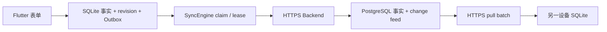

# 第 6 章：持久同步与 Backend SQL 如何保护追加历史

本章解释已提交接触、追加修订、未获回应尝试和账号私有草稿如何在本机 SQLite、Backend 与 PostgreSQL 之间移动。App 不上传整个 SQLite 文件，只传送有版本的 command 和有顺序的 change。

## 同步链路



Flutter 不知道 PostgreSQL 密码。它只用 Supabase access token 调用自有 Backend。Backend 验证 JWT 后，重新取得内部 `app_user_id`、当前空间、项目和 capability。客户端 payload 不能指定业务用户身份。

HTTP 层的 context、command 和 pull 端点共用 [`bearerToken`](../../backend/server/src/authorization.ts)。它只接受一个 `Bearer token`，拒绝缺失、含空白或拼接多个值的 header。统一解析器防止不同端点形成不同的认证边界。

## 问卷管理为何使用独立命令边界

问卷管理不是接触同步 command。它有自己的列表、草稿 revision 和发布 transaction：

- `GET /v1/questionnaire-administration` 列出当前版本、历史版本和未发布草稿；
- `POST /v1/questionnaire-drafts` 建立空白草稿或复制一个已发布版本；
- `GET`／`PUT /v1/questionnaire-drafts/:id` 读取或按预期 revision 保存；
- `POST /v1/questionnaire-drafts/:id/publish` 用 request ID 发布新版本。

这些端点每次都重新验证 JWT 和可信上下文，要求 `manage_analysis_definitions` capability。客户端不能提交用户、空间或项目来扩大范围。PostgreSQL 的 `0013_questionnaire_publishing.sql` 还会重新检查活动用户、个人空间所有权和活动项目，所以旧页面状态、旧 capability 或被撤销的身份不能继续发布。

保存失败可以保留本机工作副本，但发布没有离线成功状态。发布函数取得项目级事务锁，在同一 transaction 内验证草稿、建立定义、记录发布者与说明并切换唯一 current 版本。相同请求可以安全重试；并发请求不会留下两个 current 版本。已发布定义只读，回退必须复制旧版本再发布新版本。

## Outbox 为什么和接触在同一 transaction

`ContactJournal.submitDraft` 在同一 SQLite transaction 内写入接触、revision、答案、对象关联和 `contact.submit.v1` command。更正和作废分别写入 `contact.revise.v1` 与 `contact.void.v1`。冲突解决会追加 revision，并写入 `contact.resolve.v1`。`recordContactAttempt` 同样原子写入尝试和 `contact.attempt.submit.v1` command。如果只写本机事实，随后 App 崩溃，同步引擎就不知道它需要上传。如果只写 command，本机又会出现无事实可显示的幽灵命令。

Outbox 保存稳定 command ID、设备 ID、aggregate ID、基础 revision、payload、尝试次数和失败状态。它不保存 access token。token 每次发送前从 `IdentitySession` 取得。

## claim、lease 和 ACK

claim 是在 SQLite transaction 内选出已到重试时间的 command，并立即把它们改为 `leased`。每批最多领取 20 条，同一 aggregate 只领取最早的一条。lease 是有期限的处理权。当前执行器在 30 秒内拥有这批 command，其他执行器不能同时发送它们。

进程在网络请求中途退出时，lease 会过期。下一个执行器把命令改回 `pending` 并重试。迟到 ACK 只能由仍持有同一 lease 的 worker 接受；旧 worker 不能覆盖新 worker 的结果。

同一 aggregate 的 command 必须按创建顺序处理。一条更早的更正发生冲突时，后续更正不能越过它。另一条 aggregate 可以继续同步，不被无关失败阻塞。

## 重试时间如何计算

可重试失败使用指数退避。第 `n` 次已领取尝试的基础延迟是：

```text
base_seconds(n) = min(2 × 2^(n - 1), 300)
delay = base_seconds × (1 + 0.25 × random)
```

`random` 在 `[0, 1)` 内。这个 jitter 使多台设备不会在同一秒内一起重试。Backend 可通过可信 `Retry-After` 要求更长等待，客户端最多接受一小时。永久拒绝和冲突不使用自动退避掩盖，而是进入稳定失败状态。

## 批量结果如何独立确认

`POST /v1/sync/commands/batch` 接收最多 20 条 command。Backend 为每条结果返回原 `command_id`。客户端按 ID 确认结果，不使用列表位置。因此，服务端可以乱序返回，也可以在同批中接受一条并重试另一条。已确认的 command 进入 `completed`，下一轮不再发送它。

状态转换如下：

- `accepted` 和 `duplicate` 进入 `completed`；
- `conflict` 进入 `needs_resolution`；
- `rejected` 和 `forbidden` 进入 `permanent_failure`；
- 超时、`429`、`5xx` 和单条存储暂时失败回到 `pending`。

批量响应如果缺少 ID、重复 ID 或带有未请求的 ID，客户端不猜测结果。未确认的 command 以 `invalid_server_response` 进入可重试状态。服务端幂等处理保护 ACK 丢失后的重发。

## 用户如何判断与恢复失败

首页把可重试失败显示为“等待重试”。App 在到达 `next_attempt_at` 后的下一次同步触发时自动再试，用户无需重新录入。“需要处理”表示冲突，必须保留本机事实并等待明确处理。“永久拒绝”表示服务端不会接受当前 command，自动重试不会解决问题。

同步健康只返回各状态数量、最早等待时间、最后成功时间和稳定失败码。失败码只允许小写字母、数字和下划线。其他服务端文本改为 `unknown_sync_failure`，不写入 payload、邮箱或其他 PII。

## 旧客户端如何保持兼容

新批量端点不替换旧的 `POST /v1/sync/commands`。已发布客户端可继续发送 protocol v1 单条 command。Backend 测试直接读取 [`sync-contract-v1`](../../backend/server/test/fixtures/sync-contract-v1.ts) fixture，固定该合同。未支持的协议版本返回 `rejected` 和稳定错误码 `unsupported_protocol`，不进入存储层。

## 上传 cursor 和拉取 cursor 不是同一个事实

Backend 接受 command 后返回 change feed cursor。这个回执只能证明“我的 command 已被处理”，不能证明“我已经下载了 cursor 之前的所有变化”。

假设设备 B 的接触先进入服务器，设备 A 的上传随后得到更新的 cursor。如果 A 在 ACK 后直接推进拉取 cursor，A 会永久跳过 B 的接触。因此当前实现遵守两条规则：

- push ACK 只把本机 command 改为 `completed`；
- 只有 pull batch 的全部事实已在 SQLite transaction 中成功应用，才推进 `server_cursor`。

拉取遇到已在本机存在的同一 revision 时，只有动作类型、原因、完整快照、类型化答案和对象关联都相同才幂等跳过。迟到的 revision 1 会与本机保存的 revision 1 比较，不会拿已经更正过的当前投影误判冲突。如果 contact ID 和 revision 相同，但触达人数、渠道、地点、原因、答案或对象关联不同，客户端把它当成无效远端变化，不会静默覆盖本地事实。一个 batch 中任何变化无效时，该 batch 的接触和 cursor 全部回滚。

## Backend 如何幂等写入 PostgreSQL

[`apply_contact_submit`](../../backend/database/migrations/0003_contact_sync.sql) 是 `SECURITY DEFINER` 函数。runtime role 可以执行它，但不能直接读写接触表。函数再次核对个人空间、当前项目和已发布问卷版本。

同一 `(app_user_id, command_id)` 先取 transaction advisory lock。首次请求原子写入以下事实：

- 接触当前投影、revision 1 和类型化答案；
- `processed_commands` 幂等结果；
- `change_feed` 的有序变化；
- 不含 token 或对象 PII 的审计事件；
- 经过批准字段的 warehouse Outbox 分析事实。

重复 command 返回原 cursor，不再插入一次接触。这是幂等性：同一请求执行一次或多次，业务事实结果相同。

[`0017_contact_target_links.sql`](../../backend/database/migrations/0017_contact_target_links.sql) 提供 v3 接触与草稿包装函数。Backend 只在使用者同时拥有接触记录和已分配对象查看能力时接受非空对象关联。PostgreSQL 再逐条核对对象属于同一空间、当前仍分配给使用者、类型一致，并在需要时以阶段 `0` 建立当前项目关系。接触 revision、对象关联、项目关系、幂等结果和 change feed 在同一 transaction 中提交；任一关联无效时不会留下接触或阶段变化。零关联的旧客户端仍走同一边界并保持匿名行为。

[`apply_contact_attempt_submit`](../../backend/database/migrations/0008_contact_attempts.sql) 对尝试使用相同的 command 幂等边界，但只写尝试、处理结果、change feed 和审计事件。它不写 warehouse Outbox，因为未获回应不属于接触或转化事实。Backend parser 还会拒绝在尝试 payload 中夹带触达人数、兴趣、问卷答案或关系阶段。

后来回应仍通过 `apply_contact_submit` 提交普通接触。该函数核对来源尝试属于同一用户、空间和项目，并且尚未关联其他接触；接触成功后才锁定并关联尝试。任一步失败时，整个 transaction 回滚。

## PostgreSQL 如何追加更正和作废

[`0009_contact_revisions.sql`](../../backend/database/migrations/0009_contact_revisions.sql) 给 `contact_revisions` 增加受约束的动作类型和原因。revision 1 只能是 `submitted` 且没有原因。后续 revision 只能是 `corrected` 或 `voided`，并必须有非空原因。

`apply_contact_revise` 和 `apply_contact_void` 是 runtime role 可以执行的 `SECURITY DEFINER` 包装函数。私有 helper 负责同一组事务规则，runtime role 不能直接执行该 helper，也不能直接读写事实表。

每条命令先核对可信用户、个人空间、活动项目、接触归属和 `base_revision`。更正随后追加完整 snapshot、答案和对象关联，更新当前投影，并写入 change feed、审计事件和 warehouse Outbox。作废复制当前完整 snapshot、答案和对象关联，追加作废 revision，再把当前投影标为 `voided`。任何一步失败时，整个 transaction 回滚。

同一 `(app_user_id, command_id)` 重放返回原 cursor。新的 command 使用旧 base revision 时，`0010_contact_revision_conflicts.sql` 执行三路比较，不把所有过期命令都当成冲突。其他用户即使知道 contact ID，也只得到稳定的 `contact_forbidden`，不能通过错误差异探测归属。

更正发生时间后，SQLite 和 PostgreSQL 的个人指标都使用新的当前投影重新归期。作废后，两端都因 `lifecycle_status = 'active'` 条件排除该记录。revision 历史、审计事件和 warehouse 作废事件仍保留。

## 关系阶段 revision 如何成为阶段变更事件

`promotion_target_relationship_revisions` 是项目关系的追加历史。每条 revision 保留
`old_stage`、`new_stage`、`changed_by_app_user_id` 和数据库生成的 `changed_at`。当前关系投影
只回答现在的阶段；阶段变更指标直接读取这份历史，不用当前阶段覆盖过去的事件。

Backend 先从 Bearer token 映射可信 `app_user_id`，再取得可信 workspace 和 project。客户端不能
在 payload 或 query 中指定 actor、workspace 或 project。PostgreSQL 写入的
`changed_by_app_user_id` 必须来自这个可信上下文，个人查询只保留与可信当前用户相等的 revision。
这条 actor 边界防止使用者把他人的操作算到自己名下，也防止跨项目读取。

指标只把 `old_stage` 非空、不同于 `new_stage` 且 `changed_fields` 包含 `stage` 的 revision
视为阶段变更事件。初始 `project_entry`、只改 lifecycle 或跟进备注的 revision，以及同阶段
revision 都排除。数值上升
产生 `upward`，数值下降产生 `downward`。数据库的 `timestamptz` 按 UTC 解释，查询使用
`[from_utc, until_utc)`：左边界包含，右边界不包含。当前分配结束不会删除已经发生的事件，
因为归属依据是事件的可信操作者和 `changed_at`，不是查询时的分配状态。

同一关系的不同 revision 是不同事件；`relationships_with_stage_change@1` 再按对象与项目
关系去重。相同 mutation 的幂等重放不能新增 revision；同一 revision 的重复输入或内容冲突
必须失败关闭。这个阶段只固定个人指标合同，不新增关系历史同步、Drift 表、Outbox、HTTP
endpoint 或管理报告。

问卷答案经过同步时，Backend 先把受控 wire 格式解析为类型化答案，PostgreSQL 再按可信项目与精确已发布版本复验。[`0012_questionnaire_visibility.sql`](../../backend/database/migrations/0012_questionnaire_visibility.sql) 按问题顺序重算显示规则，拒绝隐藏题的真实值、可见题的 `rule_skipped` 标记和可见必填题遗漏。客户端即时预验只改善离线体验，不代替这个服务端边界。

## 跨设备更正如何合并

三路比较同时查看基础 revision、服务器当前 revision 和本机建议快照。它把事实分成发生时间、渠道、地点、触达人数、单次兴趣、问卷答案和对象关联七组。如果两台设备修改的组没有重叠，服务器把本机改动合并到当前快照，再追加一条 `corrected` revision。

如果两边修改了同一事实组，服务器保存基础、当前和本机建议快照，并返回 `contact_revision_conflict`。Backend 只能按已验证的用户、空间和项目读取这一份对比。普通 runtime role 不能直接读冲突表，同步健康与日志也不包含快照。

本机在发出更正前已经乐观地追加了 revision。收到冲突时，`SyncEngine` 先把这份本机建议保存到冲突表，再恢复服务器的精确当前 revision 和投影。这个顺序很重要：如果保留了两条编号相同但内容不同的 revision，后续 pull 会把它判定为无效远端变化。

自动合并也要解决编号碰撞。例如，本机乐观保存 revision 2 后，服务器可能已经把另一台设备的更正保存为 revision 2，再把合并结果保存为 revision 3。只有当本机 revise、void 或 resolve command 已经得到 ACK，且 base 紧邻撞号 revision 时，`SyncEngine` 才用服务器历史替换该乐观 revision。未确认的本机修改仍会阻止 pull 并回滚整个 batch。

接触详情页只显示两边不同的事实组。本人可以采用服务器版本、采用本机修改，或手动编辑合并结果。问卷回答冲突时，手动合并也会明确选择服务器或本机的回答组。三种选择都会在本机原子地追加新 revision、完成原冲突 command，并写入新的 `contact.resolve.v1`。服务器接受后保留冲突记录并标记已解决；重放同一解决 command 不会重复追加 revision。本机在冲突待处理或解决 command 待同步期间不提供普通更正和作废入口，也在领域接口拒绝这两类写入。

## change feed 如何拉取

`GET /v1/sync/changes` 接收当前 workspace、project、可选 cursor 和最多 100 条的 batch 大小。Backend 先从 token 取得可信上下文，再与查询范围交叉核对。

PostgreSQL 内部用递增 `change_sequence` 排序，对客户端只暴露随机 `cursor_token`。[`pull_sync_changes`](../../backend/database/migrations/0005_regions_and_private_draft_sync.sql) 确认 cursor 属于同一可信范围，再返回后续接触、尝试或私有草稿变化。客户端无需知道全局序号，也不能用别人项目的 cursor 探测数据。

无效 cursor 是已确定的客户端问题，不是值得自动重试的服务不可用。PostgreSQL 用 SQLSTATE `22023` 拒绝它；Backend Store 将该错误转为 `InvalidSyncCursorError`，HTTP 再稳定返回 `400 invalid_cursor`。其他未分类的数据库错误仍失败关闭为 `503 sync_unavailable`。

## 私有草稿为什么不使用最后写入覆盖

`draft.upsert.v1` 携带客户端已知的 `base_revision`。PostgreSQL 只在这个版本等于服务器当前版本时接受写入；同一 command 重放返回原 cursor，旧版本的新 command 返回稳定冲突。`draft.delete.v1` 保留 tombstone revision，因此另一台设备的迟到写入不能把已删除草稿当作全新草稿复活。

拉取变化时，如果本机没有未上传编辑，远端版本直接成为新的本机草稿。如果本机已经分叉，SyncEngine 先保存一份 `device_only` 冲突副本，再安装服务器确认的原草稿。这样不会丢失任一份内容，也不会让冲突副本进入接触统计或 warehouse。

PostgreSQL 的草稿主键是 `(app_user_id, draft_id)`。即使两个用户提交相同 draft ID，也只会写各自的行。同一用户的既有 draft ID 不能改换 workspace、project 或问卷版本；upsert 和 delete 都核对创建时固定的 scope。runtime role 不能直接读取草稿表，只能通过按可信用户和项目过滤的函数访问。

问卷升级不对旧行执行 upsert，而是用“来源草稿 ID + 目标问卷版本”生成稳定的新 draft ID。SQLite 和 PostgreSQL 都保存 `upgradedFromDraftId`。PostgreSQL 外键要求来源属于同一用户，触发器再核对 workspace、project 和不同问卷版本，并阻止后续改写来源关系。相同升级重试返回同一份新草稿；change feed 保留这个关系，因此另一台设备可同时恢复原草稿和新草稿。明确放弃原草稿只写来源的 tombstone，不会删除新草稿。

已同步草稿切换为 `device_only` 时，本机发送带当前 server revision 的删除 command。服务器保存 tombstone，其他设备删除账号私有副本，发起切换的设备保留本机内容。若一个上传已经发出但 ACK 尚未确认，App 暂停模式切换；否则 ACK 丢失时，服务器可能已有副本，而本机却错误显示“仅本设备”。

## 区域树为什么同时有应用校验和数据库约束

本机 [`RegionCatalog`](../../lib/regions/region_catalog.dart) 在安装区域版本前检查重复 ID、缺失父级和循环。PostgreSQL 的自引用外键保证父级存在，触发器拒绝多节点循环。已解析接触必须引用一个真实版本节点，而且沿唯一父链至少能找到城市。两层规则相同，但各自保护自己的写入边界，不能假设所有数据永远来自当前 Flutter 页面。

平台用 [`0007_canonical_region_resolution.sql`](../../backend/database/migrations/0007_canonical_region_resolution.sql) 发布唯一的当前区域树版本和边界。`resolve_canonical_region` 使用 PostgreSQL 内置 `point` 与 `polygon` 判断坐标归属，从所有命中项中选择层级最深的节点，并返回从根到该节点的父链。返回结果必须包含城市祖先；同层命中按稳定 ID 排序，避免相同数据产生不确定结果。

Slice 6T 的窄函数 `resolve_canonical_region_with_provenance` 在相同结果上增加已发布 release 的内容指纹和固定解析器合同。runtime 可以执行该函数，但不能直接读取 release 表。Backend 只接受一行、完整父链、64 位小写 SHA-256 指纹和 `canonical-region-resolution:v1`；返回合同漂移时失败关闭。

Flutter 的 [`HttpContactRegionResolver`](../../lib/regions/contact_region_resolver.dart) 用 access token 调用 `POST /v1/regions/resolve`。`200` 表示已匹配；`202` 表示当前版本没有边界命中。成功响应还要包含可信指纹和解析器合同。Flutter 把输入坐标、可选精度、该指纹和合同绑定到 `ResolvedContactLocation`；任一证据缺失或不合法时仍保留原 `PendingContactLocation`。超时、离线、认证失败、数据库不可用、无效父链或未命中也保持 pending。这个合同保留已经取得的位置事实，同时阻止客户端自行猜测区域。

同步 wire 中，`resolved` 可以不带 `location_source`，表示旧记录或人工选择的 region-only 地点。只有坐标解析得到的 `resolved` 可以带 `captured_coordinates` 来源；pending 的坐标仍保存在 `location`，`not_applicable` 和空草稿地点不能带来源。Backend 对 submit、revise、resolve-conflict 和 draft 共用严格 codec，并拒绝未知字段、错误数字和地点／来源矛盾。void 不接收新地点，只复制已接受 revision。

Drift v18 把来源保存到草稿、当前接触和 revision 的类型化列。ContactJournal、Outbox、pull apply 和冲突快照把地点与来源作为一个事实组：更正会同时替换或清空两者，作废复制上一条已接受 revision，来源单边变化也参与冲突判断。pending、N/A 和冲突界面只显示状态或地点名称，不回显精确坐标。v17 旧行升级后来源保持未知，不根据当前区域投影补造历史。

这组设备测试证明草稿重启、排队重试、pull 和冲突处理不会静默丢失合法来源。它还不是四层端到端证据。Slice 6V 的四层证据必须把 Flutter command、Backend store、PostgreSQL 来源表和 warehouse 清理放进同一条可重跑的对账路径；在该路径通过前，不得声称真实同步命令已经完整写入 ADR-0112 的来源记录。

## 地点来源四层对账与错误边界

PostgreSQL [`0039_contact_location_provenance.sql`](../../backend/database/migrations/0039_contact_location_provenance.sql) 在已接受 revision 的同一 transaction 中追加来源记录。[共享 CSV](../../backend/database/fixtures/shared/contact_location_source_v1.csv) 给 Flutter、Backend 和 PostgreSQL 提供相同的四种当前状态及错误输入。数据库 [`0039_contact_location_provenance.sql`](../../backend/database/fixtures/0039_contact_location_provenance.sql) fixture 另行覆盖历史 `legacy_incomplete`，并检查 revision、冲突、作废、warehouse scrub、append-only 和 runtime 权限。SQL fixture 本身不证明 HTTP adapter 已连接。

Backend Store 只把 0039 中已知的固定 `SQLSTATE 23514`／错误文字映射为永久拒绝。source 形状错误返回 `rejected / invalid_location_source`，location 形状错误返回 `rejected / invalid_location`，HTTP 状态为 `422`。未知 `23514` 和其他数据库错误仍上抛，HTTP 层返回 `503 sync_unavailable`，所以新的约束或权限故障不会被误分类为用户输入错误。错误响应只返回稳定代码，不回显坐标；授权的个人同步冲突和 pull 仍可以返回本人的精确事实。

Docker runner 在 PostgreSQL fixture 后使用 `node:24-bookworm` 执行 `backend/server/test/contact-location-evidence.integration.ts` 的编译产物。该阶段读取同一份共享 CSV，通过真实 Backend Store 对账四种地点来源、修订、冲突、解决、作废、永久失败分类、追加证据、warehouse 和匿名管理报告隐私边界。入口文件缺失或任一断言失败都会使整个命令失败，不能把前面的 SQL fixture 通过单独当作四层通过。这条路径只使用 synthetic 数据，不是生产数据库、真实用户、真机或平台认证验证。

## Drift 与 PostgreSQL 如何对账同一指标

[`personal_contact_metrics_v1.csv`](../../backend/database/fixtures/shared/personal_contact_metrics_v1.csv) 是接触场次指标在两端共用的 synthetic 输入。它包含同项目有效接触、时间窗外接触、另一用户接触和另一项目接触。Drift 测试与 PostgreSQL fixture 都从该文件读取，并分别核对：

- 有效接触场次；
- `SUM(reach_count)`；
- 兴趣 `0–4` 五档数量；
- 由五档数量确定的下中位等级；
- 兴趣 `0–4` 五档整数比例；
- 兴趣 `3–4` 与 `0` 两个独立子集比例；
- 七类稳定渠道分布；
- `MAX(occurred_at_utc)`。

[`read_personal_contact_summary`](../../backend/database/migrations/0006_personal_contact_metrics.sql) 使用与 Drift 相同的 UTC 半开区间和 scope 条件。共用输入可以发现两套 SQL 的筛选或单位漂移；它不表示两种 SQL 方言必须写成同一段代码。

对象反应需要 contact-target link 和 revision 事实，不在上述 contact-level CSV 中。Drift 的 `ContactJournal` 测试与 PostgreSQL 的 [`0044_personal_target_response_distribution.sql`](../../backend/database/fixtures/0044_personal_target_response_distribution.sql)、[`0045_personal_target_response_ordinal_summary.sql`](../../backend/database/fixtures/0045_personal_target_response_ordinal_summary.sql) 和 [`0046_personal_target_response_level_ratios.sql`](../../backend/database/fixtures/0046_personal_target_response_level_ratios.sql) fixture 分别建立可读的 synthetic 对象关联场景，核对 `0–4` 分布、已填写关联数、未填写关联数、下中位等级、五档整数比例、current revision、作废、scope 和 UTC 边界。两端目前共享书面口径和断言结果，不共享同一份输入文件；不得把这组证据写成共享 CSV 对账。

Flutter 不把这些结果当作无版本的页面字段。[`CoreMetricCatalog`](../../lib/features/contact_metrics/metric_contract.dart) 为接触场次、触达人数、兴趣分布、兴趣有序汇总、兴趣五档比例、两个兴趣子集比例、对象反应分布、对象反应有序汇总、对象反应五档比例和渠道分布固定 `metric_id + version`、统计单位、值形状、实际发生时间口径、排除项和管理隐私规则。`interest_distribution` v1 保持原有计数合同；`interest_ordinal_summary` v1 另行固定五档计数、总场次和下中位等级；`interest_level_ratios` v1 保存每档整数分子、共同分母、缺失／排除计数和百分比基点；`interest_3_4_ratio` v1 与 `interest_0_ratio` v1 分别保存一个子集分子和同一有效接触分母。`target_responses` v1 统计已填反应的当前接触对象关联；`target_response_distribution` v1 以它为分母保存 `0–4` 五档和未填覆盖；`target_response_ordinal_summary` v1 从同一五档数量保存已填总数和下中位等级；`target_response_level_ratios` v1 从同一五档数量保存各档整数分子、共同已填分母、未填覆盖和百分比基点。修改任何口径时必须新增版本，不能静默覆盖旧定义。

下中位等级只使用 `0–4` 的顺序。样本不为空时，取累计数量首次达到 `(总场次 + 1) ~/ 2` 的等级；空期间返回 `null`。例如 `1、1、4、4` 的中位等级是 `1`，不是 `2.5`。个人页同时显示五档数量和这个中位等级，不默认显示兴趣算术指数。

兴趣比例的五个分子直接来自同一份有效接触分布，分子之和必须等于共同分母。百分比基点只从整数分数按 half-up 规则派生；空期间保存 `0/0` 和空百分比，而不是 `0%`。核心兴趣列受非空 `0–4` 约束，所以未知、拒答、不适用、未回答和候选内排除均为零。这个排除数不盘点草稿、接触尝试或作废记录；这些事实已在进入指标候选集前由生命周期和类型边界排除，草稿也没有可用于该期间的可信实际发生时间。

兴趣 `3–4` 与 `0` 比例分别使用 [`SubsetRatioMetricValue`](../../lib/features/contact_metrics/metric_contract.dart)。每项只要求自己的分子不大于共同分母，不要求两个分子相加等于分母，因为兴趣 `1–2` 仍属于分母。五档 `RatioMetricValue` 的穷尽约束保持不变；页面只读取两个版本化结果，不从五档行临时相加。

对象反应分布使用不同的真实单位。查询只连接有效接触的 `current_revision` 与对象关联；一场接触有两个已填写关联时，分母增加二。五档分子之和必须等于 `target_responses`，而 `response_level IS NULL` 的当前关联只增加 `unanswered_count`。反应 `2` 是用户明确填写的“中性或无法判断”，绝不用于代替 `NULL`。旧 revision 的关联仍作为追加历史保留，但不会再次计数；对象匿名化后，PII 与当前分配会消失，去身份化的反应事实仍保留。

对象反应下中位从这五档已填数量确定。已填数为偶数时取两个中间观察值中较低的真实等级，不计算等级平均。没有已填关联时返回 `null`；未填数量仍只用于覆盖说明。

对象反应五档比例复用上述五档数量，不增加 Drift 查询。共同分母只包含 `response_level` 非 `NULL` 的当前关联；五个分子必须穷尽分母，`NULL` 只作为 `unanswered_count`。PostgreSQL `0046` bridge 返回五行比例和整数 half-up 基点；分母为零时返回 `0/0` 与 `NULL` 百分比。个人页的同步覆盖仍以接触场次为单位，不能推导已同步关联数。

后续联系同意占比使用同样的当前有效 contact revision 边界，但它不是对象反应的另一种
名称。统计单位仍是 contact-target link，分子为 `yes`，分母为 `yes + no`。同一接触关联
多个对象时分别计数；同名场次问卷答案不进入这项指标。现有 `unknown` 是新关联默认值，
无法证明使用者主动选择了“未知”，所以 v1 把它计入 `unanswered_count`。`refused` 和
`not_applicable` 保持独立，`unknown_count` 与 `excluded_count` 固定为零。

共享 fixture [`follow_up_consent_ratio_v1.csv`](../../backend/database/fixtures/shared/follow_up_consent_ratio_v1.csv)
固定项目启用、`2 / 3 = 6667` 基点、空分母、多对象、当前 revision、作废、scope 和 UTC
边界。项目未启用时只有 `not_enabled`，没有数值或覆盖；项目已启用但没有 yes/no 时才是
`0 / 0` 和空百分比。

Slice 6AD-1 在 PostgreSQL 中加入可信项目开关，但仍未加入比例查询或 UI。开关使用追加式
版本：首次配置的预期版本是零，之后每次变更都要带当前版本和 UUID 请求 ID。同一请求的相同
内容重试返回原版本；过期版本、同 ID 不同内容和并发竞争会失败。普通 runtime 不能读取版本
表，只能调用会从可信认证身份重新核对活动账号、个人空间所有者和活动项目的 configure/read
函数。

这是“当前是否允许读取指标”的开关，不是接触对象的同意。启用后可以计算项目已有期间；
停用或从未配置时都只返回 `not_enabled`。停用不会删除接触记录或配置历史，配置时间也不会被
暗中当成指标期间的起点。

Slice 6AD-2 在 PostgreSQL 中加入个人比例 bridge。公开函数
`app_data.read_personal_follow_up_consent_ratio_v1(text,text,uuid,text,timestamptz,timestamptz)`
接收 Backend 从已验证 JWT 取得的 trusted issuer／subject、项目 ID、固定指标
`follow_up_consent_ratio@1` 和 UTC 半开期间 `[from_utc, until_utc)`。函数先重新验证活动账号、个人
空间所有者和活动项目，再读取 0048 的当前开关。未配置或当前停用时，SQL 在读取 contact 事实前
短路，并只返回四个键：

```json
{
  "contract_id": "personal_follow_up_consent_ratio_result_v1",
  "metric_id": "follow_up_consent_ratio@1",
  "project_id": "<uuid>",
  "status": "not_enabled"
}
```

这个分支没有 `period`、`value`、覆盖或排除字段。启用后才返回 `status: "ready"`、`period`
和嵌套 `value`。`value` 包含 `yes_count`、`no_count`、`numerator`、`unknown_count`、`refused_count`、
`not_applicable_count`、`unanswered_count`、`excluded_count`、`denominator` 和
`percentage_basis_points`。`numerator` 与 `yes_count` 相同。统计单位是 contact-target link；只连接活动 contact 的
`current_revision`，`yes + no` 是分母，`unknown` 计入未回答，拒答和不适用分别保留。启用但没有
`yes` 或 `no` 时仍返回 `0 / 0`，百分比基点为 `null`。

PostgreSQL fixture 直接读取共享 [`follow_up_consent_ratio_v1.csv`](../../backend/database/fixtures/shared/follow_up_consent_ratio_v1.csv)，
把 CSV 行映射为 contact、revision 和 contact-target link，再把 `expected_*` 列与 bridge 结果对账。
它覆盖 `2 / 3 = 6667`、多对象、`unknown`／拒答／不适用、空分母、current revision、作废、
错误统计单位、其他项目和 UTC 左含右不含边界；未启用场景还检查四键结果和事实读取短路。

Slice 6AD-3 增加固定 Backend 读取入口：
`GET /v1/personal/follow-up-consent-ratio?from_utc=...&until_utc=...`。调用方只能给出一个 UTC
半开期间；Backend 从 verified identity 取得 issuer／subject，从当前 personal context 取得项目，并
在 Store 内固定 metric。query 不能带 user、workspace、project、metric、筛选或 SQL。HTTP 响应保留
PostgreSQL 的 `not_enabled`／`ready` 区别和 snake_case exact-key 合同；错误不会回显 identity、接触
事实或数据库消息。

无数据库的 Backend 测试检查认证顺序、query codec、HTTP no-store、固定参数、结果 union 和计数
不变量。完整 Docker runner 另用 runtime role 连接真实 PostgreSQL：先读取未启用结果，再通过正式
配置入口启用同一项目并读取 `ready 0 / 0`，最后回滚。项目设置写入口、Flutter／Drift、个人页面、
离线缓存、管理报告和 warehouse 仍属于后续工作。

Slice 6AD-4 增加同一路径的项目开关入口：
`GET /v1/personal/follow-up-consent-ratio/opt-in` 读取当前状态，`PUT` 追加新配置。PUT body 只能
包含 `expected_version`、`enabled` 和 `request_id`。版本必须在 PostgreSQL `integer` 的非负范围
`0..2147483647` 内。用户、workspace、project、metric、actor 和
capability 都不能由客户端指定；Backend 从已验证 identity 与当前 personal context 取得可信范围，
PostgreSQL 还会再次授权。

读取未配置项目时，configuration 是 null。启用后状态为 `enabled`；停用后状态回到
`not_enabled`，但响应保留最新 disabled 配置及版本，供下一次变更使用。HTTP 不发送数据库内部
actor ID。相同请求的重试和首次成功都返回 `200`，不能根据版本号猜测本次是否建立了新版本。
版本冲突和同一请求 ID 的不同内容返回稳定 `409`。完整 Docker runner 用真实 runtime role 对账
未配置、启用、精确重放、冲突、停用和回滚。Flutter 设置页与离线配置仍未交付。

Slice 6AD-5 把这个开关接到 Flutter 的当前个人项目设置。入口位于项目菜单；打开设置不会自动
启用指标。页面会区分“从未启用”“已启用”和“已停用”，解释它不是接触对象的同意，也不显示
占比结果。组织项目不显示这个个人设置入口，但最终授权仍由 Backend 和 PostgreSQL 重新核对，
不能把 Flutter 的入口隐藏当成权限控制。

Flutter gateway 固定调用同一个 GET／PUT 路径，并严格检查 contract、metric、当前 project、状态、
版本、UUID 和 UTC 时间。通用 [`IdGenerator`](../../lib/foundation/runtime_values.dart) 只保证返回新的
不透明字符串，不保证 UUID；配置请求因此使用独立的 UUID v4 生成器。首次配置的预期版本是零，
后续变更使用服务端返回的当前版本。同一项未确认成功的保存重试会复用相同请求 ID 和内容；用户
改变选择后则产生新请求 ID。

设置状态只保存在当前页面内，不写 Drift、Outbox 或离线缓存。网络失败不会改写已显示的权威
状态，也不会声称保存成功。`409` 会重新读取最新状态并要求用户再次确认，不会自动用旧版本
覆盖。项目切换和页面关闭都会让迟到响应失效。设置页按现有紧凑界面基线验证 320 px、200%
字号、键盘焦点、Escape 返回、heading／control 语义和异步 live region；这些 Widget 测试仍不能
代替 VoiceOver、TalkBack、NVDA 或真机发布验收。

[`MetricResult`](../../lib/features/contact_metrics/metric_contract.dart) 把值与 UTC 半开期间、报告时区、数据截止时间、来源层、同步覆盖和隐私状态放在同一个结果合同中。当前个人页由 [`PersonalContactMetricMapper`](../../lib/features/contact_metrics/personal_contact_overview.dart) 把 Drift 汇总映射为 `localOperational + personalFact`；同步覆盖明确以接触场次为单位。即使指标值是触达人数或对象关联数，也不能用待同步场次数推算“已同步人数”或“已同步对象反应数”。

当前关系阶段不能直接塞进这份期间合同。[`current_relationship_stage_v1.csv`](../../backend/database/fixtures/shared/current_relationship_stage_v1.csv) 先固定未来各层共用的 synthetic 输入。主场景包含 active 的 `0–4` 五档、paused、ended、匿名化对象、已结束分配、另一推广者和另一项目；预期只保留五个当前 active 关系。第二场景故意重复同一对象 × 项目，要求消费者失败关闭，而不是任选一行或重复计数。fixture 还固定一致性读取的 `snapshot_as_of_utc`，并要求当前 revision 的 `updated_at_utc` 不晚于该时刻。

Slice 6AC 已注册对象 × 项目统计单位、当前快照时间口径，以及不强制使用接触期间的结果形状。PostgreSQL `0047` 通过窄 bridge 返回当前个人项目的 PII-free 关系集合；Backend 固定 GET 入口不接受客户端范围或时间。Flutter 先严格验证完整响应，再由 Drift v19 在同一事务中替换按账号、workspace 和项目隔离的投影及元数据。有效空快照会删除旧投影但保留快照证据；安装失败则保留上一份完整快照。

`snapshot_as_of_utc` 是当前状态的一致性读取时刻，`source_cutoff_utc` 是来源关系的截止，成功接收时刻又是第三个时间。页面分别显示这些含义和对象 × 项目的同步覆盖。只有网络失败可回退到明确标为旧数据的缓存；授权失败会清除对应范围。当前 PII vault 含对象资料、关系和共享备注，只为限时离线查看服务，不能成为分析查询源。

这一层没有授予管理权限，也没有把个人事实当成可公开的管理结果。后续加入的私有管理隐私政策见[第 11 章](11-management-metrics-and-privacy.md)。管理查询仍需独立验证成员授权和报告时区；在这些前置条件完成前，不得新增可绕过它们的任意指标端点。

阶段变更的 Dart 与 PostgreSQL 对账使用共享 [`relationship_stage_changes_v1.csv`](../../backend/database/fixtures/shared/relationship_stage_changes_v1.csv)。
它覆盖本人／他人、其他项目、UTC 左右边界、结束当前分配、初始 `project_entry`、lifecycle-only、
同阶段、上升、下降、同一关系多次事件和重复 revision。两端分别重算事件数、`upward`／`downward`
分布和去重关系数；重复 revision 或跨 scope 输入必须失败关闭。fixture 只含 synthetic ID，不含对象姓名、
联系方式、备注或其他 PII。

## 为什么这样测试

Flutter 测试使用真实内存 SQLite 和可控 Transport。它们覆盖 ACK、指数退避、jitter 上限、双 worker 租约、过期恢复、迟到 ACK、aggregate 顺序、永久失败隔离、批量部分成功、乱序结果、远端 batch 原子性、cursor 区分、同 ID 内容冲突，以及冲突快照恢复与解决 ACK。HTTP Adapter 测试固定 bearer header、路径、query、JSON、`Retry-After`、完整冲突对比和错误分类。

Backend 测试使用 synthetic 身份和上下文。它们证明伪造项目在 Store 调用前被拒绝，固定 protocol v1 兼容 fixture，并验证批量单条失败。它们还证明非空对象关联需要额外 capability，机构反应和重复关联会在 Store 前被拒绝；PostgreSQL 的无效 cursor 不会被误报成临时服务故障，问卷管理和指标兼容决定都会重新取得 capability，并在发布前重读草稿 revision。PostgreSQL 16 验证从空库执行全部 migration，再次执行核对 checksum，运行 runtime 权限、接触修订、对象关联原子性、自动合并、同字段冲突、解决重放、区域循环、草稿冲突、跨用户隔离、问卷事务发布、问卷指标兼容和共用指标 fixture，最后执行并发发布、并发兼容确认与撤销、`pg_dump` 与 `pg_restore` 检查。

这些测试分别回答不同问题。单元测试证明状态机，HTTP 测试证明协议转换，真实 PostgreSQL 证明 SQL 语法、权限、transaction 和恢复路径。某一类通过不能替代另一类。

## 当前运行边界

[`ProductionHomeViewModel`](../../lib/features/home/production_home_view_model.dart) 接收 App 启动、回到前台、提交或放弃草稿等意图。它调用内部的 [`ForegroundSyncCoordinator`](../../lib/sync/foreground_sync_coordinator.dart)，再刷新同一可信上下文的首页快照。Widget 不创建 worker，也不直接调用 `ContactJournal` 或 `SyncEngine`。

同步运行中的重复信号会合并为一次串行补跑，不并发启动第二个 drainer，也不会漏掉运行中刚产生的 command。ViewModel 负责同步后的数据刷新和失败隔离；`ForegroundSyncCoordinator` 负责每轮批量上传、拉取和批次数上限。项目切换会创建使用新 scope 的 ViewModel。后台调度和运维监控属于后续切片。
