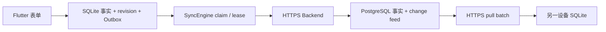

# 第 6 章：持久同步与 Backend SQL 如何保护追加历史

本章解释已提交接触、追加修订、未获回应尝试和账号私有草稿如何在本机 SQLite、Backend 与 PostgreSQL 之间移动。App 不上传整个 SQLite 文件，只传送有版本的 command 和有顺序的 change。

## 同步链路



Flutter 不知道 PostgreSQL 密码。它只用 Supabase access token 调用自有 Backend。Backend 验证 JWT 后，重新取得内部 `app_user_id`、当前空间、项目和 capability。客户端 payload 不能指定业务用户身份。

HTTP 层的 context、command 和 pull 端点共用 [`bearerToken`](../../backend/server/src/authorization.ts)。它只接受一个 `Bearer token`，拒绝缺失、含空白或拼接多个值的 header。统一解析器防止不同端点形成不同的认证边界。

## Outbox 为什么和接触在同一 transaction

`ContactJournal.submitDraft` 在同一 SQLite transaction 内写入接触、revision、答案和 `contact.submit.v1` command。更正和作废分别写入 `contact.revise.v1` 与 `contact.void.v1`。`recordContactAttempt` 同样原子写入尝试和 `contact.attempt.submit.v1` command。如果只写本机事实，随后 App 崩溃，同步引擎就不知道它需要上传。如果只写 command，本机又会出现无事实可显示的幽灵命令。

Outbox 保存稳定 command ID、设备 ID、aggregate ID、基础 revision、payload、尝试次数和失败状态。它不保存 access token。token 每次发送前从 `IdentitySession` 取得。

## claim、lease 和 ACK

claim 是在 SQLite transaction 内选出已到重试时间的 command，并立即把它们改为 `leased`。每批最多领取 20 条，同一 aggregate 只领取最早的一条。lease 是有期限的处理权。当前执行器在 30 秒内拥有这批 command，其他执行器不能同时发送它们。

进程在网络请求中途退出时，lease 会过期。下一个执行器把命令改回 `pending` 并重试。迟到 ACK 只能由仍持有同一 lease 的 worker 接受；旧 worker 不能覆盖新 worker 的结果。

同一 aggregate 的 command 必须按创建顺序处理。一条更早的更正发生冲突时，后续更正不能越过它。另一条 aggregate 可以继续同步，不被无关失败阻塞。

## 重试时间如何计算

可重试失败使用指数退避。第 `n` 次已领取尝试的基础延迟是：

```text
base_seconds(n) = min(2 × 2^(n - 1), 300)
delay = base_seconds × (1 + 0.25 × random)
```

`random` 在 `[0, 1)` 内。这个 jitter 使多台设备不会在同一秒内一起重试。Backend 可通过可信 `Retry-After` 要求更长等待，客户端最多接受一小时。永久拒绝和冲突不使用自动退避掩盖，而是进入稳定失败状态。

## 批量结果如何独立确认

`POST /v1/sync/commands/batch` 接收最多 20 条 command。Backend 为每条结果返回原 `command_id`。客户端按 ID 确认结果，不使用列表位置。因此，服务端可以乱序返回，也可以在同批中接受一条并重试另一条。已确认的 command 进入 `completed`，下一轮不再发送它。

状态转换如下：

- `accepted` 和 `duplicate` 进入 `completed`；
- `conflict` 进入 `needs_resolution`；
- `rejected` 和 `forbidden` 进入 `permanent_failure`；
- 超时、`429`、`5xx` 和单条存储暂时失败回到 `pending`。

批量响应如果缺少 ID、重复 ID 或带有未请求的 ID，客户端不猜测结果。未确认的 command 以 `invalid_server_response` 进入可重试状态。服务端幂等处理保护 ACK 丢失后的重发。

## 用户如何判断与恢复失败

首页把可重试失败显示为“等待重试”。App 在到达 `next_attempt_at` 后的下一次同步触发时自动再试，用户无需重新录入。“需要处理”表示冲突，必须保留本机事实并等待明确处理。“永久拒绝”表示服务端不会接受当前 command，自动重试不会解决问题。

同步健康只返回各状态数量、最早等待时间、最后成功时间和稳定失败码。失败码只允许小写字母、数字和下划线。其他服务端文本改为 `unknown_sync_failure`，不写入 payload、邮箱或其他 PII。

## 旧客户端如何保持兼容

新批量端点不替换旧的 `POST /v1/sync/commands`。已发布客户端可继续发送 protocol v1 单条 command。Backend 测试直接读取 [`sync-contract-v1`](../../backend/server/test/fixtures/sync-contract-v1.ts) fixture，固定该合同。未支持的协议版本返回 `rejected` 和稳定错误码 `unsupported_protocol`，不进入存储层。

## 上传 cursor 和拉取 cursor 不是同一个事实

Backend 接受 command 后返回 change feed cursor。这个回执只能证明“我的 command 已被处理”，不能证明“我已经下载了 cursor 之前的所有变化”。

假设设备 B 的接触先进入服务器，设备 A 的上传随后得到更新的 cursor。如果 A 在 ACK 后直接推进拉取 cursor，A 会永久跳过 B 的接触。因此当前实现遵守两条规则：

- push ACK 只把本机 command 改为 `completed`；
- 只有 pull batch 的全部事实已在 SQLite transaction 中成功应用，才推进 `server_cursor`。

拉取遇到已在本机存在的同一 revision 时，只有动作类型、原因、完整快照和类型化答案都相同才幂等跳过。迟到的 revision 1 会与本机保存的 revision 1 比较，不会拿已经更正过的当前投影误判冲突。如果 contact ID 和 revision 相同，但触达人数、渠道、地点、原因或答案不同，客户端把它当成无效远端变化，不会静默覆盖本地事实。一个 batch 中任何变化无效时，该 batch 的接触和 cursor 全部回滚。

## Backend 如何幂等写入 PostgreSQL

[`apply_contact_submit`](../../backend/database/migrations/0003_contact_sync.sql) 是 `SECURITY DEFINER` 函数。runtime role 可以执行它，但不能直接读写接触表。函数再次核对个人空间、当前项目和已发布问卷版本。

同一 `(app_user_id, command_id)` 先取 transaction advisory lock。首次请求原子写入以下事实：

- 接触当前投影、revision 1 和类型化答案；
- `processed_commands` 幂等结果；
- `change_feed` 的有序变化；
- 不含 token 或对象 PII 的审计事件；
- 经过批准字段的 warehouse Outbox 分析事实。

重复 command 返回原 cursor，不再插入一次接触。这是幂等性：同一请求执行一次或多次，业务事实结果相同。

[`apply_contact_attempt_submit`](../../backend/database/migrations/0008_contact_attempts.sql) 对尝试使用相同的 command 幂等边界，但只写尝试、处理结果、change feed 和审计事件。它不写 warehouse Outbox，因为未获回应不属于接触或转化事实。Backend parser 还会拒绝在尝试 payload 中夹带触达人数、兴趣、问卷答案或关系阶段。

后来回应仍通过 `apply_contact_submit` 提交普通接触。该函数核对来源尝试属于同一用户、空间和项目，并且尚未关联其他接触；接触成功后才锁定并关联尝试。任一步失败时，整个 transaction 回滚。

## PostgreSQL 如何追加更正和作废

[`0009_contact_revisions.sql`](../../backend/database/migrations/0009_contact_revisions.sql) 给 `contact_revisions` 增加受约束的动作类型和原因。revision 1 只能是 `submitted` 且没有原因。后续 revision 只能是 `corrected` 或 `voided`，并必须有非空原因。

`apply_contact_revise` 和 `apply_contact_void` 是 runtime role 可以执行的 `SECURITY DEFINER` 包装函数。私有 helper 负责同一组事务规则，runtime role 不能直接执行该 helper，也不能直接读写事实表。

每条命令先核对可信用户、个人空间、活动项目、接触归属和 `base_revision`。更正随后追加完整 snapshot 和答案，更新当前投影，并写入 change feed、审计事件和 warehouse Outbox。作废复制当前完整 snapshot 和答案，追加作废 revision，再把当前投影标为 `voided`。任何一步失败时，整个 transaction 回滚。

同一 `(app_user_id, command_id)` 重放返回原 cursor。新的 command 如果仍使用旧 base revision，则返回 `contact_revision_conflict`。其他用户即使知道 contact ID，也只得到稳定的 `contact_forbidden`，不能通过错误差异探测归属。

更正发生时间后，SQLite 和 PostgreSQL 的个人指标都使用新的当前投影重新归期。作废后，两端都因 `lifecycle_status = 'active'` 条件排除该记录。revision 历史、审计事件和 warehouse 作废事件仍保留。

## change feed 如何拉取

`GET /v1/sync/changes` 接收当前 workspace、project、可选 cursor 和最多 100 条的 batch 大小。Backend 先从 token 取得可信上下文，再与查询范围交叉核对。

PostgreSQL 内部用递增 `change_sequence` 排序，对客户端只暴露随机 `cursor_token`。[`pull_sync_changes`](../../backend/database/migrations/0005_regions_and_private_draft_sync.sql) 确认 cursor 属于同一可信范围，再返回后续接触、尝试或私有草稿变化。客户端无需知道全局序号，也不能用别人项目的 cursor 探测数据。

无效 cursor 是已确定的客户端问题，不是值得自动重试的服务不可用。PostgreSQL 用 SQLSTATE `22023` 拒绝它；Backend Store 将该错误转为 `InvalidSyncCursorError`，HTTP 再稳定返回 `400 invalid_cursor`。其他未分类的数据库错误仍失败关闭为 `503 sync_unavailable`。

## 私有草稿为什么不使用最后写入覆盖

`draft.upsert.v1` 携带客户端已知的 `base_revision`。PostgreSQL 只在这个版本等于服务器当前版本时接受写入；同一 command 重放返回原 cursor，旧版本的新 command 返回稳定冲突。`draft.delete.v1` 保留 tombstone revision，因此另一台设备的迟到写入不能把已删除草稿当作全新草稿复活。

拉取变化时，如果本机没有未上传编辑，远端版本直接成为新的本机草稿。如果本机已经分叉，SyncEngine 先保存一份 `device_only` 冲突副本，再安装服务器确认的原草稿。这样不会丢失任一份内容，也不会让冲突副本进入接触统计或 warehouse。

PostgreSQL 的草稿主键是 `(app_user_id, draft_id)`。即使两个用户提交相同 draft ID，也只会写各自的行。同一用户的既有 draft ID 不能改换 workspace、project 或问卷版本；upsert 和 delete 都核对创建时固定的 scope。runtime role 不能直接读取草稿表，只能通过按可信用户和项目过滤的函数访问。

已同步草稿切换为 `device_only` 时，本机发送带当前 server revision 的删除 command。服务器保存 tombstone，其他设备删除账号私有副本，发起切换的设备保留本机内容。若一个上传已经发出但 ACK 尚未确认，App 暂停模式切换；否则 ACK 丢失时，服务器可能已有副本，而本机却错误显示“仅本设备”。

## 区域树为什么同时有应用校验和数据库约束

本机 [`RegionCatalog`](../../lib/regions/region_catalog.dart) 在安装区域版本前检查重复 ID、缺失父级和循环。PostgreSQL 的自引用外键保证父级存在，触发器拒绝多节点循环。已解析接触必须引用一个真实版本节点，而且沿唯一父链至少能找到城市。两层规则相同，但各自保护自己的写入边界，不能假设所有数据永远来自当前 Flutter 页面。

平台用 [`0007_canonical_region_resolution.sql`](../../backend/database/migrations/0007_canonical_region_resolution.sql) 发布唯一的当前区域树版本和边界。`resolve_canonical_region` 使用 PostgreSQL 内置 `point` 与 `polygon` 判断坐标归属，从所有命中项中选择层级最深的节点，并返回从根到该节点的父链。返回结果必须包含城市祖先；同层命中按稳定 ID 排序，避免相同数据产生不确定结果。

Flutter 的 [`HttpContactRegionResolver`](../../lib/regions/contact_region_resolver.dart) 用 access token 调用 `POST /v1/regions/resolve`。`200` 表示已匹配；`202` 表示当前版本没有边界命中。超时、离线、认证失败、数据库不可用或无效父链都保持 `PendingContactLocation`。这个合同保留已经取得的位置事实，同时阻止客户端自行猜测区域。

## Drift 与 PostgreSQL 如何对账同一指标

[`personal_contact_metrics_v1.csv`](../../backend/database/fixtures/shared/personal_contact_metrics_v1.csv) 是两端共用的 synthetic 输入。它包含同项目有效接触、时间窗外接触、另一用户接触和另一项目接触。Drift 测试与 PostgreSQL fixture 都从该文件读取，并分别核对：

- 有效接触场次；
- `SUM(reach_count)`；
- 兴趣 `0–4` 五档数量；
- 七类稳定渠道分布；
- `MAX(occurred_at_utc)`。

[`read_personal_contact_summary`](../../backend/database/migrations/0006_personal_contact_metrics.sql) 使用与 Drift 相同的 UTC 半开区间和 scope 条件。共用输入可以发现两套 SQL 的筛选或单位漂移；它不表示两种 SQL 方言必须写成同一段代码。

## 为什么这样测试

Flutter 测试使用真实内存 SQLite 和可控 Transport。它们覆盖 ACK、指数退避、jitter 上限、双 worker 租约、过期恢复、迟到 ACK、aggregate 顺序、永久失败隔离、批量部分成功、乱序结果、远端 batch 原子性、cursor 区分和同 ID 内容冲突。HTTP Adapter 测试固定 bearer header、路径、query、JSON、`Retry-After` 和错误分类。

Backend 测试使用 synthetic 身份和上下文。它们证明伪造项目在 Store 调用前被拒绝，固定 protocol v1 兼容 fixture，并验证批量单条失败。它们还证明 PostgreSQL 的无效 cursor 不会被误报成临时服务故障。PostgreSQL 16 验证从空库执行全部 migration，再次执行核对 checksum，运行 runtime 权限、接触修订、区域循环、草稿冲突、跨用户隔离和共用指标 fixture，最后执行 `pg_dump` 与 `pg_restore` 并重跑检查。

这些测试分别回答不同问题。单元测试证明状态机，HTTP 测试证明协议转换，真实 PostgreSQL 证明 SQL 语法、权限、transaction 和恢复路径。某一类通过不能替代另一类。

## 当前运行边界

[`ProductionHomeViewModel`](../../lib/features/home/production_home_view_model.dart) 接收 App 启动、回到前台、提交或放弃草稿等意图。它调用内部的 [`ForegroundSyncCoordinator`](../../lib/sync/foreground_sync_coordinator.dart)，再刷新同一可信上下文的首页快照。Widget 不创建 worker，也不直接调用 `ContactJournal` 或 `SyncEngine`。

同步运行中的重复信号会合并为一次串行补跑，不并发启动第二个 drainer，也不会漏掉运行中刚产生的 command。ViewModel 负责同步后的数据刷新和失败隔离；`ForegroundSyncCoordinator` 负责每轮批量上传、拉取和批次数上限。项目切换会创建使用新 scope 的 ViewModel。后台调度、两台设备并发更正的冲突合并页和运维监控属于后续切片。
