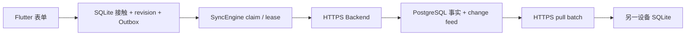

# 第 6 章：持久同步与 Backend SQL 如何保护接触事实

本章解释一条已提交接触如何从本机 SQLite 进入 PostgreSQL，以及另一台设备如何安全取得这条事实。这不是把整个 SQLite 文件上传，而是传送有版本的 command 和有顺序的 change。

## 同步链路



Flutter 不知道 PostgreSQL 密码。它只用 Supabase access token 调用自有 Backend。Backend 验证 JWT 后，重新取得内部 `app_user_id`、当前空间、项目和 capability。客户端 payload 不能指定业务用户身份。

## Outbox 为什么和接触在同一 transaction

`ContactJournal.submitDraft` 在同一 SQLite transaction 内写入接触、revision、答案和 `contact.submit.v1` command。如果只写接触，随后 App 崩溃，同步引擎就不知道这条事实需要上传。如果只写 command，本机又会出现无事实可显示的幽灵命令。

Outbox 保存稳定 command ID、设备 ID、aggregate ID、基础 revision、payload、尝试次数和失败状态。它不保存 access token。token 每次发送前从 `IdentitySession` 取得。

## claim、lease 和 ACK

claim 是在 SQLite transaction 内选出一条已到重试时间的 command，并立即把它改为 `leased`。lease 是有期限的处理权。当前执行器在 30 秒内拥有这条 command，其他执行器不能同时发送它。

进程在网络请求中途退出时，lease 会过期。下一个执行器把命令改回 `pending` 并重试。迟到 ACK 只能由仍持有同一 lease 的 worker 接受；旧 worker 不能覆盖新 worker 的结果。

同一 aggregate 的 command 必须按创建顺序处理。一条更早的更正发生冲突时，后续更正不能越过它。另一条 aggregate 可以继续同步，不被无关失败阻塞。

## 重试时间如何计算

可重试失败使用指数退避。第 `n` 次已领取尝试的基础延迟是：

```text
base_seconds(n) = min(2 × 2^(n - 1), 300)
delay = base_seconds × (1 + 0.25 × random)
```

`random` 在 `[0, 1)` 内。这个 jitter 使多台设备不会在同一秒内一起重试。Backend 可通过可信 `Retry-After` 要求更长等待，客户端最多接受一小时。永久拒绝和冲突不使用自动退避掩盖，而是进入稳定失败状态。

## 上传 cursor 和拉取 cursor 不是同一个事实

Backend 接受 command 后返回 change feed cursor。这个回执只能证明“我的 command 已被处理”，不能证明“我已经下载了 cursor 之前的所有变化”。

假设设备 B 的接触先进入服务器，设备 A 的上传随后得到更新的 cursor。如果 A 在 ACK 后直接推进拉取 cursor，A 会永久跳过 B 的接触。因此当前实现遵守两条规则：

- push ACK 只把本机 command 改为 `completed`；
- 只有 pull batch 的全部事实已在 SQLite transaction 中成功应用，才推进 `server_cursor`。

拉取遇到已在本机存在的同一 revision 时，只有完整快照和类型化答案都相同才幂等跳过。如果 contact ID 相同但触达人数、渠道、地点或答案不同，客户端把它当成无效远端变化，不会静默覆盖本地事实。一个 batch 中任何变化无效时，该 batch 的接触和 cursor 全部回滚。

## Backend 如何幂等写入 PostgreSQL

[`apply_contact_submit`](../../backend/database/migrations/0003_contact_sync.sql) 是 `SECURITY DEFINER` 函数。runtime role 可以执行它，但不能直接读写接触表。函数再次核对个人空间、当前项目和已发布问卷版本。

同一 `(app_user_id, command_id)` 先取 transaction advisory lock。首次请求原子写入以下事实：

- 接触当前投影、revision 1 和类型化答案；
- `processed_commands` 幂等结果；
- `change_feed` 的有序变化；
- 不含 token 或对象 PII 的审计事件；
- 经过批准字段的 warehouse Outbox 分析事实。

重复 command 返回原 cursor，不再插入一次接触。这是幂等性：同一请求执行一次或多次，业务事实结果相同。

## change feed 如何拉取

`GET /v1/sync/changes` 接收当前 workspace、project、可选 cursor 和最多 100 条的 batch 大小。Backend 先从 token 取得可信上下文，再与查询范围交叉核对。

PostgreSQL 内部用递增 `change_sequence` 排序，对客户端只暴露随机 `cursor_token`。[`pull_contact_changes`](../../backend/database/migrations/0003_contact_sync.sql) 确认 cursor 属于同一可信范围，再返回后续 revision 快照。客户端无需知道全局序号，也不能用别人项目的 cursor 探测数据。

无效 cursor 是已确定的客户端问题，不是值得自动重试的服务不可用。PostgreSQL 用 SQLSTATE `22023` 拒绝它；Backend Store 将该错误转为 `InvalidSyncCursorError`，HTTP 再稳定返回 `400 invalid_cursor`。其他未分类的数据库错误仍失败关闭为 `503 sync_unavailable`。

## 为什么这样测试

Flutter 测试使用真实内存 SQLite 和可控 Transport。它们覆盖 ACK、指数退避、双 worker 租约、过期恢复、迟到 ACK、aggregate 顺序、永久失败隔离、远端 batch 原子性、cursor 区分和同 ID 内容冲突。HTTP Adapter 测试则固定 bearer header、路径、query、JSON 和错误分类。

Backend 测试使用 synthetic 身份和上下文，证明伪造项目在 Store 调用前被拒绝，并证明 PostgreSQL 的无效 cursor 不会被误报成临时服务故障。PostgreSQL 16 验证从空库执行全部 migration，再次执行核对 checksum，运行 runtime 权限和 synthetic fixture，最后执行 `pg_dump` 与 `pg_restore` 并重跑检查。

这些测试分别回答不同问题。单元测试证明状态机，HTTP 测试证明协议转换，真实 PostgreSQL 证明 SQL 语法、权限、transaction 和恢复路径。某一类通过不能替代另一类。

## 当前运行边界

同步在 App 启动、回到前台和提交接触后运行。每轮上传和拉取都有数量上限，防止 UI 生命周期一次占用无限工作。后台调度、手工“立即重试”、冲突处理页和运维监控属于后续切片。
