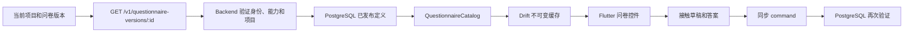

# 第 7 章：版本化问卷如何离线执行并由服务端复验

场景问卷可以随推广项目变化，但接触的时间、渠道、地点、触达人数和单次兴趣不能随问卷改写。本章说明已发布问卷的执行路径：按精确版本读取和缓存定义，离线填写八种题型，按受限规则动态显示问题，再保存草稿或正式提交。Backend 和 PostgreSQL 会按同一版本重算，不信任客户端宣称的可见性。

本章不包含问卷编辑、发布审批和旧草稿升级。这些能力属于后续切片。

## 一条问卷从服务器到草稿的路径

[`QuestionnaireCatalog`](../../lib/questionnaires/questionnaire_contract.dart) 先按项目 ID 和问卷版本 ID 查本机缓存。命中后不需要网络。未命中时，它通过 [`HttpQuestionnaireRemoteSource`](../../lib/questionnaires/http_questionnaire_remote_source.dart) 取得精确版本，并在一个 SQLite transaction 内安装版本、问题和选项。

已安装版本不可被同 ID 的不同内容覆盖。如果服务器返回另一项目的版本，或同一已发布版本后来改变内容，目录会失败关闭。旧草稿仍绑定创建时的版本；新草稿使用可信当前上下文给出的版本。

首次离线且本机没有该版本时，App 不显示一个猜测的空问卷，也不允许绕过问卷提交。页面会说明当前版本不可用，并保留重试入口。

## 八种题型不是八种随意 JSON

第一版只接受以下受控类型：

| 题型 | 保存的值 | 关键约束 |
| --- | --- | --- |
| 是／否 | boolean | 只能是 `true` 或 `false` |
| 普通单选 | option ID | 选项必须属于该题；显示顺序不产生数值含义 |
| 有序单选 | option ID | 选项必须属于该题；顺序含义来自题型 |
| 多选 | option ID 列表 | 不能重复，且满足最少和最多选择数 |
| 数字 | number | 区分整数与小数，并检查单位、最小值和最大值 |
| 日期 | `YYYY-MM-DD` | 只表示真实日历日期，不带时区和时间 |
| 短文本 | string | 非空，并受 Unicode 字符数上限约束 |
| 长文本 | string | 非空，并受独立字符数上限约束 |

合同没有脚本、公式、SQL、上传、签名、矩阵或重复子表的解析入口。问卷定义即使来自服务器，Flutter 也只把它翻译为固定的 Material 控件，不执行定义中的文字。

## 回答状态和值必须分开

每题有五种状态：已回答、未知、拒绝回答、不适用和未回答。只有“已回答”携带真实值。其余四种状态的值必须为 `NULL`。

这一区分解决两个常见错误：

- “不知道”不能被统计成“否”或数值 `0`；
- `NULL` 不能同时代表拒答、不适用和漏填。

必填题不能保持未回答。未知、拒答和不适用是否可以提交，由该题的发布定义决定。可选题可以明确保持未回答。Flutter 的完成度按非“未回答”状态计数，但是否允许正式提交仍以完整 evaluator 结果为准。

## 显示规则为何只能引用更早的问题

一道问题可以有一层 `all` 或 `any` 规则。每个条件只能引用同一问卷版本中排在它之前的问题。定义解析器会拒绝未知来源、引用自己、向后引用、空条件和与题型不相容的操作符。因为依赖只能向前，求值器按问题顺序计算就能得到唯一结果，不需要运行用户代码或处理循环。

| 来源题型 | 允许的判断 |
| --- | --- |
| 是／否 | 等于、不等于、是否属于布尔值集合 |
| 普通单选、有序单选 | 等于、不等于、是否属于合法选项集合 |
| 多选 | 包含或不包含一个合法选项 |
| 数字、日期 | 等于、不等于、大于、大于等于、小于、小于等于、包含边界的区间 |
| 短文本、长文本 | 已回答或未回答 |

如果来源问题本身已隐藏，它不能使后续条件成立。隐藏的必填题不会阻止提交；它使用 `not_applicable` 状态与 `rule_skipped` 原因保存，以区分使用者手动选择的“不适用”。已回答的问题因前置答案改变而隐藏时，页面先列出将被清除的问题并请求确认。取消不修改任何答案；确认后可在短暂窗口内撤销整次变更。

## SQLite 如何保存类型而不失去约束

`db_contact_answers` 和 `db_contact_draft_answers` 使用状态列、受约束的跳过原因、题型列和四类互斥值列：boolean、text、number、multi-choice JSON。SQLite `CHECK` 保证：

- 非回答状态的所有值列都是 `NULL`；
- 已回答时只有与题型对应的值列非空；
- 一个草稿或 revision 对同一道题只有一行。

选择题 ID、日期和文本共用 text 列，但它们仍保留独立题型。范围、选项归属和字符上限需要问卷定义，因此由 evaluator 检查。多选列表使用 JSON 只作为 SQLite 值列编码；任意 JSON 不是问卷能力。

`QuestionnaireAnswerCodec` 集中负责 SQLite 列与同步 JSON 的转换。草稿、提交、修订和冲突同步不各自维护一套格式。

schema v13 的 migration 会重建两张答案表，以替换旧版“只能是 boolean”的 `CHECK`。schema v14 再重建这两张表并扩展问题缓存，保存 `rule_skipped` 原因和显示规则。已有答案和已缓存定义原样复制，新列默认为空，不猜测历史显示状态。

## 为什么客户端验证以后服务端还要再验证

Flutter evaluator 用于即时提示和离线提交判断。客户端设备不属于服务端信任边界，攻击者可以跳过界面直接构造 HTTP 请求。因此 Backend 只做协议形状解析，PostgreSQL 再按已发布版本核对：

- 问题是否存在且没有重复；
- 题型、状态和值形状是否一致；
- 必填题是否完成；
- 非回答状态是否被该题允许；
- 选项、选择数量、数字范围、真实日期和文本长度是否合法；
- 显示规则的来源题、操作符和操作数是否受控；
- 隐藏题是否使用精确的规则跳过标记，可见题是否夹带该标记；
- 问卷版本是否属于可信当前项目。

[`0011_questionnaire_execution.sql`](../../backend/database/migrations/0011_questionnaire_execution.sql) 提供新的 v2 写入函数。旧 protocol v1 函数仍保留，避免已发布客户端立即失效。新 Backend 将提交、更正、冲突解决、作废和私有草稿写入路由到 v2 函数。

[`0012_questionnaire_visibility.sql`](../../backend/database/migrations/0012_questionnaire_visibility.sql) 保存发布定义中的显示规则，并在 PostgreSQL 写入边界按顺序重算可见问题。完整提交和不完整草稿都不能夹带隐藏值；隐藏题必须使用受控跳过标记，可见必填题则仍必须完成。

runtime role 可以执行公开入口，但不能直接读取定义表，也不能执行私有 validator 或答案写入 helper。读取定义同样经过 `SECURITY DEFINER` 函数，并按可信用户、空间和项目过滤。

## 文本答案为什么不进入 warehouse

短文本和长文本属于接触问卷，不是推广对象资料。页面明确提示：不要用问卷文本保存姓名、联系方式或其他对象 PII。

服务端仍把文本答案保存在有权限和追加历史保护的接触 revision 中，以便本人查看和同步。默认 warehouse payload 不包含问卷答案。提交和更正只发送批准的核心分析字段；作废事件也会先移除 `answers` 再写入 warehouse。这样可以保留操作历史，而不把自由文本扩散到默认分析面。

## 同一 fixture 如何约束 Flutter、Backend 和 PostgreSQL

[`questionnaire-contract-v1.json`](../../fixtures/questionnaire/questionnaire-contract-v1.json) 同时包含已发布定义、八种题型、五种状态、合法用例和边界失败。Flutter evaluator 与 Backend validator 读取同一文件，并比较相同的稳定错误码。

[`questionnaire-visibility-contract-v1.json`](../../fixtures/questionnaire/questionnaire-visibility-contract-v1.json) 专门覆盖两种条件组合、各题型的允许操作符、前置问题隐藏、必填题跳过，以及一次答案变更应清除的稳定问题集。Flutter 和 Backend 直接读取该 fixture。PostgreSQL 使用同等 synthetic 定义验证读取、提交、草稿、作废和失败回滚。

PostgreSQL fixture 另用同样的题型和状态建立真实发布定义。它证明：

- 当前项目可以读取定义，另一项目不能读取；
- 八种类型可以原子提交；
- 越界选项和必填缺失被拒绝，且不留下半条接触；
- 不完整问卷仍可保存为私有草稿；
- 作废 revision 保留类型化答案；
- 问卷文本不进入 warehouse。

Drift migration 测试从保存的 v12 schema 写入 boolean 正式答案和草稿答案，再升级到 v14。独立的 v13 升级用例还核对旧答案和问卷定义保留，新的跳过原因和显示规则为空。

## 当前边界

当前实现完成已发布版本授权读取、本地不可变缓存、八题型 UI、五状态、受限显示规则、隐藏答案确认与撤销、离线草稿、Flutter evaluator、Backend validator、PostgreSQL 复验和文本 warehouse 隔离。

以下能力尚未实现：管理端问卷草稿与发布预览、已发布版本差异、旧草稿明确升级，以及跨版本指标兼容决定。没有这些能力时，不应把同 ID 版本改写，也不应把旧版本答案自动解释成新版本答案。
