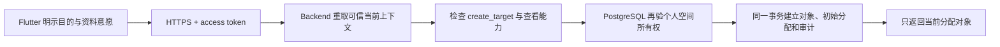

# 第 8 章：推广对象目录、资料保留与匿名化

推广对象是为了持续跟进而建立的资料，不是每次接触的必填主体。使用者可以继续离线记录匿名接触；只有确有跟进需要、并且对方愿意留下资料时，才建立个人或机构对象。本章说明对象的在线授权路径、资料保留与匿名化、七十二小时只读离线快照、接触关联、项目关系，以及个人与机构之间的历史联系。

## 匿名接触为何仍是默认入口

接触记录描述一次已经发生的推广事实。推广对象描述一个可能跨多次接触持续跟进的主体。两者有不同的保存目的和隐私风险，所以当前实现不要求先建对象再记接触，也不把姓名、电话或邮箱写入接触、问卷文本、同步 command 或分析 warehouse。

对象页会明确说明保存目的。建立按钮只有在使用者填写名称并确认跟进需要和资料意愿后才可用。这个确认是操作意图证据，不替代当地法律要求，也不扩大后端授权。

## 一次建立请求经过哪些边界

[`PromotionTargetDirectoryPage`](../../lib/features/targets/promotion_target_directory_page.dart) 不提交用户、空间或项目 ID。它只提交对象类型、名称、可选电话、可选邮箱和幂等 request ID。Backend 从 access token 取得内部 `app_user_id` 和当前上下文；客户端不能通过修改 JSON 选择另一个空间。

PostgreSQL 生成对象 UUID。客户端无需先猜测或保留对象 ID。相同使用者和 request ID 的网络重试返回原对象；同一 request ID 改写资料会冲突，不会产生第二个对象。

## PII 保存在哪里

服务端 PII 只在 `promotion_targets` 保存一份。`promotion_target_creation_requests` 只保存操作者、request ID 和对象 ID；`promotion_target_access_events` 只保存对象、操作者、动作和时间。两张审计表没有名称、电话或邮箱列，并由触发器阻止修改和删除。

建立事务同时写入：

- workspace 级对象资料；
- 建立者的活动跟进分配；
- 不重复 PII 的幂等请求记录；
- 一条 `created` 访问审计。

任一步失败，整个事务回滚。目录读取只联结 `ended_at IS NULL` 的分配，并为实际返回的每个对象追加 `viewed` 审计。已经结束分配的对象不会返回。

## 保留期如何计算

默认保留期是十二个日历月。组织配置只能缩短到一至十一个月，不能超过十二个月，也不能设为无限期。当前个人空间沿用十二个月；组织成员和管理权限在组织切片实现后接入同一策略表。

每个对象的保留期基准取以下时间中的最新值：

- 对象建立时间；
- 仍有效接触中，当前 revision 与对象关联的最近发生时间；
- 当前跟进者最近一次明确确认仍有保留目的的时间。

服务端用日历月计算到期日，不把十二个月换算成固定 365 天。到期前三十天，Backend 返回只含对象 ID 和到期时间的复核任务。页面顶部只显示任务数量和通用提示，不在通知中显示姓名、电话或邮箱。当前跟进者进入对象菜单后，才能明确续期。

目录和复核任务都是在线入口。每次读取前，PostgreSQL 会先匿名化已经到期且没有明确续期的当前分配对象。因此，过期资料不会在同一次响应中返回。生产环境后续可让定时任务调用同一受控事务，缩短“到期”和“下一次在线读取”之间的数据库残留时间；客户端不能自行宣布对象已经匿名化。

## 匿名化事务保留什么、移除什么

对方明确撤回资料时，当前跟进者在对象菜单选择“对方撤回资料”，阅读不可撤销提示后再次确认。Backend 不接收客户端 workspace、项目或操作者 ID；它从 token 重取可信上下文，再要求调用者仍有当前分配。

一个匿名化事务会：

- 把名称替换为固定占位值，并清空电话、邮箱；
- 结束该对象的所有活动分配；
- 结束所有活动项目关系，并清除当前及历史共享备注和原因说明；
- 结束涉及该对象的活动个人与机构关系，并不可逆替换角色说明；
- 写入不含 PII 的匿名化审计事件；
- 保留接触、接触 revision、对象关联、场次、触达人数、对象当次反应和去标识统计。

匿名化不是物理删除接触。历史接触继续证明一次行动发生过，但不能从对象表恢复原姓名、电话、邮箱或敏感备注。精确重放同一 mutation ID 返回第一次结果；改写重放、伪造空间、未分配请求和并发第二次匿名化都会拒绝。

完整的数据流、攻击面和残余风险见[对象资料保留与匿名化威胁模型](../security/promotion-target-anonymization-threat-model.md)。

## 离线对象快照怎样限制在七十二小时

对象列表成功返回时，Backend 同时返回本次重验权限的 `authorized_at`。[`OfflinePromotionTargetGateway`](../../lib/targets/offline_promotion_target_gateway.dart) 只把本次明确分配的完整集合交给 [`OfflinePiiVault`](../../lib/privacy/offline_pii_vault.dart)。Vault 把可信上下文、对象资料、项目关系和共享备注历史写入平台安全存储。它不把这些内容写入普通 Drift、应用偏好、同步 Outbox、日志或通知。

普通 Drift 只保存一个不含 PII 的锁。锁的 key 使用身份 subject 的 SHA-256，value 只含锁定原因和 UTC 时间。它让“删除密文失败”与“可以继续读取”成为两个独立状态：密文即使暂时残留，也不能绕过锁重新显示。

离线读取必须同时满足下列条件：

- 最近一次成功联网验权尚未满七十二小时；
- 当前身份、workspace 和项目与快照一致；
- 安装 ID 没有变化；
- 本机时钟没有相对服务器时间或已观察高水位回拨超过五分钟；
- 平台安全存储本次启动已完成写入、精确读回和删除探针。

七十二小时整即到期。打开快照不会续期。对象页即使持续打开，也会在到期时从 Widget 树移除资料。只有明确的网络失败可以降级；`401`、`403`、无效响应和其他服务端失败不会使用旧资料。对象页显示最近验权时间，并关闭建立对象、修改阶段、编辑备注、配置别名和管理个人机构关系等写操作。使用者可点刷新重新验权；拒绝结果会移除已经显示的旧资料。匿名接触仍可离线记录。

退出登录、切换身份或项目、服务端撤权、到期、重装残留、时间回拨和快照损坏都会先锁定，再删除安全存储值。删除失败保持锁定；同一身份再次启动或再次联网时重试。在线匿名化成功后，客户端不等待下一次列表：它先锁定并删除整份本地密文，再重新读取剩余对象。取消分配仍由下一次成功在线列表整体替换。

完整攻击面、控制与残余风险见[离线推广对象资料威胁模型](../security/offline-pii-threat-model.md)。六平台能否实际启用由本机能力探针决定；build 成功不等于安全存储运行时通过。

[`HttpPromotionTargetGateway`](../../lib/targets/http_promotion_target_gateway.dart) 只接受 HTTPS Backend；localhost 仅用于本机测试。它在每次请求前取得 access token，遇到 `401` 最多强制刷新一次。正式 Flutter 不知道 PostgreSQL login 或表权限。

关系阶段和共享跟进备注可随对象资料进入加密只读快照。断网时不能编辑。个人与机构关系列表及其管理仍只在线读取，因为当前快照不包含这组 workspace 级关系。

## 项目关系保存什么

一个对象在一个项目中只有一条当前关系投影。关系阶段和生命周期是两个字段：

- 阶段固定保存 `0–4`，表示初次建立、可以联络、持续互动、明确推进、达成项目目标关系；
- 生命周期保存 `active`、`paused` 或 `ended`，不使用负数阶段表示暂停或结束；
- 界面显示 `0／2／4／6／8` 时，只计算 `stage * 2`，不保存第二套数值；
- 项目可以覆盖每一级的显示名，但不能改变级别的含义、顺序或方向；
- 阶段 `4` 不是永久终点，事实变化时可以下降。

当前投影便于读取，`promotion_target_relationship_revisions` 保留每次历史。一个 revision 保存原阶段、新阶段、原生命周期、新生命周期、备注快照、修改字段、操作者、时间和原因。历史表由触发器禁止更新或删除。

共享跟进备注属于“对象 × 项目”的关系，只对当前跟进者可见。它不是个人反思。个人反思仍只属于记录者本人，两类文本都不进入匿名分析或 warehouse。

## 个人与机构关系为何不属于项目阶段

个人与机构关系说明两个 workspace 级对象之间已经明确存在的联系。它可在多个推广项目中复用，因此不保存 `project_id`，也不使用关系阶段。每条关系只选择一种固定性质：任职／代表、所有／治理、学习／参与、成员／归属、合作／服务或其他。“其他”必须填写角色说明；其余性质也可填写具体职务或身份。

同一个人与同一机构可以同时有多种不同性质。例如，一个人可以同时是机构所有者和志愿顾问。同一种活动关系不能重复。关系结束后保留原关系和建立、结束 revision；以后再次发生同种联系时建立新关系，不恢复或覆盖旧记录。

建立关系要求使用者当前同时获分配个人和机构两端。读取也使用同一边界；只保留一端分配时，关系不会继续返回。关系本身不会授予另一端对象资料、建立 App 组织成员、关联接触、改变对象反应或改变项目关系阶段。App 不根据邮箱域、名称或共同出现在一次接触中自动推断关系。

关系建立和结束只在线进行。Flutter 发送两端对象 ID、固定关系性质、可选角色说明、当前 revision 和 mutation ID；Backend 提供服务器开始或结束时间。普通 Drift 表、Outbox、日志、通知和 warehouse 不保存这项关系或角色说明。

## 为什么修改需要 revision 和 mutation ID

Flutter 提交关系修改时发送当前看到的 `expected_revision` 和一次性的 `mutation_id`。Backend 从 token 重取用户、空间和项目；PostgreSQL 再检查对象仍在当前分配中。

如果数据库 revision 已经变化，PostgreSQL 以使用者看到的 base revision 做三方比较。另一个设备改阶段、当前设备只改备注时，两个不同字段自动合并并形成新 revision。双方修改同一字段时才返回 `409`。冲突会保存服务器版本号、拟提交值和冲突字段；App 并排显示当前值与拟提交值，由当前跟进者明确选择保留服务器值或采用拟提交值。解决动作本身也是一个新 revision。它不会把旧表单自动覆盖到新版本上，也不会丢弃原始拟提交内容。

如果网络重试同一个 `mutation_id`，且内容完全相同，服务器返回第一次已经接受的 revision，不再增加历史。同一个 ID 携带不同内容会冲突。阶段下降还必须使用失去联系、时间变化、情况变化、对象请求、项目变化、更正或其他等结构化原因；普通“进展更新”不能解释下降。

## HTTP 与权限边界

| 方法与路径 | 用途 | Backend capability |
| --- | --- | --- |
| `GET /v1/promotion-targets` | 返回当前分配对象、当前项目关系和历史 | `view_assigned_target_pii` |
| `POST /v1/promotion-targets` | 建立对象和初始分配 | `create_target` + 查看能力 |
| `GET /v1/promotion-target-retention-tasks` | 返回不含姓名和联系方式的到期前复核任务 | `manage_assigned_target_follow_up` + 查看能力 |
| `POST /v1/promotion-targets/:id/retention` | 明确续期或不可逆匿名化 | `manage_assigned_target_follow_up` + 查看能力，且数据库仍有当前分配 |
| `PATCH /v1/promotion-targets/:id/relationship` | 追加关系修订或明确解决冲突 | `manage_assigned_target_follow_up` + 查看能力，且数据库仍有当前分配 |
| `PUT /v1/promotion-target-stage-aliases` | 配置当前项目的阶段显示名 | `manage_analysis_definitions`；不授予或读取对象 PII |
| `GET /v1/promotion-target-institution-relationships` | 返回同时获分配两端的个人—机构历史关系 | `view_assigned_target_pii`，且数据库重验两端分配 |
| `POST /v1/promotion-target-institution-relationships` | 明确建立一种关系性质 | `manage_assigned_target_relations` + 查看能力 |
| `POST /v1/promotion-target-institution-relationships/:id/end` | 结束关系并追加 revision | `manage_assigned_target_relations` + 查看能力 |

Flutter 不提交 workspace、project 或操作者 ID。路径中的对象 ID 也不能单独授权；数据库要求它属于可信 workspace、当前项目已有关系，并且调用者仍有活动分配。

## 两层授权为何都需要

Backend 每次列表或建立操作都重新检查 capability：

- `create_target` 允许建立对象；
- `view_assigned_target_pii` 允许读取当前分配对象的资料；
- `manage_assigned_target_follow_up` 允许维护项目关系、明确续期或匿名化；
- `manage_assigned_target_relations` 允许在仍可查看两端时建立或结束个人与机构关系。

界面隐藏按钮只改善操作体验，不是授权。即使攻击者直接调用 HTTP，Backend 仍会拒绝缺少 capability 的上下文。即使 Backend 传入错误上下文，[`0016_promotion_target_directory.sql`](../../backend/database/migrations/0016_promotion_target_directory.sql) 也会重新检查活动用户、个人空间所有权和活动项目。

当前只有个人空间。组织成员、角色和跨成员分配要等组织切片建立成员关系后再授权，不能从个人空间所有者规则推导。

## 如何验证这个边界

Flutter 测试证明建立按钮需要明示确认、空目录不阻断匿名接触，并固定 bearer header 与不含客户端 `target_id` 的请求合同。Backend 测试证明 capability 会在存储前重验，额外 `workspace_id` 会被拒绝，PostgreSQL Adapter 只传可信上下文和受控资料。

离线 PII 测试另外证明：

- Backend 授权时间而非设备打开时间决定七十二小时期限；
- 网络失败只可读取同一身份、workspace 和项目的未过期快照；
- `401`／`403`、注销、换身份、换项目和重装残留会锁定旧资料；
- 时间回拨、损坏密文和安全存储失败均为失败关闭；
- 删除失败保持不可访问，并在同一身份再次启动时重试；
- 较旧并发刷新不能覆盖较新分配或并发撤权；
- 普通 Drift 锁不含身份 subject、姓名、电话或邮箱。

PostgreSQL 检查与 synthetic fixture 证明：

- runtime role 只能执行受控函数，不能直接读写对象、分配或审计表；
- 建立者在同一事务取得初始分配；
- 精确重放返回同一对象，改写重放发生冲突；
- 伪造空间和未分配身份不能读取 PII；
- 结束分配后对象退出目录；
- 建立和查看审计只追加，且不重复 PII。

保留与匿名化测试另外证明：

- 十二个月是上限，较短策略可保存，超过上限会拒绝；
- 复核任务只含对象 ID 和到期时间，不含姓名、电话或邮箱；
- 明确续期推进下一次到期日，精确重放不重复写审计；
- 到期对象在目录读取前自动匿名化，明确撤回立即匿名化；
- 匿名化清除对象 PII、历史敏感备注、活动分配和活动关系；
- 接触事实、当次反应、场次和去标识统计保留；
- 两个独立数据库会话同时匿名化时只有一个成功；
- 客户端收到成功结果后立即删除离线密文，断网时不恢复旧对象。

关系测试另外证明：

- 阶段 `0 → 4` 和 `4 → 3` 都可保存，下降必须使用结构化原因；
- 生命周期可独立暂停，不改变阶段数值；
- 同一 mutation 重放不增加 revision；
- 不同字段的旧 revision 自动合并；同字段写入保存拟提交内容并进入显式冲突；
- 冲突解决保留“保留当前／采用拟提交／自定义”的选择和解决 revision；
- 备注修订只追加，结束分配后不能再读取或修改；
- 显示别名和双倍刻度不改变数据库的 `0–4`；
- 姓名和备注不会进入 warehouse payload。

个人与机构关系测试另外证明：

- 只允许同一 workspace 内个人与机构两种不同对象相连；
- 六类性质固定，“其他”必须填写角色说明；
- 同一对对象可同时有不同性质，同一种活动关系不能重复；
- 建立和结束追加 revision，精确重放幂等，改写重放发生冲突；
- 两个独立数据库会话并发建立时只有一个成功；
- 撤销任一端分配后不可读取或结束关系；
- 关系不增加对象分配、不建立接触关联，也不写 warehouse。

CI 从空库执行全部 migration 两次，再运行检查和 fixture。随后执行 `pg_dump`／`pg_restore`，并在恢复库中重跑同一组验证。没有用过 Docker 的读者可以按[第 9 章](09-local-docker-and-ci-testing.md)从安装、启动到读取成功输出逐步执行；关系审计由 `verify_promotion_target_relationship_audit.sql` 和 `0018_promotion_target_relationship_audit.sql` fixture 覆盖。

## 当前边界

当前实现完成对象目录、个人或机构资料建立、初始分配、当前分配读取、接触关联、对象当次反应、项目关系阶段、独立生命周期、共享备注历史、显式冲突、阶段显示别名、个人与机构的六类历史关系、十二个月上限的保留复核、明确续期、不可逆匿名化，以及当前分配对象的七十二小时加密只读快照。组织切片仍需把组织角色和较短保留期的管理界面接入已经存在的策略表。
