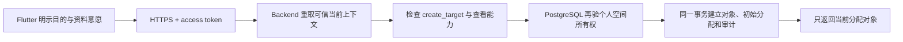

# 第 8 章：推广对象目录、项目关系与共享跟进备注

推广对象是为了持续跟进而建立的资料，不是每次接触的必填主体。使用者可以继续离线记录匿名接触；只有确有跟进需要、并且对方愿意留下资料时，才建立个人或机构对象。本章说明在线对象路径：建立对象、取得初始分配、关联接触，以及维护对象在当前项目中的关系阶段、生命周期和共享跟进备注。

## 匿名接触为何仍是默认入口

接触记录描述一次已经发生的推广事实。推广对象描述一个可能跨多次接触持续跟进的主体。两者有不同的保存目的和隐私风险，所以当前实现不要求先建对象再记接触，也不把姓名、电话或邮箱写入接触、问卷文本、同步 command 或分析 warehouse。

对象页会明确说明保存目的。建立按钮只有在使用者填写名称并确认跟进需要和资料意愿后才可用。这个确认是操作意图证据，不替代当地法律要求，也不扩大后端授权。

## 一次建立请求经过哪些边界

[`PromotionTargetDirectoryPage`](../../lib/features/targets/promotion_target_directory_page.dart) 不提交用户、空间或项目 ID。它只提交对象类型、名称、可选电话、可选邮箱和幂等 request ID。Backend 从 access token 取得内部 `app_user_id` 和当前上下文；客户端不能通过修改 JSON 选择另一个空间。

PostgreSQL 生成对象 UUID。客户端无需先猜测或保留对象 ID。相同使用者和 request ID 的网络重试返回原对象；同一 request ID 改写资料会冲突，不会产生第二个对象。

## PII 保存在哪里

当前 PII 只在 `promotion_targets` 保存一份。`promotion_target_creation_requests` 只保存操作者、request ID 和对象 ID；`promotion_target_access_events` 只保存对象、操作者、动作和时间。两张审计表没有名称、电话或邮箱列，并由触发器阻止修改和删除。

建立事务同时写入：

- workspace 级对象资料；
- 建立者的活动跟进分配；
- 不重复 PII 的幂等请求记录；
- 一条 `created` 访问审计。

任一步失败，整个事务回滚。目录读取只联结 `ended_at IS NULL` 的分配，并为实际返回的每个对象追加 `viewed` 审计。已经结束分配的对象不会返回。

## 为什么当前不做离线对象缓存

这一切片没有在 Drift、应用偏好、日志或同步 Outbox 保存对象资料。对象页没有网络时失败关闭，同时提示匿名接触仍可离线使用。这样先证明授权和审计路径，再在后续切片加入经过加密、受七十二小时期限约束的最小离线资料。

[`HttpPromotionTargetGateway`](../../lib/targets/http_promotion_target_gateway.dart) 只接受 HTTPS Backend；localhost 仅用于本机测试。它在每次请求前取得 access token，遇到 `401` 最多强制刷新一次。正式 Flutter 不知道 PostgreSQL login 或表权限。

关系阶段和共享跟进备注沿用这个在线边界。备注没有写入 Drift、同步 Outbox、应用日志或通知。这样可以在 Slice 4E 定义加密和限时缓存前，避免新增一份离线敏感文本副本。断网时对象关系不可编辑，但匿名接触仍可离线记录。

## 项目关系保存什么

一个对象在一个项目中只有一条当前关系投影。关系阶段和生命周期是两个字段：

- 阶段固定保存 `0–4`，表示初次建立、可以联络、持续互动、明确推进、达成项目目标关系；
- 生命周期保存 `active`、`paused` 或 `ended`，不使用负数阶段表示暂停或结束；
- 界面显示 `0／2／4／6／8` 时，只计算 `stage * 2`，不保存第二套数值；
- 项目可以覆盖每一级的显示名，但不能改变级别的含义、顺序或方向；
- 阶段 `4` 不是永久终点，事实变化时可以下降。

当前投影便于读取，`promotion_target_relationship_revisions` 保留每次历史。一个 revision 保存原阶段、新阶段、原生命周期、新生命周期、备注快照、修改字段、操作者、时间和原因。历史表由触发器禁止更新或删除。

共享跟进备注属于“对象 × 项目”的关系，只对当前跟进者可见。它不是个人反思。个人反思仍只属于记录者本人，两类文本都不进入匿名分析或 warehouse。

## 为什么修改需要 revision 和 mutation ID

Flutter 提交关系修改时发送当前看到的 `expected_revision` 和一次性的 `mutation_id`。Backend 从 token 重取用户、空间和项目；PostgreSQL 再检查对象仍在当前分配中。

如果数据库 revision 已经变化，PostgreSQL 以使用者看到的 base revision 做三方比较。另一个设备改阶段、当前设备只改备注时，两个不同字段自动合并并形成新 revision。双方修改同一字段时才返回 `409`。冲突会保存服务器版本号、拟提交值和冲突字段；App 并排显示当前值与拟提交值，由当前跟进者明确选择保留服务器值或采用拟提交值。解决动作本身也是一个新 revision。它不会把旧表单自动覆盖到新版本上，也不会丢弃原始拟提交内容。

如果网络重试同一个 `mutation_id`，且内容完全相同，服务器返回第一次已经接受的 revision，不再增加历史。同一个 ID 携带不同内容会冲突。阶段下降还必须使用失去联系、时间变化、情况变化、对象请求、项目变化、更正或其他等结构化原因；普通“进展更新”不能解释下降。

## HTTP 与权限边界

| 方法与路径 | 用途 | Backend capability |
| --- | --- | --- |
| `GET /v1/promotion-targets` | 返回当前分配对象、当前项目关系和历史 | `view_assigned_target_pii` |
| `POST /v1/promotion-targets` | 建立对象和初始分配 | `create_target` + 查看能力 |
| `PATCH /v1/promotion-targets/:id/relationship` | 追加关系修订或明确解决冲突 | `manage_assigned_target_follow_up` + 查看能力，且数据库仍有当前分配 |
| `PUT /v1/promotion-target-stage-aliases` | 配置当前项目的阶段显示名 | `manage_analysis_definitions`；不授予或读取对象 PII |

Flutter 不提交 workspace、project 或操作者 ID。路径中的对象 ID 也不能单独授权；数据库要求它属于可信 workspace、当前项目已有关系，并且调用者仍有活动分配。

## 两层授权为何都需要

Backend 每次列表或建立操作都重新检查 capability：

- `create_target` 允许建立对象；
- `view_assigned_target_pii` 允许读取当前分配对象的资料。

界面隐藏按钮只改善操作体验，不是授权。即使攻击者直接调用 HTTP，Backend 仍会拒绝缺少 capability 的上下文。即使 Backend 传入错误上下文，[`0016_promotion_target_directory.sql`](../../backend/database/migrations/0016_promotion_target_directory.sql) 也会重新检查活动用户、个人空间所有权和活动项目。

当前只有个人空间。组织成员、角色和跨成员分配要等组织切片建立成员关系后再授权，不能从个人空间所有者规则推导。

## 如何验证这个边界

Flutter 测试证明建立按钮需要明示确认、空目录不阻断匿名接触，并固定 bearer header 与不含客户端 `target_id` 的请求合同。Backend 测试证明 capability 会在存储前重验，额外 `workspace_id` 会被拒绝，PostgreSQL Adapter 只传可信上下文和受控资料。

PostgreSQL 检查与 synthetic fixture 证明：

- runtime role 只能执行受控函数，不能直接读写对象、分配或审计表；
- 建立者在同一事务取得初始分配；
- 精确重放返回同一对象，改写重放发生冲突；
- 伪造空间和未分配身份不能读取 PII；
- 结束分配后对象退出目录；
- 建立和查看审计只追加，且不重复 PII。

关系测试另外证明：

- 阶段 `0 → 4` 和 `4 → 3` 都可保存，下降必须使用结构化原因；
- 生命周期可独立暂停，不改变阶段数值；
- 同一 mutation 重放不增加 revision；
- 不同字段的旧 revision 自动合并；同字段写入保存拟提交内容并进入显式冲突；
- 冲突解决保留“保留当前／采用拟提交／自定义”的选择和解决 revision；
- 备注修订只追加，结束分配后不能再读取或修改；
- 显示别名和双倍刻度不改变数据库的 `0–4`；
- 姓名和备注不会进入 warehouse payload。

CI 从空库执行全部 migration 两次，再运行检查和 fixture。随后执行 `pg_dump`／`pg_restore`，并在恢复库中重跑同一组验证。没有用过 Docker 的读者可以按[第 9 章](09-local-docker-and-ci-testing.md)从安装、启动到读取成功输出逐步执行；关系审计由 `verify_promotion_target_relationship_audit.sql` 和 `0018_promotion_target_relationship_audit.sql` fixture 覆盖。

## 当前边界

当前实现完成在线对象目录、个人或机构资料建立、初始分配、当前分配读取、接触关联、对象当次反应、项目关系阶段、独立生命周期、共享备注历史、显式冲突和阶段显示别名。加密限时离线对象资料、匿名化执行，以及个人与机构之间的六类关系仍属于后续切片。
