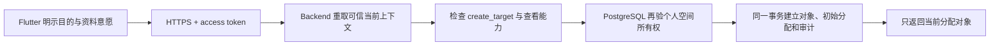

# 第 8 章：推广对象目录、资料保留与匿名化

推广对象是为了持续跟进而建立的资料，不是每次接触的必填主体。使用者可以继续离线记录匿名接触；只有确有跟进需要、并且对方愿意留下资料时，才建立个人或机构对象。本章说明对象的在线授权路径、资料保留与匿名化、七十二小时只读离线快照、接触关联、项目关系，以及个人与机构之间的历史联系。

## 匿名接触为何仍是默认入口

接触记录描述一次已经发生的推广事实。推广对象描述一个可能跨多次接触持续跟进的主体。两者有不同的保存目的和隐私风险，所以当前实现不要求先建对象再记接触，也不把姓名、电话或邮箱写入接触、问卷文本、同步 command 或分析 warehouse。

对象页会明确说明保存目的。建立按钮只有在使用者填写名称并确认跟进需要和资料意愿后才可用。这个确认是操作意图证据，不替代当地法律要求，也不扩大后端授权。

## 一次建立请求经过哪些边界


```mermaid
flowchart LR
  A["Flutter 明示目的与资料意愿"] --> B["HTTPS + access token"]
  B --> C["Backend 重取可信当前上下文"]
  C --> D["检查 create_target 与查看能力"]
  D --> E["PostgreSQL 再验个人空间所有权"]
  E --> F["同一事务建立对象、初始分配和审计"]
  F --> G["只返回当前分配对象"]
```

[`PromotionTargetDirectoryPage`](../../lib/features/targets/promotion_target_directory_page.dart) 不提交用户、空间或项目 ID。它只提交对象类型、名称、可选电话、可选邮箱和幂等 request ID。Backend 从 access token 取得内部 `app_user_id` 和当前上下文；客户端不能通过修改 JSON 选择另一个空间。

PostgreSQL 生成对象 UUID。客户端无需先猜测或保留对象 ID。相同使用者和 request ID 的网络重试返回原对象；同一 request ID 改写资料会冲突，不会产生第二个对象。

## PII 保存在哪里

服务端 PII 只在 `promotion_targets` 保存一份。`promotion_target_creation_requests` 只保存操作者、request ID 和对象 ID；`promotion_target_access_events` 只保存对象、操作者、动作和时间。两张审计表没有名称、电话或邮箱列，并由触发器阻止修改和删除。

建立事务同时写入：

- workspace 级对象资料；
- 建立者的活动跟进分配；
- 不重复 PII 的幂等请求记录；
- 一条 `created` 访问审计。

任一步失败，整个事务回滚。目录读取只联结 `ended_at IS NULL` 的分配，并为实际返回的每个对象追加 `viewed` 审计。已经结束分配的对象不会返回。

## 保留期如何计算

默认保留期是十二个日历月。组织配置只能缩短到一至十一个月，不能超过十二个月，也不能设为无限期。当前个人空间沿用十二个月；组织成员和管理权限在组织切片实现后接入同一策略表。

每个对象的保留期基准取以下时间中的最新值：

- 对象建立时间；
- 仍有效接触中，当前 revision 与对象关联的最近发生时间；
- 当前跟进者最近一次明确确认仍有保留目的的时间。

服务端用日历月计算到期日，不把十二个月换算成固定 365 天。到期前三十天，Backend 返回只含对象 ID 和到期时间的复核任务。页面顶部只显示任务数量和通用提示，不在通知中显示姓名、电话或邮箱。当前跟进者进入对象菜单后，才能明确续期。

目录和复核任务都是在线入口。每次读取前，PostgreSQL 会先匿名化已经到期且没有明确续期的当前分配对象。因此，过期资料不会在同一次响应中返回。生产环境后续可让定时任务调用同一受控事务，缩短“到期”和“下一次在线读取”之间的数据库残留时间；客户端不能自行宣布对象已经匿名化。

## 匿名化事务保留什么、移除什么

对方明确撤回资料时，当前跟进者在对象菜单选择“对方撤回资料”，阅读不可撤销提示后再次确认。Backend 不接收客户端 workspace、项目或操作者 ID；它从 token 重取可信上下文，再要求调用者仍有当前分配。

一个匿名化事务会：

- 把名称替换为固定占位值，并清空电话、邮箱；
- 结束该对象的所有活动分配；
- 结束所有活动项目关系，并清除当前及历史共享备注和原因说明；
- 结束涉及该对象的活动个人与机构关系，并不可逆替换角色说明；
- 写入不含 PII 的匿名化审计事件；
- 保留接触、接触 revision、对象关联、场次、触达人数、对象当次反应和去标识统计。

匿名化不是物理删除接触。历史接触继续证明一次行动发生过，但不能从对象表恢复原姓名、电话、邮箱或敏感备注。精确重放同一 mutation ID 返回第一次结果；改写重放、伪造空间、未分配请求和并发第二次匿名化都会拒绝。

完整的数据流、攻击面和残余风险见[对象资料保留与匿名化威胁模型](../security/promotion-target-anonymization-threat-model.md)。

## 离线对象快照怎样限制在七十二小时

对象列表成功返回时，Backend 同时返回本次重验权限的 `authorized_at`。[`OfflinePromotionTargetGateway`](../../lib/targets/offline_promotion_target_gateway.dart) 只把本次明确分配的完整集合交给 [`OfflinePiiVault`](../../lib/privacy/offline_pii_vault.dart)。Vault 把可信上下文、对象资料、项目关系和共享备注历史写入平台安全存储。它不把这些内容写入普通 Drift、应用偏好、同步 Outbox、日志或通知。

普通 Drift 只保存一个不含 PII 的锁。锁的 key 使用身份 subject 的 SHA-256，value 只含锁定原因和 UTC 时间。它让“删除密文失败”与“可以继续读取”成为两个独立状态：密文即使暂时残留，也不能绕过锁重新显示。

离线读取必须同时满足下列条件：

- 最近一次成功联网验权尚未满七十二小时；
- 当前身份、workspace 和项目与快照一致；
- 安装 ID 没有变化；
- 本机时钟没有相对服务器时间或已观察高水位回拨超过五分钟；
- 平台安全存储本次启动已完成写入、精确读回和删除探针。

七十二小时整即到期。打开快照不会续期。对象页即使持续打开，也会在到期时从 Widget 树移除资料。只有明确的网络失败可以降级；`401`、`403`、无效响应和其他服务端失败不会使用旧资料。对象页显示最近验权时间，并关闭建立对象、修改阶段、编辑备注、配置别名和管理个人机构关系等写操作。使用者可点刷新重新验权；拒绝结果会移除已经显示的旧资料。匿名接触仍可离线记录。

退出登录、切换身份或项目、服务端撤权、到期、重装残留、时间回拨和快照损坏都会先锁定，再删除安全存储值。删除失败保持锁定；同一身份再次启动或再次联网时重试。在线匿名化成功后，客户端不等待下一次列表：它先锁定并删除整份本地密文，再重新读取剩余对象。取消分配仍由下一次成功在线列表整体替换。

### 为什么撤权后还要拒绝旧请求

仅把 Vault 操作串行化仍有一个缺口：旧列表请求先发出，用户随后换项目并清除缓存，旧请求最后才返回。此时快照已经删除，授权时间比较没有旧值可用。如果响应后才读取当前项目，就会把旧对象写进新上下文。

Slice 7Y（[Issue #340](https://github.com/XavierOwen/tongxingzhe-app/issues/340)）在请求开始时捕获账号、可信上下文和撤权代次。撤权使旧代次失效，Vault 在现有串行边界内拒绝旧刷新。Gateway 也在缓存操作和返回前检查作用域，避免旧拒绝清除新缓存，或旧网络失败读取新项目资料。同一项目内的匿名化也会使旧请求失效，不只比较项目 ID。

如果 Backend 返回的在线上下文已经没有 PII 查看能力，AppSession 即使看到相同项目 ID 也会持久锁定旧快照。下次离线启动不能恢复旧权限。同一身份在线重新解析到不同上下文时也会清除旧快照；解析、选择和创建在等待清除后都重新检查会话代次，期间已经注销的用户不会被旧成功结果重新带回项目。

只有撤权后重新开始的有效在线请求可以恢复快照。进程重启不会保留这些在途 Future，所以代次不落盘；重启后的失败关闭仍由原有持久锁承担。这项修复不增加 workspace 清除 API，也不表示成员退出 UI 或 PII-003 的全部生命周期路径已经交付。

完整攻击面、控制与残余风险见[离线推广对象资料威胁模型](../security/offline-pii-threat-model.md)。六平台能否实际启用由本机能力探针决定；build 成功不等于安全存储运行时通过。

[`HttpPromotionTargetGateway`](../../lib/targets/http_promotion_target_gateway.dart) 只接受 HTTPS Backend；localhost 仅用于本机测试。它在每次请求前取得 access token，遇到 `401` 最多强制刷新一次。正式 Flutter 不知道 PostgreSQL login 或表权限。

关系阶段和共享跟进备注可随对象资料进入加密只读快照。断网时不能编辑。个人与机构关系列表及其管理仍只在线读取，因为当前快照不包含这组 workspace 级关系。

## 项目关系保存什么

一个对象在一个项目中只有一条当前关系投影。关系阶段和生命周期是两个字段：

- 阶段固定保存 `0–4`，表示初次建立、可以联络、持续互动、明确推进、达成项目目标关系；
- 生命周期保存 `active`、`paused` 或 `ended`，不使用负数阶段表示暂停或结束；
- 界面显示 `0／2／4／6／8` 时，只计算 `stage * 2`，不保存第二套数值；
- 项目可以覆盖每一级的显示名，但不能改变级别的含义、顺序或方向；
- 阶段 `4` 不是永久终点，事实变化时可以下降。

当前投影便于读取，`promotion_target_relationship_revisions` 保留每次历史。一个 revision 保存原阶段、新阶段、原生命周期、新生命周期、备注快照、修改字段、操作者、时间和原因。历史表由触发器禁止更新或删除。

共享跟进备注属于“对象 × 项目”的关系，只对当前跟进者可见。它不是个人反思。个人反思仍只属于记录者本人，两类文本都不进入匿名分析或 warehouse。

## 当前阶段分布为何不是接触期间统计

“最近七日接触”可以按发生时间筛选，因为每次接触都有发生时刻。当前关系阶段回答的是
另一类问题：现在仍由我跟进的对象分别处于哪个阶段。它使用一次一致性读取的当前快照，
不接受使用者选择一个过去日期后再读取今天的关系表。

个人候选集只包含当前项目中同时满足四个条件的对象 × 项目关系：对象仍为 active、
查看者仍有活动分配、关系生命周期为 active、关系投影没有重复。每个关系只进入一个
`0–4` 桶。paused 和 ended 不进入默认五档；匿名化会结束活动关系与分配，也不进入当前
分布。结束分配只撤销该推广者的个人可见范围，不改写共享关系的阶段或生命周期。

当前快照时刻说明系统何时判断“当前”。数据截至时间说明来源已经同步到哪里，两者不能
混写。要回答过去某个时点，必须从关系 revision、分配有效区间和匿名化事实共同还原；
今天的当前投影不能回填过去。

Slice 6AC 使用一份不含姓名、联系方式和备注的本地最小关系投影。它按身份、workspace
和项目隔离，并以对象 × 项目报告总数和待同步数。分析不遍历或解密 PII vault。
完整远端快照验证通过后，Drift v19 才会原子替换投影和元数据；有效空快照与从未取得
快照是两个状态。网络不可用时页面可显示明确的旧快照，授权失败会清理相应范围。当同步
覆盖或授权新鲜度未知时，界面不会显示“已同步”。

## 个人与机构关系为何不属于项目阶段

个人与机构关系说明两个 workspace 级对象之间已经明确存在的联系。它可在多个推广项目中复用，因此不保存 `project_id`，也不使用关系阶段。每条关系只选择一种固定性质：任职／代表、所有／治理、学习／参与、成员／归属、合作／服务或其他。“其他”必须填写角色说明；其余性质也可填写具体职务或身份。

同一个人与同一机构可以同时有多种不同性质。例如，一个人可以同时是机构所有者和志愿顾问。同一种活动关系不能重复。关系结束后保留原关系和建立、结束 revision；以后再次发生同种联系时建立新关系，不恢复或覆盖旧记录。

建立关系要求使用者当前同时获分配个人和机构两端。读取也使用同一边界；只保留一端分配时，关系不会继续返回。关系本身不会授予另一端对象资料、建立 App 组织成员、关联接触、改变对象反应或改变项目关系阶段。App 不根据邮箱域、名称或共同出现在一次接触中自动推断关系。

关系建立和结束只在线进行。Flutter 发送两端对象 ID、固定关系性质、可选角色说明、当前 revision 和 mutation ID；Backend 提供服务器开始或结束时间。普通 Drift 表、Outbox、日志、通知和 warehouse 不保存这项关系或角色说明。

## 为什么修改需要 revision 和 mutation ID

Flutter 提交关系修改时发送当前看到的 `expected_revision` 和一次性的 `mutation_id`。Backend 从 token 重取用户、空间和项目；PostgreSQL 再检查对象仍在当前分配中。

如果数据库 revision 已经变化，PostgreSQL 以使用者看到的 base revision 做三方比较。另一个设备改阶段、当前设备只改备注时，两个不同字段自动合并并形成新 revision。双方修改同一字段时才返回 `409`。冲突会保存服务器版本号、拟提交值和冲突字段；App 并排显示当前值与拟提交值，由当前跟进者明确选择保留服务器值或采用拟提交值。解决动作本身也是一个新 revision。它不会把旧表单自动覆盖到新版本上，也不会丢弃原始拟提交内容。

如果网络重试同一个 `mutation_id`，且内容完全相同，服务器返回第一次已经接受的 revision，不再增加历史。同一个 ID 携带不同内容会冲突。阶段下降还必须使用失去联系、时间变化、情况变化、对象请求、项目变化、更正或其他等结构化原因；普通“进展更新”不能解释下降。

## 个人空间 CSV 导入 v1

首版 CSV 导入只适用于当前账号拥有的个人空间。数据库在 exact identity 对应 active app user、该账号拥有个人空间且项目有效时，为上下文派生 `import_target_pii`。Backend 检查该 capability，PostgreSQL writer 根据可信身份重验 owner 事实。客户端字符串和预览结果都不授权。组织空间和 CRM API 需要另一份授权与分配合同。

有效文件使用 UTF-8，可以带 BOM，并按 RFC 4180 解码。record 换行可以是 CRLF 或 LF。文件不超过 1 MiB，且最多包含 500 条解码后数据记录。header 必须精确为：

```csv
target_type,display_name,phone,email
```

`target_type` 只能是 `person` 或 `institution`。名称去除首尾空白后保留 1 至 200 个字符；电话和 email 可以为空，非空时分别保留 1 至 80 与 1 至 320 个字符。空值转为 `null`。缺列、重复列、额外列或超过上限都不能进入确认。

预览先显示逐行校验。它只用当前文件与当前账号在同空间已分配的 active 对象做重复提示，不检查其他空间。两行的电话去除首尾空白后完全相同，或 email 去除首尾空白后不区分大小写时，系统给出提示。名称相同不构成信号。使用者可排除该行，也可明确选择建立独立对象。导入不会自动合并、覆盖或更新既有资料。重复提示只是确认事务所见的 best-effort 结果，不是唯一性保证；并发建立可能产生两个独立对象。

预览返回 opaque receipt，绑定规范化完整行集、行序和当时重复提示。receipt 从数据库 UTC 预览时间起连续 15 分钟有效，到期时刻已不有效。确认必须引用该 receipt。无提示的有效行只接受 `skip` 或 `create`；提示行只接受 `skip` 或明确的 `create_separate`。PostgreSQL 重新运行授权、行校验和重复检查。receipt 过期或任何行内容、行序、提示漂移都返回 stale preview，本次不写数据。确认后的已选行在一个事务中全部建立；任一行或审计失败时全部回滚。一个 import request UUID 固定账号、空间、receipt、规范化行序和完整选择。精确重试返回首次确认结果；相同 UUID 的任何载荷改变都发生冲突。

每个新对象的 creator、assignment actor 和 assignee 都取当前可信账号。这只表示账号负责初始跟进，不表示已经接触对方。导入不建立接触、兴趣、对象反应、项目关系、阶段、同意、个人机构关系或共享备注。

预览和确认分别追加 value-free 审计。审计只保存 actor、workspace、request／preview ID、phase、outcome、行数、提示数、建立数、`source_kind = csv` 和数据库时间。原文件名、CSV bytes、字段值、错误行内容、姓名、电话和 email 不进入审计、日志或错误。

推广对象目录中的“导入 CSV”入口只在个人空间且当前可信上下文含 `import_target_pii` 时显示；目录来自离线加密快照时入口禁用。App 通过系统文件选择器读取一个 `.csv` 文件；文件 bytes 只在当前页面内存中短暂保留，客户端按实际读取量限制为 1 MiB，不解析内容，也不写入 Drift、离线 PII vault 或 Outbox。页面直接展示 Backend 返回的规范化行和 value-free 行错误。疑似重复行必须明确选择“另建对象”或“跳过”，其余有效行可以“建立对象”或“跳过”。确认前仍可取消，不产生写入；确认成功后目录立即重新读取。

身份、workspace 或 project 改变时，页面清除文件、receipt、行和选择。确认网络重试复用同一个 request UUID；stale preview 会清除旧选择并要求重新预览。macOS sandbox 只授予用户所选文件的只读访问。自动化测试与六平台 build 证明客户端合同、资源释放和可构建性；真人六平台系统文件选择、生产 Auth／network／PII 与发布运行仍未验证。

## 个人空间 PII 导出 v1

首版导出只适用于当前账号拥有的 active personal workspace。可信上下文必须同时包含 `export_target_pii` 和 `view_assigned_target_pii`。Backend 与 PostgreSQL 重验 exact identity、owner、workspace 和两项 capability。当前项目只确认上下文，导出仍覆盖个人空间中分配给该账号的全部 active 对象。组织 owner 或管理员不自动取得导出能力。

导出前，使用者必须重新输入密码。密码只交给 Supabase Auth，不进入自有 Backend、存储或日志。新会话必须仍是原 external subject。Backend 只接受已验签 JWT `amr` 中的 `password` 方法；`timestamp` 使用 Unix 秒，多个结构有效的 password 条目取最新值。数据库事务时间与认证时间的差必须满足 `-60 seconds <= age < 15 minutes`。普通 token refresh、`iat`、session restore、畸形 AMR 和其他方法都不合格。

文件是 `personal_promotion_target_pii_export_v1` canonical JSON。顶层字段按顺序为 `export_contract_id`、`export_event_id`、`exported_at_utc`、`targets`。每个对象按顺序只有 `target_type`、`display_name`、`phone`、`email`；电话和 email 保留原字符串或显式 `null`。对象按建立时间和 UUID 升序。文件使用 UTF-8，无 BOM、额外空白或结尾换行；该合同不声称 RFC 8785。空范围返回 `targets: []`，任一失败都不返回部分对象。

v1 不使用 CSV。CSV quoting 不阻止电子表格公式注入，为 `+phone` 加前缀又会改变原值。如果以后需要 Excel 或 Calc 直接打开，必须单独定义 typed XLSX 的 text-cell 合同。

只读入口是 `GET /v1/promotion-targets/export`，不接受 query 或 request body。Backend 先验 bearer token 签名与 password AMR，再读取上下文或 PII。成功响应固定使用 `Content-Type: application/json; charset=utf-8`、`Content-Disposition: attachment; filename="personal-promotion-target-pii-v1.json"`、`Cache-Control: no-store`、`X-Content-Type-Options: nosniff` 和精确 `Content-Length`。

缺失或无效身份返回 `401 unauthenticated`；近期认证不合格返回 `403 reauthentication_required`；上下文或权限不合格返回 `403 personal_target_pii_export_forbidden`。query 或 body 返回 `400 invalid_personal_target_pii_export_request`；内部依赖失败返回不含值的 `503 personal_target_pii_export_unavailable`。

每次完整授权并准备好文件的请求，都在同一数据库事务中追加一条不可变审计。JSON `export_event_id` 必须等于审计 event ID，审计 `result` 固定为 `prepared`。其余字段只记录 actor、workspace、合同、认证方法与时间、对象数、字节数和数据库时间。它不记录对象 ID、PII、文件 bytes 或字段 hash。每次重试产生新 event；审计只证明服务端已准备交付。

Flutter 入口只在当前在线可信个人空间上下文同时有两项 capability 时显示；离线缓存上下文不能启动导出。它捕获发起时的 external subject，使用当前邮箱把密码只交给 Auth，同账号成功后强制在线重读 AppSession context，再发一次固定 GET。账号、上下文、权限、页面或请求代次改变时，迟到结果不能恢复 artifact。

客户端只把通过固定响应头、UTF-8、长度和 exact schema 校验的原始 bytes 留在当前页面内存；新准备请求、身份／上下文／权限／在线可信状态变化或页面销毁会清除它。准备完成不会自动下载。使用者必须再选择一次“请求浏览器下载”，Web adapter 才把同一 artifact 的原始 bytes、固定 MIME 和文件名交给浏览器；失败重试不重新请求导出，因此不会新增服务端导出审计。非 Web 平台明确显示 unavailable。

成功状态只表示“已请求下载”。浏览器可能保存、询问或阻止请求，App 不能据此确认文件已保存、打开或保留。自动化使用 synthetic Auth、fake context、HTTP 响应与浏览器 adapter；它不证明生产 Supabase JWT 的 password AMR、真实 PII、浏览器最终保存、原生保存／分享或部署。

## 个人空间疑似重复对象合并与拆分 v1

此合同只适用于当前账号拥有的 active personal workspace。在线可信上下文必须同时具有 `view_assigned_target_pii` 和 `manage_assigned_target_merges`。服务端每次重验 exact identity、owner、workspace、两项 capability，以及两个对象对当前账号的 active assignment。离线快照、客户端 capability 字符串、对象 ID 和预览 receipt 都不能授权。

候选必须是同 workspace、同 `target_type`、未到期、active 且当前可见的两个对象。v1 只接受两种信号：去除首尾空白后完全相同的非空电话，或去除首尾空白后不区分大小写的非空 email。名称相同、模糊相似、电话格式推断和跨空间资料都不参与。提示只表示需要人工判断。

预览显示两个原对象、匹配原因、两端保留截止、较早的合并截止，以及到期后两端匿名化的后果。opaque receipt 本身不携带 PII；服务端把 receipt 绑定到对象 ID、字段、状态、assignment、保留截止、匹配信号和数据库预览时间。receipt 从预览时间起连续 15 分钟有效，到期时刻已不有效。确认时任一成员已经到期，或任一绑定事实或授权漂移，本次操作都失败且不写入。

一次 active merge 只接受两个尚未参加其他 active merge 的对象。使用者指定保留对象，并为姓名、电话和 email 分别选择其中一个原值或原有空值。相同值也记录来源。页面不提供自由编辑、链式合并、嵌套合并或三方合并。

普通目录随后只显示保留对象 ID 的合并视图。另一成员不再显示为独立目录项，但获授权的来源审查仍显示两个原对象。合并不改写原字段、assignment、接触关联、个人与机构关系或历史。两个对象在同一项目中已有的阶段、生命周期和备注也保持分开；页面按来源对象展示和修改，不计算统一阶段。

每次 active merge 都有稳定的合并代次。合并期间的目标相关 writer 必须识别该代次，并记录事实的已知来源对象。该要求同样适用于既有按对象 ID 写入的入口和旧客户端。无法绑定的写入失败关闭。通过合并视图产生且无法确定来源的事实保持待分配，不能冒充合并前资料。

拆分时，系统自动把合并前事实和来源明确的合并期间事实归回原对象。使用者逐项分配其余事实。数据库在锁后重验 active merge、授权、两端状态和完整待处理清单。遗漏、新增事实、重复分配、漂移或任一写入失败使整次拆分零变更。成功后两个目录项恢复，merge、split 和分配历史继续保留。

手动匿名化任一成员、结束其最后 assignment 或再次合并前，必须先拆分。合并本身不续期。合并视图使用两端较早的保留截止，并在到期前三十天进入复核。继续保留需要分别明确续期即将到期的成员。到期仍未续期或拆分时，服务端在一个事务中结束 merge，并按既有规则匿名化两个成员、本代次待分配事实和合并投影。它只保留 value-free 历史与必要 opaque 引用。任一清除失败使整个事务回滚；该处理不可逆，也不阻断其他对象。现有个人 PII 导出仍按原合同分别导出符合条件的 active 源对象，不应用合并视图，也不增加 merge 字段。

merge 与 split 分别使用固定 canonical payload 和客户端 request UUID。精确重试返回首次结果，载荷漂移或 stale 状态稳定失败。merge ledger 只保存 opaque 对象／事实 ID、合并代次、字段来源指针和拆分分配状态；PII 与事实值留在原权威表，ledger 不复制或散列这些值。独立不可变审计只保存 event、actor、workspace、request、operation、outcome、计数和数据库时间，不保存姓名、电话、email、备注、接触内容或错误原文。

0113 已提供 DB-only 的已知对象对 preview：调用方必须给出两个 UUID；数据库在单 command snapshot 中重验授权、revision、assignment、精确匹配信号与 retention 截止，签发 15 分钟 value-free receipt，并提供 private validator 与固定批量 cleanup。runtime 权限保持关闭。

0114 为 contact link、项目关系和关系 revision 增加数据库代次 fence。private ledger 保留 generation 及其两个成员，不复制 PII 或事实值。trigger 按事实中的原 target ID 绑定当前 generation，调用方不能伪造或覆盖。既有事实保持未绑定，既有 writer 在没有 active generation 时保持原结果。activation 与 writer 使用同一 private 串行化边界，不允许 activation 已线性化后再提交无代次的新事实。

7EA／0115 为个人—机构关系及其 revision 分别记录 person 与 institution 两端的 generation binding。generation 固定单一 target type，因此两端只能都未绑定、仅一端绑定，或分别绑定不同 generation。新关系及 created revision 使用创建时两端的 active generation。结束关系只让新 ended revision 使用结束时两端的 active generation，不改写原关系或 created revision。既有关系与 revision 不回填。

数据库按原 target ID 解析两端，并校验 generation member、workspace 和 target type。caller 不能提供、覆盖或事后修改 binding。

关系 create／end 与 activation 复用 0114 的 private fence。现有 0020 单端匿名化只在目标自身是 active member 时失败关闭。目标不是 active member 时，即使关系另一端是 active member，也可结束关系。新 ended revision 记录结束时两端的 active generation。此门禁不提供到期双端清除。0114／0115 的 activation 仍未授予 runtime，用户不能通过 App 建立 active merge。

retention renewal／policy、到期双端清除、独立 assignment end、receipt consumption、runtime merge、合并投影、split、Backend／HTTP／Flutter 和部署仍未交付。以上数据库边界不证明完整保留期处理、到期后 60 分钟物理删除 SLA、生产授权、真实 PII 或用户功能可用。

## HTTP 与权限边界

| 方法与路径 | 用途 | Backend capability |
| --- | --- | --- |
| `GET /v1/promotion-targets` | 返回当前分配对象、当前项目关系和历史 | `view_assigned_target_pii` |
| `POST /v1/promotion-targets` | 建立对象和初始分配 | `create_target` + 查看能力 |
| `POST /v1/promotion-targets/imports/csv/preview` | 解码有界 CSV，返回规范化行、疑似重复提示与限时 receipt | `import_target_pii`，且当前为本人拥有的个人空间 |
| `POST /v1/promotion-targets/imports/csv/confirm` | 重验 receipt、完整行与 actions，原子建立全部已选对象 | `import_target_pii`，且 PostgreSQL 重验 exact identity owner |
| `GET /v1/promotion-targets/export` | 导出当前账号在个人空间的全部 active assigned 对象 | `export_target_pii` + `view_assigned_target_pii` + 近 15 分钟 `password` AMR |
| `GET /v1/promotion-target-retention-tasks` | 返回不含姓名和联系方式的到期前复核任务 | `manage_assigned_target_follow_up` + 查看能力 |
| `POST /v1/promotion-targets/:id/retention` | 明确续期或不可逆匿名化 | `manage_assigned_target_follow_up` + 查看能力，且数据库仍有当前分配 |
| `PATCH /v1/promotion-targets/:id/relationship` | 追加关系修订或明确解决冲突 | `manage_assigned_target_follow_up` + 查看能力，且数据库仍有当前分配 |
| `PUT /v1/promotion-target-stage-aliases` | 配置当前项目的阶段显示名 | `manage_analysis_definitions`；不授予或读取对象 PII |
| `GET /v1/promotion-target-institution-relationships` | 返回同时获分配两端的个人—机构历史关系 | `view_assigned_target_pii`，且数据库重验两端分配 |
| `POST /v1/promotion-target-institution-relationships` | 明确建立一种关系性质 | `manage_assigned_target_relations` + 查看能力 |
| `POST /v1/promotion-target-institution-relationships/:id/end` | 结束关系并追加 revision | `manage_assigned_target_relations` + 查看能力 |

Flutter 不提交 workspace、project 或操作者 ID。路径中的对象 ID 也不能单独授权；数据库要求它属于可信 workspace、当前项目已有关系，并且调用者仍有活动分配。

## 两层授权为何都需要

Backend 每次列表或建立操作都重新检查 capability：

- `create_target` 允许建立对象；
- `view_assigned_target_pii` 允许读取当前分配对象的资料；
- `export_target_pii` 只在同时具有查看能力和近期密码认证时允许批量导出；
- `manage_assigned_target_merges` 只在同时具有查看能力、个人空间 owner 事实和两端 active assignment 时允许预览、合并或拆分；
- `manage_assigned_target_follow_up` 允许维护项目关系、明确续期或匿名化；
- `manage_assigned_target_relations` 允许在仍可查看两端时建立或结束个人与机构关系。

界面隐藏按钮只改善操作体验，不是授权。即使攻击者直接调用 HTTP，Backend 仍会拒绝缺少 capability 的上下文。即使 Backend 传入错误上下文，[`0016_promotion_target_directory.sql`](../../backend/database/migrations/0016_promotion_target_directory.sql) 也会重新检查活动用户、个人空间所有权和活动项目。

当前只有个人空间。组织成员、角色和跨成员分配要等组织切片建立成员关系后再授权，不能从个人空间所有者规则推导。

## 如何验证这个边界

Flutter 测试证明建立按钮需要明示确认、空目录不阻断匿名接触，并固定 bearer header 与不含客户端 `target_id` 的请求合同。Backend 测试证明 capability 会在存储前重验，额外 `workspace_id` 会被拒绝，PostgreSQL Adapter 只传可信上下文和受控资料。

离线 PII 测试另外证明：

- Backend 授权时间而非设备打开时间决定七十二小时期限；
- 网络失败只可读取同一身份、workspace 和项目的未过期快照；
- `401`／`403`、注销、换身份、换项目和重装残留会锁定旧资料；
- 时间回拨、损坏密文和安全存储失败均为失败关闭；
- 删除失败保持不可访问，并在同一身份再次启动时重试；
- 较旧并发刷新不能覆盖较新分配，撤权后迟到的响应不能恢复密文；
- 账号／项目切换、切换后返回原上下文和同上下文匿名化会拒绝旧请求，旧网络回退不能读取新作用域；
- 撤权后重新开始的有效在线请求仍可建立快照；
- 普通 Drift 锁不含身份 subject、姓名、电话或邮箱。

PostgreSQL 检查与 synthetic fixture 证明：

- runtime role 只能执行受控函数，不能直接读写对象、分配或审计表；
- 建立者在同一事务取得初始分配；
- 精确重放返回同一对象，改写重放发生冲突；
- 伪造空间和未分配身份不能读取 PII；
- 结束分配后对象退出目录；
- 建立和查看审计只追加，且不重复 PII。

保留与匿名化测试另外证明：

- 十二个月是上限，较短策略可保存，超过上限会拒绝；
- 复核任务只含对象 ID 和到期时间，不含姓名、电话或邮箱；
- 明确续期推进下一次到期日，精确重放不重复写审计；
- 到期对象在目录读取前自动匿名化，明确撤回立即匿名化；
- 匿名化清除对象 PII、历史敏感备注、活动分配和活动关系；
- 接触事实、当次反应、场次和去标识统计保留；
- 两个独立数据库会话同时匿名化时只有一个成功；
- 客户端收到成功结果后立即删除离线密文，断网时不恢复旧对象。

关系测试另外证明：

- 阶段 `0 → 4` 和 `4 → 3` 都可保存，下降必须使用结构化原因；
- 生命周期可独立暂停，不改变阶段数值；
- 同一 mutation 重放不增加 revision；
- 不同字段的旧 revision 自动合并；同字段写入保存拟提交内容并进入显式冲突；
- 冲突解决保留“保留当前／采用拟提交／自定义”的选择和解决 revision；
- 备注修订只追加，结束分配后不能再读取或修改；
- 显示别名和双倍刻度不改变数据库的 `0–4`；
- 姓名和备注不会进入 warehouse payload。

个人与机构关系测试另外证明：

- 只允许同一 workspace 内个人与机构两种不同对象相连；
- 六类性质固定，“其他”必须填写角色说明；
- 同一对对象可同时有不同性质，同一种活动关系不能重复；
- 建立和结束追加 revision，精确重放幂等，改写重放发生冲突；
- 两个独立数据库会话并发建立时只有一个成功；
- 撤销任一端分配后不可读取或结束关系；
- 关系不增加对象分配、不建立接触关联，也不写 warehouse。

CI 在源库从空库执行全部 migration 两次，再运行 check、fixture、相关并发脚本和 checksum。随后执行 `pg_dump`／`pg_restore`，并在恢复库中只重跑 check 和 fixture。没有用过 Docker 的读者可以按[第 9 章](09-local-docker-and-ci-testing.md)从安装、启动到读取成功输出逐步执行；关系审计由 `verify_promotion_target_relationship_audit.sql` 和 `0018_promotion_target_relationship_audit.sql` fixture 覆盖。

## 用模拟器预检离线 PII

[`offline_pii_runtime_probe.dart`](../../tool/offline_pii_runtime_probe.dart) 是独立验证入口。它使用生产 `OfflinePiiVault`、真实平台安全存储和真实本地 Drift 数据库，但只写固定 synthetic 资料，不连接 Backend。探针导出的 JSON 只含 allowlist 状态码、轮次 ID、环境、版本和授权／过期时间，不含姓名、电话、邮箱、subject、对象 ID 或快照正文。

这个探针提供预检证据，不改变发布结论：

- 单元测试使用 fake store，只证明共享业务合同；
- iOS Simulator、Android Emulator 和 unsigned／ad-hoc macOS 结果统一标记为 `simulated`；
- Issue #161 要求的 iOS 真机和 macOS Development 签名证据仍需 Apple Developer Program；
- Web 当前不装配离线 PII。即使浏览器安全存储可用，durable database 仍是 `runtimeProbeRequired`，探针只记录 `unsupported`，不会为了测试绕过策略。

本入口不会生成 `runtime` 分类。真实设备或 Development 签名流程完成后，由人工按 #161 的证据矩阵单独复核和登记。

### 运行前准备

在仓库根目录执行：

```bash
flutter doctor -v
flutter devices
git status --short
git rev-parse --short HEAD
flutter --version
```

`git status --short` 必须没有输出。记下 commit、Flutter 版本、设备 ID 和模拟器 OS 版本，再替换后续命令中的尖括号。为这轮测试创建一个只含字母、数字和连字符的 run ID，例如 `probe-20260820-01`。同一轮的进程重启必须复用这个 ID；下一轮必须换新 ID。不要把邮箱、账号 token、OTP 或真实对象资料放进任何 `--dart-define`。

iOS Simulator 不需要 Apple Developer Program：

```bash
xcrun simctl boot <ios-simulator-id>
open -a Simulator
flutter devices
flutter run \
  -t tool/offline_pii_runtime_probe.dart \
  -d <ios-simulator-id> \
  --dart-define=OFFLINE_PII_PROBE_COMMIT=<commit> \
  --dart-define=OFFLINE_PII_PROBE_RUN_ID=<run-id> \
  --dart-define=OFFLINE_PII_PROBE_FLUTTER_VERSION=<flutter-version> \
  --dart-define='OFFLINE_PII_PROBE_OS_VERSION=iOS <version>' \
  --dart-define=OFFLINE_PII_PROBE_ENVIRONMENT=ios-simulator \
  --dart-define=OFFLINE_PII_PROBE_SIGNING=simulator
```

Android Emulator 使用同一入口：

```bash
flutter emulators
flutter emulators --launch <android-emulator-id>
flutter devices
flutter run \
  -t tool/offline_pii_runtime_probe.dart \
  -d <android-device-id> \
  --dart-define=OFFLINE_PII_PROBE_COMMIT=<commit> \
  --dart-define=OFFLINE_PII_PROBE_RUN_ID=<run-id> \
  --dart-define=OFFLINE_PII_PROBE_FLUTTER_VERSION=<flutter-version> \
  --dart-define='OFFLINE_PII_PROBE_OS_VERSION=Android <version>' \
  --dart-define=OFFLINE_PII_PROBE_ENVIRONMENT=android-emulator \
  --dart-define=OFFLINE_PII_PROBE_SIGNING=simulator
```

启动 AVD 后，`flutter devices` 才会显示运行设备 ID，例如 `emulator-5554`。如果 shell 找不到 `adb`，使用 Android SDK 中 `platform-tools/adb` 的绝对路径；macOS 默认位置是 `$HOME/Library/Android/sdk/platform-tools/adb`。

Web 的命令只验证失败关闭。页面中的写入按钮应保持禁用，`platformGate` 应记录 `unsupported` 和 `sensitiveStorageDisabled`：

```bash
flutter run \
  -t tool/offline_pii_runtime_probe.dart \
  -d chrome \
  --dart-define=OFFLINE_PII_PROBE_COMMIT=<commit> \
  --dart-define=OFFLINE_PII_PROBE_RUN_ID=<run-id> \
  --dart-define=OFFLINE_PII_PROBE_FLUTTER_VERSION=<flutter-version> \
  --dart-define='OFFLINE_PII_PROBE_OS_VERSION=Chrome <version>' \
  --dart-define=OFFLINE_PII_PROBE_ENVIRONMENT=web-browser \
  --dart-define=OFFLINE_PII_PROBE_SIGNING=not-applicable
```

macOS 只有在当前 App 能启动时才运行本探针。`build_macos_unsigned.sh` 只做构建检查，不提供已验证的探针启动路径。没有 provisioning profile 时，把运行格保留为 `blocked`。不要反复执行会停在 Xcode provisioning 的 `flutter run -d macos`，也不要把 unsigned build 写成 Keychain runtime pass。

Windows 原生主机使用 PowerShell。先执行 `flutter devices`，确认输出含 Windows，再运行：

```powershell
flutter run `
  -t tool/offline_pii_runtime_probe.dart `
  -d windows `
  --dart-define=OFFLINE_PII_PROBE_COMMIT=<commit> `
  --dart-define=OFFLINE_PII_PROBE_RUN_ID=<run-id> `
  --dart-define=OFFLINE_PII_PROBE_FLUTTER_VERSION=<flutter-version> `
  --dart-define='OFFLINE_PII_PROBE_OS_VERSION=Windows <version>' `
  --dart-define=OFFLINE_PII_PROBE_ENVIRONMENT=native-host `
  --dart-define=OFFLINE_PII_PROBE_SIGNING=not-applicable
```

Linux 原生主机要先提供可用的 `libsecret`／keyring session。没有 keyring 时，预期结果是 `unsupported` 或 `blocked`，不是失败的 runtime pass：

```bash
flutter run \
  -t tool/offline_pii_runtime_probe.dart \
  -d linux \
  --dart-define=OFFLINE_PII_PROBE_COMMIT=<commit> \
  --dart-define=OFFLINE_PII_PROBE_RUN_ID=<run-id> \
  --dart-define=OFFLINE_PII_PROBE_FLUTTER_VERSION=<flutter-version> \
  --dart-define='OFFLINE_PII_PROBE_OS_VERSION=Linux <version>' \
  --dart-define=OFFLINE_PII_PROBE_ENVIRONMENT=native-host \
  --dart-define=OFFLINE_PII_PROBE_SIGNING=not-applicable
```

CI 的 Linux job 在保留原 App build 后，执行 [`run_linux_offline_pii_disabled_probe.sh`](../../tool/run_linux_offline_pii_disabled_probe.sh) 的无 keyring 检查。它启动独立 Xvfb 与禁止服务激活的 D-Bus session，不操作用户显示或 Clipboard，不更改 HOME。新 XDG 配置把 Documents 指向本轮目录。

检查必须取得真实 GTK 窗口，通过现有复制按钮读取原始 allowlist JSON，严格匹配实际 checkout SHA、Flutter 3.44.2 和唯一的 `unsupported`／`sensitiveStorageDisabled` 门禁事件。启动前后确认 Secret Service 无 owner 且不能激活，同时检查精确的 `Documents/tongxingzhe_local.sqlite` 及 sidecar 均未生成。只有这些检查通过，才登记这个受控环境的禁用路径；不能登记 Linux 支持路径、真实 Auth 或 #161 发布验收通过。

基础正向预检另建独立 Xvfb、D-Bus、XDG 与 Documents，只启动属于本轮的临时 secrets daemon，用固定 synthetic 密码解锁。真实安全存储 nonce 写入、精确读回、删除全部成功，随后 Drift 初始化与 device ID 事务完成，才接受唯一 `platformGate=pass`／`simulated`／`secureStorageAndDatabaseAvailable`。只读检查 SQLite 的 `user_version=19` 与 device settings 非空，不输出设置值。

正向检查只允许现有 Copy 动作，不遍历或点击任何 synthetic PII 阶段；任何额外事件都会被拒绝。临时 keyring 的基础操作不能替代完整离线 PII、真实授权、硬件安全或真人 UI 验收，#161 和 #6 仍保持开放。

### 按阶段操作

1. 点击“写入并读回 synthetic 快照”。
2. 从操作系统完全结束 App，并停止当前 `flutter run`。重新执行同一条命令，再点击“检查恢复”。热重载和 hot restart 不是新进程；探针会比较 OS 进程 ID 和首次授权时间，并拒绝同一进程或续期快照通过。
3. 依次检查 `72h` 前一分钟和 `72h` 整。探针写入 synthetic 授权时间，不修改系统时钟，也不等待七十二小时。
4. 点击“模拟授权撤销并立即删除”。结果必须使用 `unauthorized` 锁因，并确认密文已经删除。
5. 点击“模拟登出并让下一次删除失败”。此时安全存储值故意保留，但 `signedOut` 持久锁必须使它不可读。
6. 再次完全结束 App 并重新运行，然后点击“重试删除”。同一进程或不同 run ID 直接重试会得到 `restartRequired`。
7. 复制脱敏证据 JSON，最后点击“清除全部 synthetic 密文”。清理只操作五个固定探针 scope，不调用安全存储的全量删除。普通 Drift 会保留五条不含 PII 的 fail-closed 锁；下一轮成功 synthetic 写入会替换对应锁。

操作系统可能重用 PID。若新进程仍得到 `restartRequired`，先清理，再从第 1 步开始新一轮；不要手工改 checkpoint。

每个 `pass` 只说明该模拟环境观察到对应代码路径。它不能填入 #161 的真机／正式签名通过格，也不能关闭父 Issue #6。

### 2026-09-17 Android 预检与按钮阅读边界

本次在独立临时 AVD 数据目录中运行 debug APK，不清空或复用已有 App 数据。三个独立进程完成九种 scenario；第 2、3 进程的断网检查确认 active default network 为 `NONE`，不能只把 `svc wifi/data disable` 当成断网证据。原始 JSON、版本、首次授权／到期时间与未完成项见[六平台能力证据矩阵](../spikes/six-platform-capability-matrix.md#2026-09-17-android-模拟器离线-pii-预检)。结果为 `simulated`，并非真实身份或平台发布验收。

探针阶段按钮的文字在 320dp 小屏／高字号下会换行。默认胶囊弧边不能完整承托首尾行，因此现有 Filled／Outlined 阶段按钮共用 8dp 小圆角和至少 48dp 高度；不缩小字体，不改阶段动作、门禁或证据分类。Widget 回归挂载实际 `OfflinePiiProbeApp`，而不是另造一份主题。Android 系统字号使用原生缩放，不能把 `font_scale=2.0` 写成所有文字都线性放大两倍。

### Web 禁用路径的观察方法与限制

2026-09-17 使用同一独立入口的 release-web 构建，分别检查首次打开、刷新、完全退出测试浏览器后用同一临时 profile 重开，以及已加载页面断网。每次都确认失败关闭状态与七个阶段按钮禁用，再按测试 origin 检查 localStorage、sessionStorage、IndexedDB、Cache Storage 和 Service Worker 列表。本次五类列表均为空；没有清空现有用户 profile，也没有读取系统 Clipboard。

断网不能只看 UI 标志：本次同时确认 `navigator.onLine=false` 与禁止缓存的实际 fetch 失败。完整版本、独立 PID 和观察 JSON 见[六平台能力证据矩阵](../spikes/six-platform-capability-matrix.md#2026-09-17-web-独立探针禁用观察)。快照不是 recorder 原始事件导出；`unsupported` 不等于支持路径 runtime pass，也不证明断网刷新可加载或整款产品无持久 PII。不要据此关闭 #161 或 #6。

## 当前边界

当前实现完成对象目录、个人或机构资料建立、初始分配、当前分配读取、接触关联、对象当次反应、项目关系阶段、独立生命周期、共享备注历史、显式冲突、阶段显示别名、个人与机构的六类历史关系、十二个月上限的保留复核、明确续期、不可逆匿名化，以及当前分配对象的七十二小时加密只读快照。个人空间 PII 导出 v1 已实现 PostgreSQL 原子文件与审计、Backend AMR／授权／HTTP，以及 Flutter 同账号密码重验、严格内存 artifact 和 Web 浏览器下载请求。浏览器请求不证明文件已保存；原生保存／分享、生产 Supabase AMR、真实 PII 和真人交付证据尚未验证。疑似重复对象已有未开放 runtime 的 preview 和 contact／项目关系代次 fence；个人—机构关系、retention／assignment fence、目录级候选、清理调度、Backend／Flutter、active merge 和 split 尚未实现。组织切片仍需把组织角色和较短保留期的管理界面接入已经存在的策略表。
