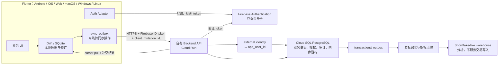

# 正式运行 SQL 后端选型研究（2026）

> **2026-07-31 决策更新：**本文保留为 Cloud Run／Cloud SQL 的研究证据，其“Cloud SQL 作为当前默认”已由 [ADR-0097](../adr/0097-use-supabase-postgresql-for-the-initial-stage.md) 取代。当前阶段使用 Supabase PostgreSQL；正式公开生产前再按 Cloud Run、私网、HA、SLA、PITR 和跨云连接条件复审 Cloud SQL。

> 调研日期：2026-07-21
>
> 状态：架构建议，供后续 ADR 与实施 Issue 使用；不是采购承诺
>
> 资料范围：只采用厂商官方文档、官方产品页与 PostgreSQL/MySQL/Snowflake 官方文档

## 1. 结论先行

本项目当前最稳妥的正式主线是：

**六平台 Flutter 客户端 → 自有 HTTPS Backend API（优先 Cloud Run）→ Cloud SQL for PostgreSQL**，同时保持以下边界：

- Flutter 继续以 Drift/SQLite 作为离线优先的本地数据层，并用 `sync_outbox` 保存待同步操作；
- Firebase Authentication **只负责证明“你是谁”**；
- Backend 验证 Firebase ID token，并把可信的外部身份 `(issuer, subject)` 映射成内部 `app_user_id`；
- 项目成员资格、角色、能力、数据访问授权、撤权和审计都由应用 PostgreSQL 管理；
- 每次业务写入、审计记录和待发送的服务端 outbox 在同一数据库事务内提交；
- 将来只把去标识化、适合统计的事实传入 Snowflake 一类分析仓库，不让分析仓库承担 App 的日常交易写入。

这是本报告的**默认推荐**，不是说 Google Cloud 在所有情形下都最便宜，而是它目前最完整地同时满足六个平台、离线同步、Firebase 身份边界、可读 SQL、应用自主管理授权以及以后替换基础设施的需要。

第二选择是：保留同一个自有 Backend API，把 PostgreSQL 托管在 Neon；当早期长期空闲、成本极敏感，而且其区域、SLA、合规套餐与跨云延迟都可接受时，它可能比 Cloud SQL 更经济。Supabase 也可仅作为托管 PostgreSQL 使用，但若完全不用 Supabase Auth、Data API 等能力，付费套餐的整体价值通常较低。

目前不建议把 Firebase SQL Connect（原 Data Connect）作为六平台统一数据通道，也不建议把 Snowflake 作为运行时主数据库。两者各有能力，但都没有消除本项目真正困难的部分：离线 mutation outbox、幂等同步、冲突保留、内部授权、审计、兼容旧客户端和六平台一致性。

## 2. 不可动摇的系统边界



这里有三个不同层次的“事实”，不应混为一句模糊的“唯一真相来源”：

1. 尚未联网的本地操作，首先可靠地存在本机 SQLite/outbox 中；不能因为服务器尚未见到它，就假装它不存在。
2. 已同步、需要跨设备或跨成员协作的运行时事实，以 PostgreSQL 中带修订和审计的数据为准。
3. 分析仓库保存的是下游、去标识化、允许延迟的分析投影；它不是编辑业务记录的入口。

### 2.1 为什么任何客户端都不能直接连接 PostgreSQL

“六个平台客户端直接连数据库”表面上省掉 API，实际上会破坏安全和演化能力：

- App 中无法安全保存一个长期数据库密码；被分发的客户端可以被反编译、抓包或自行构造请求。
- Firebase ID token 是给受信后端验证的身份凭据，不是 PostgreSQL 连接凭据。官方流程也是客户端通过 HTTPS 把 ID token 交给后端，再由后端验证签名、有效期、`aud`、`iss` 和 `sub`。[Firebase：验证 ID token](https://firebase.google.com/docs/auth/admin/verify-id-tokens)
- 即使数据库启用 Row-Level Security，客户端直连仍不能自然解决离线幂等、冲突副本、旧版 App 兼容、限流、业务级审计、撤权传播和跨多表事务不变量。
- 数据库 schema 一旦改变，旧客户端可能立即失效；API 可以在数据库迁移期间继续保留旧 contract，并使用 expand → migrate → contract 的兼容迁移。
- Snowflake 或 PostgreSQL 凭据一旦进入客户端，就无法保证只执行预期查询，也无法可靠阻止对个人数据的横向读取。
- 统一 HTTPS API 能用 Dart 的跨平台 HTTP 客户端覆盖六个平台；官方 `http` package 列出 Android、iOS、Linux、macOS、Web 和 Windows 支持。[Dart `http` package](https://pub.dev/packages/http)

这不意味着所有 Backend 都必须手写。Firebase SQL Connect 本身也是一道托管 API，而不是把 PostgreSQL 密码发给 App；本报告不选择它的原因是平台与领域能力边界，而不是把它误称为数据库裸连。

## 3. 评估标准

本次选型按已经确认的需求评估，而不是只比较数据库跑分：

| 标准 | 本项目的具体含义 |
|---|---|
| 六平台一致 | Android、iOS、Web、macOS、Windows、Linux 都是一等公民；不能把桌面端长期当作“也许能编译” |
| 离线优先 | Drift/SQLite、持久化 mutation outbox、幂等重试、cursor pull、冲突副本和修订历史都能由项目控制 |
| 身份与授权分离 | Firebase Auth 只出具身份；`app_user_id`、项目权限、撤权和审计归应用 SQL |
| 可学习的 SQL | migration、约束、JOIN、统计查询和测试保留为人能阅读的 SQL，并配中文说明 |
| 可演化 | 旧 App 离线数周后仍可同步；数据库、API、客户端 schema 可以分别升级 |
| 隐私与分析 | 运行库保存必要业务数据；仓库只接收去标识化事实，并在汇总输出执行匿名阈值 |
| 运维与成本 | 不只看免费层，也看固定数据库底价、HA、备份、连接数、出站流量、合规与人工维护 |
| 可迁移性 | API contract 和 PostgreSQL SQL 尽量不绑定某一家 BaaS；未来可换托管商而不重写 Flutter 业务层 |

## 4. 方案横向比较

| 方案 | 六平台统一入口 | 离线同步与冲突 | 真实 SQL 学习 | 身份/授权边界 | 成本形态 | 主要判断 |
|---|---|---|---|---|---|---|
| **Cloud Run + Cloud SQL PostgreSQL** | 是，HTTPS API | 完全可控 | 最直接 | 最清晰 | Cloud Run 用量费 + Cloud SQL 持续固定成本 | **默认推荐** |
| **自有 API + Neon PostgreSQL** | 是，HTTPS API | 完全可控 | 直接 | 清晰 | 可缩零；计算、存储、历史与网络按套餐/用量 | 低流量备选，先验证区域、SLA、合规和跨云延迟 |
| **自有 API + Supabase PostgreSQL（不用其 Auth）** | 是，HTTPS API | 完全可控 | 直接 | 清晰，但须刻意绕开其客户端 BaaS 路径 | Free 或从 Pro 套餐起，另有算力/磁盘/备份增项 | 可行，但可能为未使用的套件能力付费 |
| **Firebase SQL Connect** | **否：官方 Flutter 产品矩阵未覆盖六平台** | 只有 query cache 不能替代项目 outbox | GraphQL-first；Native SQL 仍 Preview | 可用 `@auth`，但易与应用 SQL 权限分成两套 | operation 费 + 同一 Cloud SQL 固定成本 | 暂不作为主线；以后重新验证 |
| **Snowflake / Hybrid Tables** | 仍需自有 API | 仍需自行实现 | SQL 强，但产品目标偏分析 | 仍需自行实现 | 仓库存储 + warehouse compute，Hybrid storage 较高 | 作为下游仓库，不作 App 主库 |

## 5. 推荐方案：Cloud Run + Cloud SQL for PostgreSQL

### 5.1 身份请求的完整路径

1. Flutter 通过一个项目自有的 `AuthAdapter` 登录 Firebase Authentication。
2. 客户端取得短期 Firebase ID token，并通过 HTTPS `Authorization: Bearer …` 调用 Backend。
3. Backend 使用 Firebase Admin SDK 验证 token；普通 `verifyIdToken()` 不会自动检查撤销，如需撤销检查必须显式启用，而且会增加一次远端检查。[Firebase：管理会话与撤销](https://firebase.google.com/docs/auth/admin/manage-sessions)
4. Backend 只接受验证后 token 的 issuer/project 与 subject/uid，不接受客户端自报的 `app_user_id`。
5. PostgreSQL 以类似 `(auth_provider, issuer, subject)` 的唯一键查找或创建内部 `app_user_id`。
6. Backend 再查询应用自己的项目成员资格、capability、作用域和撤权状态，随后才执行业务操作。
7. 业务写入、审计和 server outbox 在同一 PostgreSQL transaction 中提交。

ID token 通常约一小时到期，客户端使用 refresh token 换取新 token；删除、禁用用户或重大账号变化会使 refresh token 失效，管理员也可以主动撤销。[Firebase：管理用户会话](https://firebase.google.com/docs/auth/admin/manage-sessions)

撤销检查不必粗暴地对每个低风险读请求都增加网络往返。可在敏感写入、权限租约续期、账号状态变化以及一定时间间隔的会话检查点执行；具体时限必须成为可测试的安全策略，而不能散落在 controller 中。

### 5.2 六平台下 Firebase Authentication 本身仍有一个阻塞项

数据库选型并没有自动解决 Flutter Auth 的平台缺口。Firebase 官方 Flutter 插件矩阵把 macOS、Windows 的部分支持标为 beta，并说明 Windows 上的 Firebase 不用于生产；Linux 没有列入 Firebase Auth Flutter 支持。Firebase Auth REST API 是官方跨语言接口，但若用它补 Linux，就需要项目自己负责安全存储、token 刷新、错误映射以及各登录方式的完整流程。[Firebase Flutter 支持矩阵](https://firebase.google.com/docs/flutter/setup) [Firebase Auth REST API](https://firebase.google.com/docs/reference/rest/auth)

因此，在承诺“六平台正式上线”之前必须做一个真实的 Auth spike：先确定首发登录方式，再验证 Android、iOS、Web、macOS、Windows、Linux 的注册、登录、刷新、注销、禁用和离线恢复。若 Linux 采用 REST adapter，它必须与其他平台共用同一应用级 `AuthAdapter` contract，不能把 Firebase SDK 类型渗透进业务层。

本地单元测试可继续使用隔离 fake auth；端到端 wiring 使用 Firebase Auth Emulator。Flutter 可调用 `useAuthEmulator()`；服务端设置 `FIREBASE_AUTH_EMULATOR_HOST` 后 Admin SDK 会接受 emulator token，但官方明确警告生产环境绝不能设置该变量。[Firebase：连接 Auth Emulator](https://firebase.google.com/docs/emulator-suite/connect_auth)

### 5.3 Cloud Run 与 Cloud SQL 的连接方式

Cloud Run 的服务账号获得最小必要的 `Cloud SQL Client` 权限，Backend 通过 Cloud SQL connector、内置 Auth Proxy/Unix socket 或私有 IP 连接 PostgreSQL；数据库凭据永远不进入 Flutter。Google 的 Cloud SQL Language Connectors 当前官方覆盖 Java、Python、Go 和 Node.js，并提供加密、IAM 授权及自动 IAM database authentication。[Cloud Run 连接 Cloud SQL](https://cloud.google.com/sql/docs/postgres/connect-run) [Cloud SQL Language Connectors](https://cloud.google.com/sql/docs/postgres/connect-connectors)

Backend 语言因此也是架构选择：

- Node.js/TypeScript、Go、Java、Python 都有官方 Firebase Admin token 验证路径；
- Dart 可复用 Flutter 团队的语言知识，但 Firebase 没有官方 Dart Admin SDK。官方允许按 JWT 规则自行验证 token，不过这把安全更新和边界测试责任交给项目自己。[Firebase：验证 ID token](https://firebase.google.com/docs/auth/admin/verify-id-tokens)

除非“全栈只用 Dart”本身是硬要求，首版 Backend 更适合在 Node.js/TypeScript 与 Go 中二选一。Flutter/SQL 的学习目标不要求服务器也必须用 Dart。

### 5.4 连接池与扩缩容

Cloud Run 默认按请求、CPU 和并发自动扩缩，无流量时可以缩到零；设置 maximum instances 可以保护数据库，但官方提醒在流量尖峰、部署、多 revision 或维护期间可能短暂超过该值。[Cloud Run autoscaling](https://cloud.google.com/run/docs/about-instance-autoscaling) [Cloud Run 最大实例数](https://cloud.google.com/run/docs/configuring/max-instances)

每个 Cloud Run container instance 最多可对 Cloud SQL 建立 100 个连接，总连接数会随实例数增长。应用应在实例级初始化并复用小连接池，不应每个请求新建连接。[Cloud Run 连接 Cloud SQL](https://cloud.google.com/sql/docs/postgres/connect-run) [Cloud SQL：管理连接](https://cloud.google.com/sql/docs/postgres/manage-connections)

容量不能用简单的“每实例可开 100”来设计，而应保守估算：

```text
最坏连接需求 ≈ 同时活动的 revisions × 可能实例数 × 每实例 pool 上限
              + migration / 管理连接
              + 故障与部署余量
```

首版建议：

- alpha 阶段 `min-instances = 0`，接受偶发冷启动以降低 Cloud Run 空闲成本；
- 每实例使用很小的 pool，并让 HTTP 并发不超过数据库实际承受能力；
- 设置 Cloud Run maximum instances，但在数据库容量中为官方说明的临时超额留余量；
- 用真实的批量同步形态压测，而不是只测单条 CRUD；
- 监控 pool wait、active connections、transaction time、deadlock、API p95/p99 和 sync backlog。

Cloud SQL 也有 Managed Connection Pooling，但它仅适用于 Enterprise Plus，默认 transaction pooling 还限制部分 session 级 SQL 功能，因此不应把它写进低成本首版的必要条件。[Cloud SQL Managed Connection Pooling](https://cloud.google.com/sql/docs/postgres/managed-connection-pooling)

### 5.5 区域、高可用、备份与合规

Cloud SQL 实例创建时选择区域，之后不能直接修改；Google 建议计算与数据库放在同一区域以降低延迟。因此 Cloud Run、Cloud SQL、对象存储和任务队列应优先同区，跨区灾备另行设计。[Cloud SQL locations](https://cloud.google.com/sql/docs/postgres/locations)

Cloud SQL regional HA 在同一区域两个 zone 间同步写入 primary/standby，官方说明 failover 通常会有约 60 秒不可用窗口；HA 成本约为 standalone 的两倍，因为 CPU、RAM 和 storage 都有冗余。[Cloud SQL 高可用](https://cloud.google.com/sql/docs/postgres/high-availability)

合理的分期是：

- 本地与临时测试：本地 PostgreSQL，不依赖云数据库；
- 内部 alpha：可用单区小实例，但必须明确它不是生产级可靠性；
- 真正承载用户数据前：按明确的 RTO/RPO 决定 regional HA、PITR、自动备份、删除保护和恢复演练，而不是只勾选“有备份”。

Google 列出 Cloud Run 与 Cloud SQL 等服务可纳入其 HIPAA BAA 覆盖范围，但这不代表使用这些服务就自动合规；数据模型、日志、权限、密钥、区域和操作流程仍是客户责任。[Google Cloud HIPAA compliance](https://cloud.google.com/security/compliance/hipaa)

还要单独注意：Firebase Authentication 没有供项目选择的数据处理区域。Firebase 的隐私说明指出，没有 location selection 的服务可能在 Google 或其代理运营设施所在地处理和存储数据。因此，如果将来有严格的数据驻留要求，不能只因为 Cloud SQL 选了某一区域就宣布整个身份链路满足驻留要求。[Firebase privacy](https://firebase.google.com/support/privacy)

### 5.6 成本结构

Cloud Run 可以按请求用量计费并缩到零；设置 minimum instances 会产生空闲成本。官方价格页还提供按 billing mode 区分的月度免费用量，但免费额度、区域系数与出站流量规则应在部署时重新核对。[Cloud Run pricing](https://cloud.google.com/run/pricing) [Cloud Run billing settings](https://cloud.google.com/run/docs/configuring/billing-settings)

Cloud SQL 不会因为 Cloud Run 缩到零而停止计费。只要实例运行，就持续按 CPU、内存、存储、备份和网络计费；HA、read replica 和更高规格会增加成本。[Cloud SQL pricing](https://cloud.google.com/sql/pricing)

因此小规模 App 的成本底座通常是数据库，而不是 API。Cloud SQL 的 shared-core `db-f1-micro` / `db-g1-small` 面向开发测试，没有 SLA，不应因价格低就直接当作正式生产规格。[Cloud SQL instance settings](https://cloud.google.com/sql/docs/postgres/instance-settings)

### 5.7 Migration 与本地测试

数据库 migration 应是源码中经过 review 的、有序纯 SQL 文件，由一次性 migration job 执行；不能让每个 Cloud Run 实例在启动时竞争执行 DDL。Google 官方支持从 Cloud Build 连接 Cloud SQL 并运行 schema migration 代码。[Cloud Build 连接 Cloud SQL](https://cloud.google.com/sql/docs/postgres/connect-build)

推荐流程：

1. 本地 PostgreSQL container 从空库执行全部 migration；
2. 用固定 synthetic fixtures 跑 SQL contract、权限、审计、同步与指标测试；
3. CI 再从旧版本快照执行 forward migration，验证旧数据；
4. 部署兼容旧 schema 与新 schema 的 Backend；
5. staging 运行 migration、回填和回滚演练；
6. production 由单次受控 job 执行；
7. 等旧客户端退出兼容窗口后，才执行 contract/drop。

Drift/SQLite schema version、Backend API version 与 PostgreSQL migration version 必须分别记录。旧客户端可能离线很久，不能假定三者永远同步升级。破坏性更改应采用 expand → backfill/migrate → contract，并为旧 mutation payload 保留明确的转换或拒绝策略。

## 6. 备选方案一：自有 API + Neon PostgreSQL

这里的“选择 Neon”只表示让 Neon 托管 PostgreSQL。Flutter 仍只调用自有 Backend API；不在客户端放 Neon connection string，也不采用 Neon Auth 或其他会改变身份边界的服务。

Neon 把 compute 与 storage 分离，空闲 compute 可在约五分钟后 scale to zero，唤醒通常是数百毫秒级；Free tier 固定启用 scale-to-zero，付费层可以调整。[Neon architecture](https://neon.com/docs/introduction/architecture-overview) [Neon scale to zero](https://neon.com/docs/introduction/scale-to-zero)

Neon 的 pooled connection 使用 PgBouncer transaction pooling。它能承接大量客户端连接，但不是同量的并发事务，而且 session 级功能受到限制；migration、`pg_dump` 等操作应使用 direct connection。[Neon connection pooling](https://neon.com/docs/connect/connection-pooling)

截至本报告日期，官方价格页列出：

- Free：$0，约 100 CU-hours/project/month、0.5 GB/project，并在空闲后缩零；
- Launch：用量价约 $0.106/CU-hour、$0.35/GB-month，官方示例典型约 $15/月；
- Scale：约 $0.222/CU-hour，并提供更高等级的 SLA、合规和网络能力。

实际费用还受 compute size/active time、storage、历史恢复窗口、branches 和 egress 影响，数字必须在采购前按官方页面重新核对。[Neon pricing](https://neon.com/pricing)

Neon 当前区域覆盖 AWS 与 Azure 的若干美国、欧洲、亚太和南美区域；项目创建后区域不可原地更改，迁区需要新建项目再迁移。[Neon regions](https://neon.com/docs/introduction/regions)

它的优势是早期长期空闲时固定成本可能更低、标准 PostgreSQL 可迁移、database branch 适合 migration/E2E 测试。风险是：

- 若 Backend 在 Google Cloud 而数据库在 AWS/Azure，会增加跨云延迟、故障边界和可能的 egress；
- scale-to-zero 唤醒会叠加到第一次同步的延迟；
- 合规报告、private networking、SLA 等能力与套餐有关，不能把 Free tier 的技术可用等同于生产承诺；
- 区域少于 Google Cloud，必须先确认目标用户、驻留和灾备要求。

**何时反转默认建议：**完成真实同步压测后，如果 Cloud SQL 的固定底价明显成为早期负担，而 Neon 的目标区域、付费 SLA、备份恢复、合规与跨云网络都通过验收，可把 Neon 升为正式主库。由于 API 和 SQL migration 都由本项目拥有，这种替换不需要重写 Flutter 领域层。

## 7. 备选方案二：自有 API + Supabase PostgreSQL（DB-only）

Supabase 为每个项目提供完整 PostgreSQL，而不是私有数据库方言。[Supabase database overview](https://supabase.com/docs/guides/database/overview)

本项目若采用它，应明确：

- 只把 Supabase 当托管 PostgreSQL；
- 不采用 Supabase Auth，Firebase Authentication 仍是唯一身份提供方；
- Flutter 不直接调用 Supabase Data API，也不持有 `service_role` key；
- 自有 API 验证 Firebase token，再使用服务端数据库连接执行授权、审计和同步事务。

Supabase 官方文档明确说明 service key 可绕过 RLS，绝不能暴露给客户；这也再次说明 DB/BaaS 管理密钥不能进 Flutter。[Supabase Row Level Security](https://supabase.com/docs/guides/database/postgres/row-level-security)

持久 Backend 可使用 direct connection；serverless/短连接可用 Supavisor transaction pooler，但 transaction mode 不支持 prepared statements 等 session 相关特性，migration 应走 direct connection。[Supabase：连接 PostgreSQL](https://supabase.com/docs/guides/database/connecting-to-postgres)

截至本报告日期，官方价格页列出：

- Free：2 个 active projects、500 MB database、5 GB egress，长期不活跃项目可能暂停；
- Pro：从 $25/月起，并含可抵扣一个 Micro compute 的 compute credit；
- PITR、更长备份、额外 compute/disk/IOPS、Team/Enterprise 管理与合规能力另有成本。

具体额度和增项必须在采购前重查。[Supabase pricing](https://supabase.com/pricing) [Supabase compute and disk](https://supabase.com/docs/guides/platform/compute-and-disk)

Supabase 提供多个 AWS 区域；数据区域在建项目时选择。[Supabase regions](https://supabase.com/docs/guides/platform/regions) SOC 2 与 HIPAA 仍遵循 shared responsibility，HIPAA 需要符合条件的套餐、BAA 与相应 add-on，不能只凭产品名称判断。[Supabase SOC 2](https://supabase.com/docs/guides/security/soc-2-compliance) [Supabase HIPAA](https://supabase.com/docs/guides/security/hipaa-compliance)

其 CLI 支持本地 Docker stack、版本化 SQL migration、`db reset` 与 `db push`，学习和测试路径良好。[Supabase local development](https://supabase.com/docs/guides/local-development/overview)

Supabase DB-only 在技术上完全可行；主要问题不是能力不足，而是项目已决定不用它的 Auth 和客户端 Data API，可能无法充分利用套餐价值。若团队未来需要 Supabase 的控制台、分支、备份或运维体验，这个结论可以改变。

## 8. 为什么目前不选 Firebase SQL Connect

Firebase Data Connect 已在 2026 年 4 月更名为 **Firebase SQL Connect** 并 GA；既有 API 与集成名称继续兼容。[Firebase release notes](https://firebase.google.com/support/releases) 它由托管 SQL Connect service 与 Cloud SQL for PostgreSQL 组成：开发者用 GraphQL 定义 schema、预部署 query/mutation，Firebase 生成 type-safe client SDK，客户端不能提交任意 SQL。[Firebase SQL Connect overview](https://firebase.google.com/docs/sql-connect)

这是一个真实且有吸引力的产品，但与本项目当前硬约束存在四个冲突。

### 8.1 官方六平台支持未闭合

FlutterFire 官方支持矩阵把 SQL Connect/Data Connect 标为 Android、iOS、Web 支持，macOS 与 Windows 不适用，Linux 未列；Firebase Flutter 页面也没有给出六平台生产支持，并明确提示 Windows Firebase 不用于生产。[FlutterFire official repository](https://github.com/firebase/flutterfire) [Firebase Flutter setup](https://firebase.google.com/docs/flutter/setup)

包元数据能在某个平台解析或编译，不等于产品团队对该平台作出生产支持承诺。既然本项目把六个平台都定义为一等公民，就必须按官方产品矩阵，而不是按“似乎可以跑”做架构承诺。

### 8.2 Cache 不等于 offline-first sync

SQL Connect Flutter SDK 的 client-side cache 可以离线读取已经缓存的 query response；官方说明 Android/iOS 可使用 persistent storage，而 Web 只有 memory cache。[SQL Connect Flutter SDK caching](https://firebase.google.com/docs/sql-connect/flutter-sdk#enable_client-side_caching)

官方没有把它描述为持久化 mutation outbox、幂等重试、冲突副本、提交修订或跨设备 cursor sync。因此它不能替换本项目的 Drift/SQLite 和 `sync_outbox`。即使采用 SQL Connect，仍要自行实现这些领域语义。

### 8.3 标准路径不是“持续学习真实 SQL”

SQL Connect 的标准开发路径是 GraphQL schema、query 和 mutation，再由服务生成数据库操作。它能简化客户端调用，但日常代码不再直接展示全部 SQL。[SQL Connect overview](https://firebase.google.com/docs/sql-connect)

产品已有 Native SQL，可以表达复杂 JOIN、window function 和 stored procedure，但官方仍将其标为 Preview：没有正式 SLA/deprecation policy，可能出现不兼容变化，DDL 仍走 schema 流程。[SQL Connect Native SQL](https://firebase.google.com/docs/sql-connect/native-sql)

对于“正式业务代码就是 Flutter 与 SQL 教材”的目标，自有 API + 版本化 PostgreSQL SQL 更直接，也更容易让同一条查询接受解释、fixture 与回归测试。

### 8.4 它没有消除 schema 与旧客户端兼容问题

SQL Connect 提供 `dataconnect:sql:diff` 与 `dataconnect:sql:migrate`。`COMPATIBLE` 模式保留应用 schema 未引用的结构；`STRICT` 模式要求数据库完全匹配，可能删除未使用 table/column。官方也提醒 connector 变化可能破坏已发布旧客户端，破坏性 migration 删除的数据不能靠重新部署旧代码恢复。[SQL Connect schema and connector management](https://firebase.google.com/docs/sql-connect/manage-schemas-and-connectors)

这些工具很好，但不能替项目决定兼容窗口、回填、离线旧 mutation 和数据恢复。对于已有数据库，SQL Connect 也可不取得 schema ownership，仅获得表的 read/write 权限；这反而说明自有 migration 仍是合理选择。[SQL Connect CLI reference](https://firebase.google.com/docs/sql-connect/cli-reference)

### 8.5 成本与本地测试

SQL Connect 有两部分费用：service operation 与关联的 Cloud SQL PostgreSQL。Blaze 方案每月前 250,000 client operations 免费，之后官方列价为 $0.90/million；前 10 GiB/月 network egress 免费。Cloud SQL 仍单独计费，官方页面给出的最低起点约 $9.37/月，具体随区域与配置变化。[SQL Connect pricing](https://firebase.google.com/docs/sql-connect/pricing)

Spark trial 只有 90 天，并限制每日约 8,000 operations 与约 330 MiB egress；到期不升级会归档并最终删除，不能视为正式生产永久免费层。[SQL Connect pricing](https://firebase.google.com/docs/sql-connect/pricing)

本地 emulator 使用 PGLite，适合交互和 CI，但官方提醒其 PostgreSQL 版本与配置可能不同于生产 Cloud SQL。因此关键 SQL 与 migration 仍需在真实 PostgreSQL integration test 中验证。[SQL Connect emulator](https://firebase.google.com/docs/sql-connect/data-connect-emulator-suite)

**重新评估条件：**未来官方正式补齐 macOS、Windows、Linux；Native SQL GA；并用 PoC 证明既有 Drift outbox、冲突策略、内部权限与审计不需要被迫维护两套规则。到那时 SQL Connect 可能成为减少 API 样板代码的合理选择。

## 9. 为什么 Snowflake 不作交易主库

不能简单说“Snowflake 不能做 transaction”。Snowflake 已有 Hybrid Tables，采用 row store、row locking，并强制 primary/foreign key，目标就是低延迟 point read/write 和轻量 transactional workload。[Snowflake Hybrid Tables](https://docs.snowflake.com/en/user-guide/tables-hybrid)

但这不使它成为本 App 的默认主库：

- Snowflake standard tables 以 columnar micro-partitions 和大型分析为主，primary/foreign key 通常不强制；[Snowflake constraints](https://docs.snowflake.com/en/sql-reference/constraints)
- Hybrid Tables 当前有约 2 TB/database、约 16,000 ops/sec 的限制，并缺少 replication、Fail-safe、streams、Snowpipe/Snowpipe Streaming、materialized views、dynamic tables、`UNDROP` 等能力；
- Hybrid Tables 仅在 AWS/Azure commercial regions 提供，不在 GCP，也不在 trial account；
- 它仍不能替代 Firebase token 验证、`app_user_id` 映射、离线幂等与客户端版本兼容；
- Hybrid row storage 高于 standard table，此外还要支付 virtual warehouse compute。[Snowflake Hybrid Tables limitations](https://docs.snowflake.com/en/user-guide/tables-hybrid-limitations) [Snowflake Hybrid Tables cost](https://docs.snowflake.com/en/user-guide/tables-hybrid-cost)

截至 2026-03-01，Snowflake 已取消 Hybrid Tables 单独的 request-based billing，但 storage 与 virtual warehouse compute 仍存在。[Snowflake 2026 pricing change](https://docs.snowflake.com/en/release-notes/2026/other/2026-03-02-hybrid-tables-pricing)

因此正确边界是：PostgreSQL 负责小事务、一致性、授权、审计和同步；server outbox 以 batch 或事件方式输出去标识化事实；Snowflake-like warehouse 负责跨项目、跨时间的大规模统计。首版可以接受 24 小时内批处理，只有业务证明需要更低延迟时才引入 CDC。

进入仓库前应剔除姓名、联系方式、自由文本、私人反思等不必要信息，使用稳定但不可逆回查个人的分析 surrogate key。匿名汇总继续执行已经确认的最小样本阈值 `k = 10`，并让每个指标文档明确：计数单位、去重键、分子、分母、时间窗、时区、空值和修订/撤销处理。这样统计代码、数学口径与隐私规则才能一起回归测试。

## 10. PostgreSQL 与 MySQL：为何推荐前者，但不贬低后者

MySQL InnoDB 同样支持 ACID transaction；MySQL 8.4 也有原生 JSON、recursive CTE 与 CHECK constraints。它不是“不够现代”的数据库。[MySQL InnoDB and ACID](https://dev.mysql.com/doc/refman/8.4/en/mysql-acid.html) [MySQL JSON](https://dev.mysql.com/doc/refman/8.4/en/json.html) [MySQL CTE](https://dev.mysql.com/doc/refman/8.4/en/with.html) [MySQL CHECK constraints](https://dev.mysql.com/doc/refman/8.4/en/create-table-check-constraints.html)

本项目选 PostgreSQL 是具体适配度判断：

- PostgreSQL 原生 Row-Level Security 可以作为 Backend 授权之外的 defense in depth；启用后若没有适用 policy 默认拒绝，但 table owner/superuser 的绕过行为必须测试。[PostgreSQL Row Security](https://www.postgresql.org/docs/current/ddl-rowsecurity.html)
- `jsonb` 可以索引，适合保存受控制的问卷配置或扩展 metadata；稳定核心字段仍应使用正常关系列与约束。[PostgreSQL JSON types](https://www.postgresql.org/docs/current/datatype-json.html)
- partial index 很适合只索引 active、未撤销或待同步记录，减少索引体积；[PostgreSQL partial indexes](https://www.postgresql.org/docs/current/indexes-partial.html)
- recursive CTE 适合项目已经确认的唯一父级严格区域树；[PostgreSQL WITH / recursive queries](https://www.postgresql.org/docs/current/queries-with.html)
- 本报告比较的 Cloud SQL、Neon、Supabase 与 SQL Connect 都直接支持 PostgreSQL，迁移选择较多。

如果未来团队已有深厚 MySQL 运维能力、现成 schema 或显著的供应商/价格优势，MySQL 仍是合理候选；但没有这类反向证据时，PostgreSQL 的一致工具链与上述特性让它成为更低摩擦的默认项。

## 11. 费用快照与免费层误区

以下是 **2026-07-21 调研快照**，仅用于理解成本结构。区域、税费、承诺折扣、备份、网络与厂商改价都会改变实际账单；进入采购前必须重新打开官方计算器/价格页。

| 项目 | 免费/试用现状 | 主要成本驱动 | 结论 |
|---|---|---|---|
| Cloud Run | 官方价格页按 billing mode 给月度免费用量；可缩零 | vCPU、memory、requests、启动/处理时间、min instances、egress | 低流量 API 可很低，但不是后端全部成本 |
| Cloud SQL | 不应假定有永久 always-free；新用户信用额度不是生产承诺 | 持续 CPU/RAM、storage、backup、network、HA/replica | 通常是 Google 方案的固定成本底座 |
| Firebase Auth / Identity Platform | Tier 1 常规 provider 前 50,000 MAU 免费；phone/MFA SMS 单独计费 | MAU、provider 类型、SMS、MFA | 登录方式会显著改变费用；不要把短信登录当免费 |
| Neon | Free $0；约 100 CU-hours/project/month、0.5 GB/project | active compute、compute size、storage、history、branches、egress | 最有利于长期空闲的早期环境，但生产能力看套餐 |
| Supabase | Free 2 projects、500 MB DB、5 GB egress；Pro 从 $25/月 | compute、disk/IOPS、egress、backup/PITR、合规套餐 | DB-only 可行，需判断套件价值 |
| SQL Connect | 90-day Spark trial；Blaze 每月 250k operations 免费 | operation、egress + Cloud SQL 持续成本 | 免费 operations 不等于免费数据库 |
| Snowflake | 不以本项目所需的交易主库免费层为决策基础 | storage、warehouse compute、data transfer、服务等级 | 以后按分析规模单独采购 |

Cloud SQL 未列入 Google Cloud always-free 产品表；新账户可能有期限和金额受限的信用额度，但不应据此设计长期生产成本。[Google Cloud Free Program](https://cloud.google.com/free/docs/free-cloud-features)

采用 Identity Platform 的 Tier 1 时，email/password、anonymous、social 等常规 provider 前 50,000 MAU 免费，超过后分阶梯；phone 与 MFA 按发送短信收费，OIDC/SAML 的免费额度更低。[Identity Platform pricing](https://cloud.google.com/identity-platform/pricing)

## 12. 推荐的实现与验证顺序

### 第 0 阶段：先消除会推翻架构的未知数

- 确认首发登录方式，并完成六平台 Firebase Auth spike，尤其是 Linux 与 Windows 生产边界；
- 确认首发国家/区域、是否涉及 HIPAA 或其他受监管数据、Cloud SQL/Auth 各自的数据驻留要求；
- 盘点现有 App 是否已经有不可丢弃的真实本地数据；这决定是 reset、自动 migration 还是迁移向导；
- 给出 MAU、同步频率、每批 mutation 大小、峰值并发、RTO、RPO 和月预算的数量级。

### 第 1 阶段：本地 vertical slice

- Flutter：Drift/SQLite + `sync_outbox`；
- Auth：unit test 使用 fake，wiring test 使用 Auth Emulator；
- Backend：本地运行，验证 token 后映射 `app_user_id`；
- PostgreSQL：本地 container，从空库执行版本化 SQL migration；
- API：只做一条完整 push/pull vertical slice，而不是先铺满 CRUD；
- 同一 fixture 验证 SQLite 结果、PostgreSQL SQL 与指标输出。

### 第 2 阶段：把同步不变量做成数据库与测试

每个客户端 mutation 带不可变 `client_mutation_id`；PostgreSQL 用 unique constraint 保证幂等。一次 transaction 中完成：

1. 验证用户和项目 capability；
2. 检查 base revision；
3. 写入业务 revision；
4. 写入审计；
5. 写入 server outbox；
6. 返回 server revision/cursor。

发生并发冲突时保留双方事实或生成明确 conflict copy，不使用静默 last-write-wins。重试同一个 mutation 只能返回原结果，不能重复计数。

### 第 3 阶段：Google Cloud staging

- Cloud Run 与 Cloud SQL 同区；
- 最小 IAM、Secret Manager/connector、TLS，不使用客户端数据库密钥；
- 小 pool + maximum instances + 容量余量；
- migration job 与服务启动分离；
- 用真实离线批量进行 load test、断网重试、重复请求、token 过期/撤销、权限撤销与恢复演练；
- 将 Cloud SQL 与 Neon 的同一 workload 成本和 p95/p99 做一次实测，再锁定生产托管商。

### 第 4 阶段：生产门槛

- 根据 RTO/RPO 决定 HA、PITR、备份保留和跨区恢复；
- 完成删除保护、restore drill、migration rollback/forward-fix 演练；
- 对 audit/outbox、权限变更、异常同步 backlog 和数据库连接建立告警；
- 仓库导出只包含批准的去标识字段，并为匿名阈值 `k = 10` 写自动测试；
- 发布旧客户端兼容政策和 schema deprecation 窗口。

## 13. 怎样让正式代码同时成为 Flutter 与 SQL 教材

不需要维护一套与真实 App 脱节的教学 Demo。正式代码可采用以下规则：

- migration 保留为有序 `.sql` 文件，每个文件用中文说明目的、前置条件、锁表/回填风险和恢复方案；
- 重要 query 保留为命名 SQL，而不是完全藏在 ORM/query builder 后面；
- 每个参数说明来源、单位、nullable 语义和安全边界；
- JOIN、recursive CTE、window function、partial index、事务隔离和指标公式各有小型 synthetic fixture；
- SQL 测试同时断言“结果是什么”和“为什么这样计数”，特别覆盖修订、撤销、重复 mutation、时区与空值；
- generated code 与机械样板明确标注来源；人工维护代码以充分中文注释解释意图、不变量与选择理由；
- App 内说明书渲染的 Markdown 只引用经过测试的正式代码片段，复制按钮复制原始代码，不复制行号或展示装饰；
- 每个统计指标记录公式、分子、分母、去重键、时间窗、时区、样本阈值与适用限制，让数学解释和 SQL 实现互相链接。

这样学习路径来自真实系统：Flutter 学状态与离线数据流，SQL 学约束、事务、JOIN、迁移和统计；两者都受同一套自动化测试约束。

## 14. 尚未解决、会影响最终承诺的问题

以下不是研究不足，而是必须由产品或实测提供的新证据：

1. **六平台 Firebase Auth：**首发 provider 是 email/password、magic link、Google/Apple，还是 phone？Linux 是否接受自建 REST adapter？Windows 的官方生产支持缺口如何处理？这是发布阻塞项。
2. **后端语言：**Node.js/TypeScript 与 Go 都有官方 Firebase Admin/Cloud SQL 路径；Dart 学习一致性更高但承担自验 JWT 的安全责任。
3. **数据区域与合规：**首发国家、是否需要 BAA/HIPAA、是否允许 Firebase Auth 的非区域化处理，都可能改变供应商选择。
4. **可靠性目标：**没有明确 RTO/RPO，就无法合理决定单区、regional HA、跨区恢复与相应成本。
5. **规模与费用：**需要真实的同步 batch、并发和数据增长压测；静态价格页不能替代 workload 账单。
6. **历史数据：**现有用户设备上是否已有真实且不可丢数据，将决定 Drift 与服务端 schema 的迁移复杂度。
7. **分析仓库：**Snowflake、BigQuery 或其他仓库应等指标、数据量、区域与预算明确后另选；不能反向绑架运行库设计。
8. **SQL Connect 演进：**其桌面/Linux 支持与 Native SQL 状态可能变化，建议在重要版本节点复查官方矩阵，而不是永久排除。

## 15. 最终决策句

在现有证据下，应以 **Cloud Run 自有 API + Cloud SQL for PostgreSQL** 开始正式 backend vertical slice；用 Firebase Authentication 证明外部身份，用应用 SQL 管理 `app_user_id`、权限、审计与同步，用 Drift/SQLite 保住六平台离线体验，再从 transactional outbox 向 Snowflake-like warehouse 输出去标识化分析事实。

同时保持 API 与 PostgreSQL migration 可移植，并在 staging 用同一 workload 对 Neon 做成本/延迟对照。只有当官方六平台支持与离线领域能力得到实证后，才重新考虑 SQL Connect；Snowflake 则留在它最擅长的位置——分析，而不是每一次 App 点击背后的交易心脏。
