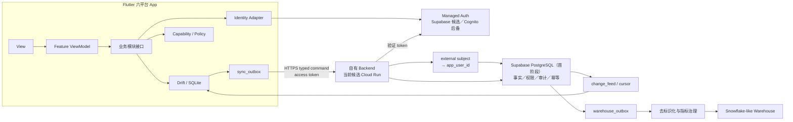

# 同行者 App 目标架构与渐进迁移计划

更新日期：2026-07-31

状态：**研究后的架构依据；已压缩进 [`docs/PRODUCT_SPEC.md`](../PRODUCT_SPEC.md)，尚未进入实施。若两者冲突，以已接受 ADR 和正式 Spec 为准。**

> **2026-07-31 状态更新：**用户已确认当前没有任何用户、任何设备或任何不可丢失的真实 schema v5 数据，因此后续采用“保留只读备份＋初始化新数据库”，不开发旧业务数据迁移向导。用户同时确认以 Supabase Auth 为有条件首选、AWS Cognito 为验证失败时的后备；[ADR-0096](../adr/0096-use-supabase-auth-with-cognito-fallback.md) 已正式取代 ADR-0025。首阶段业务数据库已确认为 Supabase PostgreSQL，但正式公开生产前必须依 [ADR-0097](../adr/0097-use-supabase-postgresql-for-the-initial-stage.md) 复审 Cloud SQL。

本文把已经确认的领域决策、当前代码审计和官方技术资料收敛为一条可以逐步实施的路线。它不是“大重写”计划，也不表示这里列出的所有模块会在第一版同时创建。

相关证据：

- [当前代码差距审计](./current-code-gap-audit.md)
- [正式运行 SQL 后端选型研究](./operational-sql-backend-2026.md)
- [Flutter、Drift 六平台约束研究](./flutter-drift-six-platform-constraints-2026.md)
- [Flutter 六平台托管认证比较](./flutter-auth-provider-comparison-2026.md)
- [Supabase PostgreSQL 与 Cloud SQL 比较](./supabase-postgres-vs-cloud-sql-2026.md)
- [领域词汇表](../../CONTEXT.md)
- [架构决策记录](../adr/)

## 1. 结论先行

建议采用：

> **Feature-first Flutter + 少数深业务模块 + Drift/SQLite 离线事实与 Outbox + 自有模块化单体 Backend + PostgreSQL（首阶段由 Supabase 托管）+ 可替换的托管身份适配层 + 下游去标识化分析仓库。**

其中：

- Flutter 负责界面、设备能力、离线工作流和个人即时反馈；
- Drift/SQLite 负责可靠保存草稿、本地事实、修订、同步状态和可读 SQL；
- 自有 Backend（当前运行位置优先考虑 Cloud Run）负责验证托管认证商签发的 token、内部身份映射、每次业务授权、同步协议和旧客户端兼容；
- PostgreSQL 负责跨设备／成员的运行时事实、能力权限、审计、幂等、冲突与正式统计；
- Snowflake、BigQuery 或类似仓库将来只接收批准的去标识化分析事实，不参与 App 的交易写入；
- 代码按正在交付的垂直切片增长，不先搭一个抽象齐全却没有用户行为的“空架构”。

这套设计刻意不采用：

- 完整 Event Sourcing；
- 微服务和分布式 CQRS；
- 每张表一个 Repository／DAO／UseCase 的机械分层；
- 一个能承载任意 JSON 的万能同步框架；
- 移动端、桌面端或 Web 直连 PostgreSQL／Snowflake；
- 与正式 App 脱节的教学 Demo；
- 继续扩张当前万能 `AppController` 与万能 `ConversationRecord`。

## 2. 事实、推论与建议的边界

### 2.1 已确认事实

- 领域模型已由 `CONTEXT.md` 和 ADR 0001–0095 固定大量关键语义，例如接触独立于推广对象、默认匿名、项目问卷版本化、修订而非覆盖、Outbox 离线同步、匿名阈值 `k = 10`、四个主导航以及生产代码与说明书共同演进。
- 当前 App 可以运行，`dart analyze` 与现有 Widget 测试通过；Flutter、Drift、本地事务、Material 3、双语和六平台工程骨架都可以继续利用。
- 当前 schema v5 与目标模型存在结构冲突：PII、关系阶段、兴趣、心率、备注和接触场次混在同一旧宽表；本地认证使用 MD5；没有项目、问卷、草稿、Outbox、修订、能力权限或可靠统计边界。
- Drift 支持五个原生平台和 Web，但 Web 可能在可靠 OPFS、共享 IndexedDB、不安全多标签页或内存数据库之间降级。
- Firebase Authentication 因无法满足六个平台的正式 Flutter 认证合同而被排除；Supabase Auth 是有条件首选，AWS Cognito 是严格六平台后备。
- 首阶段业务数据库已确认使用 Supabase PostgreSQL；Flutter 仍只调用自有 Backend API，正式公开生产前重新复审 Cloud SQL。

### 2.2 由事实支持的推论

- “现代化”不能等同于换状态管理库或拆小文件；如果 UI、权限、SQL、同步和统计仍共享一个万能对象，耦合只是换了位置。
- 新模型不能安全地由旧字段自动推断。尤其不能用 `roleLevel` 推断能力、用 `teamName` 推断组织／项目、用联系方式推断跟进同意、用接触上的旧阶段值推断 `target × project` 的长期关系。
- 六平台代码和六平台生产认证是两个不同合同。前者已具备可行技术路线，后者必须先通过真实 spike，不能用“包可以解析”代替官方支持和安全验证。
- 为了灵活应对需求变化，最重要的是稳定事实、版本、接口和测试，而不是预先猜出所有未来页面。

### 2.3 本文提出但尚未实施的建议

- Backend 暂建议采用 Node.js/TypeScript，以成熟的 OIDC／JWT／JWKS 与 PostgreSQL 库实现身份验证和 SQL 访问；业务查询和 migration 保留为命名 `.sql`，不让 ORM 隐藏 SQL。
- 第一条生产切片只做匿名接触，不先引入推广对象 PII。
- 新架构采用 typed commands、revision、幂等和 CQRS-lite，但不采用完整 Event Sourcing。
- v5 只保留只读备份和 schema 证据，然后初始化新数据库；不为不存在的真实数据开发复杂迁移向导。

## 3. 三种方案比较与最终取舍

| 方案 | 强项 | 风险 | 取舍 |
| --- | --- | --- | --- |
| 完整 Feature-first MVVM＋深 Repository | 结构清楚、测试边界稳定、模块可长期演进 | 首期容易产生过多目录和样板 | 保留 View/ViewModel、深业务接口和模块化单体；不机械套四层目录 |
| Protocol-first Hexagonal／Command-Event | 离线幂等、冲突、兼容性和因果链清楚 | 容易演化成通用 EventBus／框架工程 | 保留有限 typed command、revision、cursor 和 adapter；拒绝完整 Event Sourcing |
| 极简渐进 Vertical Slice | 少代码、快形成真实闭环、SQL 和行为可见 | 若缺乏护栏，可能再次形成大 Controller | 作为实施节奏；外部依赖、跨切片导入、事务和测试设硬边界 |

最终选择可概括为：

> **外部边界采用 Hexagonal seam，业务内部采用 Feature-first deep module，交付节奏采用最小 vertical slice。**

不是所有类都需要 Interface。只有以下情况才建立 Port：

1. 已经有生产实现与测试实现；
2. 平台确实需要不同实现；
3. 该边界隐藏了复杂失败、权限、事务或同步语义；
4. 删除该接口会迫使复杂度泄漏回多个调用者。

## 4. 目标系统总图



这里没有一句含糊的“唯一真相来源”，而是三个明确状态：

1. **本地尚未同步的用户操作**可靠存在于本机 SQLite 与 Outbox；
2. **已经同步、需要协作的运行时事实**以 PostgreSQL 的当前状态、追加修订和审计为准；
3. **分析仓库数据**是允许延迟、去标识化的下游投影，不接受用户编辑。

## 5. Flutter 端：按用户行为组织，而不是按技术名词堆文件

建议逐步演化到以下顶层结构；只有切片开始实施时才创建对应目录：

```text
lib/
  app/                    # composition root、router、主题、语言
  features/
    current_context/      # 当前空间与项目
    today/                # 私人计划、自我提醒、同步异常
    contacts/             # 草稿、提交、修订、作废、尝试
    questionnaires/       # 问卷定义、版本、回答与规则
    targets/              # 对象、项目关系、跟进事项
    analytics/            # 个人与管理 MetricResult
    manual/               # App 内开发说明书
  platform/               # 身份、位置、通知、安全存储等 Adapter
  data/                   # Drift database factory、migration、共享 SQL 基础
```

每个 Feature 最初只需要足够表达当前行为的文件，例如 View、ViewModel、不可变 state、一个深业务模块和必要模型；不强制为每个 Feature 复制 `presentation/domain/application/infrastructure` 四层。

### 5.1 View 与 ViewModel

- View 只负责布局、动画、简单显示判断和把用户意图交给 ViewModel；
- ViewModel 把业务模块返回的数据组合成不可变 `ViewState`；
- Widget 不执行 SQL、HTTP、认证 SDK、权限或指标公式；
- ViewModel 不暴露 Drift row、认证商 `User` 或 HTTP DTO；
- 每个页面／完整用户功能拥有自己的 ViewModel，不再共享万能全局 Controller。

### 5.2 首批真正有价值的深模块

| 模块 | 小接口应表达什么 | 内部隐藏什么 |
| --- | --- | --- |
| `AppSession` | 登录态、语言、主题、当前空间／项目、当前 capabilities | 认证商类型、设置表、上下文恢复和路由 redirect 输入 |
| `ContactJournal` | 自动保存草稿、提交、修订、作废、观察记录与同步状态 | 多表 SQL、revision、Outbox 原子事务、错误分类 |
| `QuestionnaireCatalog` | 取得绑定版本、验证答案、执行显示规则、明确升级 | 八种题型、五状态、兼容关系和不可变发布版本 |
| `TargetFollowUp` | 取得有权跟进对象、接触关联、项目阶段与后续事项 | PII 隔离、分配权限、关系历史、保留期和匿名化 |
| `MetricRepository` | 返回带版本与口径的 `MetricResult` | SQL、分母／排除项、隐私抑制和数据截止时间 |
| `ManualCatalog` | 目录、章节、版本、代码块与复制内容 | bundled Markdown、snippet manifest、在线／本地版本差异 |

`SyncEngine` 是内部基础模块，不应成为所有页面都要理解的公共 API。页面只观察“仅本机／同步中／失败／冲突／已同步”等稳定状态。

### 5.3 平台 Capability 与 Policy

不要在页面散布 `Platform.isWindows` 或 `kIsWeb`。把分支原因表达为可测试能力，例如：

- `supportsProductionAuth`；
- `supportsReliableLocalPersistence`；
- `supportsSensitiveOfflineCache`；
- `supportsBackgroundSync`；
- `supportsSystemNotifications`；
- `shouldWarnAboutMultipleTabs`；
- `shouldUseNavigationRail`。

Capability 表达设备／运行环境能做什么；Policy 表达产品在该能力下应该怎么处理。平台缺能力时采用明确降级，不改变领域语义：例如不能可靠后台同步时，在前台恢复后 drain Outbox；不能安全离线保存 PII 时，匿名接触仍可离线，对象资料改为联网查看。

## 6. Backend：一个模块化单体，而不是微服务集合

第一阶段只部署一个自有模块化单体 Backend 和一个 Supabase PostgreSQL 数据库。Backend 的当前运行位置仍优先考虑 Cloud Run，但它与 Supabase 之间的跨云连接必须在正式公开生产前通过 ADR-0097 的复审门禁。代码可按业务模块组织：

```text
server/
  app/                    # HTTP、composition root、配置
  identity_bridge/        # 外部 issuer／subject → app_user_id
  access_control/         # membership、capability、授权与审计
  workspaces_projects/
  contacts/
  questionnaires/         # 实际交付问卷时创建
  targets_follow_up/      # 实际交付对象时创建
  regions/                # 实际交付规范区域时创建
  analytics/              # 实际交付正式指标时创建
  db/
    migrations/
    queries/
```

### 6.1 为什么首选 Node.js/TypeScript

- OIDC／JWT／JWKS、PostgreSQL 和 Cloud Run 运行库成熟；
- typed command、JSON Schema/OpenAPI 和稳定错误码容易表达；
- Cloud Run 运行路径成熟；
- 后端仍可用轻量 PostgreSQL driver 执行可读 `.sql`，不需要 ORM 接管模型；
- 可以使用经过维护的标准库验证托管认证商 token，不自行实现密码和签名算法。

Go 是合理的第二选择；如果将来负载、团队能力或运维证据支持，可以在不改变 HTTP contract 与 PostgreSQL schema 的前提下重写 Adapter。Backend 语言仍是可调整建议，不应与某一家认证商绑死。

### 6.2 Backend 的硬边界

- HTTP 层不信任客户端自报的 `app_user_id`、角色、管理员模式或项目权限；
- 托管认证商 token 只产生可信的 issuer／subject；Backend 再映射内部用户并查询 SQL capability；
- 每个受保护操作重新按 workspace、project、对象分配和当前撤权状态授权；
- 管理分析只返回隐私处理后的统计或去身份化异常，不把原始行发到 Flutter 后再隐藏；
- 业务写入、revision、审计、幂等结果、`change_feed` 与 `warehouse_outbox` 尽可能在同一 PostgreSQL transaction 中提交；
- migration 由一次性受控 job 执行，不让每个 Cloud Run 实例启动时竞争 DDL。

## 7. 同步协议：typed command、revision 与 cursor，不是万能 JSON

首版只定义实际使用的命令，例如：

- `contact.submit.v1`；
- `contact.revise.v1`；
- `contact.void.v1`。

每个 command envelope 至少包含：

- `protocol_version`；
- `command_id`／`client_mutation_id`；
- `device_id`；
- `aggregate_id`；
- `base_revision`；
- 稳定 `type`；
- typed payload。

它不包含可被信任的 actor ID。服务端结果使用稳定状态：

- `accepted`：返回 server revision 与 cursor；
- `duplicate`：同一 mutation 返回原结果，不重复写入／计数；
- `conflict`：返回当前 revision 和可解释冲突；
- `rejected`：返回稳定字段错误与是否可重试；
- `forbidden`：权限撤销，并触发相应敏感缓存失效。

Pull 使用不透明 server cursor，不使用客户端时钟排序。客户端在一个 Drift transaction 中幂等应用 change batch，成功后才推进 cursor。

### 7.1 不采用完整 Event Sourcing

系统确实存在 `ContactSubmitted`、`ContactRevisionAppended`、`ContactVoided`、`RelationshipStageChanged` 等事件，但 PostgreSQL 的规范化当前表＋append-only revision 表仍是运行时模型。

原因是完整 Event Sourcing 会额外引入永久 event schema、projection rebuild、事件升级，以及 PII 删除／匿名化和历史权限重放难题。当前规模没有证据证明这些成本值得承担。

采用的是“事件化事务日志”：

- `processed_commands`：幂等；
- revision／stage history：业务历史；
- `audit_events`：安全审计；
- `change_feed`：客户端同步，可有保留期；
- `warehouse_outbox`：去标识化分析出口。

### 7.2 CQRS-lite

写入按 command、不变量、权限和 revision 设计；读取按 view、筛选、统计与性能设计。两者仍共享一个 PostgreSQL，不引入消息总线或第二套 read database。这里的 CQRS 是认知分离，不是分布式基础设施。

## 8. 一次匿名接触的完整事务路径

### 8.1 本地提交

`ContactJournal.submit(draftId)` 在一个 Drift transaction 中：

1. 验证草稿仍绑定明确项目和问卷版本；
2. 验证发生时间、渠道、地点状态、触达人数、必填单次兴趣和问卷答案；
3. 写入不可直接覆盖的接触事实与初始 revision；
4. 把草稿标为 `submitted_pending_sync`；
5. 写入唯一 typed Outbox mutation。

任一写入失败则全部回滚。只有本地事务提交后，界面才显示“已保存”；网络失败只改变同步状态，不删除本地事实。

### 8.2 服务端接受

Backend 在一个 PostgreSQL transaction 中：

1. 验证托管认证商 token 并映射 `app_user_id`；
2. 以 `app_user_id + command_id` 查询幂等结果；
3. 重新验证 project capability、问卷版本和所有核心字段；
4. 检查 aggregate revision；
5. 写入接触、revision、审计、change feed 和 warehouse outbox；
6. 保存 command outcome 并提交。

客户端收到结果后，以另一个本地 transaction 确认 Outbox。它不是跨网络的单一分布式 transaction，而是两个持久事实通过幂等协议连接。

## 9. SQL 分层：三种 SQL，各自可读但不能假装同一种方言

| 层 | 用途 | 教学重点 |
| --- | --- | --- |
| Drift／SQLite SQL | 离线事务、草稿、Outbox、个人即时查询 | transaction、JOIN、索引、迁移、本地时间／空值 |
| PostgreSQL SQL | 权限、正式事实、revision、幂等、管理统计 | constraint、recursive CTE、partial index、锁与隔离、审计 |
| Warehouse SQL | 去标识化趋势、较大规模分析 | 分层模型、窗口函数、快照、隐私和统计口径 |

建议：

- Drift table 定义可继续使用 Dart API；有教学与统计价值的 JOIN／聚合放入按领域命名的 `.drift` 文件；
- PostgreSQL 使用有序 `.sql` migration 和命名查询；
- 不把所有简单 CRUD 改成 raw SQL，也不让 ORM 隐藏重要 SQL；
- 同一个业务指标在不同方言中使用同一 synthetic fixture 对账，而不是强行共享一段 SQL；
- 每条统计 SQL 说明统计单位、去重键、分子、分母、排除项、时区、回答状态、修订和作废处理。

## 10. UI 现代化目标

UI 不以“换颜色”作为现代化，而以信息结构、可恢复状态和能力适配为基础。

### 10.1 稳定主结构

- 四个主目的地：`今日 / 接触 / 对象 / 分析`；
- 持续可见的“空间 → 项目”上下文；
- 窄屏使用 `NavigationBar`，宽屏使用 `NavigationRail`；
- 管理、成员、问卷和项目设置从项目菜单进入；个人设置与说明书从个人菜单进入；
- 使用 `MaterialApp.router + go_router`，让 Web URL、deep link、详情页、说明书章节和浏览器前后退都有稳定语义。

### 10.2 高频接触入口

- “快速记录”是完整接触草稿的渐进披露，不是校验更弱的另一种记录；
- 首屏只呈现项目／问卷版本、时间、渠道、地点或 N/A、触达人数和单次兴趣；
- 问卷、对象关联、跟进和个人反思按需展开；
- 明确显示草稿 `保存中／已保存／仅本机／同步失败／有冲突`；
- 关闭页面、崩溃或切换主导航不丢草稿，可靠性来自 SQL，不来自 Widget 是否还挂载。

### 10.3 视觉与可访问性

- 延续 Material 3，但建立统一 color／type／spacing／shape／motion tokens；
- 复杂页面拆成可复用、可 `const` 的小 Widget，减少无关 rebuild；
- 同时支持触摸、鼠标、键盘、Tab focus、hover、tooltip 和可读的最小点击区域；
- 图表只消费 `MetricResult`，同时提供文本表格、口径说明和样本不足状态；
- 不用颜色单独表达兴趣、同步失败或隐私抑制；
- UI prototype 应作为单独可丢弃的设计 spike，确认信息密度与跨尺寸行为后再写生产 Widget。

## 11. 六平台：诚实的能力合同

### 11.1 可以立即承诺的部分

- 六个平台共用领域规则、四主导航、Drift schema、重要 SQL 和绝大多数测试；
- 原生平台使用 Drift Native，Web 使用 Wasm；
- 所有外部平台能力都通过 Adapter／Capability；
- 六平台都进入 build smoke 和关键宽度 Widget 验收。

### 11.2 仍是发布阻塞项的部分

Supabase Auth 已确认为有条件首选；它的 Flutter 包列出六个平台，但官方 Deep Link 说明没有列 Linux。因此在主实现前建立一个有明确通过／失败标准的 Auth spike：

1. 首版登录采用 email/password，不先引入短信、Magic Link 或多个 social provider；
2. 邮箱确认和找回密码使用用户在 App 内输入的 email／recovery OTP，避免把 Linux Deep Link 当成未验证前提；
3. 在 Android、iOS、Web、macOS、Windows、Linux 验证注册、确认、登录、刷新、注销、撤销、找回密码和 App 重启恢复；
4. 原生平台注入安全会话存储，不直接沿用 Shared Preferences 默认值；
5. 使用本地 Supabase CLI＋Mailpit 测试普通流程，并用隔离 staging 验证真实接线；
6. Backend 使用受信任 issuer／JWKS 验证 token，再映射 `app_user_id`；
7. 若任何必需 Linux 流程不能安全完成，就停止编写平台补丁并改用 AWS Cognito。

这不是放弃六平台，而是避免在官方能力尚不存在时伪造承诺。`IdentitySession` 接口使 spike 的结果只影响 Adapter 和发行 Policy，不污染业务代码。

### 11.3 Web Drift 运行时能力

- 记录 Drift 选择的实际存储实现；
- `unsafeIndexedDb` 显示不要多开标签页的警告；
- `inMemory` 不允许把未同步草稿标为可靠保存；
- 同时测试 OPFS 所需 COOP/COEP 与 Web 认证会话／回跳；
- 同一时刻只允许一个 tab drain Outbox；
- 浏览器普通／隐私窗口、刷新、崩溃、双标签和断网都要真实测试。

## 12. v5 处理：保留证据，干净初始化

用户已经确认当前没有任何人使用过 App，也没有任何设备保存不可丢失的真实 v5 数据。这里不需要 expand–contract、legacy reader、人工复核队列或旧业务数据迁移向导。

在第一次修改 schema 前仍完成以下安全动作：

- 导出并保存 v5 Drift schema 快照；
- 保存一份只读数据库／数据导出备份，证明旧状态可追溯；
- 区分并记录 Demo seed、演示账号和空数据库；
- 用新 schema 从零初始化数据库，重新生成明确标记的 Demo 数据；
- 自动测试表、约束、索引、seed 和关键 SQL 均能从空数据库建立；
- 从第一个正式发布的新 schema 开始，保留真实 migration fixture 和恢复演练。

旧 v5 字段不能被当成新领域事实的来源。若将来意外发现此前未知的真实旧数据，应暂停导入并单独评估；不能静默猜测 `roleLevel`、team、联系方式、阶段、备注或姓名的现代含义。

## 13. 建议的垂直切片顺序

### Slice 0：迁移与组合根护栏

- 冻结 v5 schema／fixture；
- 把 Demo seed 和 MD5 认证隔离出 production configuration；
- 建立 App composition root、Clock、ID、错误结果和 database factory；
- 固定 analyze、migration、generated code 与 smoke test CI。

### Slice 1：匿名接触完整闭环

> Fake Identity → 内部用户 → 个人空间＋一个项目 → 当前上下文 → 空／基础问卷版本 → 多草稿自动保存 → 匿名核心接触提交 → Drift Outbox → 本地 Backend／PostgreSQL 幂等接受 → cursor pull → 个人接触次数。

只创建这条路径需要的表和接口；它验证 Flutter、SQL、离线、事务、身份映射、授权、同步和基础指标，同时不接触 PII。

### Slice 2：修订、作废、重放与冲突

- typed command contract；
- 同一 mutation 重放不重复计数；
- 不同字段可合并，同字段生成可见冲突；
- 已提交接触只追加 revision，错误记录用 void；
- 旧 payload 兼容 fixture。

### Slice 3：版本化问卷

- 八种题型、五回答状态、有限显示规则；
- 草稿／预览／差异／不可变发布；
- 接触草稿绑定旧版本并可明确升级；
- Flutter evaluator 与 Backend validator 共用 fixture。

### Slice 4：推广对象与跟进

- 个人／机构对象与空间所有权；
- `contact ↔ target` 多对多关联；
- `target × project` 阶段、变更历史和项目级后续事项；
- 跟进者分配、PII 审计、保留期与匿名化；
- 加密敏感缓存和 72 小时授权租约先做跨平台 security spike。

### Slice 5：今日与四目的地完整落地

- 私人提醒、可选每周接触场次目标、固定统计时区；
- 四主导航、稳定 URL 和项目上下文；
- 不公开、不通知管理者的计划差距；
- 通知内容与逐设备 opt-in。

### Slice 6：指标目录与分析

- 版本化平台核心指标；
- 本地个人即时指标与未同步提示；
- Backend 管理统计执行 `k = 10`、至少三位贡献者、单人不超过 50%、互补隐藏与防差分；
- 报告快照、数据截止时间和更正版；
- Flutter／PostgreSQL／仓库 fixture 对账。

### Slice 7：组织治理、导入导出与合并

- 邀请、加入申请、组织／项目 membership 与 capability；
- 所有者约束、删除恢复期和账号删除；
- PII 导入导出能力；
- 疑似重复、人工合并与可逆拆分；
- 每项分别交付，不打包成一个巨大 Admin rewrite。

## 14. 实现前必须固定的测试接缝

### Seam 1：ContactJournal 原子行为

- 使用真实内存 Drift；
- 断言“接触／revision／答案／Outbox 要么全部写入，要么全部不写”；
- 注入失败点，验证 UI 不会错误显示已保存；
- 同一测试面覆盖 autosave、submit、revise、void。

### Seam 2：Identity 与 Backend 授权

- `IdentitySession` 有 fake、Auth Emulator 和 production Adapter；
- Backend 只接受验证后的 external subject；
- SQL 测试覆盖 membership、capability、对象分配、撤权和越权拒绝；
- UI 隐藏从不作为安全测试的替代。

### Seam 3：Sync contract

- `SyncTransport` 有 HTTP 与内存合同 Adapter；
- 固定 command／outcome／cursor／错误码 fixture；
- 测试幂等、重试、离线重启、乱序、批量部分失败、revision 冲突和旧 contract；
- 第二种真实同步 aggregate 出现后，才抽取更通用同步内核。

### Seam 4：Questionnaire evaluator／validator

- 同一 JSON fixture 驱动 Flutter 显示规则、草稿验证与 Backend 验证；
- 覆盖八题型、五回答状态、必填、隐藏答案清除、旧草稿和语义兼容升级；
- App 不接受任意脚本或任意 SQL 问卷。

### Seam 5：MetricResult 与跨层统计对账

- `MetricResult` 固定单位、分子、分母、排除项、时区、版本、截止时间和隐私状态；
- 同一 synthetic fixture 在 Dart／SQLite、PostgreSQL 与未来 warehouse 复算；
- 覆盖修订、作废、补录、回答状态、关系去重、阈值、贡献者保护和互补隐藏；
- Widget 只测展示，不重复实现公式。

### Seam 6：Platform Capability／Policy

- 位置、数据库持久化、生产认证、安全缓存、通知和后台同步都可替换；
- Web 真实浏览器组合测试；
- 六平台 build smoke＋少量设备 integration；
- 能力降级不会改变接触、兴趣、阶段或隐私的核心语义。

### Seam 7：数据库初始化与未来升级

- 先保存 v5 schema 与只读导出备份，再初始化目标数据库；
- 自动验证新数据库从零创建后结构、约束、seed 和关键 SQL 都正确；
- 从第一个真正发布的新 schema 开始，为每次升级保存 fixture 并反复演练 migration；
- migration 失败时有 forward-fix／恢复策略，不用真实用户数据做试验。

## 15. 说明书与中文注释是发布物，不是事后补充

建议的说明书唯一入口是：

```text
docs/manual/README.md
```

它链接分章 Markdown；构建时生成 manifest 并将与 App 版本匹配的章节打包。设置页的“开发说明书”使用同一 manifest 渲染，代码块有复制按钮。

规则：

- 中文为权威版本；翻译状态明确；
- 正式 Dart／SQL 示例由稳定标记从生产代码或可执行测试自动提取；
- 教学改写必须标为“简化示例”；
- snippet 标记失效、Markdown 链接错误、章节未打包、复制内容错误或统计 fixture 不一致时，CI 阻止发布；
- 每章解释“为什么这样设计、数据如何流动、SQL 在做什么、有哪些优缺点和替代方案”；
- 统计章节必须解释数学假设、计数单位、公式、分子／分母、排除规则、时区、缺失、隐私和因果解释边界。

代码注释以中文为主，要求充分但不追求机械的“每一行一条注释”：

- 公共业务接口说明用途、参数来源／单位／nullable 语义、返回值、副作用和权限边界；
- 复杂 SQL、事务、迁移、同步、冲突、统计和隐私规则逐步说明不变量与原因；
- 简单赋值、括号和自动生成代码不重复翻译；
- 不写会随编辑失效的固定行号；用稳定类名、函数名、字段名和 snippet marker 建立引用。

## 16. 对“现代、高效、灵活”的可验收定义

### 现代

- Material 3＋响应式／自适应＋键鼠／触控／可访问性；
- URL Router、不可变 UI state、Feature ViewModel；
- 身份、授权、PII、统计与平台能力边界明确；
- 正式文档、代码和测试共同发布。

### 高效

- Drift 原生后台 connection，不在 UI isolate 做重 SQL；
- 小而命名清楚的 SQL、正确索引和批量同步；
- Cloud Run 小连接池、受控实例上限和 workload 压测；
- Widget 只观察所需 state，图表不反复扫描原始宽表；
- 仓库分析不阻塞日常交易。

### 灵活

- 稳定核心＋版本化问卷；
- typed API contract＋expand–contract；
- Feature 只依赖小接口，不依赖认证商 SDK／Drift／HTTP 类型；
- 新需求按 vertical slice 进入，第二次真实重复后才抽象；
- 指标、问卷、修订和报告都版本化，不静默改写历史。

## 17. 进入正式 PRD 前只需确认的事项

### 已确认的首阶段数据库

当前阶段采用与 Supabase Auth 同一 project 中的 Supabase PostgreSQL，但 Flutter 仍只访问自有 Backend API，核心 schema、身份映射、权限、Outbox 和 warehouse 出口保持 provider-neutral。正式公开生产前依 [ADR-0097](../adr/0097-use-supabase-postgresql-for-the-initial-stage.md) 对 Cloud Run、私网、HA、SLA、PITR 和跨云连接做必要复审。

### 已确认的 v5 数据事实

当前没有用户、没有真实 v5 数据，也没有任何设备上的不可丢失记录。采用“只读导出备份＋初始化新数据库”；不为不存在的真实数据开发复杂迁移向导。

### 已确认的测试原则

“测试接缝”不是要求用户设计七个技术接口。它只是指：在容易出错的位置预留一个可替换、可控制的测试入口，像插座一样，测试时可以拔掉真实云服务、网络、时钟或设备能力，换上可制造成功、失败、断网、过期等情况的测试版本。

用户已经确认：**重要外部依赖可以替换，关键业务规则可以单独自动验证。**工程实现再把它落实为以下七类测试边界：

1. `ContactJournal` 原子事务；
2. Identity＋Backend SQL 授权；
3. typed Sync contract；
4. Questionnaire evaluator／validator；
5. MetricResult 跨层对账；
6. Platform Capability／Policy；
7. 数据库初始化与未来升级。

下一步是把本文压缩成正式 PRD／Spec，并在用户审阅后创建带 `ready-for-agent` 的 GitHub parent Issue；随后再把它拆成可独立验收的 vertical-slice tickets。此顺序避免在需求和验收标准尚未经过用户审阅时，提前发布一个看似完整但实施时会被推翻的 Issue。
