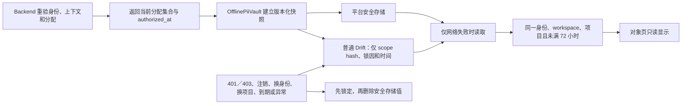

# 离线推广对象资料威胁模型

状态：截至 2026-09-07，包含 Slice 7Y 的请求作用域与撤权并发保护。

适用需求：`PII-002`、`PII-003`、`AUTHZ-006`、`TEST-006`

## 保护对象与信任边界

本功能保护当前跟进者获分配对象的姓名、电话、邮箱、项目关系和共享跟进备注。缓存还包含可信 App 用户、workspace、项目、问卷版本和能力上下文。这些资料不得进入普通 Drift 业务表、同步 Outbox、日志、通知或分析 warehouse。

Backend 返回的当前分配集合和 `authorized_at` 是在线授权事实。平台安全存储负责保护设备上的密文。设备时钟、普通 Drift、网络错误文本和 Widget 都不属于授权来源。客户端进程本身也不是服务端信任边界；服务器仍在每次在线请求时重验 token、能力和活动分配。

## 数据流

一次在线列表成功会整体替换缓存，不做逐对象追加。这样，已经取消分配的对象会在下一次成功验权时退出快照。服务器拒绝不会降级到旧缓存。只有明确的网络不可用才可尝试离线读取。

## 期限与时钟

授权窗口从 Backend 的 `authorized_at` 起算。七十二小时整即锁定，不使用“最后一次打开”的时间续期。每次成功读取会把本机观察到的 UTC 高水位写回安全存储。时钟相对服务器授权时间或已观察高水位回拨超过五分钟时，缓存立即锁定并删除。五分钟只用于容纳普通时钟校准，不延长七十二小时期限。

安装 ID 也写入安全快照。安全存储若在 App 重装后残留，而普通 Drift 已产生新安装 ID，旧快照会锁定。每台设备保存自己的快照和高水位；一台设备的在线验权不能延长另一台设备的期限。

## 撤权、清除与失败关闭

下列事件会先写入不含 PII 的持久锁，再删除安全存储值：

- Backend 对上下文或对象列表返回 `401`／`403`；
- Backend 返回的在线上下文不再具备 PII 查看能力，即使账号和项目 ID 未变；
- 退出登录、切换身份或成功切换项目；
- 七十二小时到期、时钟回拨、安装 ID 改变或快照损坏；
- 安全存储读取、写入或高水位更新失败。

对象匿名化成功会立即锁定并删除整份快照，然后在线读取剩余对象；它不等待下一次列表替换。取消分配由下一次在线列表整体替换。退出 workspace、账号删除或服务端撤权会使上下文或对象请求被拒绝，并走同一锁定路径。设备离线时无法提前知道服务端变化，因此取消分配的残余窗口最多是最近验权后的七十二小时。

删除失败不会移除锁。相同身份再次启动会重试删除；失败时仍不可读取。新的在线验权成功后才可写入新快照并清除锁。刷新、读取、撤权和重试按身份 scope 串行执行；较旧的 `authorized_at` 不能覆盖较新的快照。

请求开始时捕获身份、可信上下文和撤权代次。撤权使此前开始的请求失效；Vault 在同一串行边界内拒绝旧刷新。这样，即使旧密文已删除，迟到响应也不能清除锁或恢复资料。Gateway 在缓存操作和返回资料前检查请求仍属于当前作用域。旧请求的拒绝、匿名化结果和网络回退不能改用新账号或项目。

撤权后重新开始且成功完成在线验权的请求可以建立快照。请求代次只保存在内存中，因为在途 Future 不跨进程重启；既有持久锁仍负责重启后的失败关闭。这不是跨进程同步机制，也不提供按 workspace 清除的新入口。

AppSession 在在线上下文失去 PII 查看能力时持久锁定旧快照，使下次离线启动不能恢复已知失效的权限。同一身份重新解析到不同上下文也会撤销旧快照。上下文解析、选择和创建在等待清除后重新检查会话代次，避免期间的注销或切换被旧成功结果覆盖。

## 威胁、控制和残余风险

| 威胁 | 当前控制 | 残余风险或限制 |
| --- | --- | --- |
| 下载整个 workspace 通讯录 | 只缓存 Backend 本次返回的当前分配集合 | 服务端分配错误仍需由服务端审计和修复 |
| 把 401、403 当成断网继续显示 | 只允许 `networkUnavailable` 降级；明确拒绝先锁定 | 离线期间不能即时收到服务端撤权 |
| 修改本机时间延长访问 | 服务器授权时间、观察高水位、五分钟回拨容差、页面到期计时器 | 设备时钟严重错误会保守锁定，要求联网 |
| 重装后读取残留安全存储 | 快照绑定普通 Drift 中的安装 ID | 同一安装内的系统备份行为仍需逐平台实测 |
| 并发旧响应覆盖新分配或撤权 | 请求开始时绑定 scope 与撤权代次，串行边界拒绝旧刷新，保留授权时间比较 | 只保护同一 Vault 实例内的在途请求，多进程行为仍需逐平台实测 |
| 清除失败后资料重新出现 | 持久锁先于删除；启动和再次联网重试 | 安全存储和 Drift 同时永久损坏时只能保持功能不可用 |
| 匿名化后断网恢复旧对象 | 匿名化成功先锁定并删除整份快照；网络失败不绕过锁 | 另一台离线设备仍受其最近验权后的七十二小时上限约束 |
| PII 泄漏到 SQLite、Outbox、日志或通知 | 密文只进平台安全存储；Drift 只存散列 scope 和锁 | 进程内存、系统截图和已解锁设备不由本缓存格式消除 |
| 把 build 成功当成安全存储可用 | 启动时执行写入、精确读回和删除探针 | 探针证明本次基本操作，不证明系统备份、升级或多进程行为 |

## 验证证据

[`offline_pii_vault_test.dart`](../../test/privacy/offline_pii_vault_test.dart) 覆盖期限边界、时间回拨、重装残留、损坏快照、存储失败、并发刷新和并发撤权。[`app_session_test.dart`](../../test/app_session/app_session_test.dart) 覆盖离线启动、token 获取失败、注销、换身份、换项目和删除重试。[`offline_promotion_target_gateway_test.dart`](../../test/targets/offline_promotion_target_gateway_test.dart) 覆盖同一上下文的网络回退，以及旧请求晚于撤权、账号／上下文切换或匿名化返回时的拒绝。测试通过可控 Future 固定时序，不依赖真实网络延迟。[`promotion_target_directory_page_test.dart`](../../test/features/targets/promotion_target_directory_page_test.dart) 证明持续打开的页面会按时移除资料，拒绝刷新也不会保留旧 PII。

[`drift_offline_pii_lock_store_test.dart`](../../test/privacy/drift_offline_pii_lock_store_test.dart) 直接检查普通 Drift 中没有身份 subject、姓名、电话或邮箱。[`secure_value_store_capability_probe_test.dart`](../../test/privacy/secure_value_store_capability_probe_test.dart) 固定安全存储探针的写、读、删合同。

这些自动测试使用可控存储接缝，不是六平台运行时证据。各平台的真实结果和未验证项以[六平台能力证据矩阵](../spikes/six-platform-capability-matrix.md)为准。人工验证矩阵由 [Issue #161](https://github.com/XavierOwen/tongxingzhe-app/issues/161) 跟踪。
