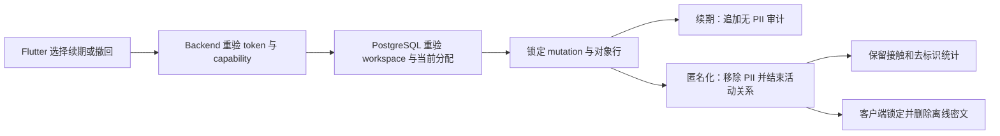

# 推广对象资料保留与匿名化威胁模型

状态：截至 2026-08-06，与 Slice 4F 实现一致。

适用需求：`PII-003`、`PII-004`、`PII-005`、`TARGET-008`、`AUTHZ-005`、`AUTHZ-006`、`TEST-002`、`TEST-006`

## 保护对象与目标

本功能保护推广对象的名称、电话、邮箱、共享跟进备注、关系原因说明和个人与机构角色说明。保留目的失效后，这些内容不得继续通过对象目录、历史 revision、冲突记录、离线密文、通知或审计恢复。

匿名化仍保留接触、接触 revision、对象关联 ID、关系阶段事实、场次、触达人数、当次反应和去标识统计。对象 ID 用于维持引用完整性，不得与已移除的可识别资料重新绑定。

## 信任边界与数据流

客户端不提交 workspace、项目或操作者 ID。对象 ID 只用于定位，不能单独授权。Backend 从 access token 重取可信上下文；PostgreSQL 再检查活动用户、workspace、项目和当前分配。

## 保留期和复核

默认期限为十二个日历月。策略表只接受一至十二个月。基准时间取对象建立、最近有效接触和最近明确续期中的最新值。作废接触不延长保留期；旧 contact revision 的对象关联也不延长保留期。

到期前三十天可返回复核任务。任务只含对象 ID 和到期时间。通用通知只显示数量，不显示姓名或联系方式。到期后，目录或复核读取会先执行匿名化，再返回仍可读取的对象。没有后台调度器时，数据库中从到期到下一次在线读取仍可能短暂保留 PII；这是当前残余风险，不应表述为定时删除已经完成。

## 不可逆事务

匿名化在一个 PostgreSQL transaction 中完成：

- 对象名称变为固定占位值，电话和邮箱变为 `NULL`；
- 所有活动分配结束；
- 项目关系生命周期结束，当前及历史敏感文本被清除；
- 个人与机构活动关系结束，角色说明变为固定占位值；
- 追加不含 PII 的匿名化事件；
- 接触和去标识统计不变。

历史表通常只追加。隐私擦除是唯一允许改写敏感文本的路径。私有安全函数在 transaction 内设置目标范围标记；runtime role 不能直接更新这些表，也不能执行私有匿名化 helper。

mutation ID 与操作者组成唯一键。精确重放返回第一次结果。相同 ID 改写动作、原因、workspace 或对象会冲突。对象行锁保证两个不同 mutation 并发匿名化时只有一个成功。

## 威胁、控制与残余风险

| 威胁 | 当前控制 | 残余风险或限制 |
| --- | --- | --- |
| 伪造 workspace 或他人对象 ID | Backend 不接收客户端 scope；数据库重验可信 scope 和当前分配 | Backend 身份上下文本身错误仍需独立审计 |
| 未分配用户匿名化对象 | 活动分配是写入前置条件 | 组织角色尚未接入当前个人空间实现 |
| 网络重试重复擦除或改写审计 | mutation 唯一键、内容比较、精确重放 | 客户端必须为新意图生成新 ID |
| 两个设备同时续期或匿名化 | mutation advisory lock 与对象行锁 | 不同合法续期可顺序发生；每次都留下审计 |
| 只清当前投影，历史备注仍可恢复 | 同一事务清除 revision、冲突和角色说明 | 数据库备份的法定擦除流程仍需部署策略 |
| 匿名化删除接触证据 | 接触和链接使用外键保留，匿名化不物理删除对象行 | 对象 ID 本身仍是稳定假名，导出时要继续去标识 |
| 通知泄漏姓名 | 复核任务和页面通知只显示数量与到期事实 | 进入已授权对象页后仍会显示当前对象资料 |
| 本机离线密文恢复已匿名化对象 | 成功响应后先锁定并删除整份密文 | 其他离线设备在最近验权后最多仍有七十二小时窗口 |
| 到期后数据库仍保留 PII | 每次目录或复核读取先执行到期清理 | 后台定时调度尚未接入，静默 workspace 可能延后执行 |

## 验证证据

[`0020_promotion_target_retention.sql`](../../backend/database/migrations/0020_promotion_target_retention.sql) 固定策略、到期计算、匿名化 transaction、权限和重放合同。[`verify_promotion_target_retention.sql`](../../backend/database/checks/verify_promotion_target_retention.sql) 检查 schema 与最小权限；[`0020` fixture](../../backend/database/fixtures/0020_promotion_target_retention.sql) 验证续期、自动到期、明确撤回、跨空间拒绝、历史文本清除和接触事实保留。

[`verify_promotion_target_retention_concurrency.sh`](../../tool/verify_promotion_target_retention_concurrency.sh) 使用两个独立数据库会话同时匿名化同一对象，要求只有一个请求成功，且最终只有一条匿名化审计。[`promotion-targets.test.ts`](../../backend/server/test/promotion-targets.test.ts) 固定 HTTP 输入和无 PII 响应。[`offline_promotion_target_gateway_test.dart`](../../test/targets/offline_promotion_target_gateway_test.dart) 与 [`promotion_target_directory_page_test.dart`](../../test/features/targets/promotion_target_directory_page_test.dart) 固定本机清除、通用复核提示和二次确认。
